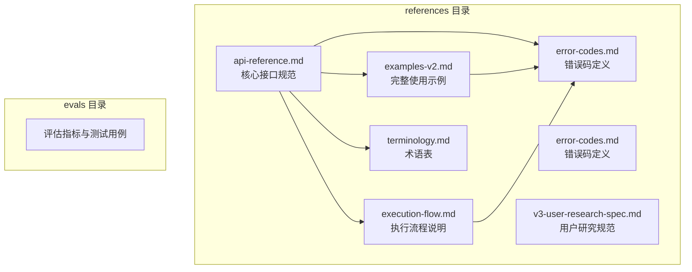
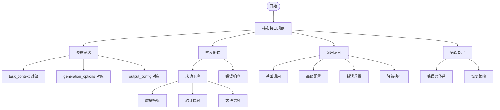
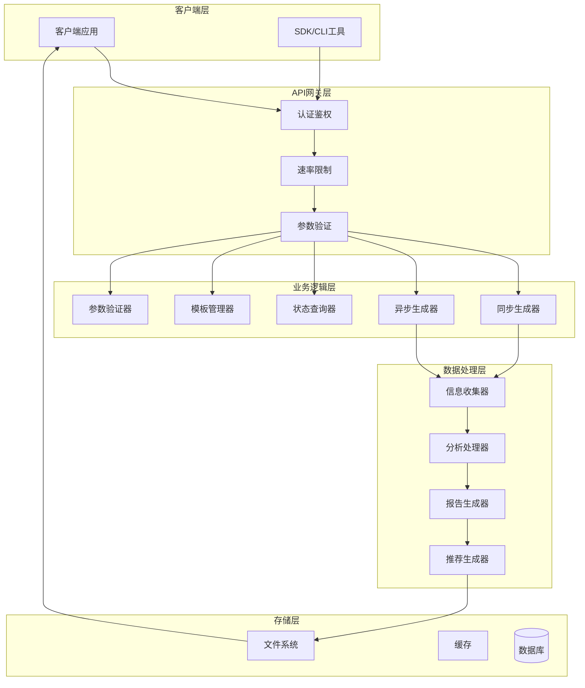
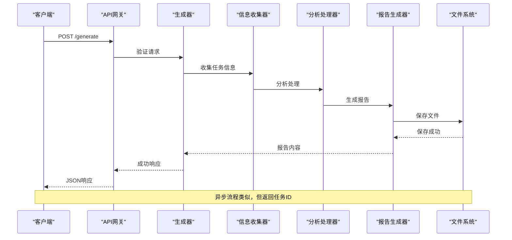
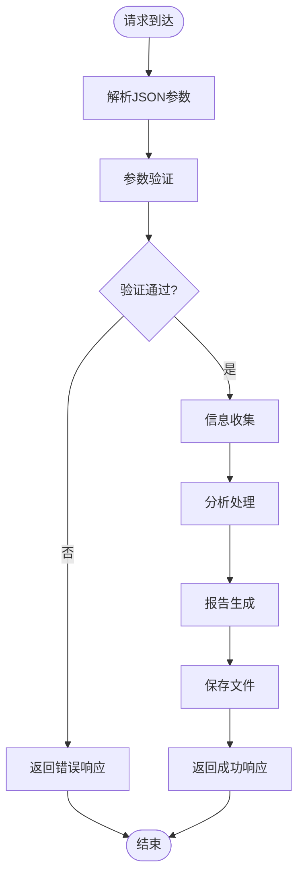
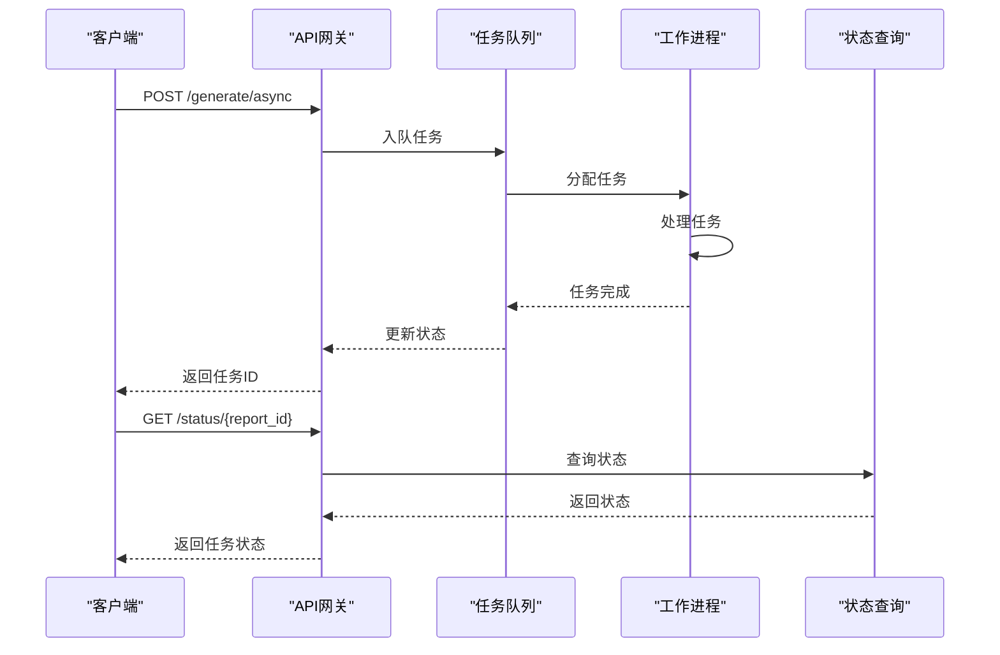
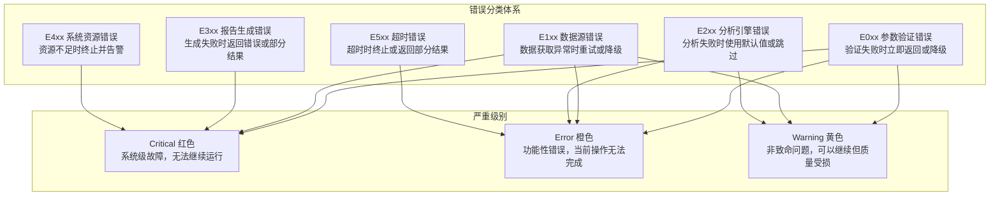
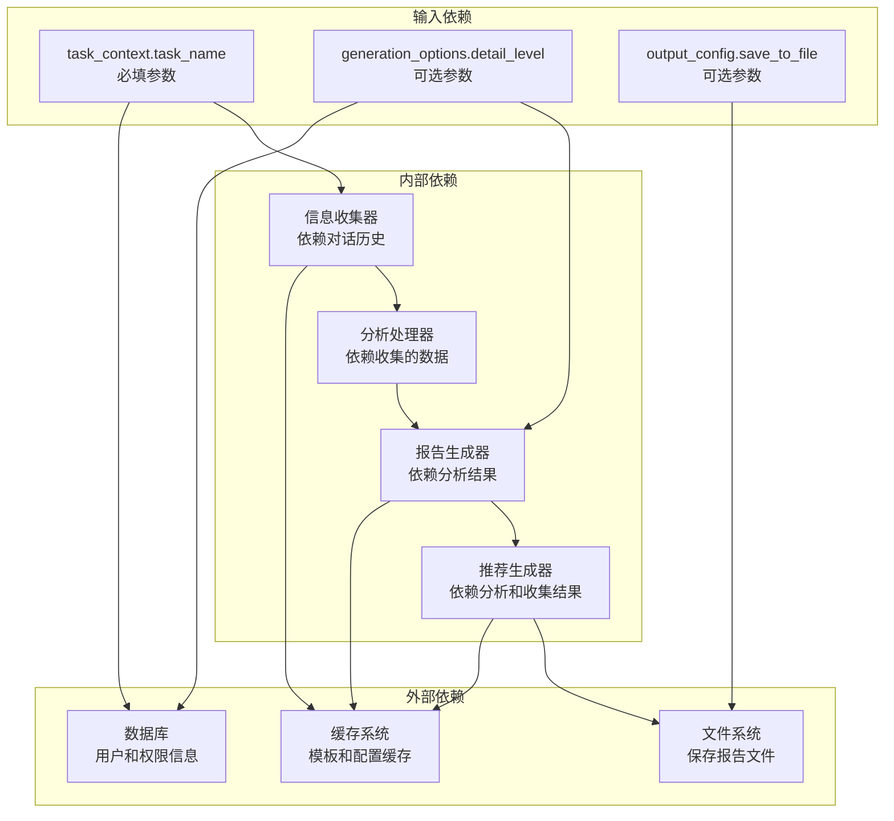
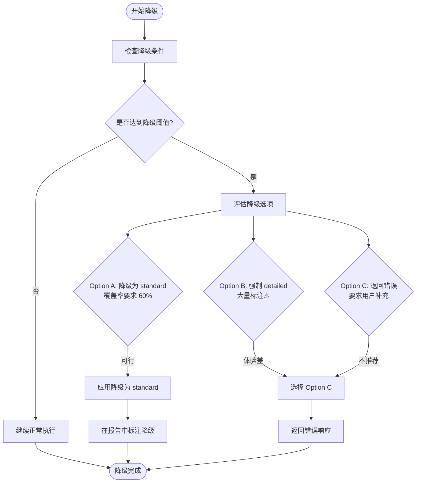

# API接口参考

<cite>
**本文档引用的文件**
- [api-reference.md](file://references/api-reference.md)
- [error-codes.md](file://references/error-codes.md)
- [examples-v2.md](file://references/examples-v2.md)
- [execution-flow.md](file://references/execution-flow.md)
- [terminology.md](file://references/terminology.md)
</cite>

## 目录
1. [概述](#概述)
2. [项目结构](#项目结构)
3. [核心组件](#核心组件)
4. [架构总览](#架构总览)
5. [详细组件分析](#详细组件分析)
6. [依赖分析](#依赖分析)
7. [性能考虑](#性能考虑)
8. [故障排除指南](#故障排除指南)
9. [结论](#结论)
10. [附录](#附录)

## 概述

### 1.1 文档目的与适用范围

本文档为“任务执行总结报告生成器”技能提供完整的 API 接口规范说明，旨在帮助开发者、集成商和高级用户：

- 理解接口的完整功能能力和参数体系
- 准确构建符合规范的请求报文
- 正确解析和处理响应数据
- 进行系统集成和自动化工作流开发
- 实现定制化的报告生成解决方案

**适用范围**

本接口适用于以下场景：

| 场景类型 | 典型用例 | 说明 |
|---------|---------|------|
| 软件开发 | 功能开发完成、Bug修复、技术重构 | 技术方案沉淀、问题排查记录 |
| 项目管理 | Sprint结束、里程碑达成、项目收尾 | 进度复盘、资源评估 |
| 运维排查 | 故障处理、性能优化、安全加固 | 排查流程标准化、预防措施 |
| 技术研究 | 技术选型、POC验证、架构设计 | 决策依据、技术对比 |
| 学习成长 | 课程学习、技能培训、认证备考 | 知识体系构建、学习方法论 |

**核心能力概述**

本接口基于四大核心引擎协同工作：

1. **信息收集引擎 (Information Collection Engine)**：从对话历史和相关文件中全面提取任务执行的关键信息
2. **分析处理引擎 (Analysis Processing Engine)**：对收集到的信息进行深度分析和多维度评估
3. **报告生成引擎 (Report Generation Engine)**：按照规范模板将分析结果转化为结构化 Markdown 报告
4. **智能推荐引擎 (Intelligent Recommendation Engine)**：生成针对性的改进建议和可复用的方法论

### 1.2 接口版本信息

```
API 版本: v1.0
协议: RESTful API / JSON-RPC
数据格式: JSON (请求) / Markdown 或 JSON (响应)
编码: UTF-8
兼容性: 向后兼容
```

**版本策略**：
- 主版本号（Major）：不兼容的 API 变更
- 次版本号（Minor）：向后兼容的功能新增
- 修订号（Patch）：向后兼容的问题修复

### 1.3 基础 URL 与调用方式

**基础 URL 结构**

```
生产环境: https://api.task-execution-summary.com/v1
测试环境: https://staging-api.task-execution-summary.com/v1
本地开发: http://localhost:8080/v1
```

**主要端点 (Endpoint)**

| 端点路径 | HTTP 方法 | 功能描述 | 认证要求 |
|---------|-----------|---------|---------|
| `/generate` | POST | 生成任务执行总结报告 | 可选 |
| `/generate/async` | POST | 异步生成报告（适用于复杂任务） | 可选 |
| `/status/{report_id}` | GET | 查询异步任务状态 | 可选 |
| `/templates` | GET | 获取可用模板列表 | 无需认证 |
| `/validate` | POST | 验证请求参数合法性 | 无需认证 |

**调用方式示例**

```bash
# 同步调用
curl -X POST https://api.task-execution-summary.com/v1/generate \
  -H "Content-Type: application/json" \
  -H "Authorization: Bearer YOUR_API_KEY" \
  -d '{
    "task_context": {
      "task_name": "用户认证模块开发"
    }
  }'

# 异步调用（推荐用于大型任务）
curl -X POST https://api.task-execution-summary.com/v1/generate/async \
  -H "Content-Type: application/json" \
  -d '{
    "task_context": {
      "task_name": "Sprint 24 回顾",
      "task_type": "management"
    },
    "generation_options": {
      "detail_level": "detailed"
    }
  }'
```

### 1.4 认证方式

**认证机制**

本接口支持以下认证方式：

| 认证方式 | 适用场景 | 安全级别 | 说明 |
|---------|---------|---------|------|
| API Key | 服务端集成、自动化脚本 | 中等 | 适合内部系统和可信环境 |
| OAuth 2.0 / JWT | 企业级应用、多租户系统 | 高 | 支持用户身份验证和权限控制 |
| 无认证 | 本地开发、公开演示 | 低 | 仅限测试和非敏感场景 |

**API Key 认证**

```
Authorization: Bearer your_api_key_here
```

或在查询参数中：

```
?api_key=your_api_key_here
```

**获取 API Key**

1. 注册开发者账号
2. 在控制台创建应用
3. 生成 API Key（支持设置过期时间和权限范围）
4. 在请求头中携带 API Key

**速率限制 (Rate Limiting)**

| 计费层级 | 限制 | 说明 |
|---------|------|------|
| 免费版 | 100 次/小时 | 适合个人学习和测试 |
| 专业版 | 1000 次/小时 | 适合团队日常使用 |
| 企业版 | 自定义 | 适合大规模集成 |

超限返回 `429 Too Many Requests`，响应头包含：

```
X-RateLimit-Limit: 1000
X-RateLimit-Remaining: 999
X-RateLimit-Reset: 1640000000
```

## 项目结构

### 2.1 文件组织结构

该项目采用文档驱动的 API 规范管理方式，核心文档分布在 `references` 目录下：



**图表来源**
- [api-reference.md:1-1378](file://references/api-reference.md#L1-L1378)
- [error-codes.md:1-1594](file://references/error-codes.md#L1-L1594)
- [examples-v2.md:1-769](file://references/examples-v2.md#L1-L769)

### 2.2 文档层次结构



**章节来源**
- [api-reference.md:1-1378](file://references/api-reference.md#L1-L1378)
- [examples-v2.md:1-769](file://references/examples-v2.md#L1-L769)

## 核心组件

### 3.1 输入参数完整定义

#### 3.1.1 task_context 对象（必填）

task_context 对象是请求的核心，包含任务的基本信息和上下文数据。

**task_name**
- **类型**: string
- **必填**: 是 ✅
- **默认值**: 无
- **描述**: 任务名称或标题，用于标识任务并生成报告标题
- **约束条件**:
  - 最小长度: 2 字符
  - 最大长度: 200 字符
  - 不允许纯空格或特殊控制字符
  - 支持中文、英文、数字及常见标点符号
- **使用场景**: 必须提供，用于生成报告标题和标识任务

**task_type**
- **类型**: enum (枚举字符串)
- **必填**: 否
- **默认值**: `"auto-detect"` （自动检测）
- **可选值**:
  - `development`: 软件开发类任务
  - `management`: 项目管理类任务  
  - `operations`: 运维排查类任务
  - `research`: 技术研究类任务
  - `learning`: 学习成长类任务
  - `auto-detect`: 自动从上下文推断（默认）

**time_range 对象（可选）**
- **start_time**: 任务开始的精确时间点，ISO 8601 格式
- **end_time**: 任务结束的精确时间点，ISO 8601 格式

**description**
- **类型**: string
- **必填**: 否
- **默认值**: 从对话历史中自动提取摘要
- **约束条件**: 最小长度 10 字符，最大长度 2000 字符

**participants 数组（可选）**
- **类型**: object 数组
- **必填**: 否
- **默认值**: 空（表示单人任务）
- **数组元素结构**:
  - `name`: 参与者姓名或代号
  - `role`: 角色（如：开发者、测试、产品经理、运维）
  - `responsibility`: 主要职责描述（可选）

**context_data 对象（可选）**
- **类型**: object
- **必填**: 否
- **默认值**: 空
- **支持的子字段**:
  - `objectives`: 任务目标列表
  - `constraints`: 约束条件列表
  - `tools_used`: 使用的工具列表
  - `technologies`: 技术栈列表
  - `external_references`: 外部参考资料
  - `custom_metadata`: 自定义元数据

**章节来源**
- [api-reference.md:185-376](file://references/api-reference.md#L185-L376)

#### 3.1.2 generation_options 对象（可选）

generation_options 对象控制报告生成的详细程度、模板选择和内容定制。

**detail_level**
- **类型**: enum
- **必填**: 否
- **默认值**: `"standard"`
- **可选值**:
  - `summary`: 2-3页（500-800字）- 快速汇报
  - `standard`: 8-15页（3000-5000字）- 标准版【默认推荐】
  - `detailed`: 20-30页（8000-15000字）- 详细深度版

**template_variant**
- **类型**: enum
- **必填**: 否
- **默认值**: `"standard"`
- **可选值**:
  - `summary`: 快速摘要版模板
  - `standard`: 标准通用模板（默认）
  - `detailed`: 详细深度版模板
  - `learning`: 学习专用模板

**included_chapters / excluded_chapters**
- **类型**: integer 数组
- **必填**: 否
- **默认值**: 空（表示全部包含/不排除）
- **有效范围**: 1-10（对应报告的10个章节）
- **约束条件**: 不能同时排除所有章节，至少保留第1、9、10章

**language_style**
- **类型**: enum
- **必填**: 否
- **默认值**: `"professional"`
- **可选值**:
  - `professional`: 专业、客观、准确
  - `casual`: 轻松、亲切、易懂
  - `academic`: 严谨、学术化

**focus_dimensions**
- **类型**: enum 数组
- **必填**: 否
- **默认值**: 空（表示全部维度均衡分析）
- **可选值**:
  - `goal_achievement`: 目标达成度
  - `time_efficiency`: 时间管理效能
  - `resource_utilization`: 资源利用效率
  - `problem_patterns`: 问题解决模式
  - `collaboration`: 协作效果

**output_format**
- **类型**: enum
- **必填**: 否
- **默认值**: `"markdown"`
- **可选值**:
  - `markdown`: Markdown 格式（默认）
  - `json`: JSON 格式
  - `html`: HTML 格式

**章节来源**
- [api-reference.md:380-586](file://references/api-reference.md#L380-L586)

#### 3.1.3 output_config 对象（可选）

output_config 对象控制报告输出的存储、命名和附加选项。

**save_to_file**
- **类型**: boolean
- **必填**: 否
- **默认值**: `true`
- **描述**: 是否将生成的报告保存到文件系统

**file_path**
- **类型**: string
- **必填**: 否
- **默认值**: 自动生成路径
- **约束条件**: 必须是有效的文件路径，父目录必须存在或可创建

**include_metadata**
- **类型**: boolean
- **必填**: 否
- **默认值**: `true`
- **描述**: 是否在报告中包含 YAML Frontmatter 元数据块

**append_to_existing**
- **类型**: boolean
- **必填**: 否
- **默认值**: `false`
- **描述**: 是否追加到已有文件（而非覆盖）

**encoding**
- **类型**: enum
- **必填**: 否
- **默认值**: `"utf-8"`
- **可选值**: `utf-8` | `gbk` | `gb2312` | `ascii`

**custom_header / custom_footer**
- **类型**: string
- **必填**: 否
- **默认值**: 空（使用系统默认的头部/尾部）
- **描述**: 自定义报告的头部或尾部内容（支持 Markdown 格式）

**章节来源**
- [api-reference.md:590-714](file://references/api-reference.md#L590-L714)

### 3.2 输出响应格式定义

#### 3.2.1 成功响应（HTTP 200）

当报告成功生成时，返回 HTTP 200 状态码和以下 JSON 结构：

```json
{
  "success": true,
  "report_id": "rpt_20260409_abc123def456",
  "timestamp": "2026-04-09T14:30:22+08:00",
  "processing_time_ms": 3250,
  "report": {
    "title": "任务执行总结报告：用户认证模块开发",
    "content": "# 任务执行总结报告\n\n> **报告元信息**\n> ...\n\n## 第一章：执行概览\n...",
    "word_count": 4580,
    "chapter_count": 10,
    "metadata": {
      "task_name": "用户认证模块开发",
      "task_type": "development",
      "generated_at": "2026-04-09T14:30:22+08:00",
      "generator_version": "v1.0",
      "template_used": "standard",
      "detail_level": "standard",
      "language_style": "professional",
      "file_path": "./reports/task-summary-auth-module-20260409.md",
      "file_size_bytes": 24568
    }
  },
  "quality_check": {
    "completeness_rate": 0.95,
    "accuracy_confidence": 0.97,
    "information_gaps": [
      {
        "section": "第三章：执行过程详解",
        "issue": "缺少T+120min至T+150min之间的详细操作记录",
        "severity": "low",
        "suggestion": "如需补充，可手动添加该时间段的具体操作步骤"
      }
    ],
    "warnings": [
      {
        "code": "W001",
        "message": "第七章（团队协作分析）因检测到单人任务而简化处理",
        "severity": "info"
      }
    ],
    "overall_quality_score": 92
  },
  "statistics": {
    "total_phases": 6,
    "total_decisions": 8,
    "total_problems": 12,
    "suggestions_count": 7,
    "methodologies_extracted": 3,
    "key_metrics": {
      "goal_achievement_rate": 0.93,
      "time_efficiency_ratio": 1.05,
      "resource_utilization_rate": 0.78,
      "problem_resolution_rate": 1.0
    }
  },
  "file_info": {
    "saved": true,
    "path": "./reports/task-summary-auth-module-20260409.md",
    "size_bytes": 24568,
    "checksum_md5": "d41d8cd98f00b204e9800998ecf8427e"
  }
}
```

**字段详细说明**

**顶层字段**

| 字段名 | 类型 | 必填 | 说明 |
|-------|------|------|------|
| `success` | boolean | 是 | 固定为 `true`，表示请求成功 |
| `report_id` | string | 是 | 报告唯一标识符，格式：`rpt_{YYYYMMDD}_{随机16位hex}` |
| `timestamp` | datetime | 是 | 报告生成完成的 ISO 8601 时间戳 |
| `processing_time_ms` | integer | 是 | 报告生成耗时（毫秒） |

**章节来源**
- [api-reference.md:718-786](file://references/api-reference.md#L718-L786)

#### 3.2.2 错误响应（HTTP 4xx/5xx）

所有错误响应遵循统一的 JSON 结构：

```json
{
  "success": false,
  "error": {
    "code": "E001",
    "name": "MissingRequiredParameter",
    "message": "缺少必填参数: task_name",
    "category": "parameter_validation",
    "severity": "Error",
    "http_status": 400,
    "timestamp": "2026-04-09T14:30:00Z",
    "request_id": "req_abc123xyz",
    "context": {
      "missing_parameter": "task_name",
      "available_parameters": ["detail_level", "output_format"]
    },
    "recovery": {
      "mode": "terminate",
      "suggestions": [
        "请提供 task_name 参数",
        "参考文档: /docs/api#parameters"
      ],
      "documentation_url": "/errors/E001"
    }
  },
  "metadata": {
    "version": "1.0.0",
    "service": "task-execution-summary"
  }
}
```

**字段说明**

| 字段 | 类型 | 必填 | 说明 |
|------|------|------|------|
| success | boolean | ✅ | 是否成功，错误时为 false |
| error.code | string | ✅ | 错误码，如 "E001" |
| error.name | string | ✅ | 错误名称，PascalCase |
| error.message | string | ✅ | 人类可读的错误描述 |
| error.category | string | ✅ | 错误分类标识 |
| error.severity | string | ✅ | 严重级别: Critical/Error/Warning |
| error.http_status | integer | ✅ | 对应的 HTTP 状态码 |
| error.timestamp | string | ✅ | ISO 8601 格式的时间戳 |
| error.request_id | string | ✅ | 请求唯一标识，用于追踪 |
| error.context | object | ⚠️ | 错误发生的上下文信息 |
| error.recovery | object | ✅ | 恢复建议和模式 |

**章节来源**
- [api-reference.md:98-132](file://references/api-reference.md#L98-L132)

### 3.3 参数验证规则表

| 参数 | 类型 | 必填 | 默认值 | 有效范围/约束 | 说明 |
|------|------|------|--------|-------------|------|
| task_context.task_name | string | 是 | 无 | 2-200字符，不允许纯空格 | 任务名称 |
| task_context.task_type | enum | 否 | "auto-detect" | development/management/operations/research/learning/auto-detect | 任务类型 |
| generation_options.detail_level | enum | 否 | "standard" | summary/standard/detailed | 报告详细程度 |
| generation_options.template_variant | enum | 否 | "standard" | summary/standard/detailed/learning | 模板变体 |
| generation_options.included_chapters | integer[] | 否 | [] | 1-10，至少包含1,9,10 | 包含的章节 |
| generation_options.excluded_chapters | integer[] | 否 | [] | 1-10，不能排除全部章节 | 排除的章节 |
| generation_options.language_style | enum | 否 | "professional" | professional/casual/academic | 语言风格 |
| generation_options.focus_dimensions | enum[] | 否 | [] | 最多5个，不能同时指定 | 分析维度 |
| generation_options.output_format | enum | 否 | "markdown" | markdown/json/html | 输出格式 |
| output_config.save_to_file | boolean | 否 | true | true/false | 是否保存文件 |
| output_config.encoding | enum | 否 | "utf-8" | utf-8/gbk/gb2312/ascii | 文件编码 |

**章节来源**
- [api-reference.md:4-799](file://references/api-reference.md#L4-L799)

## 架构总览

### 4.1 系统架构



**图表来源**
- [execution-flow.md:99-132](file://references/execution-flow.md#L99-L132)
- [api-reference.md:97-105](file://references/api-reference.md#L97-L105)

### 4.2 执行流程



**图表来源**
- [execution-flow.md:175-196](file://references/execution-flow.md#L175-L196)
- [execution-flow.md:921-956](file://references/execution-flow.md#L921-L956)

## 详细组件分析

### 5.1 同步报告生成 (/generate)

#### 5.1.1 接口规范

**HTTP 方法**: POST
**URL**: `/v1/generate`
**认证**: 可选
**请求体**: 包含 task_context、generation_options、output_config 对象

**请求示例**:
```json
{
  "task_context": {
    "task_name": "用户认证模块开发",
    "task_type": "development"
  },
  "generation_options": {
    "detail_level": "standard",
    "template_variant": "standard"
  },
  "output_config": {
    "save_to_file": true,
    "file_path": "./reports/test.md"
  }
}
```

**响应示例**:
```json
{
  "success": true,
  "report_id": "rpt_20260409_abc123def456",
  "timestamp": "2026-04-09T14:30:22+08:00",
  "processing_time_ms": 3250,
  "report": {
    "title": "任务执行总结报告：用户认证模块开发",
    "content": "# 任务执行总结报告\n\n> **报告元信息**\n> ...\n\n## 第一章：执行概览\n...",
    "word_count": 4580,
    "chapter_count": 10,
    "metadata": {
      "task_name": "用户认证模块开发",
      "task_type": "development",
      "generated_at": "2026-04-09T14:30:22+08:00",
      "generator_version": "v1.0",
      "template_used": "standard",
      "detail_level": "standard",
      "language_style": "professional"
    }
  }
}
```

#### 5.1.2 处理流程



**图表来源**
- [execution-flow.md:175-196](file://references/execution-flow.md#L175-L196)
- [execution-flow.md:441-474](file://references/execution-flow.md#L441-L474)

**章节来源**
- [api-reference.md:99-101](file://references/api-reference.md#L99-L101)
- [execution-flow.md:175-196](file://references/execution-flow.md#L175-L196)

### 5.2 异步报告生成 (/generate/async)

#### 5.2.1 接口规范

**HTTP 方法**: POST
**URL**: `/v1/generate/async`
**认证**: 可选
**请求体**: 与同步接口相同

**请求示例**:
```json
{
  "task_context": {
    "task_name": "Sprint 24 回顾",
    "task_type": "management"
  },
  "generation_options": {
    "detail_level": "detailed"
  }
}
```

**响应示例**:
```json
{
  "success": true,
  "report_id": "rpt_20260409_fedcba987654",
  "timestamp": "2026-04-09T14:30:25+08:00",
  "message": "任务已提交到异步队列，正在后台生成报告"
}
```

#### 5.2.2 异步处理流程



**图表来源**
- [execution-flow.md:1474-1485](file://references/execution-flow.md#L1474-L1485)

**章节来源**
- [api-reference.md:102-102](file://references/api-reference.md#L102-L102)
- [execution-flow.md:1474-1485](file://references/execution-flow.md#L1474-L1485)

### 5.3 异步任务状态查询 (/status/{report_id})

#### 5.3.1 接口规范

**HTTP 方法**: GET
**URL**: `/v1/status/{report_id}`
**认证**: 可选

**响应状态码**:
- `200 OK`: 任务完成，返回报告
- `202 Accepted`: 任务进行中
- `404 Not Found`: 任务不存在或已过期

**成功响应示例**:
```json
{
  "success": true,
  "status": "completed",
  "report_id": "rpt_20260409_fedcba987654",
  "progress": 100,
  "report": {
    "title": "Sprint 24 回顾 - 执行总结报告",
    "content": "# Sprint 24 回顾 - 执行总结报告\n\n## 📋 基本信息\n\n| 属性 | 值 |\n|------|-----|\n| **任务名称** | Sprint 24 回顾 |\n| **任务类型** | 项目管理（Sprint 复盘） |\n| **Sprint 周期** | 2026-03-25 ~ 2026-04-07（10个工作日） |\n| **报告生成时间** | 2026-04-09 17:00 |\n| **质量评分** | 91.2 / 100 |\n\n---\n\n## 🎯 一、任务目标与背景\n\n### 1.1 Sprint 目标设定\n\n**Sprint 目标（Goal）**:\n完成电商平台的首页改版 V2.0，提升用户体验和转化率，同时推进订单系统的性能优化和用户画像数据的迁移工作。",
    "word_count": 9876,
    "chapter_count": 10
  }
}
```

**进行中响应示例**:
```json
{
  "success": true,
  "status": "processing",
  "report_id": "rpt_20260409_fedcba987654",
  "progress": 65,
  "message": "报告仍在生成中，已完成65%"
}
```

**章节来源**
- [api-reference.md:103-103](file://references/api-reference.md#L103-L103)

### 5.4 模板列表查询 (/templates)

#### 5.4.1 接口规范

**HTTP 方法**: GET
**URL**: `/v1/templates`
**认证**: 无需认证

**响应示例**:
```json
{
  "success": true,
  "templates": [
    {
      "name": "standard",
      "title": "标准通用模板",
      "description": "适用于大多数任务类型的通用模板",
      "chapters": 10,
      "estimated_words": "3000-5000",
      "is_default": true
    },
    {
      "name": "summary",
      "title": "快速摘要模板",
      "description": "2-3页摘要，适用于快速汇报",
      "chapters": 2,
      "estimated_words": "500-800",
      "is_default": false
    },
    {
      "name": "detailed",
      "title": "详细深度模板",
      "description": "20-30页详细报告，适用于审计需求",
      "chapters": 10,
      "estimated_words": "8000-15000",
      "is_default": false
    },
    {
      "name": "learning",
      "title": "学习专用模板",
      "description": "强调知识掌握、学习方法论",
      "chapters": 10,
      "estimated_words": "3000-5000",
      "is_default": false
    }
  ]
}
```

**章节来源**
- [api-reference.md:104-104](file://references/api-reference.md#L104-L104)

### 5.5 参数验证 (/validate)

#### 5.5.1 接口规范

**HTTP 方法**: POST
**URL**: `/v1/validate`
**认证**: 无需认证

**请求示例**:
```json
{
  "task_context": {
    "task_name": "测试任务"
  },
  "generation_options": {
    "detail_level": "standard"
  }
}
```

**成功响应示例**:
```json
{
  "success": true,
  "valid": true,
  "message": "参数验证通过"
}
```

**错误响应示例**:
```json
{
  "success": true,
  "valid": false,
  "errors": [
    {
      "field": "task_context.task_name",
      "code": "E002",
      "message": "参数类型错误: task_name",
      "details": "期望类型: string, 实际类型: number"
    }
  ],
  "message": "参数验证失败"
}
```

**章节来源**
- [api-reference.md:105-105](file://references/api-reference.md#L105-L105)

### 5.6 调用示例

#### 5.6.1 示例一：最小调用（仅 task_name）

**场景**: 用户刚完成了一个软件开发任务，希望快速生成一份标准的执行总结报告

**请求**:
```json
{
  "task_context": {
    "task_name": "用户认证模块开发"
  }
}
```

**预期响应**: 标准详细程度的完整报告，包含10个章节，质量评分90%+

**章节来源**
- [examples-v2.md:29-166](file://references/examples-v2.md#L29-L166)

#### 5.6.2 示例二：标准调用（常用配置组合）

**场景**: 团队刚结束了一个为期2周的敏捷Sprint迭代，项目经理希望生成一份复盘报告

**请求**:
```json
{
  "task_context": {
    "task_name": "Sprint 24 回顾",
    "task_type": "management"
  },
  "generation_options": {
    "detail_level": "standard",
    "template_variant": "standard",
    "language_style": "professional",
    "focus_dimensions": ["goal_achievement", "time_efficiency", "problem_patterns"]
  },
  "output_config": {
    "save_to_file": true,
    "include_metadata": true
  }
}
```

**预期响应**: 包含项目管理特色分析维度的完整报告

**章节来源**
- [examples-v2.md:168-276](file://references/examples-v2.md#L168-L276)

#### 5.6.3 示例三：完全配置调用（所有参数都指定）

**场景**: 需要生成详细深度版报告，用于审计需求或培训材料

**请求**:
```json
{
  "task_context": {
    "task_name": "用户认证模块开发",
    "task_type": "development",
    "time_range": {
      "start_time": "2026-04-01T09:00:00+08:00",
      "end_time": "2026-04-03T17:30:00+08:00"
    },
    "description": "开发基于JWT的用户认证模块，支持多种登录方式和安全特性",
    "participants": [
      {"name": "张伟", "role": "后端开发"},
      {"name": "李娜", "role": "前端开发"}
    ],
    "context_data": {
      "objectives": [
        "实现用户注册、登录、登出功能",
        "支持本地密码和OAuth2.0第三方登录",
        "Token刷新和安全存储机制"
      ],
      "technologies": ["TypeScript", "Express.js", "JWT", "Passport.js"]
    }
  },
  "generation_options": {
    "detail_level": "detailed",
    "template_variant": "detailed",
    "included_chapters": [1, 2, 3, 4, 5, 6, 8, 9, 10],
    "language_style": "professional",
    "focus_dimensions": ["goal_achievement", "time_efficiency", "resource_utilization", "problem_patterns", "collaboration"],
    "output_format": "markdown"
  },
  "output_config": {
    "save_to_file": true,
    "file_path": "./reports/用户认证模块开发_执行总结报告_20260409.md",
    "include_metadata": true,
    "append_to_existing": false,
    "encoding": "utf-8",
    "custom_header": "> **机密文件** - 本报告仅供内部使用，请勿外传",
    "custom_footer": null
  }
}
```

**预期响应**: 详细深度版报告，包含完整附录和详细分析

**章节来源**
- [examples-v2.md:352-533](file://references/examples-v2.md#L352-L533)

## 依赖分析

### 6.1 错误码体系



**图表来源**
- [error-codes.md:152-162](file://references/error-codes.md#L152-L162)

### 6.2 错误处理策略矩阵

| 错误类别 | 错误码范围 | 严重级别 | 处理策略 | 触发阶段 | 降级选项 |
|---------|-----------|---------|---------|---------|---------|
| 参数验证 | E001-E010 | Error/Warning | 验证失败时立即返回或降级 | 触发检测 → 信息收集 | 非致命参数修正 |
| 数据源 | E011-E015 | Error/Warning | 数据获取异常时重试或降级 | 信息收集阶段 | 降级继续 |
| 分析引擎 | E021-E025 | Error/Warning | 分析失败时使用默认值或跳过 | 分析处理阶段 | 跳过该维度 |
| 报告生成 | E031-E035 | Error | 生成失败时返回错误或部分结果 | 报告生成阶段 | 回退到简化模板 |
| 系统资源 | E041-E045 | Critical | 资源不足时终止并告警 | 任意阶段 | 终止执行 |
| 超时 | E051 | Error | 超时时终止或返回部分结果 | 任意阶段 | 部分结果 |

**章节来源**
- [error-codes.md:152-162](file://references/error-codes.md#L152-L162)

### 6.3 依赖关系图



**图表来源**
- [execution-flow.md:441-474](file://references/execution-flow.md#L441-L474)

**章节来源**
- [execution-flow.md:441-474](file://references/execution-flow.md#L441-L474)

## 性能考虑

### 7.1 性能基线

根据执行流程文档，各阶段在典型任务场景下的预估耗时分布：

```
总耗时分布概览（标准版报告，中等复杂度任务）

Step 3 ████████████████████████████████░░░░░░░░  40-50%  (核心瓶颈)
Step 4 ██████████████████████████░░░░░░░░░░░░░░  35-40%
Step 5 ████████████████░░░░░░░░░░░░░░░░░░░░░░░  15-20%
Step 6 ████████░░░░░░░░░░░░░░░░░░░░░░░░░░░░░░░░   5-10%
Step 7 █░░░░░░░░░░░░░░░░░░░░░░░░░░░░░░░░░░░░░░░   < 2%
Step 2 ░░░░░░░░░░░░░░░░░░░░░░░░░░░░░░░░░░░░░░░░   < 2%
Step 1 ░░░░░░░░░░░░░░░░░░░░░░░░░░░░░░░░░░░░░░░░   < 1%

总计：2-8 分钟（取决于对话长度和详细程度要求）
```

**主要性能影响因素**：

| 影响因素 | 对 Step 3 影响 | 对 Step 4 影响 | 对 Step 5 影响 |
|---------|---------------|---------------|---------------|
| 对话轮数 (< 20轮) | 低 (~30s) | 低 (~60s) | 低 (~30s) |
| 对话轮数 (20-50轮) | 中 (~60s) | 中 (~120s) | 中 (~60s) |
| 对话轮数 (> 50轮) | 高 (~120s) | 高 (~180s) | 高 (~120s) |
| 详细程度: 摘要版 | -30% | -40% | -50% |
| 详细程度: 标准版 | 基准 | 基准 | 基准 |
| 详细程度: 详细版 | +50% | +60% | +80% |

### 7.2 优化建议

**客户端实现指南**：

1. **批量请求优化**：
   - 合理控制请求频率，避免触发速率限制
   - 对于大量相似请求，考虑使用异步模式

2. **参数优化**：
   - 仅提供必要的参数，避免冗余字段
   - 使用默认值减少参数传递

3. **缓存策略**：
   - 缓存常用的模板和配置
   - 利用文件系统缓存已生成的报告

4. **错误处理**：
   - 实现指数退避重试机制
   - 区分可恢复错误和致命错误

**性能监控**：
- 监控各阶段处理时间
- 跟踪错误率和成功率
- 分析用户使用模式

## 故障排除指南

### 8.1 常见错误处理

#### 8.1.1 参数验证错误 (E001-E005)

**E001: 缺少必填参数**
- **触发条件**: 缺少 task_name 或其他必填参数
- **处理方式**: 返回错误响应，提示补充缺失参数
- **恢复建议**: 检查 API 文档确认所有必填参数

**E002: 参数类型错误**
- **触发条件**: 参数类型与预期不符
- **处理方式**: 返回错误响应，给出正确格式示例
- **恢复建议**: 对照文档检查参数的预期类型

**E003: 参数值越界**
- **触发条件**: 参数值超出允许的范围
- **处理方式**: 尝试修正到最近合法值，发出警告
- **恢复建议**: 查看文档了解参数的有效取值范围

**E004: 参数冲突**
- **触发条件**: 多个参数之间存在逻辑冲突
- **处理方式**: 返回错误响应，指出冲突的参数对
- **恢复建议**: 选择一组一致的非冲突参数组合

**E005: 无效章节组合**
- **触发条件**: 选择的章节组合违反依赖关系
- **处理方式**: 返回错误响应，提供推荐的完整组合
- **恢复建议**: 了解章节之间的依赖关系，补充被依赖的前置章节

#### 8.1.2 数据质量错误 (E010-E012)

**E010: 数据不充分警告**
- **触发条件**: 任务执行过程中发现某些关键信息缺失
- **处理方式**: 降级继续生成报告，标注受影响章节
- **恢复建议**: 补充信息后重新生成，或接受降级结果

**E011: 对话历史不可用**
- **触发条件**: 无法访问对话历史
- **处理方式**: 返回错误或支持手动输入模式
- **恢复建议**: 检查权限或使用手动模式

**E012: 文件访问被拒绝**
- **触发条件**: 无法读写指定的文件
- **处理方式**: 返回错误或建议更换路径
- **恢复建议**: 检查文件/目录权限设置

#### 8.1.3 分析引擎错误 (E021-E022)

**E021: 目标分析失败**
- **触发条件**: 某一维度的分析数据不足
- **处理方式**: 跳过该维度，其他维度正常输出
- **恢复建议**: 提供更多相关信息

**E022: 时间线重建失败**
- **触发条件**: 分析引擎本身异常
- **处理方式**: 回退到简化分析模式
- **恢复建议**: 稍后重试

#### 8.1.4 报告生成错误 (E031-E032)

**E031: 模板渲染失败**
- **触发条件**: 模板引擎异常
- **处理方式**: 回退到备用模板
- **恢复建议**: 检查模板文件完整性

**E032: 报告生成超时**
- **触发条件**: 内容生成器异常
- **处理方式**: 使用已有数据直接组装
- **恢复建议**: 简化报告配置后重试

### 8.2 降级策略详解



**图表来源**
- [execution-flow.md:644-678](file://references/execution-flow.md#L644-L678)

### 8.3 错误码快速查询表

| 错误码 | 类别 | 严重级别 | 描述 | 处理建议 |
|-------|------|---------|------|---------|
| E001 | 参数验证 | Error | 缺少必填参数 | 补充缺失参数后重试 |
| E002 | 参数验证 | Error | 参数类型错误 | 修正参数类型后重试 |
| E003 | 参数验证 | Warning | 参数值越界 | 调整到有效范围内 |
| E004 | 参数验证 | Error | 参数冲突 | 移除或修改冲突参数 |
| E010 | 数据源 | Warning | 数据不充分 | 补充信息后重新生成 |
| E011 | 数据源 | Error | 对话历史不可用 | 检查权限或使用手动模式 |
| E021 | 分析引擎 | Warning | 部分分析失败 | 跳过该维度继续 |
| E031 | 报告生成 | Error | 模板渲染失败 | 使用备用模板 |
| E041 | 系统资源 | Critical | 内存不足 | 稍后重试或升级配置 |
| E051 | 超时 | Error | 执行超时 | 简化配置后重试 |

**章节来源**
- [error-codes.md:173-557](file://references/error-codes.md#L173-L557)

## 结论

本文档为"任务执行总结报告生成器"技能提供了完整的 API 接口参考，涵盖了：

1. **全面的接口规范**: 包括所有端点的 HTTP 方法、URL 模式、请求/响应模式和认证方法
2. **详细的参数说明**: 每个参数的数据类型、默认值、约束条件和使用场景
3. **丰富的调用示例**: 从最小调用到完全配置的完整示例
4. **完善的错误处理**: 错误码体系、处理策略和降级机制
5. **性能优化建议**: 基于执行流程的性能基线和优化策略

该 API 设计体现了以下特点：

- **RESTful 设计**: 符合 RESTful 原则的资源导向接口
- **灵活的配置**: 通过 generation_options 和 output_config 实现高度定制化
- **强大的错误处理**: 分层的错误处理机制和优雅降级策略
- **高性能实现**: 基于执行流程的性能基线和优化建议
- **安全考虑**: 多层次的认证和授权机制

建议开发者在集成时重点关注参数验证、错误处理和性能监控，以确保系统的稳定性和用户体验。

## 附录

### 9.1 版本历史与变更记录

| 版本 | 日期 | 变更内容 |
|------|------|---------|
| v1.0 | 2026-04-09 | 初始版本，包含完整的 API 规范和示例 |

### 9.2 相关文档索引

- **SKILL.md**: 技能主文档（概述、触发条件、执行流程）
- **api-reference.md**: 完整 API 参数规范（输入/输出/约束）
- **error-codes.md**: 所有错误码定义和处理策略
- **execution-flow.md**: 7 步执行流程详解
- **examples.md (V1)**: 4 场景自然语言使用示例
- **templates.md**: 4 种模板变体的结构定义
- **terminology.md**: 86 个专业术语表

### 9.3 术语表

- **任务 (Task)**: 具有明确目标、起止时间和可衡量产出的基本工作单元
- **报告模板 (Report Template)**: 预定义的报告结构和格式规范
- **质量评分 (Quality Score)**: 0-100 的综合质量评估指标
- **降级执行 (Degradation)**: 在信息不充分时的降级处理模式
- **异步生成 (Async Generation)**: 后台处理的异步报告生成模式

**章节来源**
- [terminology.md:1-1104](file://references/terminology.md#L1-L1104)