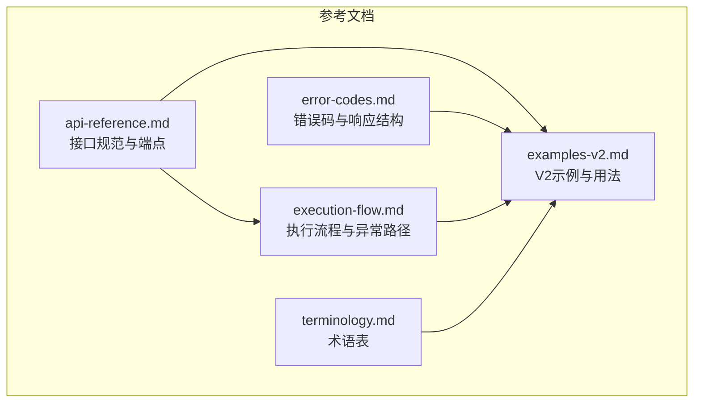
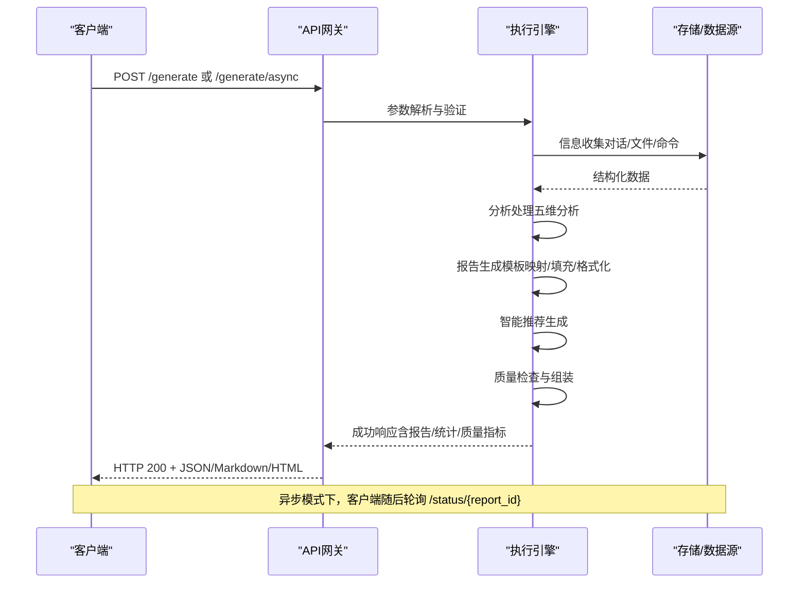
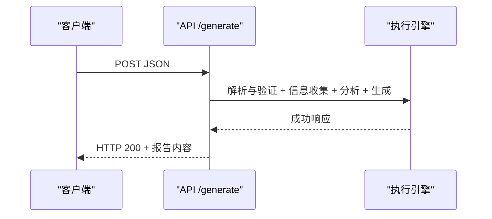
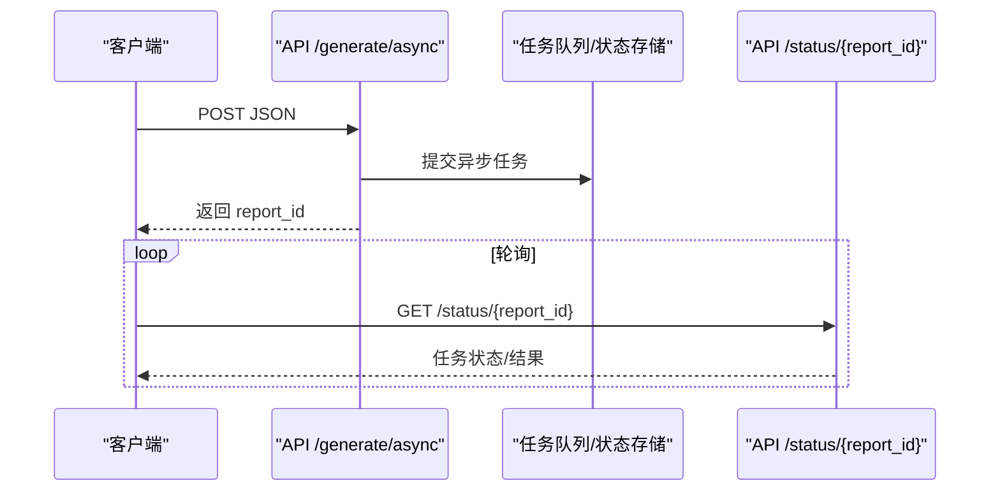
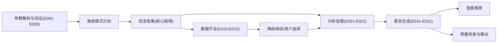

# API接口参考

<cite>
**本文档引用的文件**
- [api-reference.md](file://references/api-reference.md)
- [error-codes.md](file://references/error-codes.md)
- [examples-v2.md](file://references/examples-v2.md)
- [execution-flow.md](file://references/execution-flow.md)
- [terminology.md](file://references/terminology.md)
</cite>

## 目录
1. [简介](#简介)
2. [项目结构](#项目结构)
3. [核心组件](#核心组件)
4. [架构总览](#架构总览)
5. [详细组件分析](#详细组件分析)
6. [依赖分析](#依赖分析)
7. [性能考量](#性能考量)
8. [故障排查指南](#故障排查指南)
9. [结论](#结论)
10. [附录](#附录)

## 简介
本文件为“任务执行总结报告生成器”技能的完整API接口参考，面向开发者、集成商与高级用户，提供RESTful API的HTTP方法、URL模式、请求/响应模式、认证方式、参数定义、错误处理策略与最佳实践。接口支持同步与异步两种调用模式，输出格式可为Markdown、JSON或HTML，满足从快速汇报到深度审计的多样化场景。

## 项目结构
- 文档化内容来源于四个核心参考文件：
  - 接口规范与端点定义
  - 错误码与错误响应结构
  - V2标准请求-响应示例
  - 执行流程与异常路径
  - 术语表与概念解释

**图表来源**
- [api-reference.md](file://references/api-reference.md)
- [error-codes.md](file://references/error-codes.md)
- [examples-v2.md](file://references/examples-v2.md)
- [execution-flow.md](file://references/execution-flow.md)
- [terminology.md](file://references/terminology.md)

**章节来源**
- [api-reference.md](file://references/api-reference.md)
- [error-codes.md](file://references/error-codes.md)
- [examples-v2.md](file://references/examples-v2.md)
- [execution-flow.md](file://references/execution-flow.md)
- [terminology.md](file://references/terminology.md)

## 核心组件
- 基础URL与调用方式
  - 生产环境: https://api.task-execution-summary.com/v1
  - 测试环境: https://staging-api.task-execution-summary.com/v1
  - 本地开发: http://localhost:8080/v1
- 主要端点
  - /generate: 同步生成报告（可选认证）
  - /generate/async: 异步生成报告（可选认证）
  - /status/{report_id}: 查询异步任务状态（可选认证）
  - /templates: 获取可用模板列表（无需认证）
  - /validate: 验证请求参数合法性（无需认证）

**章节来源**
- [api-reference.md](file://references/api-reference.md)

## 架构总览
接口采用RESTful风格，支持JSON请求与多种输出格式。系统通过七步执行流水线完成从参数解析、信息收集、分析处理、报告生成、智能推荐到质量检查与输出的完整流程。异常路径采用分层防御与优雅降级策略，确保在参数错误、数据不足、分析失败、生成异常等情况下仍能返回可消费的响应。

**图表来源**
- [execution-flow.md](file://references/execution-flow.md)
- [api-reference.md](file://references/api-reference.md)

**章节来源**
- [execution-flow.md](file://references/execution-flow.md)
- [api-reference.md](file://references/api-reference.md)

## 详细组件分析

### 1) 同步生成接口 /generate
- HTTP方法: POST
- 认证: 可选
- 请求体: 包含 task_context、generation_options、output_config
- 响应: 成功时返回 HTTP 200，包含 report_id、timestamp、processing_time_ms、report、quality_check、statistics、file_info 等字段
- 适用场景: 中小型任务、快速反馈、无需等待的场景

**图表来源**
- [api-reference.md](file://references/api-reference.md)
- [execution-flow.md](file://references/execution-flow.md)

**章节来源**
- [api-reference.md](file://references/api-reference.md)
- [execution-flow.md](file://references/execution-flow.md)

### 2) 异步生成接口 /generate/async
- HTTP方法: POST
- 认证: 可选
- 请求体: 与同步接口相同
- 响应: 成功时返回 HTTP 202 或 200（视实现），包含 report_id
- 查询状态: 使用 /status/{report_id} 获取最终结果
- 适用场景: 复杂任务、大型任务、需要后台处理的场景

**图表来源**
- [api-reference.md](file://references/api-reference.md)

**章节来源**
- [api-reference.md](file://references/api-reference.md)

### 3) 查询状态接口 /status/{report_id}
- HTTP方法: GET
- 认证: 可选
- 响应: 返回任务状态与结果（若已完成）
- 适用场景: 异步调用后的轮询查询

**章节来源**
- [api-reference.md](file://references/api-reference.md)

### 4) 模板列表接口 /templates
- HTTP方法: GET
- 认证: 无需认证
- 响应: 返回可用模板列表
- 适用场景: 预览模板、选择模板变体

**章节来源**
- [api-reference.md](file://references/api-reference.md)

### 5) 参数验证接口 /validate
- HTTP方法: POST
- 认证: 无需认证
- 响应: 返回参数验证结果（成功或错误详情）
- 适用场景: 集成前的参数自检

**章节来源**
- [api-reference.md](file://references/api-reference.md)

### 6) 输入参数完整定义
- task_context（必填）
  - task_name: 字符串，2-200字符，必填
  - task_type: 枚举（development/management/operations/research/learning/auto-detect），默认 auto-detect
  - time_range: 可选，包含 start_time 与 end_time（ISO 8601）
  - description: 可选，10-2000字符
  - participants: 可选，数组，最多50人
  - context_data: 可选，对象，支持 objectives、constraints、tools_used、technologies、external_references、custom_metadata
- generation_options（可选）
  - detail_level: 枚举（summary/standard/detailed），默认 standard
  - template_variant: 枚举（summary/standard/detailed/learning），默认 standard
  - included_chapters/excluded_chapters: 数组，互斥，至少保留第1、9、10章
  - language_style: 枚举（professional/casual/academic），默认 professional
  - focus_dimensions: 数组，最多5个，枚举（goal_achievement/time_efficiency/resource_utilization/problem_patterns/collaboration）
  - output_format: 枚举（markdown/json/html），默认 markdown
- output_config（可选）
  - save_to_file: 布尔，默认 true
  - file_path: 字符串，文件路径，需匹配 output_format
  - include_metadata: 布尔，默认 true
  - append_to_existing: 布尔，默认 false
  - encoding: 枚举（utf-8/gbk/gb2312/ascii），默认 utf-8
  - custom_header/custom_footer: 字符串，自定义头部/尾部（支持Markdown）

**章节来源**
- [api-reference.md](file://references/api-reference.md)

### 7) 输出响应格式定义
- 成功响应（HTTP 200）
  - 顶层字段: success（true）、report_id、timestamp、processing_time_ms
  - report 对象: title、content、word_count、chapter_count、metadata
  - quality_check: completeness_rate、accuracy_confidence、information_gaps、warnings、overall_quality_score
  - statistics: total_phases、total_decisions、total_problems、suggestions_count、methodologies_extracted、key_metrics
  - file_info: saved、path、size_bytes、checksum_md5
- 错误响应（HTTP 4xx/5xx）
  - 顶层字段: success（false）、error（包含 code、name、message、category、severity、http_status、timestamp、request_id、context、recovery）
  - metadata: version、service

**章节来源**
- [api-reference.md](file://references/api-reference.md)
- [error-codes.md](file://references/error-codes.md)

### 8) 参数验证规则表
- 必填参数: task_context.task_name
- 类型与范围: detail_level、template_variant、included_chapters/excluded_chapters、language_style、focus_dimensions、output_format
- 互斥与约束: included_chapters 与 excluded_chapters 互斥；至少保留第1、9、10章
- 时间范围: start_time ≤ end_time（若均提供）
- 文件路径: 与 output_format 匹配，父目录存在或可创建

**章节来源**
- [api-reference.md](file://references/api-reference.md)

### 9) 调用示例
- 示例一：最小调用（仅 task_name）
  - 仅提供 task_name，其余参数使用默认值
- 示例二：标准调用（常用配置组合）
  - 指定 task_type、detail_level、focus_dimensions、output_format
- 示例三：完全配置调用（所有参数都指定）
  - 指定 generation_options 与 output_config 的全部可选字段
- 异常场景示例
  - 参数验证错误（缺少必填、类型错误、值越界、参数冲突）
  - 数据不足时的降级执行（quality_score 降低，warnings 标注）

**章节来源**
- [examples-v2.md](file://references/examples-v2.md)

### 10) 版本历史与变更记录
- 版本策略: 主版本号（不兼容变更）、次版本号（向后兼容新增）、修订号（向后兼容修复）
- 兼容性: 向后兼容

**章节来源**
- [api-reference.md](file://references/api-reference.md)

## 依赖分析
- 组件耦合与内聚
  - 参数解析与验证（Step 1）与后续步骤强耦合，错误在此阶段阻断
  - 信息收集（Step 3）是核心瓶颈，耗时占比最高
  - 分析处理（Step 4）与报告生成（Step 5）紧密衔接
  - 智能推荐（Step 6）与质量检查（Step 7）作为后置增强
- 直接与间接依赖
  - 直接依赖: 数据源（对话历史/文件变更/命令日志）、模板引擎、文件系统
  - 间接依赖: 认证服务、速率限制、存储服务
- 异常路径与降级
  - 参数错误（E001-E005）直接返回错误
  - 数据不足（E010-E012）支持降级继续或用户选择
  - 分析失败（E021-E022）与生成失败（E031-E032）分别回退到简化模式或备用模板

**图表来源**
- [execution-flow.md](file://references/execution-flow.md)
- [error-codes.md](file://references/error-codes.md)

**章节来源**
- [execution-flow.md](file://references/execution-flow.md)
- [error-codes.md](file://references/error-codes.md)

## 性能考量
- 总耗时分布（标准版报告，中等复杂度任务）
  - Step 3（信息收集）: 40-50%
  - Step 4（分析处理）: 35-40%
  - Step 5（报告生成）: 15-20%
  - Step 6（智能推荐）: 5-10%
  - Step 7（质量检查）: <2%
  - Step 2（触发识别）: <2%
  - Step 1（参数解析）: <1%
- 主要性能影响因素
  - 对话轮数: 低(20轮内) → 中(20-50轮) → 高(>50轮)
  - 详细程度: 摘要版(-30%) → 标准版(基准) → 详细版(+50%)
- 优化建议
  - 合理选择 detail_level 与 focus_dimensions，减少不必要的深度分析
  - 提供更完整的上下文（时间范围、参与者、技术栈等），提升信息覆盖率，避免降级
  - 使用异步接口处理大型任务，降低客户端等待时间
  - 控制 included_chapters 与 excluded_chapters 的数量，避免过度裁剪导致信息缺失

**章节来源**
- [execution-flow.md](file://references/execution-flow.md)

## 故障排查指南
- 常见错误码与处理策略
  - E001: 缺少必填参数 → 返回错误，提示补充
  - E002: 参数类型错误 → 返回错误，给出正确格式示例
  - E003: 参数值越界 → 尝试修正到最近合法值，发出警告
  - E004: 参数冲突 → 返回错误，指出冲突的参数对
  - E010: 信息覆盖不足 → 标注缺失项，降级继续
  - E011: 信息严重缺失 → 用户选择：降级/补充/终止
  - E021-E022: 分析引擎错误 → 跳过/回退到简化分析
  - E031-E032: 报告生成错误 → 回退到备用模板/简化内容
- 调试工具与建议
  - 使用 /validate 接口进行参数自检
  - 在 /status 接口轮询异步任务状态
  - 检查响应中的 warnings 与 quality_check，定位信息缺失与质量评分偏低的原因
  - 结合 examples-v2.md 的示例进行对照测试

**章节来源**
- [error-codes.md](file://references/error-codes.md)
- [api-reference.md](file://references/api-reference.md)
- [examples-v2.md](file://references/examples-v2.md)

## 结论
本API接口提供统一、可扩展、可降级的报告生成能力，支持同步与异步两种模式，覆盖从参数验证、信息收集、分析处理、报告生成到智能推荐与质量检查的完整流程。通过标准化的请求-响应格式、完善的错误处理与降级策略，开发者可以高效集成并稳定使用该接口，满足从日常复盘到深度审计的多样化需求。

## 附录
- 术语表与概念解释
  - 任务、项目、里程碑、阶段、工作项、交付物、产出物、任务分解、目标、子目标、验收标准、完成定义、达成率、偏差、耗时、估算时间、瓶颈、时效比、关键路径、约束、依赖、问题、风险、应急预案、严重程度、根因、资源、利用率、浪费、效率、效能、生产力、优先级、技术栈、技术选型、决策、权衡、执行概览、方法论提炼、经验教训、最佳实践、模式、报告模板、附录、Sprint、用户故事、Backlog、回顾会议、Sprint Planning、Velocity、迭代、Story Point、增量交付、MVP、缺陷、技术债务、重构、代码质量、Code Review、PR/MR、CI/CD、质量门禁、回归测试、制品、SLA
- 相关文档索引
  - SKILL.md（技能主文档）
  - api-reference.md（完整 API 参数规范）
  - error-codes.md（错误码定义与处理策略）
  - execution-flow.md（7 步执行流程详解）
  - examples-v2.md（V2 标准化请求-响应示例）
  - templates.md（模板变体结构定义）
  - terminology.md（专业术语表）

**章节来源**
- [terminology.md](file://references/terminology.md)
- [api-reference.md](file://references/api-reference.md)
- [error-codes.md](file://references/error-codes.md)
- [execution-flow.md](file://references/execution-flow.md)
- [examples-v2.md](file://references/examples-v2.md)