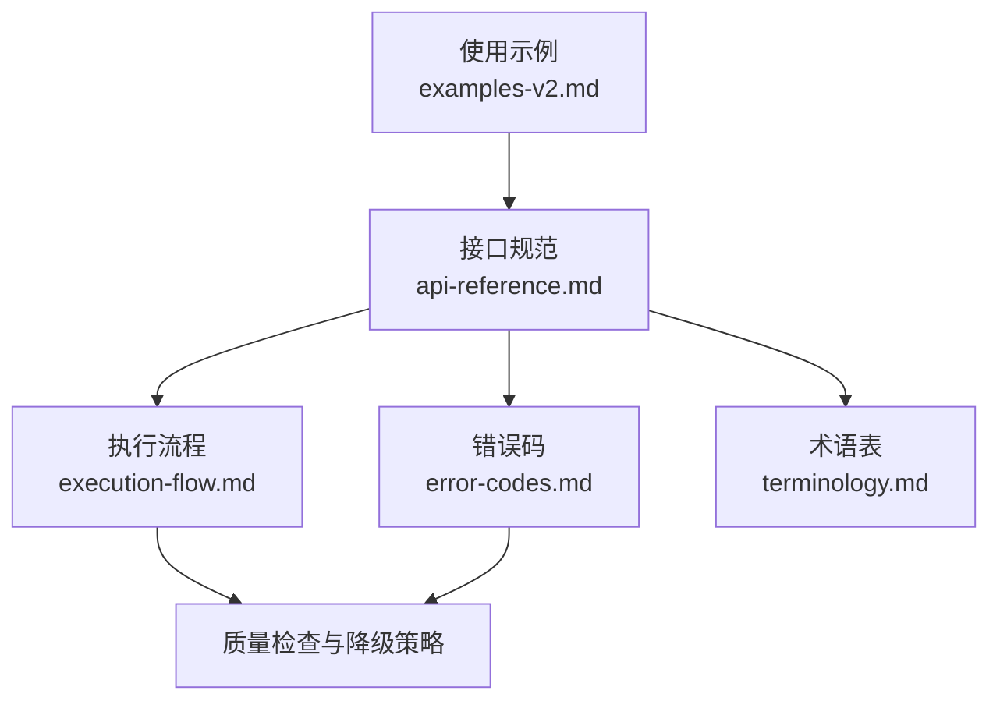
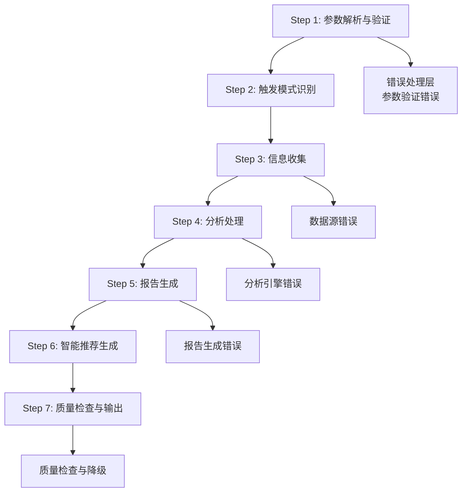
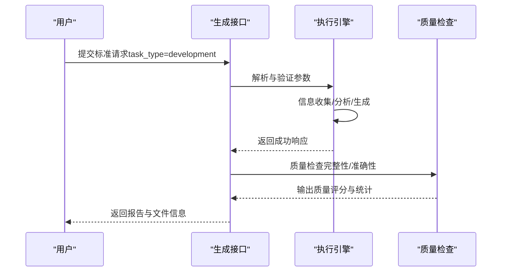
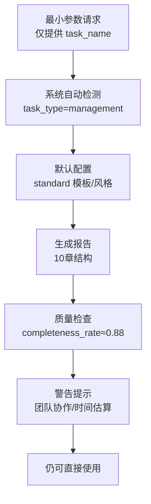
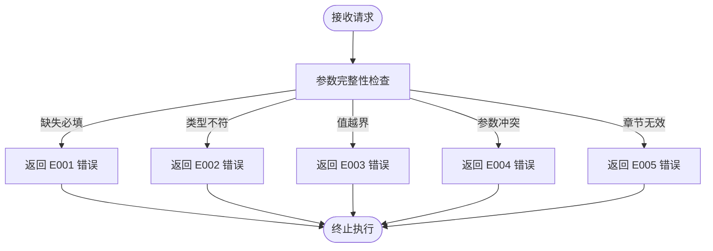
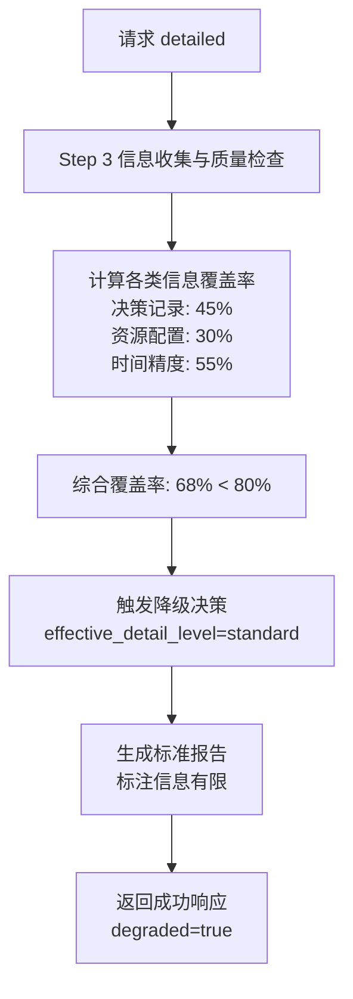
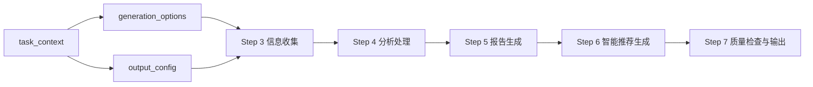

# 使用示例与最佳实践

<cite>
**本文档引用的文件**
- [examples-v2.md](file://references/examples-v2.md)
- [api-reference.md](file://references/api-reference.md)
- [execution-flow.md](file://references/execution-flow.md)
- [error-codes.md](file://references/error-codes.md)
- [terminology.md](file://references/terminology.md)
</cite>

## 目录
1. [简介](#简介)
2. [项目结构](#项目结构)
3. [核心组件](#核心组件)
4. [架构总览](#架构总览)
5. [详细组件分析](#详细组件分析)
6. [依赖分析](#依赖分析)
7. [性能考量](#性能考量)
8. [故障排查指南](#故障排查指南)
9. [结论](#结论)
10. [附录](#附录)

## 简介
本文件面向“任务执行总结报告生成器”技能的使用者，提供四个核心场景的完整使用示例与最佳实践：软件开发、项目管理、运维故障排查、学习成长。每个场景包含：
- 完整的对话示例与触发条件说明
- 报告特点分析与质量评分解读
- 何时使用技能、如何获得更高质量报告的建议
- 报告的使用与维护方法
- 常见问题FAQ与排障指引

## 项目结构
该仓库围绕“任务执行总结报告生成器”的使用与集成，提供以下关键文档：
- 使用示例与场景化参考：examples-v2.md
- 接口规范与参数定义：api-reference.md
- 执行流程与质量控制：execution-flow.md
- 错误码与异常处理：error-codes.md
- 术语与概念定义：terminology.md

**图表来源**
- [examples-v2.md:1-769](file://references/examples-v2.md#L1-L769)
- [api-reference.md:1-1378](file://references/api-reference.md#L1-L1378)
- [execution-flow.md:1-800](file://references/execution-flow.md#L1-L800)
- [error-codes.md:1-800](file://references/error-codes.md#L1-L800)
- [terminology.md:1-800](file://references/terminology.md#L1-L800)

**章节来源**
- [examples-v2.md:1-769](file://references/examples-v2.md#L1-L769)
- [api-reference.md:1-1378](file://references/api-reference.md#L1-L1378)

## 核心组件
- 任务上下文（task_context）：任务名称、类型、时间范围、描述、参与者、上下文数据等
- 生成选项（generation_options）：详细程度、模板变体、章节包含/排除、语言风格、分析维度、输出格式等
- 输出配置（output_config）：是否保存文件、文件路径、是否包含元数据、编码、自定义头部/尾部等
- 质量检查与统计：完整性评分、准确性置信度、信息缺口、警告、统计摘要（阶段数、决策数、问题数、建议数、核心指标）

**章节来源**
- [api-reference.md:183-862](file://references/api-reference.md#L183-L862)
- [execution-flow.md:441-721](file://references/execution-flow.md#L441-L721)

## 架构总览
技能执行遵循“确定性—可观测性—容错性”设计原则，分为7个步骤：参数解析与验证、触发模式识别、信息收集、分析处理、报告生成、智能推荐生成、质量检查与输出。异常路径按严重级别进行处理，支持降级继续与透明告知。

**图表来源**
- [execution-flow.md:173-721](file://references/execution-flow.md#L173-L721)

**章节来源**
- [execution-flow.md:28-171](file://references/execution-flow.md#L28-L171)

## 详细组件分析

### 场景一：软件开发（标准调用）
- 触发条件：完成一个软件开发任务（如用户认证模块开发），提供任务名称、任务类型为 development，使用默认配置即可获得高质量报告
- 关键参数：task_type=development、detail_level=standard、focus_dimensions 指向目标达成与问题模式
- 报告特点：包含10章完整结构，覆盖目标达成度、时间效能、问题解决、资源使用、多维分析、经验总结与改进建议等
- 质量评分：示例中达到94.5（优秀），completeness_rate>0.9，信息覆盖度高
- 降级与警告：本示例为完整调用，未出现降级

**图表来源**
- [examples-v2.md:29-165](file://references/examples-v2.md#L29-L165)
- [execution-flow.md:173-721](file://references/execution-flow.md#L173-L721)

**章节来源**
- [examples-v2.md:29-165](file://references/examples-v2.md#L29-L165)

### 场景二：项目管理（Sprint 复盘最小化调用）
- 触发条件：Sprint 结束后快速生成复盘报告，仅提供 task_name，系统自动推断任务类型为 management
- 关键参数：task_name、系统默认 detail_level=standard、template_variant=standard、language_style=professional
- 报告特点：涵盖目标设定与调整、执行过程、关键决策、问题解决、团队协作、多维分析、经验总结与改进建议
- 质量评分：示例中达到91.2（优秀），尽管存在团队协作信息有限的警告，仍可直接使用
- 降级与警告：存在两条低严重度警告（团队协作信息有限、时间估算精度±15%），但不影响整体可用性

**图表来源**
- [examples-v2.md:168-275](file://references/examples-v2.md#L168-L275)
- [api-reference.md:213-231](file://references/api-reference.md#L213-L231)

**章节来源**
- [examples-v2.md:168-275](file://references/examples-v2.md#L168-L275)

### 场景三：参数验证错误（异常场景）
- 触发条件：请求中缺少必填参数 task_name、使用无效枚举值、章节编号越界、排除所有核心章节等
- 处理策略：Step 1 参数验证阶段拦截，返回结构化错误响应，包含错误码、严重级别、HTTP 状态、详细错误列表、恢复建议与文档引用
- 典型错误码：E001（缺少必填参数）、E002（参数类型错误）、E003（参数值越界）、E004（参数冲突）、E005（章节组合无效）
- 建议修复：按 details 中的建议逐一修正参数，或参考最小可用请求

**图表来源**
- [examples-v2.md:278-422](file://references/examples-v2.md#L278-L422)
- [error-codes.md:177-556](file://references/error-codes.md#L177-L556)

**章节来源**
- [examples-v2.md:278-422](file://references/examples-v2.md#L278-L422)
- [error-codes.md:177-556](file://references/error-codes.md#L177-L556)

### 场景四：数据不足时的降级执行
- 触发条件：请求详细级别（detailed）但对话历史较短，信息覆盖率不足阈值（示例中为68%），系统触发降级
- 处理策略：将详细级别从 detailed 降级为 standard，返回带警告的成功响应，报告中标注“信息有限”，并提供用户升级建议
- 影响与缓解：质量评分下降至78.5（一般），第四章“关键决策分析”简化，“资源使用情况”标注“推断”，时间数据标注精度±20%
- 用户建议：补充更多任务细节后重新生成，或手动编辑报告补充标注“信息有限”的段落

**图表来源**
- [examples-v2.md:461-688](file://references/examples-v2.md#L461-L688)
- [execution-flow.md:627-699](file://references/execution-flow.md#L627-L699)

**章节来源**
- [examples-v2.md:461-688](file://references/examples-v2.md#L461-L688)
- [execution-flow.md:627-699](file://references/execution-flow.md#L627-L699)

### 概念总览
- 术语与概念：任务、项目、里程碑、阶段、工作项、交付物、产出物、目标、子目标、验收标准、完成定义、达成率、偏差、耗时、估算时间、瓶颈、时效比、关键路径、约束、依赖、问题、风险、应急预案、严重程度、根因、资源、利用率、浪费、效率、效能、生产力、优先级、技术栈、技术选型、决策、权衡、执行概览、方法论提炼、经验教训、最佳实践、模式、报告模板、附录、Sprint、用户故事、Backlog、回顾会议、Sprint Planning、Velocity、迭代、Story Point、增量交付、MVP、缺陷、技术债务、重构、代码质量、Code Review、PR/MR、CI/CD、质量门禁、回归测试、制品、SLA、学习曲线、技能矩阵、胜任力模型等

**章节来源**
- [terminology.md:22-800](file://references/terminology.md#L22-L800)

## 依赖分析
- 输入参数依赖：task_context 为必填，包含 task_name、task_type、time_range、description、participants、context_data；generation_options 与 output_config 为可选，默认值覆盖大部分场景
- 参数冲突与范围：included_chapters 与 excluded_chapters 互斥；章节编号必须在1-10之间且至少保留第1、9、10章；detail_level 与 template_variant 可能冲突时以 template_variant 优先
- 执行流程依赖：Step 1 参数验证通过后进入 Step 2；Step 3 信息收集阶段是核心瓶颈，耗时占比最高；Step 4-7 依赖前一步的中间结果

**图表来源**
- [api-reference.md:183-982](file://references/api-reference.md#L183-L982)
- [execution-flow.md:173-721](file://references/execution-flow.md#L173-L721)

**章节来源**
- [api-reference.md:951-992](file://references/api-reference.md#L951-L992)

## 性能考量
- 生成耗时分布：Step 3（信息收集）40-50%、Step 4（分析处理）35-40%、Step 5（报告生成）15-20%、Step 6（智能推荐）5-10%、Step 7（质量检查）<2%
- 详细程度影响：summary（约1-2秒）、standard（约3-5秒）、detailed（约8-15秒）
- 并发与内存：标准硬件下，不同详细程度的内存峰值与并发支持不同
- 优化建议：尽量提供精确的时间范围与上下文数据，减少 Step 3 的数据清洗与去重成本；合理选择详细程度与章节组合，避免不必要的深度分析

**章节来源**
- [api-reference.md:1348-1357](file://references/api-reference.md#L1348-L1357)
- [execution-flow.md:142-170](file://references/execution-flow.md#L142-L170)

## 故障排查指南
- 参数错误（E001-E005）：检查必填参数、类型、范围、冲突与章节组合；按 details 中的建议逐一修正
- 数据不足（E010）：对话历史过短或关键信息缺失，系统降级继续；建议补充信息后重新生成或手动编辑报告
- 数据源不可用（E011）：对话历史不可访问，切换到手动输入模式或稍后重试
- 文件访问被拒（E012）：检查输出路径权限、磁盘空间与安全策略
- 分析/生成异常（E021-E032）：系统内部错误，查看错误响应中的上下文与恢复建议
- 资源不足（E041）：内存不足等系统资源问题，等待资源释放或降低详细程度
- 超时（E051）：执行时间过长，使用异步接口或优化输入参数

**章节来源**
- [error-codes.md:177-800](file://references/error-codes.md#L177-L800)
- [examples-v2.md:278-688](file://references/examples-v2.md#L278-L688)

## 结论
- 软件开发场景：使用默认配置即可获得高质量报告，若需深度分析可提升详细程度与分析维度
- 项目管理场景：最小参数即可快速生成复盘报告，系统自动推断任务类型与默认配置
- 异常场景：参数验证错误应按错误响应中的建议修正；数据不足时接受降级并补充信息
- 学习成长场景：使用 learning 模板与 detailed 级别可生成知识体系与方法论沉淀的报告

## 附录

### 最佳实践建议
- 何时使用技能
  - 软件开发：功能开发完成、Bug修复、技术重构后进行技术沉淀与问题排查记录
  - 项目管理：Sprint 结束、里程碑达成、项目收尾后进行进度复盘与资源评估
  - 运维排查：故障处理、性能优化、安全加固后进行排查流程标准化与预防措施
  - 学习成长：课程学习、技能培训、认证备考后进行知识体系构建与学习方法论沉淀
- 如何获得更高质量的报告
  - 提供精确的时间范围与上下文数据（目标、约束、工具、技术栈、外部参考资料）
  - 保持详细的对话记录，说明思考过程、遇到的困难与尝试过的方案
  - 合理选择详细程度与章节组合，避免不必要的深度分析
  - 使用学习模板进行学习类任务，最大化知识沉淀与方法论提炼
- 报告的使用与维护
  - 将报告保存到文件并包含元数据，便于检索与版本管理
  - 定期更新报告，补充关键决策的详细说明与时间线的精确数据
  - 将报告纳入团队知识库，作为后续任务的参考与最佳实践沉淀

**章节来源**
- [api-reference.md:50-61](file://references/api-reference.md#L50-L61)
- [examples-v2.md:691-705](file://references/examples-v2.md#L691-L705)

### 常见问题FAQ
- 问：为什么我的报告质量评分不高？
  - 答：可能由于对话历史过短或关键信息缺失，系统触发降级。建议补充更多信息后重新生成，或手动编辑报告。
- 问：如何修复参数错误？
  - 答：根据错误响应中的 details 逐项修正参数类型、范围、必填与冲突问题，或参考最小可用请求。
- 问：如何避免降级执行？
  - 答：在任务执行过程中保持详细的对话记录，提供精确的时间范围与上下文数据，确保关键决策、问题与资源信息完整。
- 问：如何选择合适的详细程度与章节组合？
  - 答：根据报告用途选择 summary（快速汇报）、standard（常规复盘）、detailed（深度分析）；章节组合需满足依赖关系，至少保留第1、9、10章。

**章节来源**
- [examples-v2.md:691-705](file://references/examples-v2.md#L691-L705)
- [error-codes.md:177-556](file://references/error-codes.md#L177-L556)