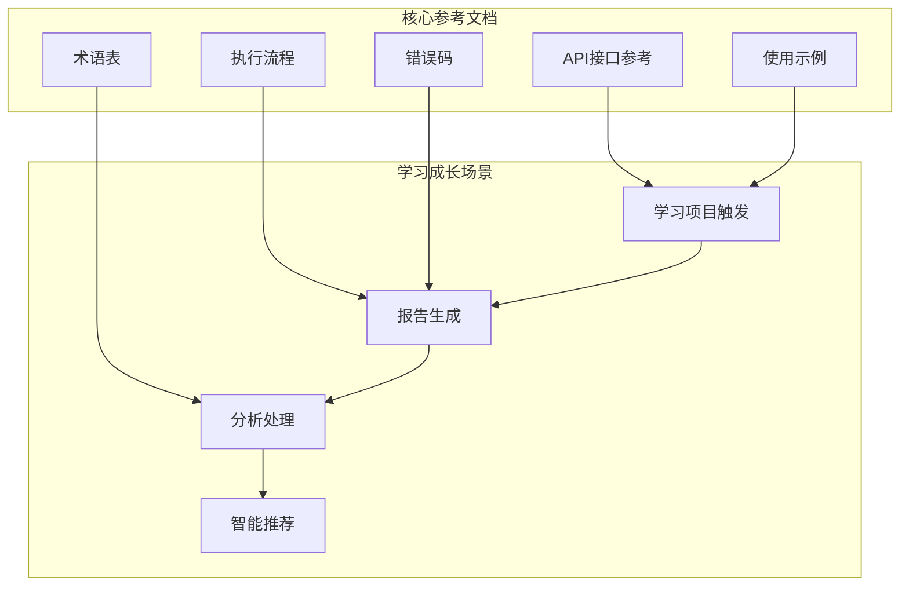
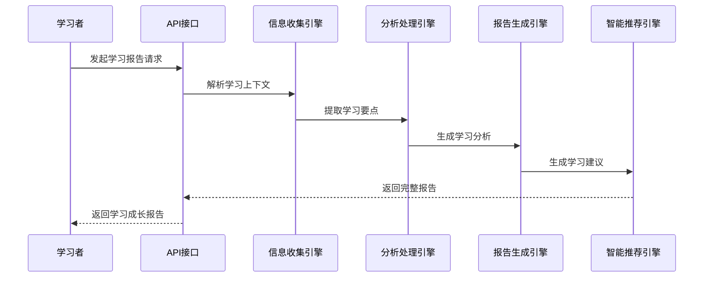
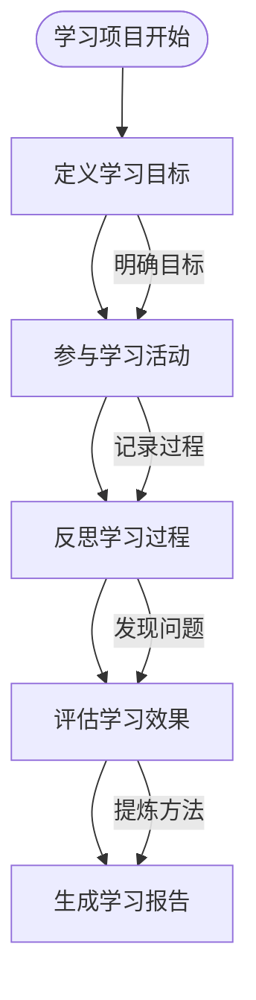
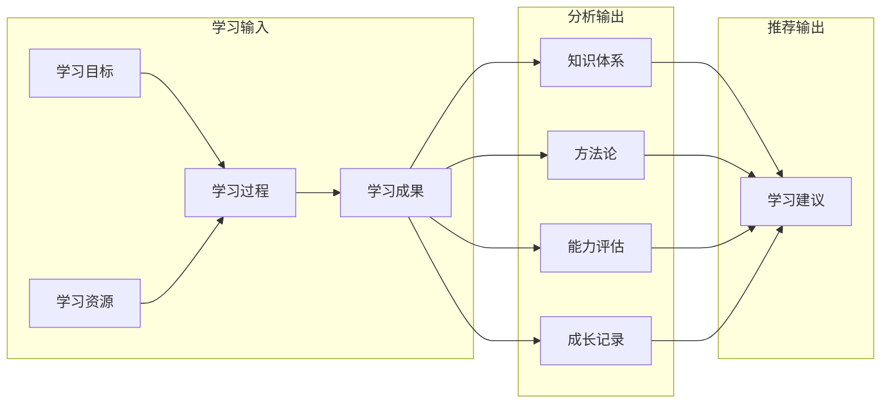

# 学习成长场景示例

<cite>
**本文档引用的文件**
- [api-reference.md](file://references/api-reference.md)
- [examples-v2.md](file://references/examples-v2.md)
- [execution-flow.md](file://references/execution-flow.md)
- [error-codes.md](file://references/error-codes.md)
- [terminology.md](file://references/terminology.md)
</cite>

## 目录
1. [简介](#简介)
2. [项目结构](#项目结构)
3. [核心组件](#核心组件)
4. [架构概览](#架构概览)
5. [详细组件分析](#详细组件分析)
6. [依赖分析](#依赖分析)
7. [性能考虑](#性能考虑)
8. [故障排除指南](#故障排除指南)
9. [结论](#结论)
10. [附录](#附录)

## 简介

"任务执行总结报告生成器"是一个专为学习成长场景设计的智能报告生成系统。该系统基于四大核心引擎协同工作，能够为React框架学习等技能培养过程提供全面的知识梳理和能力评估报告。

### 系统特色

- **学习专用模板**：针对学习项目、课程总结、技能认证备考等场景优化
- **知识体系构建**：自动提取学习要点，构建个人知识图谱
- **方法论提炼**：从学习实践中抽象出可复用的学习方法和经验
- **个人能力评估**：提供技能矩阵、胜任力模型等评估维度
- **后续行动计划**：生成个性化的学习路径和成长建议

## 项目结构

**图表来源**
- [api-reference.md:1-1378](file://references/api-reference.md#L1-L1378)
- [examples-v2.md:1-769](file://references/examples-v2.md#L1-L769)

**章节来源**
- [api-reference.md:1-1378](file://references/api-reference.md#L1-L1378)
- [examples-v2.md:1-769](file://references/examples-v2.md#L1-L769)

## 核心组件

### 学习成长报告生成器

系统的核心能力包括四个主要引擎：

1. **信息收集引擎**：从学习对话和相关文件中提取关键信息
2. **分析处理引擎**：深度分析学习过程和成果
3. **报告生成引擎**：按照学习专用模板生成结构化报告
4. **智能推荐引擎**：提供针对性的学习建议和方法论

### 学习专用模板

系统提供专门针对学习场景的模板变体，强化以下学习维度：
- 学习支持系统分析
- 知识体系与方法论沉淀
- 学习效率评估
- 技能等级自评
- 后续学习路线图

**章节来源**
- [api-reference.md:436-448](file://references/api-reference.md#L436-L448)
- [api-reference.md:441-444](file://references/api-reference.md#L441-L444)

## 架构概览

**图表来源**
- [execution-flow.md:100-132](file://references/execution-flow.md#L100-L132)
- [api-reference.md:183-714](file://references/api-reference.md#L183-L714)

## 详细组件分析

### 学习项目触发条件

学习成长场景的触发条件包括：

#### 必填参数
- **task_name**：学习任务名称（如"React Hooks学习"）
- **task_type**：必须设置为"learning"（学习成长类型）

#### 可选配置
- **time_range**：学习时间范围（可选，建议提供）
- **description**：学习目标描述
- **participants**：学习伙伴信息（可选）
- **context_data**：学习资源和工具信息

#### 学习专用配置

**图表来源**
- [examples-v2.md:29-165](file://references/examples-v2.md#L29-L165)
- [api-reference.md:213-227](file://references/api-reference.md#L213-L227)

### 预期输出报告的关键内容

#### 执行概览
- 学习项目基本信息和目标
- 学习成果概要和关键数据
- 学习效率和时间投入统计

#### 学习路径与知识图谱
- 学习内容的知识结构图
- 技能掌握程度评估
- 学习资源和工具使用情况

#### 个人成长记录
- 学习过程中的关键里程碑
- 问题解决和方法论提炼
- 学习方法和技巧总结

#### 学习方法论总结
- 从学习实践中抽象的方法论
- 可复用的学习策略和技巧
- 学习效果评估和改进方案

#### 后续行动计划
- 个性化学习路径建议
- 技能提升目标和时间规划
- 学习资源和工具推荐

**章节来源**
- [examples-v2.md:74-165](file://references/examples-v2.md#L74-L165)
- [api-reference.md:441-444](file://references/api-reference.md#L441-L444)

### 学习方法论提炼

系统能够从学习过程中自动提炼以下方法论：

#### 学习曲线分析
- 技能掌握的阶段性特征
- 学习难度和进度的关系
- 个人学习特点和偏好

#### 知识体系构建
- 学习内容的结构化整理
- 知识间的关联关系
- 个人知识图谱的形成

#### 能力评估体系
- 技能矩阵和胜任力模型
- 学习效果的量化评估
- 个人能力发展轨迹

**章节来源**
- [terminology.md:783-826](file://references/terminology.md#L783-L826)
- [terminology.md:829-861](file://references/terminology.md#L829-L861)

## 依赖分析

### 学习场景特有的依赖关系

**图表来源**
- [execution-flow.md:701-721](file://references/execution-flow.md#L701-L721)
- [examples-v2.md:168-275](file://references/examples-v2.md#L168-L275)

### 学习专用模板依赖

学习专用模板在标准模板基础上增加了：
- 第七章：学习支持系统分析
- 第九章：知识体系与方法论沉淀
- 第十章：后续学习路线图

**章节来源**
- [api-reference.md:441-444](file://references/api-reference.md#L441-L444)
- [execution-flow.md:701-721](file://references/execution-flow.md#L701-L721)

## 性能考虑

### 学习场景性能特征

| 维度 | 标准学习项目 | 复杂学习项目 | 学习模板选择 |
|------|-------------|-------------|-------------|
| 对话轮数 | 5-15轮 | 15-50轮 | learning模板 |
| 生成时间 | 1-3分钟 | 3-8分钟 | 详细程度影响 |
| 报告长度 | 2-5页 | 10-20页 | 模板变体影响 |
| 质量评分 | 85-95分 | 80-90分 | 数据完整性 |

### 学习数据质量要求

- **最低对话轮数**：8轮（建议15轮以上）
- **关键信息覆盖率**：≥70%（决策记录、问题解决、资源使用）
- **时间信息精度**：±20%（估算值标注）
- **学习目标明确性**：清晰可量化

**章节来源**
- [error-codes.md:560-668](file://references/error-codes.md#L560-L668)
- [execution-flow.md:147-158](file://references/execution-flow.md#L147-L158)

## 故障排除指南

### 常见学习场景问题

#### 数据不足警告 (E010)
**触发条件**：学习对话过短或信息不完整
**影响**：报告降级生成，部分章节标注"信息不足"
**解决方案**：
1. 补充学习过程的详细记录
2. 提供学习目标和成果的具体描述
3. 添加学习资源和工具使用情况

#### 学习模板配置错误
**触发条件**：未正确设置task_type为"learning"
**影响**：使用标准模板而非学习专用模板
**解决方案**：
1. 确保task_type参数设置为"learning"
2. 使用template_variant:"learning"
3. 提供学习相关的上下文信息

#### 学习目标不明确
**触发条件**：学习目标描述模糊或缺失
**影响**：知识体系构建不完整
**解决方案**：
1. 明确学习的具体目标和预期成果
2. 提供可量化的学习指标
3. 描述学习的背景和动机

**章节来源**
- [error-codes.md:560-668](file://references/error-codes.md#L560-L668)
- [examples-v2.md:278-422](file://references/examples-v2.md#L278-L422)

## 结论

"任务执行总结报告生成器"为学习成长场景提供了全面的智能化支持。通过专门的学习模板和分析引擎，系统能够：

1. **构建完整的学习档案**：从学习目标到成果评估的全流程记录
2. **提炼可复用的学习方法**：从实践中抽象出通用的学习策略
3. **提供个性化的成长建议**：基于个人学习特点制定发展路径
4. **支持持续的学习改进**：通过PDCA循环实现学习效果的持续优化

该系统特别适合React框架学习等技能培养场景，能够帮助学习者建立系统性的知识体系，提升学习效率，并为个人职业发展提供有力支撑。

## 附录

### 学习成长场景最佳实践

#### 学习记录建议
- 保持学习过程的详细记录
- 记录关键的学习决策和思考过程
- 总结遇到的问题和解决方法
- 评估学习效果和改进方向

#### 报告生成建议
- 提供完整的学习上下文信息
- 明确学习目标和预期成果
- 包含学习资源和工具使用情况
- 保持学习过程的真实性和完整性

#### 后续学习规划
- 基于报告结果制定个性化学习计划
- 设定阶段性学习目标和里程碑
- 选择合适的学习资源和工具
- 建立持续学习和改进的机制

**章节来源**
- [terminology.md:829-861](file://references/terminology.md#L829-L861)
- [examples-v2.md:689-742](file://references/examples-v2.md#L689-L742)