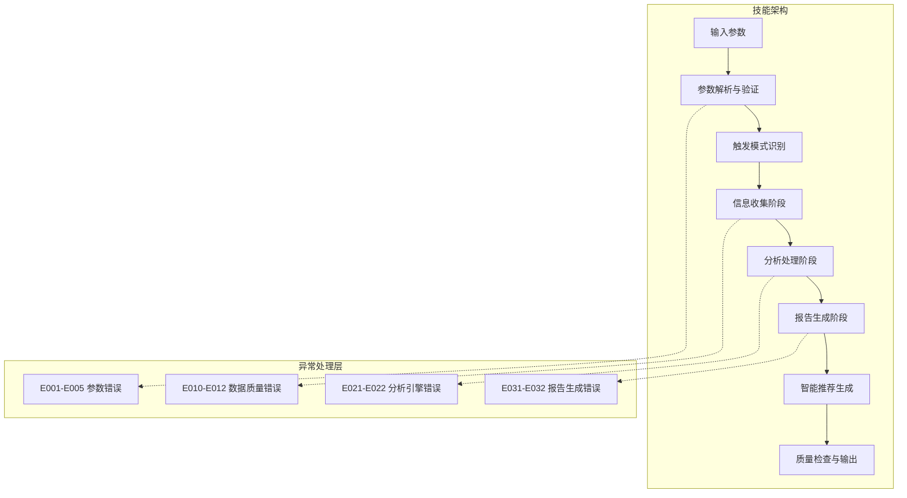
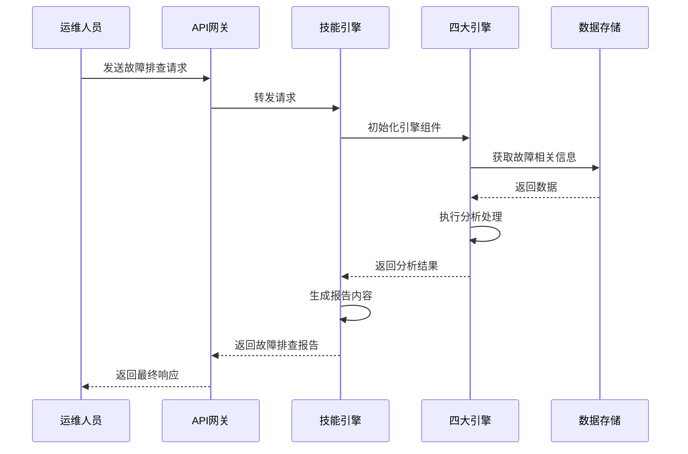
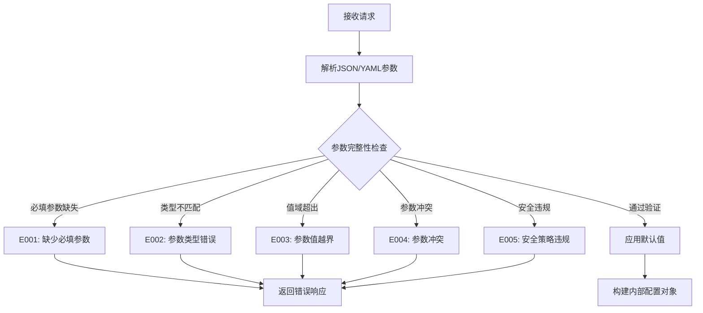
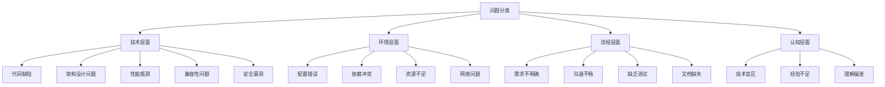
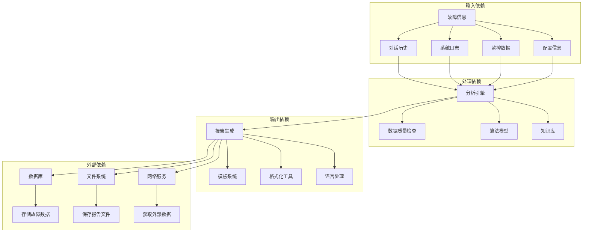
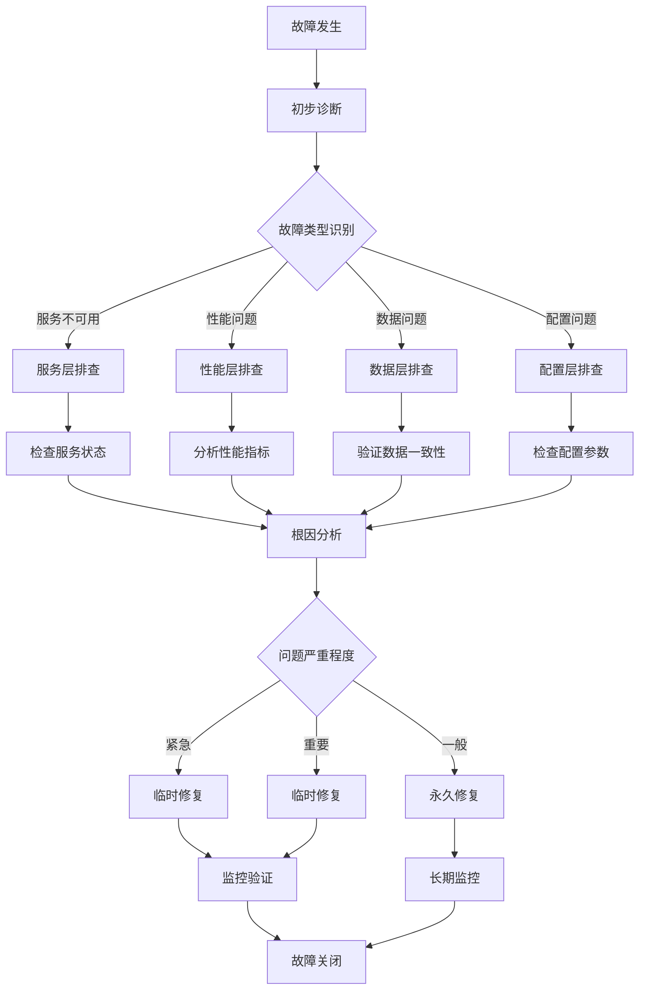

# 故障排查场景示例

<cite>
**本文档引用的文件**
- [api-reference.md](file://references/api-reference.md)
- [error-codes.md](file://references/error-codes.md)
- [examples-v2.md](file://references/examples-v2.md)
- [execution-flow.md](file://references/execution-flow.md)
- [terminology.md](file://references/terminology.md)
</cite>

## 目录
1. [简介](#简介)
2. [项目结构](#项目结构)
3. [核心组件](#核心组件)
4. [架构概览](#架构概览)
5. [详细组件分析](#详细组件分析)
6. [依赖分析](#依赖分析)
7. [性能考虑](#性能考虑)
8. [故障排查指南](#故障排查指南)
9. [结论](#结论)
10. [附录](#附录)

## 简介

本文档基于"任务执行总结报告生成器"技能，为生产环境微服务故障处理提供详细的故障排查场景示例。该技能通过七步执行流程，将故障排查过程系统化、标准化，为运维人员提供完整的故障处理方法论。

该技能的核心价值在于：
- **系统化的排查方法论**：提供标准化的故障排查流程和检查清单
- **根因分析框架**：基于五维分析模型（目标达成度、时间效能、资源利用率、问题模式、协作效果）
- **预防措施建议**：从故障中提取可复用的方法论和最佳实践
- **降级执行机制**：在信息不完整时仍能提供有价值的故障分析报告

## 项目结构



**图表来源**
- [execution-flow.md:100-132](file://references/execution-flow.md#L100-L132)

**章节来源**
- [execution-flow.md:1-1783](file://references/execution-flow.md#L1-L1783)

## 核心组件

### 1. 任务执行总结报告生成器

该技能的核心组件包括：

#### 1.1 信息收集引擎
- **对话历史解析器**：提取任务相关的关键信息
- **操作记录提取器**：识别具体的操作行为记录
- **文件变更追踪器**：获取文件系统的变更记录

#### 1.2 分析处理引擎
- **五维分析模型**：目标达成度、时间效能、资源利用率、问题模式、协作效果
- **根因分析框架**：基于"5 Why"和鱼骨图的分析方法
- **模式识别算法**：自动识别常见问题模式和解决方案

#### 1.3 报告生成引擎
- **模板系统**：支持摘要版、标准版、详细版三种模板变体
- **内容生成器**：动态生成报告内容和可视化图表
- **格式优化器**：确保报告的专业性和可读性

#### 1.4 智能推荐引擎
- **方法论提取**：从成功实践中抽象可复用的方法
- **改进建议生成**：基于证据的优先级排序建议
- **风险预警系统**：识别潜在风险并提供预防措施

**章节来源**
- [execution-flow.md:441-918](file://references/execution-flow.md#L441-L918)

## 架构概览



**图表来源**
- [execution-flow.md:175-196](file://references/execution-flow.md#L175-L196)

该架构采用"四大引擎协同工作"的设计理念，确保故障排查的全面性和准确性。

## 详细组件分析

### 故障排查触发条件

#### 1.1 自动触发条件
- **完成信号词检测**：当检测到"完成了"、"好了"、"可以了"等完成信号时自动触发
- **任务复杂度阈值**：任务复杂度超过中等水平时自动触发
- **时间窗口识别**：任务开始和结束时间明确的故障场景

#### 1.2 手动触发条件
- **显式命令**：用户发送"/summary"、"请生成总结"等明确的触发命令
- **API调用**：通过RESTful API或JSON-RPC接口主动请求
- **定时触发**：基于预设时间或条件的自动触发

#### 1.3 命令行触发条件
- **配置化参数**：通过配置文件或环境变量设置触发条件
- **脚本集成**：与其他监控或运维脚本集成触发

**章节来源**
- [execution-flow.md:313-438](file://references/execution-flow.md#L313-L438)

### 故障排查完整步骤记录

#### 步骤1：参数解析与验证


**图表来源**
- [execution-flow.md:175-310](file://references/execution-flow.md#L175-L310)

#### 步骤2：触发模式识别
- **自动触发**：基于完成信号词和任务复杂度的智能识别
- **手动触发**：显式命令的精确识别
- **命令行触发**：配置化参数的自动识别

#### 步骤3：信息收集阶段
- **数据源适配**：对话历史、操作记录、文件变更的统一适配
- **信息抽取**：任务目标、时间节点、决策、问题、资源、协作的抽取
- **数据整合**：去重、时序对齐、关联建立
- **质量检查**：完整性评分和覆盖率评估

#### 步骤4：分析处理阶段
- **目标达成度分析**：对比法和量化评估
- **时间效能分析**：偏差计算和瓶颈识别
- **资源利用率分析**：利用率计算和浪费识别
- **问题模式分析**：分类统计和有效性评估
- **协作效果分析**：多人协作的综合评估

#### 步骤5：报告生成阶段
- **模板选择**：根据详细程度选择模板变体
- **数据映射**：分析结果到模板字段的映射
- **内容填充**：动态生成文本、表格、列表
- **格式优化**：Markdown语法规范化和排版优化
- **语言润色**：专业性检查和语言质量提升

#### 步骤6：智能推荐生成
- **方法论提取**：从成功实践中抽象可复用的方法
- **改进建议生成**：基于证据的优先级排序
- **风险预警生成**：识别潜在风险并提供预防措施

#### 步骤7：质量检查与输出
- **结构完整性验证**：10章齐全性和格式正确性检查
- **内容准确性抽检**：数字一致性、逻辑自洽性验证
- **最终响应组装**：构建完整的成功响应

**章节来源**
- [execution-flow.md:173-1467](file://references/execution-flow.md#L173-L1467)

### 根因分析过程

#### 4.1 问题分类体系


**图表来源**
- [execution-flow.md:813-838](file://references/execution-flow.md#L813-L838)

#### 4.2 根因分析方法
- **5 Why分析法**：层层追溯问题的根本原因
- **鱼骨图分析**：从人、机、料、法、环五个维度分析
- **故障树分析**：从顶事件向下分析导致故障的各种因素
- **因果关系图**：建立问题与解决方案之间的因果关系

#### 4.3 解决方案有效性评估
| 解决方案 | 彻底性 | 副作用 | 可复用性 | 综合评价 |
|---------|--------|--------|---------|---------|
| 彻底解决 | ✅ 无残留 | 无 | 高 | ⭐⭐⭐⭐⭐ |
| 临时规避 | ⚠️ 可能复发 | 小 | 中 | ⭐⭐⭐☆☆ |
| 引入新问题 | ❌ 有遗留 | 有 | 低 | ⭐⭐☆☆☆ |

**章节来源**
- [execution-flow.md:807-847](file://references/execution-flow.md#L807-L847)

### 临时修复与永久修复策略

#### 5.1 临时修复策略
- **紧急响应**：快速恢复服务的临时措施
- **降级策略**：在不影响核心功能的前提下提供简化服务
- **熔断机制**：防止故障扩散的保护措施
- **限流策略**：控制请求量避免系统过载

#### 5.2 永久修复策略
- **根因治理**：从源头解决问题的长期方案
- **架构优化**：改进系统设计和架构
- **流程改进**：完善开发和运维流程
- **技术升级**：采用更先进的技术方案

#### 5.3 预防措施建议
- **监控预警**：建立完善的监控和预警机制
- **容量规划**：合理规划系统容量和资源
- **备份策略**：制定完善的备份和恢复策略
- **演练计划**：定期进行故障演练和培训

**章节来源**
- [execution-flow.md:1267-1328](file://references/execution-flow.md#L1267-L1328)

### 经验教训总结

#### 6.1 成功要素提炼
- **快速响应**：建立高效的故障响应机制
- **根因导向**：专注于解决根本问题而非表面症状
- **全面验证**：确保修复方案的完整性和有效性
- **知识沉淀**：将经验转化为可复用的知识资产

#### 6.2 方法论提炼
- **标准化流程**：建立标准化的故障处理流程
- **最佳实践**：总结成功的故障处理经验和做法
- **模式识别**：识别常见故障模式和解决方案
- **持续改进**：基于每次故障处理不断优化流程

#### 6.3 知识图谱更新
- **技术知识**：新增的技术知识和解决方案
- **流程知识**：优化的流程和操作规范
- **工具知识**：新工具和新技术的应用
- **团队知识**：团队协作和沟通的经验

**章节来源**
- [execution-flow.md:1185-1215](file://references/execution-flow.md#L1185-L1215)

## 依赖分析



**图表来源**
- [execution-flow.md:482-626](file://references/execution-flow.md#L482-L626)

### 组件耦合关系

#### 7.1 内聚性分析
- **信息收集引擎**：高度内聚，专注于数据收集和预处理
- **分析处理引擎**：中等内聚，需要访问多种数据源
- **报告生成引擎**：高度内聚，专注于内容生成和格式化
- **智能推荐引擎**：中等内聚，需要结合分析结果和知识库

#### 7.2 耦合度分析
- **信息收集与分析**：中等耦合，需要共享数据结构
- **分析与报告**：低耦合，通过标准化接口交互
- **报告与推荐**：低耦合，独立的输出组件
- **各引擎间**：松耦合，通过统一的数据格式交互

**章节来源**
- [execution-flow.md:441-918](file://references/execution-flow.md#L441-L918)

## 性能考虑

### 7.1 性能基线
- **总耗时分布**：信息收集阶段占40-50%，分析处理占35-40%，报告生成占15-20%
- **对话轮数影响**：20-50轮对话时，总耗时在2-8分钟范围内
- **详细程度影响**：摘要版比标准版快30%，详细版比标准版快50%
- **数据量影响**：对话长度每增加一倍，耗时增加约20-30%

### 7.2 性能优化策略
- **缓存机制**：缓存常用的分析结果和模板
- **异步处理**：对耗时较长的分析任务采用异步处理
- **并行计算**：对独立的分析任务采用并行处理
- **增量更新**：只处理新增的数据和变化的部分

### 7.3 资源使用优化
- **内存管理**：合理控制内存使用，避免内存泄漏
- **CPU优化**：优化算法复杂度，减少不必要的计算
- **I/O优化**：批量处理I/O操作，减少系统调用次数
- **网络优化**：优化网络请求，减少延迟和带宽占用

**章节来源**
- [execution-flow.md:142-170](file://references/execution-flow.md#L142-L170)

## 故障排查指南

### 8.1 常见故障场景

#### 场景1：服务不可用
**触发条件**：服务完全不可访问或响应超时
**排查步骤**：
1. 检查服务健康状态和可用性
2. 分析最近的变更和配置修改
3. 检查依赖服务和外部接口
4. 查看错误日志和异常信息
5. 验证资源使用情况和系统负载

**临时修复**：重启服务、回滚最近变更、启用备用实例
**永久修复**：修复代码缺陷、优化配置参数、改进监控告警

#### 场景2：性能下降
**触发条件**：响应时间明显增加或吞吐量下降
**排查步骤**：
1. 分析性能指标和瓶颈位置
2. 检查资源使用情况和限制
3. 识别慢查询和性能热点
4. 评估并发和负载情况
5. 对比历史性能数据

**临时修复**：扩容实例、优化查询、清理缓存
**永久修复**：优化代码性能、改进数据库设计、升级硬件资源

#### 场景3：数据不一致
**触发条件**：数据出现不一致或错误状态
**排查步骤**：
1. 确认问题范围和影响程度
2. 检查数据同步和一致性机制
3. 分析事务处理和并发控制
4. 验证数据验证和约束条件
5. 追溯数据变更历史

**临时修复**：数据修复、重新同步、强制一致性
**永久修复**：改进数据一致性机制、优化事务处理、加强数据验证

### 8.2 故障排查流程



**图表来源**
- [examples-v2.md:461-678](file://references/examples-v2.md#L461-L678)

### 8.3 故障处理最佳实践

#### 8.3.1 快速响应机制
- **建立值班制度**：确保24/7有人值守处理紧急故障
- **制定响应时间**：明确不同类型故障的响应和解决时限
- **建立升级机制**：复杂故障的升级和协调流程
- **记录处理过程**：详细记录故障处理的全过程

#### 8.3.2 根因分析方法
- **5 Why分析法**：深入挖掘问题的根本原因
- **鱼骨图分析**：从多个维度分析问题产生的原因
- **故障树分析**：系统性分析导致故障的各种因素
- **因果关系图**：建立问题与解决方案之间的因果关系

#### 8.3.3 预防措施制定
- **监控预警**：建立完善的监控和预警机制
- **容量规划**：合理规划系统容量和资源
- **备份策略**：制定完善的备份和恢复策略
- **演练计划**：定期进行故障演练和培训

**章节来源**
- [examples-v2.md:278-688](file://references/examples-v2.md#L278-L688)

## 结论

"任务执行总结报告生成器"技能为生产环境微服务故障处理提供了系统化、标准化的解决方案。通过七步执行流程和四大引擎协同工作，该技能能够：

1. **提供完整的故障排查方法论**：从触发条件识别到最终报告输出的全流程标准化
2. **建立科学的根因分析框架**：基于五维分析模型和多种分析方法的综合应用
3. **生成可执行的改进建议**：基于数据分析和经验总结的优先级建议
4. **确保降级执行的可靠性**：在信息不完整时仍能提供有价值的故障分析

该技能的核心价值在于将复杂的故障排查过程标准化、自动化，为运维人员提供可靠的故障处理工具和方法论指导。通过持续使用和优化，该技能将成为企业故障处理能力的重要组成部分。

## 附录

### A. 术语表

#### A.1 故障排查相关术语
- **故障**：系统或服务出现的异常情况，影响正常功能
- **根因**：导致故障发生的根本原因，而非表面现象
- **临时修复**：快速恢复服务的临时措施，不解决根本问题
- **永久修复**：从根源上解决问题的长期方案
- **预防措施**：为避免类似故障再次发生而采取的措施

#### A.2 分析相关术语
- **五维分析**：目标达成度、时间效能、资源利用率、问题模式、协作效果五个维度的综合分析
- **模式识别**：识别常见问题模式和解决方案的自动化过程
- **有效性评估**：对解决方案的效果进行量化评估的方法
- **风险预警**：识别潜在风险并提前发出警告的机制

**章节来源**
- [terminology.md:265-456](file://references/terminology.md#L265-L456)

### B. API接口参考

#### B.1 接口调用示例
```json
{
  "task_context": {
    "task_name": "生产环境故障排查",
    "task_type": "operations",
    "description": "处理生产环境数据库连接池耗尽故障",
    "time_range": {
      "start_time": "2026-04-09T10:00:00+08:00",
      "end_time": "2026-04-09T14:00:00+08:00"
    }
  },
  "generation_options": {
    "detail_level": "detailed",
    "template_variant": "standard",
    "focus_dimensions": ["problem_patterns", "resource_utilization"]
  },
  "output_config": {
    "save_to_file": true,
    "file_path": "./reports/故障排查报告_20260409.md"
  }
}
```

#### B.2 错误码定义
- **E001**: 缺少必填参数 - 致命错误，直接返回错误响应
- **E010**: 信息覆盖不足 - 警告，降级继续执行
- **E021**: 分析引擎错误 - 警告，跳过该维度分析
- **E031**: 报告生成错误 - 致命错误，回退到简化模板

**章节来源**
- [api-reference.md:183-715](file://references/api-reference.md#L183-L715)
- [error-codes.md:173-586](file://references/error-codes.md#L173-L586)