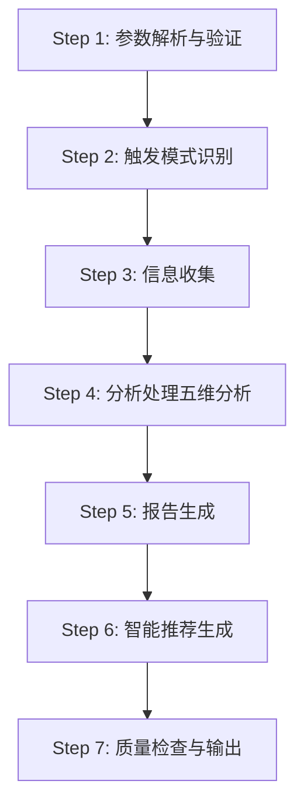
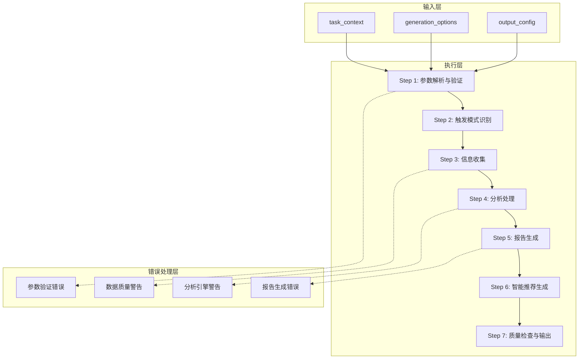
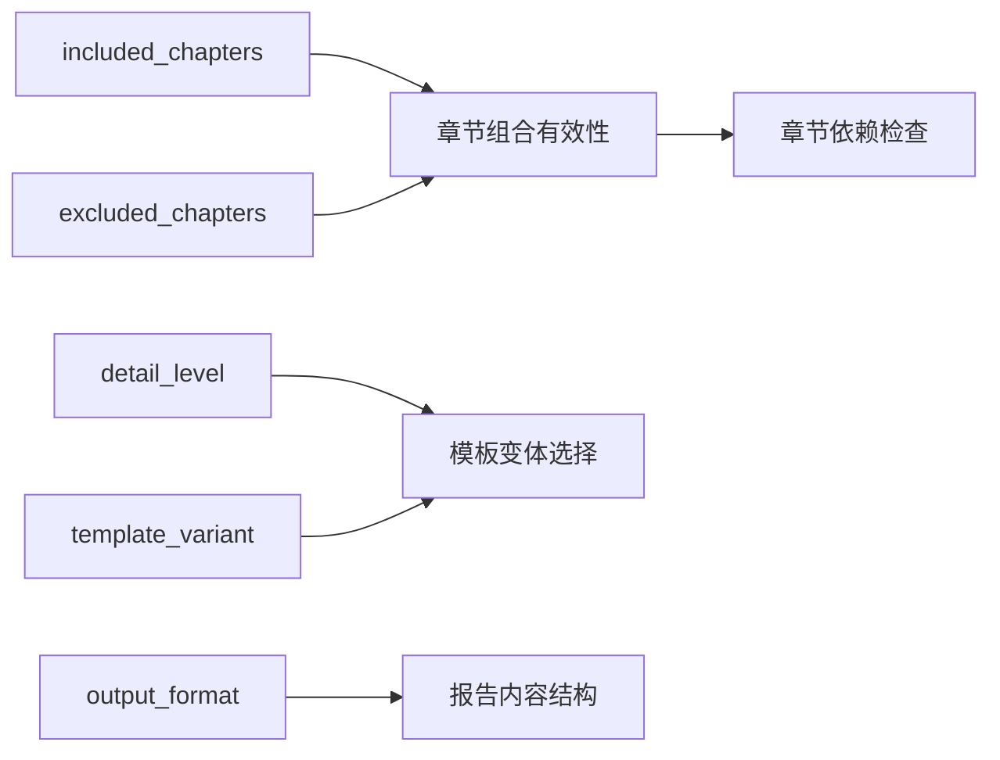

# 最佳实践与使用指南

<cite>
**本文档引用的文件**
- [api-reference.md](file://references/api-reference.md)
- [error-codes.md](file://references/error-codes.md)
- [examples-v2.md](file://references/examples-v2.md)
- [execution-flow.md](file://references/execution-flow.md)
- [terminology.md](file://references/terminology.md)
</cite>

## 目录
1. [简介](#简介)
2. [项目结构](#项目结构)
3. [核心组件](#核心组件)
4. [架构概览](#架构概览)
5. [详细组件分析](#详细组件分析)
6. [依赖分析](#依赖分析)
7. [性能考量](#性能考量)
8. [故障排查指南](#故障排查指南)
9. [结论](#结论)
10. [附录](#附录)

## 简介
本指南面向使用“任务执行总结报告生成器”技能的开发者、集成商与高级用户，系统阐述不同场景下的最佳实践、使用建议与注意事项。内容涵盖：
- 何时使用技能、如何获得更高质量的报告
- 报告的使用与维护方法
- 软件开发类、项目管理类、运维排查类、技术研究类、学习成长类任务的触发时机与数据准备要点
- 常见问题FAQ与解决方案

## 项目结构
技能以“7步执行流水线”为核心，围绕“确定性、可观测性、容错性”三大设计原则构建，确保在不同输入质量与复杂度下仍能产出可复用的结构化报告。



**图表来源**
- [execution-flow.md:1474-1485](file://references/execution-flow.md#L1474-L1485)

**章节来源**
- [execution-flow.md:28-171](file://references/execution-flow.md#L28-L171)

## 核心组件
- 输入参数体系：task_context、generation_options、output_config，分别负责任务上下文、生成偏好与输出配置。
- 执行流水线：7个步骤，从参数校验到最终报告输出，贯穿质量度量与降级策略。
- 错误与降级：统一的错误码体系与分级处理策略，确保在信息不足或异常情况下仍可返回可用结果。
- 术语体系：统一的领域术语表，便于报告与沟通的一致性。

**章节来源**
- [api-reference.md:183-715](file://references/api-reference.md#L183-L715)
- [execution-flow.md:173-1467](file://references/execution-flow.md#L173-L1467)
- [error-codes.md:1-150](file://references/error-codes.md#L1-L150)
- [terminology.md:1-120](file://references/terminology.md#L1-L120)

## 架构概览
技能采用“分层流水线 + 统一错误处理”的架构，确保：
- 确定性：标准化内部配置对象，保证相同输入产生一致输出。
- 可观测性：每步产出中间结果，便于调试与质量追踪。
- 容错性：非致命错误降级继续，警告型错误允许用户选择。



**图表来源**
- [execution-flow.md:99-132](file://references/execution-flow.md#L99-L132)
- [execution-flow.md:1474-1584](file://references/execution-flow.md#L1474-L1584)

**章节来源**
- [execution-flow.md:97-171](file://references/execution-flow.md#L97-L171)

## 详细组件分析

### 输入参数最佳实践
- task_context
  - 必填：提供清晰的任务名称，避免“任务1”等模糊命名。
  - task_type：若自动检测可能不准确，建议显式指定。
  - time_range：尽量提供，有助于时间效能分析与质量评分。
  - description/participants/context_data：补充背景、干系人与技术栈，可显著提升报告质量。
- generation_options
  - detail_level：常规复盘建议“standard”，复杂项目可选“detailed”，快速汇报选“summary”。
  - template_variant：学习成长类任务可选“learning”模板。
  - included_chapters/excluded_chapters：遵循章节依赖关系，至少保留第1、9、10章。
  - language_style：正式报告用“professional”，团队内部可用“casual”。
  - focus_dimensions：聚焦目标达成、时间效率、问题模式等关键维度。
  - output_format：默认“markdown”，便于版本控制与二次处理。
- output_config
  - save_to_file/include_metadata：建议开启，便于归档与检索。
  - file_path：建议指定，遵循命名规范，扩展名与输出格式一致。
  - append_to_existing：仅在需要累积记录时使用。
  - encoding/custom_header/custom_footer：按需添加合规声明或公司信息。

**章节来源**
- [api-reference.md:185-715](file://references/api-reference.md#L185-L715)

### 不同场景使用建议

#### 软件开发类任务
- 触发时机：功能开发完成、Bug修复、技术重构后。
- 数据准备要点：
  - 明确任务目标与验收标准，记录关键决策与备选方案。
  - 提供技术栈、工具使用、代码变更摘要。
  - 若为复杂重构，建议提供时间范围与资源使用情况。
- 报告使用与维护：
  - 将报告作为知识沉淀与方法论提炼的载体，定期回顾与更新。
  - 对照“改进建议与行动计划”，跟踪闭环。

**章节来源**
- [examples-v2.md:29-166](file://references/examples-v2.md#L29-L166)
- [api-reference.md:213-276](file://references/api-reference.md#L213-L276)

#### 项目管理类报告
- 触发时机：Sprint结束、里程碑达成、项目收尾。
- 数据准备要点：
  - 明确Sprint目标、用户故事与Story Points，记录Velocity与达成率。
  - 问题与阻塞事件、协作效果评估、风险与应对。
- 报告使用与维护：
  - 用于回顾会议与后续规划，建议形成模板化复盘流程。
  - 将“改进建议”纳入下个Sprint的Backlog。

**章节来源**
- [examples-v2.md:168-276](file://references/examples-v2.md#L168-L276)
- [terminology.md:537-657](file://references/terminology.md#L537-L657)

#### 运维排查类报告
- 触发时机：故障处理、性能优化、安全加固后。
- 数据准备要点：
  - 明确问题现象、根因分析、处置过程与验证结果。
  - 提供监控指标、日志片段、变更记录。
- 报告使用与维护：
  - 形成标准化排查流程与知识库，沉淀“问题模式分析”。
  - 建立风险预警与应急预案。

**章节来源**
- [execution-flow.md:807-847](file://references/execution-flow.md#L807-L847)
- [error-codes.md:23-28](file://references/error-codes.md#L23-L28)

#### 技术研究类报告
- 触发时机：技术选型、POC验证、架构设计后。
- 数据准备要点：
  - 明确研究目标、对比方案与评估维度。
  - 提供实验数据、性能对比、风险与局限性。
- 报告使用与维护：
  - 作为决策依据与技术对比的参考，建议形成“方法论提炼”。

**章节来源**
- [api-reference.md:424-448](file://references/api-reference.md#L424-L448)

#### 学习成长类报告
- 触发时机：课程学习、技能培训、认证备考后。
- 数据准备要点：
  - 明确学习目标、学习节奏、知识掌握情况与方法论沉淀。
  - 记录学习资源、练习与测试结果。
- 报告使用与维护：
  - 建议记录学习节奏与知识图谱，形成“学习支持系统”。
  - 对照“后续学习路线图”，制定持续学习计划。

**章节来源**
- [examples-v2.md:29-166](file://references/examples-v2.md#L29-L166)
- [api-reference.md:441-444](file://references/api-reference.md#L441-L444)

### 报告质量与使用维护
- 质量评分与指标：综合覆盖率、事实准确性、结构完整性、建议质量等。
- 信息覆盖率：建议不低于70%，否则可能触发降级或警告。
- 报告维护：定期回顾“改进建议与行动计划”，形成闭环；将报告纳入知识库与模板化流程。

**章节来源**
- [execution-flow.md:1336-1467](file://references/execution-flow.md#L1336-L1467)
- [examples-v2.md:691-706](file://references/examples-v2.md#L691-L706)

## 依赖分析
- 参数验证依赖：generation_options与output_config的互斥与兼容性。
- 章节依赖：第8章多维分析依赖第2-7章的输入；第9章经验总结与方法论依赖第3、5章的执行与问题记录。
- 模板与详细程度：detail_level与template_variant的优先级关系。
- 输出格式：output_format影响报告内容的结构化程度与二次处理能力。



**图表来源**
- [api-reference.md:450-586](file://references/api-reference.md#L450-L586)

**章节来源**
- [api-reference.md:450-586](file://references/api-reference.md#L450-L586)

## 性能考量
- 总耗时分布：Step 3（信息收集）与Step 4（分析处理）为主要瓶颈，分别占40%-50%与35%-40%。
- 影响因素：对话轮数、详细程度、数据量。
- 优化建议：在保证信息覆盖率的前提下，合理选择detail_level；对长对话任务可考虑分段生成与异步调用。

**章节来源**
- [execution-flow.md:142-170](file://references/execution-flow.md#L142-L170)

## 故障排查指南
- 参数验证错误（E001-E005）
  - 缺少必填参数：补充task_context与必要字段。
  - 参数类型错误：核对枚举值与数据类型。
  - 参数值越界：调整到合法范围。
  - 参数冲突：移除或修改冲突参数。
- 数据质量警告（E010）
  - 信息覆盖不足：补充决策记录、时间细节、问题排查过程、资源使用信息。
  - 降级执行：接受降级结果并手动补充标注“信息不足”的章节。
- 分析引擎警告（E021）
  - 部分维度数据不足：跳过该维度或提供补充数据。
- 报告生成错误（E031）
  - 模板渲染失败：回退到备用模板或简化模板。
- 超时与资源错误（E051、E041）
  - 超时：缩短详细程度或分批生成。
  - 资源不足：检查磁盘空间与权限。

```mermaid
flowchart TD
Start(["开始"]) --> CheckParams["参数验证"]
CheckParams --> |通过| Collect["信息收集"]
CheckParams --> |失败(E001-E005)| ReturnErr["返回错误响应"]
Collect --> Quality["质量检查"]
Quality --> |优秀| Analyze["分析处理"]
Quality --> |警告(E010)| WarnContinue["带警告继续"]
Quality --> |严重缺失(E011)| UserChoice["用户选择降级/补充/终止"]
Analyze --> Gen["报告生成"]
Gen --> Rec["智能推荐生成"]
Rec --> QC["质量检查与输出"]
QC --> End(["结束"])
WarnContinue --> Analyze
UserChoice --> |降级| Analyze
UserChoice --> |补充| Collect
UserChoice --> |终止| ReturnErr
```

**图表来源**
- [execution-flow.md:1474-1584](file://references/execution-flow.md#L1474-L1584)
- [error-codes.md:152-171](file://references/error-codes.md#L152-L171)

**章节来源**
- [error-codes.md:173-670](file://references/error-codes.md#L173-L670)
- [execution-flow.md:1470-1584](file://references/execution-flow.md#L1470-L1584)

## 结论
- 通过规范输入参数、提供高质量上下文数据与合理选择生成偏好，可显著提升报告质量与使用价值。
- 在信息不足或异常情况下，技能提供降级与警告机制，确保可用性与可观测性。
- 建议将报告纳入知识库与模板化流程，持续沉淀方法论与改进计划。

## 附录

### 常见问题FAQ
- Q1：为什么报告质量评分不高？
  - A1：可能因信息覆盖率不足（<70%）触发降级或警告。建议补充决策记录、时间细节、问题排查过程与资源使用信息。
- Q2：如何获得更高质量的报告？
  - A2：提供清晰的任务目标、时间范围、技术栈与协作信息；选择“standard”或“detailed”详细程度；使用“professional”语言风格。
- Q3：如何维护与复用报告？
  - A3：将报告纳入知识库，定期回顾“改进建议与行动计划”；形成模板化复盘流程，沉淀方法论。
- Q4：如何处理参数错误？
  - A4：根据错误码与恢复建议修正参数；必要时参考示例请求格式。
- Q5：如何应对数据不足的降级？
  - A5：接受降级结果并手动补充标注“信息不足”的章节；或补充信息后重新生成。

**章节来源**
- [examples-v2.md:691-706](file://references/examples-v2.md#L691-L706)
- [error-codes.md:173-670](file://references/error-codes.md#L173-L670)