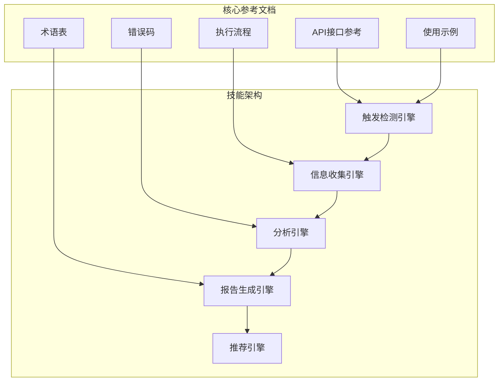
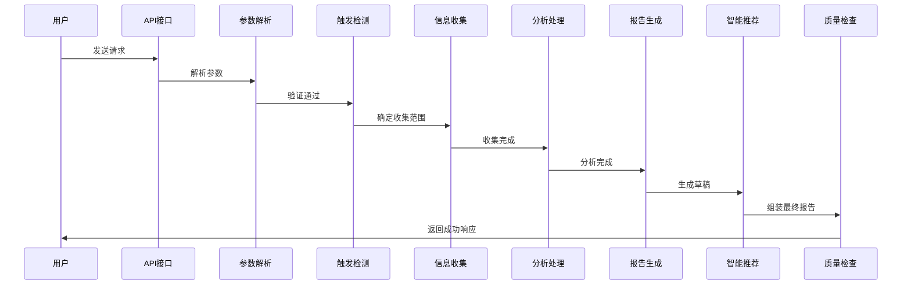
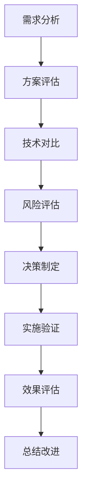
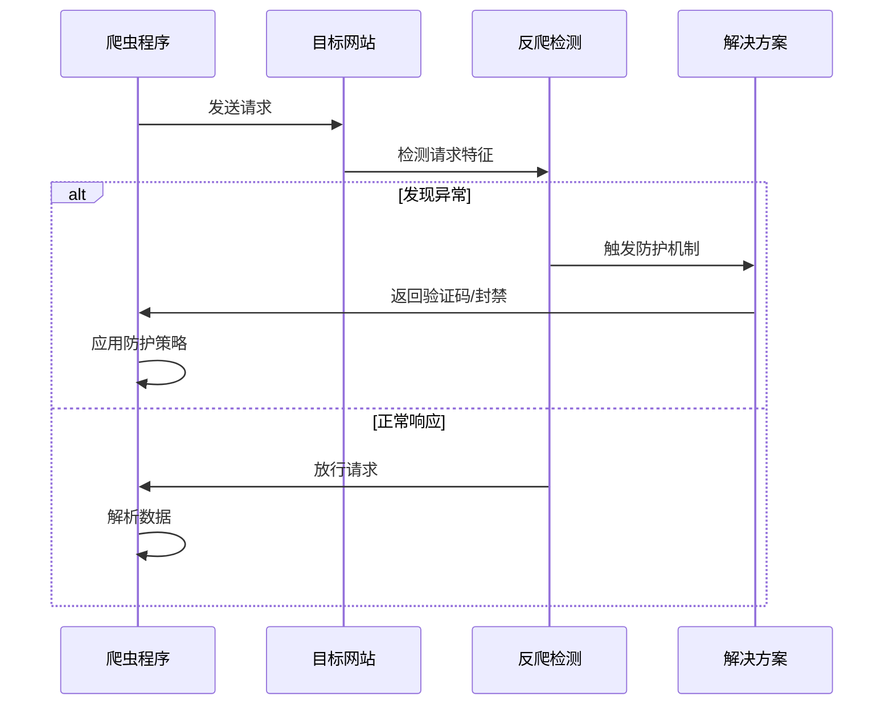
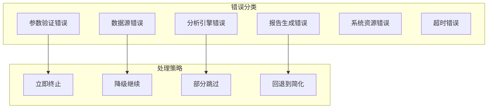
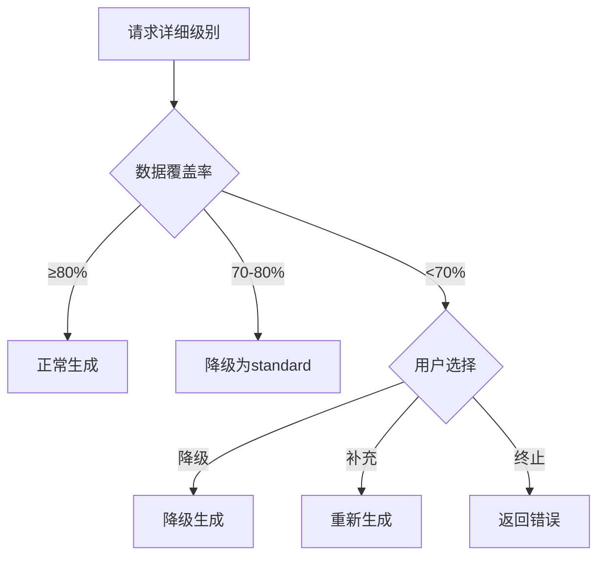

# 软件开发场景示例

<cite>
**本文档引用的文件**
- [api-reference.md](file://references/api-reference.md)
- [examples-v2.md](file://references/examples-v2.md)
- [execution-flow.md](file://references/execution-flow.md)
- [error-codes.md](file://references/error-codes.md)
- [terminology.md](file://references/terminology.md)
</cite>

## 目录
1. [简介](#简介)
2. [项目结构](#项目结构)
3. [核心组件](#核心组件)
4. [架构概览](#架构概览)
5. [详细组件分析](#详细组件分析)
6. [依赖分析](#依赖分析)
7. [性能考虑](#性能考虑)
8. [故障排除指南](#故障排除指南)
9. [结论](#结论)
10. [附录](#附录)

## 简介

本文档为"任务执行总结报告生成器"技能提供完整的使用指南，特别针对软件开发场景设计。该技能能够基于对话历史和任务上下文，自动生成结构化的执行总结报告，涵盖技术决策分析、Bug修复过程记录、代码质量和性能优化等多个维度。

该技能的核心能力包括：
- **信息收集引擎**：从对话历史和相关文件中全面提取任务执行的关键信息
- **分析处理引擎**：对收集到的信息进行深度分析和多维度评估
- **报告生成引擎**：按照规范模板将分析结果转化为结构化报告
- **智能推荐引擎**：生成针对性的改进建议和可复用的方法论

## 项目结构

该项目采用模块化设计，主要包含以下核心文件：



**图表来源**
- [api-reference.md:1-100](file://references/api-reference.md#L1-L100)
- [execution-flow.md:100-200](file://references/execution-flow.md#L100-L200)

**章节来源**
- [api-reference.md:1-100](file://references/api-reference.md#L1-L100)
- [execution-flow.md:1-100](file://references/execution-flow.md#L1-L100)

## 核心组件

### 1. 任务上下文管理器 (Task Context Manager)

任务上下文是整个报告生成的核心，包含任务的基本信息和执行环境。

**核心字段**：
- `task_name`：任务名称（必填）
- `task_type`：任务类型（development/management/operations/research/learning）
- `time_range`：执行时间范围
- `description`：任务描述
- `participants`：参与人员列表
- `context_data`：额外上下文数据

**章节来源**
- [api-reference.md:185-376](file://references/api-reference.md#L185-L376)

### 2. 生成选项控制器 (Generation Options Controller)

控制报告生成的详细程度、模板选择和内容定制。

**关键配置**：
- `detail_level`：摘要/标准/详细三个级别
- `template_variant`：模板变体选择
- `included_chapters`：包含的章节列表
- `excluded_chapters`：排除的章节列表
- `language_style`：语言风格（professional/casual/academic）

**章节来源**
- [api-reference.md:380-586](file://references/api-reference.md#L380-L586)

### 3. 输出配置管理器 (Output Config Manager)

管理报告输出的存储、命名和附加选项。

**输出选项**：
- `save_to_file`：是否保存到文件
- `file_path`：文件保存路径
- `include_metadata`：是否包含元数据
- `output_format`：输出格式（markdown/json/html）

**章节来源**
- [api-reference.md:590-714](file://references/api-reference.md#L590-L714)

## 架构概览

技能采用七步执行流水线，确保每个步骤都有明确的输入输出契约：



**图表来源**
- [execution-flow.md:175-196](file://references/execution-flow.md#L175-L196)
- [execution-flow.md:313-332](file://references/execution-flow.md#L313-L332)

**章节来源**
- [execution-flow.md:173-447](file://references/execution-flow.md#L173-L447)

## 详细组件分析

### 软件开发场景示例分析

#### 示例1：用户认证模块开发

这是一个典型的软件开发场景，展示了完整的开发流程和总结报告生成过程。

**触发示例**：
```json
{
  "task_context": {
    "task_name": "用户认证模块开发",
    "task_type": "development",
    "time_range": null,
    "description": "实现基于 Session 的用户登录注册功能"
  },
  "generation_options": {
    "detail_level": "standard",
    "template_variant": "standard",
    "focus_dimensions": ["goal_achievement", "problem_patterns"],
    "output_format": "markdown"
  },
  "output_config": {
    "save_to_file": true,
    "file_path": null,
    "include_metadata": true
  }
}
```

**预期输出关键内容**：

1. **执行概览章节**：包含任务基本信息、核心成果总结、关键数据速览
2. **技术决策分析**：详细记录技术选型决策和权衡过程
3. **问题解决记录**：完整的问题发现、分析和解决过程
4. **经验总结**：从成功实践中抽象的方法论和最佳实践
5. **改进建议**：基于分析结果的针对性建议和行动计划

**章节来源**
- [examples-v2.md:29-165](file://references/examples-v2.md#L29-L165)

#### 示例2：Sprint回顾最小化调用

展示了零配置调用的场景，系统自动推断任务类型和生成参数。

**触发示例**：
```json
{
  "task_context": {
    "task_name": "Sprint 24 回顾"
  }
}
```

**特点分析**：
- 系统自动检测到项目管理类型（management）
- 使用默认的standard模板和professional语言风格
- 仅提供最基本的task_name参数
- 适合快速回顾和日常使用

**章节来源**
- [examples-v2.md:168-275](file://references/examples-v2.md#L168-L275)

### 技术决策分析

#### 爬虫框架选型决策

在软件开发场景中，技术决策分析是报告的核心价值之一。以爬虫开发为例：

**决策维度**：
- **功能性**：是否满足业务需求
- **性能**：处理速度和资源消耗
- **可维护性**：代码复杂度和团队技能匹配
- **生态系统**：社区支持和第三方库
- **学习成本**：团队掌握程度

**决策分析流程**：


**图表来源**
- [execution-flow.md:701-722](file://references/execution-flow.md#L701-L722)

**章节来源**
- [execution-flow.md:701-918](file://references/execution-flow.md#L701-L918)

### 问题解决记录

#### 反爬机制应对策略

在爬虫开发中，反爬机制是最常见的技术挑战：

**常见反爬策略**：
- **IP封禁**：通过代理池和请求频率控制应对
- **验证码**：集成OCR识别或第三方打码服务
- **行为检测**：模拟真实用户行为，添加随机延时
- **数据加密**：分析API签名算法或使用逆向工程

**解决流程**：


**图表来源**
- [examples-v2.md:461-622](file://references/examples-v2.md#L461-L622)

**章节来源**
- [examples-v2.md:461-688](file://references/examples-v2.md#L461-L688)

### 最佳实践建议

#### 代码质量优化

1. **代码审查流程**：建立标准化的Code Review检查清单
2. **测试覆盖率**：确保关键业务逻辑的单元测试覆盖率
3. **性能监控**：建立关键指标的监控和告警机制
4. **文档维护**：保持技术文档与代码同步更新

#### 性能优化策略

1. **数据库优化**：合理设计索引，避免N+1查询问题
2. **缓存策略**：根据数据访问模式选择合适的缓存方案
3. **异步处理**：将耗时操作异步化，提升用户体验
4. **资源管理**：合理控制并发数，避免资源争用

## 依赖分析

技能的错误处理采用分层防御机制：



**图表来源**
- [error-codes.md:152-162](file://references/error-codes.md#L152-L162)
- [execution-flow.md:1474-1485](file://references/execution-flow.md#L1474-L1485)

**章节来源**
- [error-codes.md:152-171](file://references/error-codes.md#L152-L171)
- [execution-flow.md:1470-1585](file://references/execution-flow.md#L1470-L1585)

## 性能考虑

### 关键性能指标

| 指标 | 描述 | 优化建议 |
|------|------|----------|
| **处理时间** | 从请求到响应的总耗时 | 30-120秒（标准版报告） |
| **信息收集效率** | 数据提取和整合速度 | 优化数据源访问策略 |
| **分析深度** | 多维度分析的复杂度 | 根据详细程度动态调整 |
| **报告生成速度** | 模板渲染和内容填充 | 使用高效的模板引擎 |

### 性能优化策略

1. **并行处理**：对独立的数据源进行并行访问
2. **缓存机制**：对常用数据和计算结果进行缓存
3. **增量更新**：支持部分报告的增量生成
4. **资源池化**：复用数据库连接和HTTP客户端

## 故障排除指南

### 常见错误类型

#### 参数验证错误 (E001-E005)

**E001: 缺少必填参数**
- **症状**：请求被立即拒绝
- **解决方案**：检查task_context是否包含task_name
- **预防措施**：在客户端实现参数校验

**E010: 数据不充分警告**
- **症状**：报告生成但质量评分降低
- **解决方案**：补充任务执行的详细信息
- **预防措施**：在任务执行过程中保持详细记录

**章节来源**
- [error-codes.md:177-320](file://references/error-codes.md#L177-L320)
- [error-codes.md:560-668](file://references/error-codes.md#L560-L668)

### 降级执行机制

当数据质量不足时，系统会自动触发降级机制：



**图表来源**
- [execution-flow.md:642-678](file://references/execution-flow.md#L642-L678)

**章节来源**
- [execution-flow.md:627-678](file://references/execution-flow.md#L627-L678)

## 结论

"任务执行总结报告生成器"技能为软件开发场景提供了完整的自动化总结解决方案。通过七步执行流水线和智能降级机制，该技能能够在各种复杂度的任务场景中生成高质量的执行总结报告。

**核心优势**：
- **全面性**：涵盖技术决策、问题解决、代码质量、性能优化等多个维度
- **智能化**：自动识别任务类型，智能推断参数配置
- **容错性**：支持降级执行，确保在数据不足时仍能产出有用报告
- **可扩展性**：支持自定义模板和输出格式

**应用场景**：
- 软件开发项目的技术复盘
- Bug修复过程的经验总结
- 技术选型决策的回顾分析
- 团队协作效果的评估报告

## 附录

### 使用提示

1. **参数配置建议**：
   - 对于复杂项目，建议使用standard详细级别
   - 重点关注目标达成度和问题模式分析维度
   - 包含完整的章节配置，便于全面回顾

2. **最佳实践**：
   - 在任务执行过程中保持详细的对话记录
   - 明确记录技术决策的背景和理由
   - 及时记录遇到的问题和解决方案
   - 定期进行代码审查和质量检查

3. **故障排除**：
   - 检查网络连接和API密钥配置
   - 验证任务上下文的完整性和准确性
   - 确认输出路径的可写权限
   - 查看错误码文档获取具体解决方案

**章节来源**
- [api-reference.md:183-714](file://references/api-reference.md#L183-L714)
- [terminology.md:1-200](file://references/terminology.md#L1-L200)