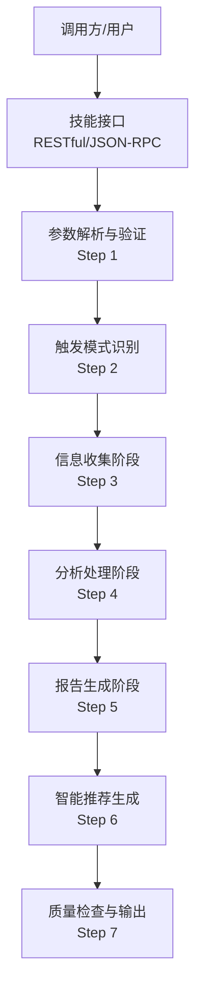
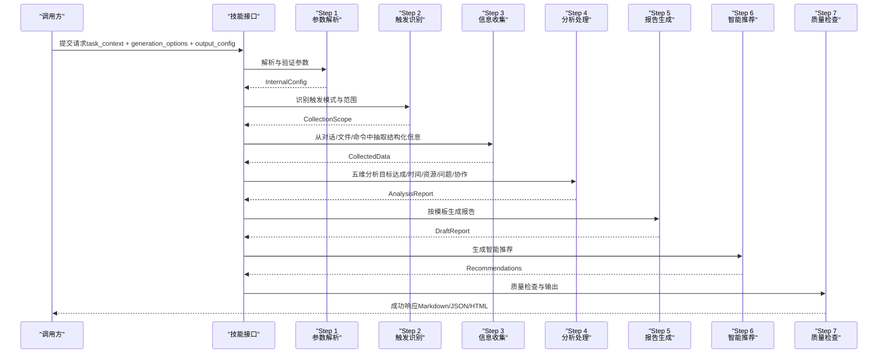
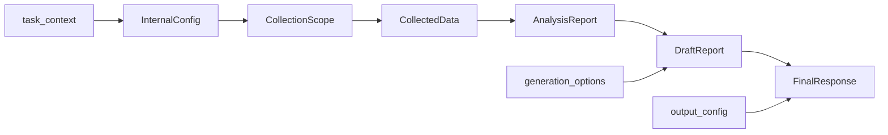

# 项目管理场景示例

<cite>
**本文档引用的文件**
- [api-reference.md](file://references/api-reference.md)
- [execution-flow.md](file://references/execution-flow.md)
- [examples-v2.md](file://references/examples-v2.md)
- [terminology.md](file://references/terminology.md)
</cite>

## 目录
1. [简介](#简介)
2. [项目结构](#项目结构)
3. [核心组件](#核心组件)
4. [架构总览](#架构总览)
5. [详细组件分析](#详细组件分析)
6. [依赖关系分析](#依赖关系分析)
7. [性能考量](#性能考量)
8. [故障排查指南](#故障排查指南)
9. [结论](#结论)
10. [附录](#附录)

## 简介
本文件面向“项目管理场景示例”，以敏捷开发Sprint复盘为例，系统阐述如何使用“任务执行总结报告生成器”技能生成高质量的项目管理类回顾报告。文档覆盖触发条件、预期输出、关键分析维度、协作与时间管理评估，以及项目管理报告特有的分析视角（团队协作效能、进度管理、跨部门协调等）。

## 项目结构
该项目管理示例依托技能的统一接口规范与执行流程，通过标准化的输入参数与可配置的生成选项，自动完成从信息收集、分析处理到报告生成的全流程。参考文件包括：
- 接口规范：定义输入参数、生成选项、输出格式与错误处理
- 执行流程：描述7步执行流水线与质量控制
- 使用示例：包含Sprint复盘在内的4类典型场景
- 术语表：统一项目管理与通用术语口径

图表来源
- [execution-flow.md: 100-132:100-132](file://references/execution-flow.md#L100-L132)

章节来源
- [api-reference.md: 13-181:13-181](file://references/api-reference.md#L13-L181)
- [execution-flow.md: 1-24:1-24](file://references/execution-flow.md#L1-L24)

## 核心组件
- 接口与参数体系：提供task_context、generation_options、output_config三类参数，支持任务类型、详细程度、章节选择、语言风格、输出格式等灵活配置
- 执行流水线：7步执行流程（参数解析、触发识别、信息收集、分析处理、报告生成、智能推荐、质量检查）
- 模板与变体：标准/摘要/详细/学习模板，适配不同场景与受众
- 质量与降级：内置质量检查与降级策略，确保在数据不足时仍可产出可用报告

章节来源
- [api-reference.md: 183-714:183-714](file://references/api-reference.md#L183-L714)
- [execution-flow.md: 173-446:173-446](file://references/execution-flow.md#L173-L446)

## 架构总览
技能采用“确定性+可观测性+容错性”的设计原则，确保在不同输入与数据条件下都能稳定产出结构化报告。执行流程中，信息收集与分析处理是核心瓶颈，分别占总耗时的40%-50%与35%-40%。

图表来源
- [execution-flow.md: 100-132:100-132](file://references/execution-flow.md#L100-L132)
- [execution-flow.md: 173-446:173-446](file://references/execution-flow.md#L173-L446)

## 详细组件分析

### 触发条件与输入参数
- 触发条件
  - 自动触发：检测到完成信号词（如“完成了”、“可以了”）且任务复杂度达到阈值
  - 手动触发：显式命令（如“请生成总结”、“/summary”）
  - 命令行触发：API调用或脚本触发
- 关键输入参数
  - task_context：任务名称、任务类型、时间范围、描述、参与者、上下文数据
  - generation_options：详细程度、模板变体、章节选择、语言风格、聚焦维度、输出格式
  - output_config：保存到文件、文件路径、元数据、追加写入、编码、自定义头部/尾部

章节来源
- [execution-flow.md: 313-438:313-438](file://references/execution-flow.md#L313-L438)
- [api-reference.md: 183-714:183-714](file://references/api-reference.md#L183-L714)

### 预期输出与报告结构
- 成功响应包含：报告ID、时间戳、处理耗时、报告主体（标题、内容、字数、章节数、元数据）、质量检查（完整性、置信度、缺口、警告）、统计摘要（阶段数、决策数、问题数、建议数、方法论数、关键指标）、文件信息
- 报告内容遵循10章结构：执行概览、任务背景与目标、执行过程详解、关键决策分析、问题与解决方案、资源使用情况、团队协作分析、多维度分析、经验总结与方法论、改进建议与行动计划

章节来源
- [api-reference.md: 718-800:718-800](file://references/api-reference.md#L718-L800)
- [examples-v2.md: 29-165:29-165](file://references/examples-v2.md#L29-L165)

### 项目管理类报告的特色分析维度
- 团队协作效能评估
  - 协作概况：参与人员、协作周期、沟通渠道
  - 协作效能：沟通效率、分工合理性、协同效果、综合得分
  - 协作亮点与待改进项：导师制成效、站会效率提升、跨角色协作顺畅度、阻塞升级机制、需求变更控制、知识分享
- 进度管理分析
  - 目标达成度：用户故事完成数、Story Points完成率、Velocity变化
  - 时间效能：阶段计划vs实际耗时、偏差分析、瓶颈识别、响应延迟、有效工作率
  - 问题模式：外部依赖阻塞、需求变更、技术难题占比与影响
- 跨部门协调情况
  - 外部依赖：第三方服务变更、接口升级、阻塞事件响应
  - 协调机制：阻塞分级响应流程、需求变更Impact Analysis、跨部门沟通渠道

章节来源
- [examples-v2.md: 168-275:168-275](file://references/examples-v2.md#L168-L275)
- [terminology.md: 537-660:537-660](file://references/terminology.md#L537-L660)

### 关键内容片段示例（Sprint复盘）
- 执行概览：Sprint周期、完成的用户故事与SP、Velocity、核心交付物
- 团队协作分析：参与人员、协作周期、沟通渠道、协作效能评分、协作亮点与待改进项
- 时间效能分析：各阶段计划vs实际耗时、偏差、瓶颈、响应延迟、有效工作率
- 问题与解决方案：阻塞事件（支付网关接口升级）、设计稿反复修改、根因与解决过程
- 经验总结与方法论：紧急变更响应SOP、设计评审提效方法、团队磨合与新人融入
- 改进建议与行动计划：阻塞分级响应流程、需求变更控制、Sprint Planning效率优化、每周Tech Talk、CI/CD自动化部署

章节来源
- [examples-v2.md: 168-275:168-275](file://references/examples-v2.md#L168-L275)

### 生成选项与模板变体
- 详细程度：摘要版（2-3页）、标准版（8-15页）、详细版（20-30页）
- 模板变体：标准/摘要/详细/学习模板，学习模板强化“学习支持系统”“知识体系与方法论”
- 章节选择：包含/排除章节，确保保留关键章节（执行概览、经验总结、改进建议）
- 语言风格：专业、轻松、学术
- 输出格式：Markdown、JSON、HTML

章节来源
- [api-reference.md: 380-714:380-714](file://references/api-reference.md#L380-L714)

### 质量检查与降级机制
- 质量检查：完整性评分、准确性置信度、信息缺口、警告
- 降级策略：当信息覆盖率不足时，自动降级详细程度（如从“详细”降至“标准”），并在报告中标注“信息有限”与缓解措施
- 用户建议：如何通过补充信息或结合外部数据（如Git历史）升级到完整版

章节来源
- [execution-flow.md: 627-698:627-698](file://references/execution-flow.md#L627-L698)
- [examples-v2.md: 461-688:461-688](file://references/examples-v2.md#L461-L688)

## 依赖关系分析
- 输入依赖：task_context的完整性与准确性直接影响分析质量
- 生成选项依赖：generation_options与output_config共同决定报告形态与输出介质
- 数据源依赖：对话历史、文件变更、命令记录等多源数据的整合与一致性校验
- 模板与分析引擎耦合：模板变体与分析维度权重联动，确保报告结构与内容匹配

图表来源
- [execution-flow.md: 286-301:286-301](file://references/execution-flow.md#L286-L301)
- [api-reference.md: 183-714:183-714](file://references/api-reference.md#L183-L714)

章节来源
- [execution-flow.md: 173-446:173-446](file://references/execution-flow.md#L173-L446)
- [api-reference.md: 183-714:183-714](file://references/api-reference.md#L183-L714)

## 性能考量
- 总耗时分布：信息收集（40%-50%）、分析处理（35%-40%）、报告生成（15%-20%）、智能推荐（5%-10%）、质量检查（<2%）
- 影响因素：对话轮数、详细程度、数据量、模板复杂度
- 优化建议：在对话中提供更丰富的上下文信息，有助于减少信息收集阶段的去重与补齐成本；合理选择详细程度与模板变体，平衡质量与性能

章节来源
- [execution-flow.md: 142-170:142-170](file://references/execution-flow.md#L142-L170)

## 故障排查指南
- 参数验证错误（E001-E005）：缺少必填参数、类型不符、值越界、参数冲突、安全策略违规
- 数据不足（E010-E012）：信息覆盖率不足、数据源不可用、降级继续或终止
- 分析引擎错误（E021-E022）：分析失败、部分跳过、降级输出
- 报告生成错误（E031-E032）：回退到简化模板
- 建议处理：优先修复致命错误（E001-E005），其次处理警告（E010-E012），最后优化非致命问题

章节来源
- [execution-flow.md: 126-131:126-131](file://references/execution-flow.md#L126-L131)
- [examples-v2.md: 278-458:278-458](file://references/examples-v2.md#L278-L458)

## 结论
通过标准化的输入参数与可配置的生成选项，项目管理类报告能够系统化地评估团队协作、进度管理与跨部门协调等关键维度。在数据不充分时，技能提供降级机制与质量检查，确保报告可用性与可追溯性。建议在Sprint复盘中优先使用“管理”任务类型与“标准”详细程度，结合协作与时间分析维度，获得高质量的回顾报告。

## 附录
- 术语速查：涵盖项目管理、软件开发、学习方法论与质量改进等86个术语，便于统一口径与深入理解
- 使用示例：包含Sprint复盘在内的4类场景，涵盖最小化调用、参数错误、降级执行等典型路径

章节来源
- [terminology.md: 1007-1104:1007-1104](file://references/terminology.md#L1007-L1104)
- [examples-v2.md: 691-769:691-769](file://references/examples-v2.md#L691-L769)