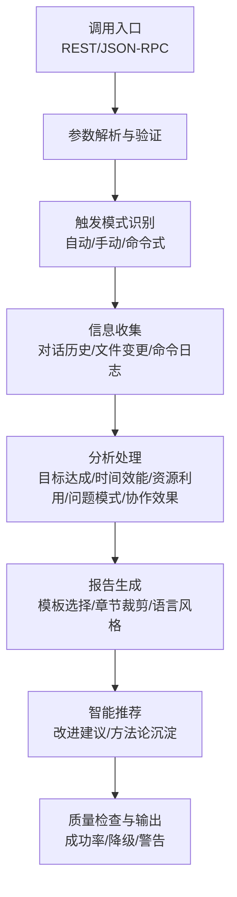
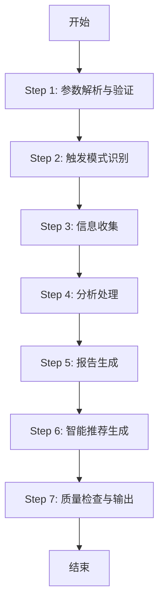
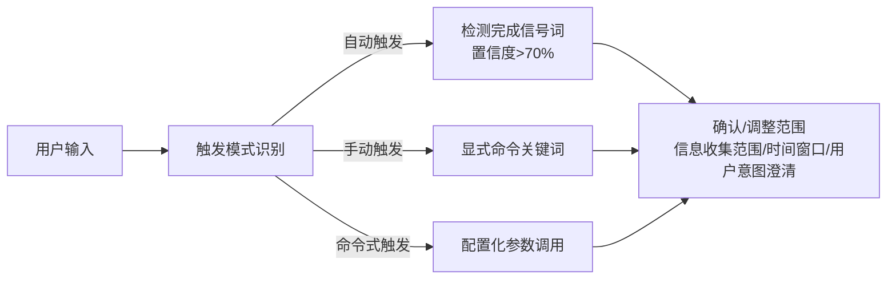
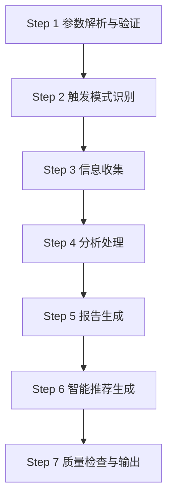

# 快速开始

<cite>
**本文档引用的文件**
- [api-reference.md](file://references/api-reference.md)
- [examples-v2.md](file://references/examples-v2.md)
- [execution-flow.md](file://references/execution-flow.md)
- [error-codes.md](file://references/error-codes.md)
- [terminology.md](file://references/terminology.md)
</cite>

## 目录
1. [简介](#简介)
2. [项目结构](#项目结构)
3. [核心组件](#核心组件)
4. [架构总览](#架构总览)
5. [详细组件分析](#详细组件分析)
6. [依赖分析](#依赖分析)
7. [性能考虑](#性能考虑)
8. [故障排查指南](#故障排查指南)
9. [结论](#结论)
10. [附录](#附录)

## 简介
本指南面向首次使用者，聚焦“任务执行总结报告生成器”的三种触发模式：自动触发、手动触发与命令式触发。通过最小可用示例、触发条件说明与实际对话案例，帮助你在不同情境下快速上手，生成高质量的执行总结报告。

## 项目结构
- 技能核心能力由四大引擎协同：信息收集、分析处理、报告生成与智能推荐。
- 提供 RESTful API 与 JSON-RPC 能力，支持同步与异步两种生成模式。
- 默认输出为 Markdown，亦支持 JSON/HTML 格式，便于二次处理或直接渲染。

**图表来源**
- [execution-flow.md:100-132](file://references/execution-flow.md#L100-L132)

**章节来源**
- [api-reference.md:64-70](file://references/api-reference.md#L64-L70)
- [execution-flow.md:97-141](file://references/execution-flow.md#L97-L141)

## 核心组件
- task_context：任务基本信息与上下文（必填）
  - task_name：任务名称（必填）
  - task_type：任务类型（development/management/operations/research/learning/auto-detect）
  - time_range：开始/结束时间（可选，建议提供）
  - description/participants/context_data：可选补充字段
- generation_options：生成控制（可选）
  - detail_level：summary/standard/detailed
  - template_variant：summary/standard/detailed/learning
  - included_chapters/excluded_chapters：章节选择
  - language_style：professional/casual/academic
  - focus_dimensions：目标达成/time_efficiency/resource_utilization/problem_patterns/collaboration
  - output_format：markdown/json/html
- output_config：输出配置（可选）
  - save_to_file/include_metadata/append_to_existing/encoding/custom_header/custom_footer/file_path

**章节来源**
- [api-reference.md:185-714](file://references/api-reference.md#L185-L714)

## 架构总览
技能执行流程分为 7 步：参数解析与验证 → 触发模式识别 → 信息收集 → 分析处理 → 报告生成 → 智能推荐 → 质量检查与输出。支持降级执行与警告提示，确保在数据不足时仍可产出可用报告。

**图表来源**
- [execution-flow.md:173-196](file://references/execution-flow.md#L173-L196)
- [execution-flow.md:313-332](file://references/execution-flow.md#L313-L332)
- [execution-flow.md:441-474](file://references/execution-flow.md#L441-L474)
- [execution-flow.md:701-721](file://references/execution-flow.md#L701-L721)

**章节来源**
- [execution-flow.md:173-721](file://references/execution-flow.md#L173-L721)

## 详细组件分析

### 触发模式与使用场景

- 自动触发
  - 触发条件：检测到完成信号词（如“完成了”“可以了”“搞定”等）且任务复杂度较高，置信度 > 70%
  - 适用场景：对话中自然结束任务后，系统自动建议生成总结
  - 信号词库包含明确完成词、隐含意图词与上下文暗示
- 手动触发
  - 触发条件：显式命令（如“请生成总结”“/summary”“做个复盘”）
  - 适用场景：需要立即生成报告，或在自动化流程中显式调用
- 命令式触发
  - 触发条件：配置化参数调用（API 调用、脚本触发）
  - 适用场景：集成系统、定时任务、CI/CD 流水线中自动触发

**图表来源**
- [execution-flow.md:313-438](file://references/execution-flow.md#L313-L438)

**章节来源**
- [execution-flow.md:313-438](file://references/execution-flow.md#L313-L438)

### 最小调用示例（仅 task_name）

- 适用场景：快速生成，零配置
- 请求要点：仅提供 task_name，其他参数使用默认值
- 预期行为：系统自动推断任务类型、详细程度、模板与语言风格，生成标准报告

**章节来源**
- [examples-v2.md:168-275](file://references/examples-v2.md#L168-L275)

### 标准调用示例（常用配置组合）

- 适用场景：常规软件开发/项目管理任务，需要完整章节与专业语言风格
- 请求要点：task_context + generation_options（detail_level/模板/语言风格/聚焦维度）+ output_config（保存到文件/文件路径/元数据）
- 预期行为：生成 10 章完整报告，质量评分优秀，文件保存成功

**章节来源**
- [examples-v2.md:29-166](file://references/examples-v2.md#L29-L166)

### 完全配置调用示例（所有参数都指定）

- 适用场景：需要严格控制输出格式、章节选择与语言风格
- 请求要点：task_context + generation_options（章节包含/排除、语言风格、输出格式）+ output_config（文件路径、编码、自定义头部/尾部）
- 预期行为：按指定模板与格式输出，章节裁剪与语言风格严格遵循

**章节来源**
- [api-reference.md:575-714](file://references/api-reference.md#L575-L714)

### 异步触发与状态查询

- 适用场景：复杂任务生成耗时较长，需要后台异步处理
- 端点：
  - POST /generate/async：异步生成
  - GET /status/{report_id}：查询异步任务状态
- 优点：避免长时间阻塞，适合大规模任务

**章节来源**
- [api-reference.md:97-105](file://references/api-reference.md#L97-L105)

### 触发条件与最佳实践

- 自动触发
  - 建议在任务完成后自然结束对话，系统检测到完成信号词时自动建议生成
  - 若任务复杂度不高，系统可能不会自动触发
- 手动触发
  - 使用明确命令词，确保触发意图清晰
  - 适合需要立即生成报告的场景
- 命令式触发
  - 适合集成系统与自动化流程，建议在任务生命周期的关键节点触发
  - 建议提供 task_name 与必要上下文，避免参数缺失导致失败

**章节来源**
- [execution-flow.md:340-438](file://references/execution-flow.md#L340-L438)

### 实际对话示例与触发案例

- 最小化调用（仅任务名）
  - 场景：Sprint 结束后快速生成回顾报告
  - 触发：自动触发（检测到完成信号词）或手动触发（显式命令）
  - 结果：生成标准版报告，质量评分优秀，文件保存成功
- 标准调用（软件开发任务）
  - 场景：完成用户认证模块开发，需要生成标准报告用于技术沉淀
  - 触发：手动触发（“请生成总结”）
  - 结果：生成 10 章完整报告，包含目标达成、时间效能、问题解决、资源使用、多维分析、经验总结与改进建议
- 异步触发（复杂任务）
  - 场景：大型项目复盘，生成耗时较长
  - 触发：命令式触发（API 调用）
  - 结果：异步生成，稍后通过状态查询获取结果

**章节来源**
- [examples-v2.md:168-275](file://references/examples-v2.md#L168-L275)
- [examples-v2.md:29-166](file://references/examples-v2.md#L29-L166)

## 依赖分析
- 参数验证与默认值：Step 1 完成参数解析与默认值应用，确保后续步骤输入稳定
- 触发模式识别：Step 2 基于信号词与上下文确定触发模式，影响信息收集范围
- 信息收集与质量检查：Step 3 为核心阶段，覆盖率不足时触发降级
- 分析与生成：Step 4-5 基于收集数据进行五维分析与报告生成
- 智能推荐与质量检查：Step 6-7 生成智能建议与质量评分，支持警告与降级

**图表来源**
- [execution-flow.md:173-721](file://references/execution-flow.md#L173-L721)

**章节来源**
- [execution-flow.md:173-721](file://references/execution-flow.md#L173-L721)

## 性能考虑
- 总耗时分布（标准版报告，中等复杂度任务）：Step 3（信息收集）40-50%、Step 4（分析处理）35-40%、Step 5（报告生成）15-20%、Step 6（智能推荐）5-10%、Step 7（质量检查）<2%、Step 2（触发识别）<2%、Step 1（参数解析）<1%
- 详细程度对耗时影响：摘要版 -30%、标准版 基准、详细版 +50%（分析与生成阶段均有显著增加）
- 对话轮数影响：对话轮数越多，信息收集与分析阶段耗时越高

**章节来源**
- [execution-flow.md:142-170](file://references/execution-flow.md#L142-L170)

## 故障排查指南

- 参数验证错误（E001-E005）
  - 缺少必填参数（E001）：确保提供 task_name 或等效任务标识
  - 参数类型错误（E002）：核对 generation_options 的枚举值与类型
  - 参数值越界（E003）：检查章节编号范围（1-10）与字符串长度限制
  - 参数冲突（E004）：避免同时指定冲突的参数组合
  - 章节组合无效（E005）：确保包含必要前置章节或使用默认 detail_level
- 数据不足降级（E010）
  - 当对话历史过短或关键信息缺失时，系统将降级生成，报告中标注“信息有限”
  - 建议补充任务细节后重新生成，或在报告中手动补充关键信息
- 数据源不可用（E011）
  - 对话历史不可读取时，可切换到手动输入模式，自行提供任务信息
- 文件访问被拒绝（E012）
  - 检查输出路径权限与磁盘空间，更换到有权限的目录

**章节来源**
- [error-codes.md:177-800](file://references/error-codes.md#L177-L800)

## 结论
通过自动触发、手动触发与命令式触发三种模式，你可以根据不同场景灵活生成任务执行总结报告。建议优先使用最小调用快速上手，再根据需要逐步引入生成控制与输出配置。遇到参数错误或数据不足时，参考错误码与降级机制，及时补充信息或调整参数，即可获得高质量的报告输出。

## 附录

### 常用术语速查
- 任务/项目/里程碑/阶段/工作项/交付物/产出物/任务分解
- 目标/子目标/验收标准/完成定义/达成率/偏差
- 耗时/估算时间/瓶颈/时效比/关键路径/约束/依赖
- 问题/风险/应急预案/严重程度/根因
- 资源/利用率/浪费/效率/效能/生产力/优先级/技术栈/技术选型/决策/权衡
- 执行概览/方法论提炼/经验教训/最佳实践/模式/报告模板/附录
- Sprint/用户故事/Backlog/回顾会议/Sprint Planning/Velocity/迭代/Story Point/增量交付/MVP
- 缺陷/技术债务/重构/代码质量/Code Review/PR/MR/CI/CD/质量门禁/回归测试/制品/SLA

**章节来源**
- [terminology.md:22-800](file://references/terminology.md#L22-L800)