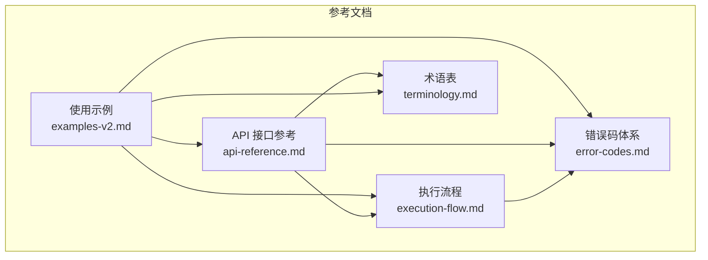
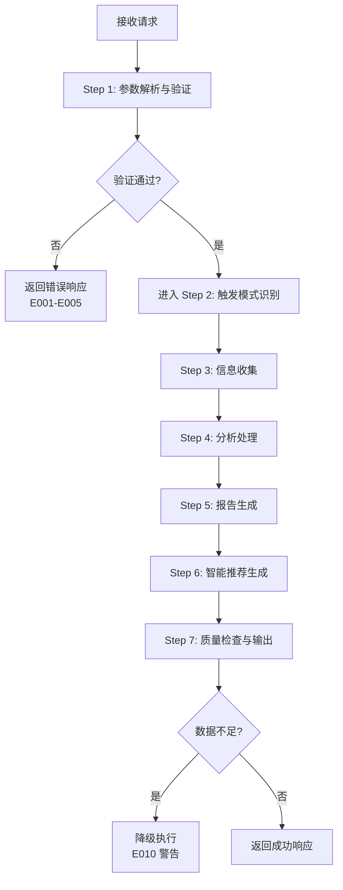
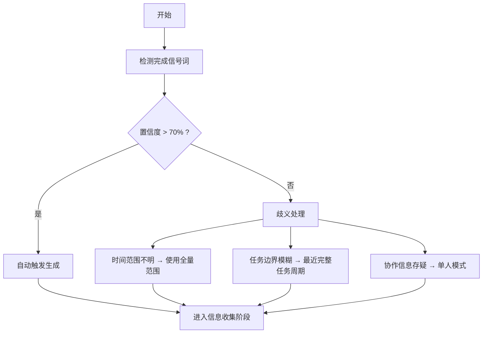
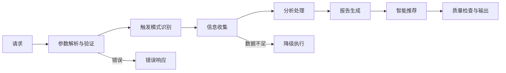
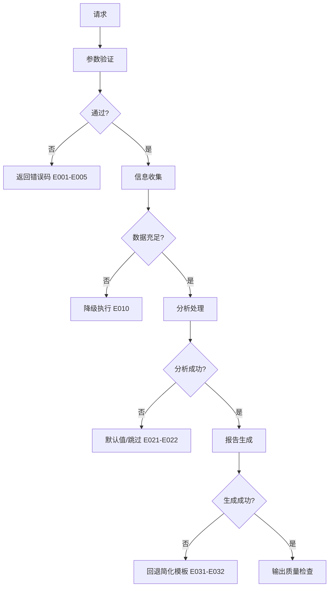

# 快速开始

<cite>
**本文档引用的文件**
- [examples-v2.md](file://references/examples-v2.md)
- [api-reference.md](file://references/api-reference.md)
- [execution-flow.md](file://references/execution-flow.md)
- [error-codes.md](file://references/error-codes.md)
- [terminology.md](file://references/terminology.md)
</cite>

## 目录
1. [简介](#简介)
2. [项目结构](#项目结构)
3. [核心组件](#核心组件)
4. [架构总览](#架构总览)
5. [详细组件分析](#详细组件分析)
6. [依赖分析](#依赖分析)
7. [性能考虑](#性能考虑)
8. [故障排除指南](#故障排除指南)
9. [结论](#结论)
10. [附录](#附录)

## 简介
本指南面向首次使用者，帮助你在最短时间内体验“任务执行总结报告生成器”的核心能力。通过自动触发、手动触发与命令式调用三种方式，你可以快速生成高质量的执行总结报告。文档提供最常用的调用方式与基础示例，涵盖参数验证、降级执行与错误处理等关键场景，确保你能快速上手并获得满意结果。

## 项目结构
本项目以参考文档为主，核心内容包括：
- 使用示例：涵盖标准调用、最小参数调用、参数错误与降级执行四种典型场景
- API 接口参考：定义输入参数、输出格式与调用方式
- 执行流程：7步执行流水线与异常处理机制
- 错误码体系：参数验证、数据源、分析引擎、报告生成、系统资源与超时等错误分类
- 术语表：涵盖任务执行、目标评估、时间效率、问题风险、资源协作、报告结构、项目管理、软件开发与学习方法论等术语

**图表来源**
- [examples-v2.md:1-769](file://references/examples-v2.md#L1-L769)
- [api-reference.md:1-800](file://references/api-reference.md#L1-L800)
- [execution-flow.md:1-800](file://references/execution-flow.md#L1-L800)
- [error-codes.md:1-800](file://references/error-codes.md#L1-L800)
- [terminology.md:1-800](file://references/terminology.md#L1-L800)

**章节来源**
- [examples-v2.md:1-769](file://references/examples-v2.md#L1-L769)
- [api-reference.md:1-800](file://references/api-reference.md#L1-L800)
- [execution-flow.md:1-800](file://references/execution-flow.md#L1-L800)
- [error-codes.md:1-800](file://references/error-codes.md#L1-L800)
- [terminology.md:1-800](file://references/terminology.md#L1-L800)

## 核心组件
- 输入参数体系：task_context（必填）、generation_options（可选）、output_config（可选）
- 执行流水线：参数解析与验证 → 触发模式识别 → 信息收集 → 分析处理 → 报告生成 → 智能推荐 → 质量检查与输出
- 错误处理：参数验证错误（E001-E005）、数据不足警告（E010）、数据源错误（E011-E012）、分析引擎错误（E021-E022）、报告生成错误（E031-E032）、系统资源错误（E041）、执行超时（E051）
- 报告结构：10章标准结构，支持摘要版（2-3页）、标准版（8-15页）、详细版（20-30页）

**章节来源**
- [api-reference.md:183-716](file://references/api-reference.md#L183-L716)
- [execution-flow.md:173-721](file://references/execution-flow.md#L173-L721)
- [error-codes.md:173-670](file://references/error-codes.md#L173-L670)

## 架构总览
技能采用“确定性 + 可观测性 + 容错性”设计原则，执行流程分为7个步骤，支持参数验证、触发模式识别、信息收集、分析处理、报告生成、智能推荐与质量检查输出。错误码体系覆盖参数验证、数据源、分析引擎、报告生成、系统资源与超时等场景，支持降级继续与透明告知。

**图表来源**
- [execution-flow.md:173-721](file://references/execution-flow.md#L173-L721)
- [error-codes.md:560-670](file://references/error-codes.md#L560-L670)

**章节来源**
- [execution-flow.md:173-721](file://references/execution-flow.md#L173-L721)
- [error-codes.md:560-670](file://references/error-codes.md#L560-L670)

## 详细组件分析

### 自动触发（Auto Trigger）
自动触发通过检测完成信号词与上下文暗示，结合置信度判断是否自动触发生成。典型场景包括用户说“完成了”、“可以了”、“搞定”等完成信号，或在对话末尾出现停顿、切换话题前的过渡语等上下文暗示。

- 触发来源判定：明确完成信号（如“完成了”、“好了”）、隐含完成意图（如“帮我总结一下”、“回顾一下”）、上下文暗示（连续多个操作后停顿、询问保存或导出）
- 收集范围确定：时间窗口、信息类别筛选、数据源选择
- 歧义处理策略：时间范围不明（使用全量范围）、任务边界模糊（最近完整任务周期）、协作信息存疑（单人模式）

**图表来源**
- [execution-flow.md:313-433](file://references/execution-flow.md#L313-L433)

**章节来源**
- [execution-flow.md:313-433](file://references/execution-flow.md#L313-L433)

### 手动触发（Manual Trigger）
手动触发通过显式命令关键词触发，如“请生成总结”、“/summary”、“做个复盘”。适用于需要明确指令或在自动化流程中显式调用的场景。

- 触发模式：显式命令关键词（100%置信度）
- 典型场景：交互式聊天、CLI 命令、脚本调用
- 配置：可直接传入 task_context、generation_options、output_config

**章节来源**
- [execution-flow.md:313-433](file://references/execution-flow.md#L313-L433)

### 命令式调用（Command-style Invocation）
命令式调用适用于 API 调用、脚本触发与配置化参数调用。支持同步与异步两种方式，异步方式适用于复杂任务。

- 同步调用：POST /generate，适合中小规模任务
- 异步调用：POST /generate/async，适合复杂任务，随后通过 /status/{report_id} 查询状态
- 认证方式：API Key、OAuth 2.0/JWT、无认证（本地开发）
- 速率限制：免费版 100 次/小时，专业版 1000 次/小时，企业版自定义

**章节来源**
- [api-reference.md:87-180](file://references/api-reference.md#L87-L180)

### 基础使用示例

#### 示例一：软件开发任务标准调用
- 适用场景：用户刚完成一个用户认证模块的开发任务，希望生成标准的执行总结报告
- 关键参数：task_context.task_name、task_type=development、generation_options.detail_level=standard、focus_dimensions=["goal_achievement","problem_patterns"]
- 预期结果：success=true，质量评分>90，报告包含10章标准结构，自动保存到文件

**章节来源**
- [examples-v2.md:29-165](file://references/examples-v2.md#L29-L165)

#### 示例二：Sprint 复盘最小化调用
- 适用场景：项目经理希望快速生成一个 Sprint 复盘报告，仅提供 task_name
- 关键参数：仅 task_context.task_name，其他参数使用默认值
- 预期结果：success=true，质量评分>90，系统自动检测 task_type=management，使用 standard 模板与 professional 风格

**章节来源**
- [examples-v2.md:168-275](file://references/examples-v2.md#L168-L275)

#### 示例三：参数验证错误（异常场景）
- 适用场景：批量调用或集成测试中，提供多个错误的参数组合
- 关键参数：缺少必填参数 task_name、无效枚举值 detail_level、章节编号越界、排除所有核心章节
- 预期结果：success=false，返回 E001-E005 错误码，包含 details 与 recovery_actions

**章节来源**
- [examples-v2.md:278-422](file://references/examples-v2.md#L278-L422)

#### 示例四：数据不足时的降级执行
- 适用场景：请求 detailed 级别但对话历史较短，信息密度不足以支撑详细报告
- 关键参数：task_context.task_name、task_type=development、generation_options.detail_level=detailed
- 预期结果：success=true，degraded=true，effective_detail_level 降级为 standard，quality_score 降低，warnings 标注受影响章节

**章节来源**
- [examples-v2.md:461-688](file://references/examples-v2.md#L461-L688)

## 依赖分析
- 参数验证依赖：task_context 必填、generation_options 与 output_config 可选，默认值体系确保边界情况稳定
- 触发模式依赖：完成信号词库、上下文暗示、置信度计算
- 信息收集依赖：对话历史解析器、操作记录提取器、文件变更追踪器
- 分析处理依赖：目标达成度、时间效能、资源利用率、问题模式、协作效果五维分析引擎
- 报告生成依赖：模板变体（summary/standard/detailed/learning）、输出格式（markdown/json/html）
- 错误处理依赖：错误码分类（E001-E051）、降级策略、恢复建议

**图表来源**
- [execution-flow.md:173-721](file://references/execution-flow.md#L173-L721)
- [error-codes.md:173-670](file://references/error-codes.md#L173-L670)

**章节来源**
- [execution-flow.md:173-721](file://references/execution-flow.md#L173-L721)
- [error-codes.md:173-670](file://references/error-codes.md#L173-L670)

## 性能考虑
- 总耗时分布：Step 3（信息收集）40-50%、Step 4（分析处理）35-40%、Step 5（报告生成）15-20%
- 性能影响因素：对话轮数（<20轮低、20-50轮中、>50轮高）、详细程度（摘要版-30%、标准版-基准、详细版+50%）
- 建议：对于复杂任务使用异步调用，合理选择详细程度以平衡生成时间与报告质量

**章节来源**
- [execution-flow.md:142-170](file://references/execution-flow.md#L142-L170)

## 故障排除指南
- 参数验证错误（E001-E005）：检查必填参数、类型与范围、参数冲突与章节组合
- 数据不足警告（E010）：对话历史过短或关键信息缺失，可接受降级或补充信息后重新生成
- 数据源错误（E011-E012）：对话历史不可用或文件访问被拒绝，检查权限与路径
- 分析引擎错误（E021-E022）：分析失败时使用默认值或跳过，最终报告标注
- 报告生成错误（E031-E032）：模板缺失或生成超时，系统回退到简化模板
- 系统资源错误（E041）：内存不足等系统资源问题，终止并告警
- 执行超时（E051）：执行时间超限，终止或返回部分结果

**图表来源**
- [error-codes.md:173-670](file://references/error-codes.md#L173-L670)
- [execution-flow.md:173-721](file://references/execution-flow.md#L173-L721)

**章节来源**
- [error-codes.md:173-670](file://references/error-codes.md#L173-L670)
- [execution-flow.md:173-721](file://references/execution-flow.md#L173-L721)

## 结论
通过本快速开始指南，你可以：
- 使用自动触发、手动触发与命令式调用三种方式快速生成任务执行总结报告
- 了解参数验证、降级执行与错误处理的关键机制
- 在最短时间内获得高质量的报告，并根据需要调整详细程度与输出格式
- 借助术语表与错误码体系更好地理解和优化使用体验

## 附录

### 最佳实践与第一次使用建议
- 首次使用建议：从最小参数调用开始（仅提供 task_name），系统将自动推断 task_type 与默认配置
- 逐步深入：在对话中补充任务背景、目标、关键决策与问题解决过程，可显著提升报告质量
- 参数选择：标准版（8-15页）适合大多数场景；详细版（20-30页）适合深度复盘与审计需求
- 输出格式：Markdown 适合版本控制与渲染；JSON 适合程序化处理；HTML 适合分享与阅读
- 错误处理：遇到参数错误时，按 recovery_actions 逐一修正；数据不足时可接受降级或补充信息后重新生成

**章节来源**
- [examples-v2.md:168-275](file://references/examples-v2.md#L168-L275)
- [api-reference.md:380-716](file://references/api-reference.md#L380-L716)
- [error-codes.md:173-670](file://references/error-codes.md#L173-L670)