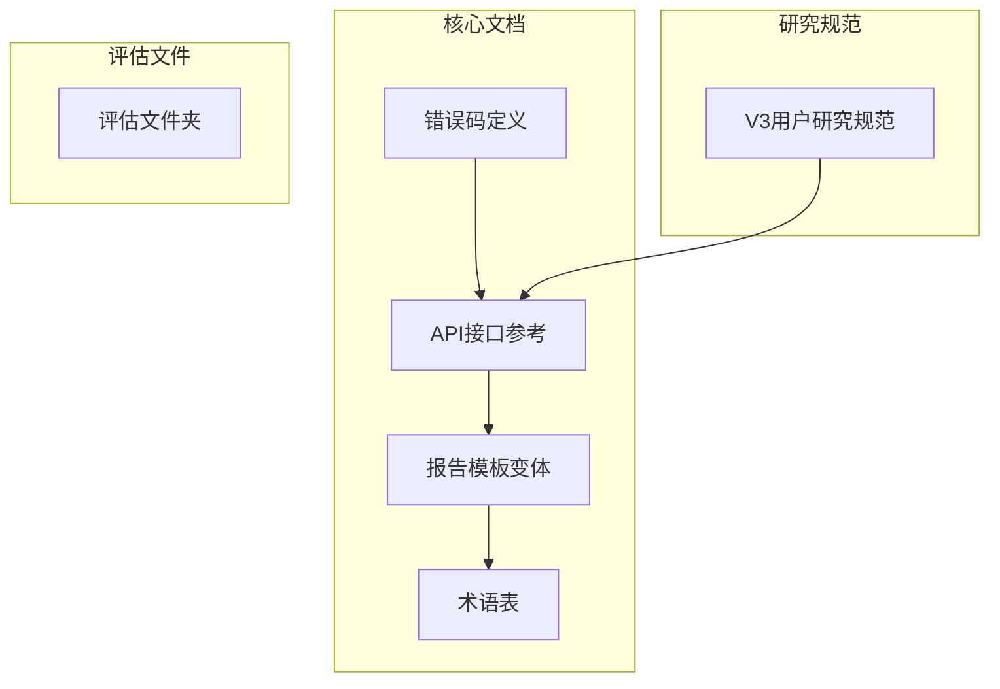
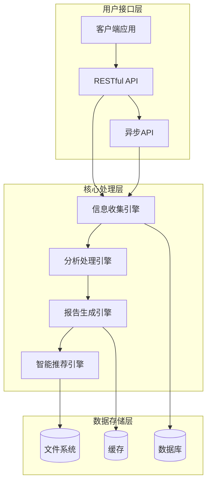
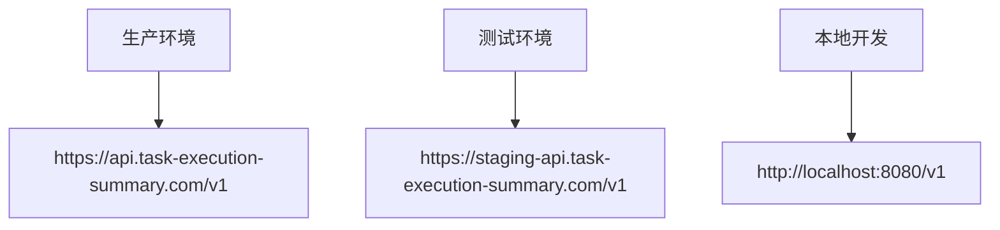
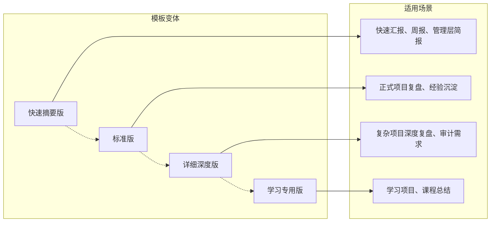
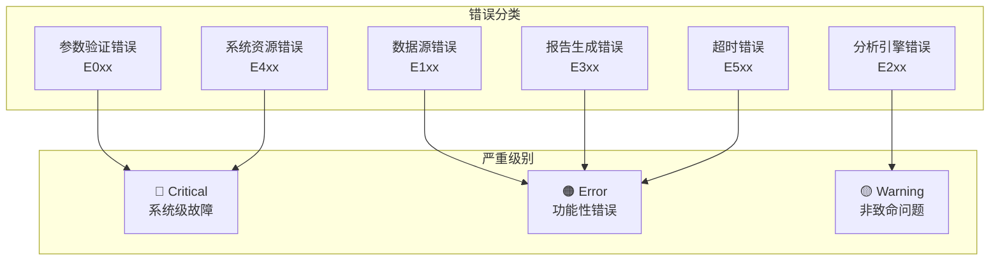
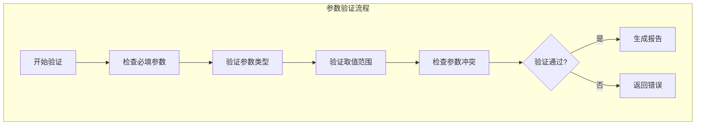
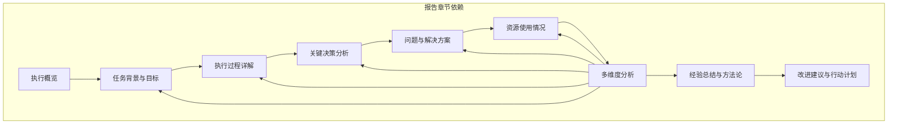

# V2使用示例

<cite>
**本文档引用的文件**
- [api-reference.md](file://references/api-reference.md)
- [templates.md](file://references/templates.md)
- [terminology.md](file://references/terminology.md)
- [error-codes.md](file://references/error-codes.md)
- [v3-user-research-spec.md](file://references/v3-planning/v3-user-research-spec.md)
</cite>

## 目录
1. [简介](#简介)
2. [项目结构](#项目结构)
3. [核心组件](#核心组件)
4. [架构概览](#架构概览)
5. [详细组件分析](#详细组件分析)
6. [依赖分析](#依赖分析)
7. [性能考虑](#性能考虑)
8. [故障排除指南](#故障排除指南)
9. [结论](#结论)

## 简介

"任务执行总结报告生成器"是一个智能化的技能工具，旨在帮助开发者、项目经理、运维工程师和技术研究人员自动生成高质量的任务执行总结报告。该工具基于四大核心引擎协同工作，提供从信息收集、分析处理到报告生成的完整解决方案。

### 核心能力概述

本接口基于四大核心引擎协同工作：
1. **信息收集引擎**：从对话历史和相关文件中全面提取任务执行的关键信息
2. **分析处理引擎**：对收集到的信息进行深度分析和多维度评估
3. **报告生成引擎**：按照规范模板将分析结果转化为结构化 Markdown 报告
4. **智能推荐引擎**：生成针对性的改进建议和可复用的方法论

### 适用场景

- **软件开发**：功能开发完成、Bug修复、技术重构
- **项目管理**：Sprint结束、里程碑达成、项目收尾
- **运维排查**：故障处理、性能优化、安全加固
- **技术研究**：技术选型、POC验证、架构设计
- **学习成长**：课程学习、技能培训、认证备考

## 项目结构

该项目采用模块化设计，主要包含以下核心文件：

**图表来源**
- [api-reference.md:1-1378](file://references/api-reference.md#L1-L1378)
- [templates.md:1-2073](file://references/templates.md#L1-L2073)
- [v3-user-research-spec.md:1-1204](file://references/v3-planning/v3-user-research-spec.md#L1-L1204)

**章节来源**
- [api-reference.md:1-1378](file://references/api-reference.md#L1-L1378)
- [templates.md:1-2073](file://references/templates.md#L1-L2073)
- [v3-user-research-spec.md:1-1204](file://references/v3-planning/v3-user-research-spec.md#L1-L1204)

## 核心组件

### 任务上下文(task_context)

任务上下文是请求的核心，包含任务的基本信息和上下文数据。这是生成报告的基础信息来源。

#### 主要字段

| 字段名 | 类型 | 必填 | 描述 |
|--------|------|------|------|
| task_name | string | 是 | 任务名称或标题，用于标识任务并生成报告标题 |
| task_type | enum | 否 | 任务类型分类，影响分析维度权重和报告模板选择 |
| time_range | object | 否 | 任务执行时间范围，帮助系统准确计算时间效能指标 |
| description | string | 否 | 任务的简要描述，帮助理解任务背景和目标 |
| participants | array | 否 | 参与任务的人员列表及其角色信息 |
| context_data | object | 否 | 额外的上下文数据，可用于补充系统无法自动提取的信息 |

**章节来源**
- [api-reference.md:185-376](file://references/api-reference.md#L185-L376)

### 生成选项(generation_options)

generation_options 对象控制报告生成的详细程度、模板选择和内容定制。

#### 详细程度(detail_level)

| 值 | 预计篇幅 | 包含内容 | 适用场景 |
|----|---------|---------|---------|
| summary | 2-3页（500-800字） | 仅核心章节（第1章完整 + 第10章摘要 + 其他章节仅标题和数据点） | 快速汇报、周报、管理层简报、日常站会纪要 |
| standard | 8-15页（3000-5000字） | 完整10章结构，标准详细程度的分析，5-8条建议【默认推荐】 | 常规任务复盘、项目文档归档、知识分享、月度/季度总结 |
| detailed | 20-30页（8000-15000字） | 所有10章完整且深入，细粒度原始数据和趋势图表，10-15条建议，完整附录 | 复杂项目深度复盘、审计需求、培训材料、重大故障事后分析 |

**章节来源**
- [api-reference.md:384-586](file://references/api-reference.md#L384-L586)

### 输出配置(output_config)

output_config 对象控制报告输出的存储、命名和附加选项。

#### 文件输出选项

| 选项 | 类型 | 默认值 | 描述 |
|------|------|--------|------|
| save_to_file | boolean | true | 是否将生成的报告保存到文件系统 |
| file_path | string | 自动生成路径 | 报告保存的完整文件路径 |
| include_metadata | boolean | true | 是否在报告中包含 YAML Frontmatter 元数据块 |
| append_to_existing | boolean | false | 是否追加到已有文件（而非覆盖） |
| encoding | enum | "utf-8" | 文件编码格式 |

**章节来源**
- [api-reference.md:590-714](file://references/api-reference.md#L590-L714)

## 架构概览

**图表来源**
- [api-reference.md:64-69](file://references/api-reference.md#L64-L69)

## 详细组件分析

### API接口参考

#### 基础URL结构

**图表来源**
- [api-reference.md:89-95](file://references/api-reference.md#L89-L95)

#### 主要端点

| 端点路径 | HTTP方法 | 功能描述 | 认证要求 |
|---------|-----------|---------|---------|
| `/generate` | POST | 生成任务执行总结报告 | 可选 |
| `/generate/async` | POST | 异步生成报告（适用于复杂任务） | 可选 |
| `/status/{report_id}` | GET | 查询异步任务状态 | 可选 |
| `/templates` | GET | 获取可用模板列表 | 无需认证 |
| `/validate` | POST | 验证请求参数合法性 | 无需认证 |

**章节来源**
- [api-reference.md:97-105](file://references/api-reference.md#L97-L105)

### 报告模板变体

#### 模板选择指南

**图表来源**
- [templates.md:73-89](file://references/templates.md#L73-L89)

**章节来源**
- [templates.md:1-2073](file://references/templates.md#L1-L2073)

### 错误处理机制

#### 错误码分类体系

**图表来源**
- [error-codes.md:160-169](file://references/error-codes.md#L160-L169)

**章节来源**
- [error-codes.md:1-1865](file://references/error-codes.md#L1-L1865)

## 依赖分析

### 参数验证规则

**图表来源**
- [api-reference.md:4-7](file://references/api-reference.md#L4-L7)

### 章节依赖关系

**图表来源**
- [templates.md:73-89](file://references/templates.md#L73-L89)

**章节来源**
- [api-reference.md:483-533](file://references/api-reference.md#L483-L533)

## 性能考虑

### 速率限制

| 计费层级 | 限制 | 说明 |
|---------|------|------|
| 免费版 | 100 次/小时 | 适合个人学习和测试 |
| 专业版 | 1000 次/小时 | 适合团队日常使用 |
| 企业版 | 自定义 | 适合大规模集成 |

### 处理时间监控

系统会记录报告生成耗时（processing_time_ms），用于性能监控和用户体验反馈。建议在生产环境中监控以下指标：
- 平均处理时间
- 处理时间分布
- 超时率
- 错误率

## 故障排除指南

### 常见错误处理

#### 参数验证错误

当调用技能时缺少必填参数时触发 `E001` 错误：
- **触发条件**：缺少 `task_name` 或等效的任务标识
- **恢复建议**：检查 API 文档确认所有必填参数，补充缺失的参数值
- **预防措施**：在 SDK 和 CLI 工具中实现参数校验

#### 数据不充分警告

当任务执行过程中发现某些关键信息缺失时触发 `E010` 警告：
- **触发条件**：对话历史过短、缺少关键阶段信息、时间戳信息不完整
- **恢复建议**：补充信息后重新生成，或接受降级结果
- **影响**：报告质量评分将相应降低

#### 文件访问被拒绝

当无法读写指定的文件时触发 `E012` 错误：
- **触发条件**：输出目录没有写入权限、文件路径不存在且无法创建
- **恢复建议**：检查文件/目录权限设置，更换路径或权限修复后重试

**章节来源**
- [error-codes.md:185-800](file://references/error-codes.md#L185-L800)

### 调试技巧

1. **启用详细日志**：在开发环境中启用详细日志记录
2. **参数验证**：使用 `/validate` 端点预验证请求参数
3. **分步调试**：先使用简单参数测试，再逐步增加复杂度
4. **监控指标**：关注处理时间、错误率和资源使用情况

## 结论

"任务执行总结报告生成器"提供了一个完整的任务执行总结自动化解决方案。通过合理配置参数、选择合适的模板变体，并遵循最佳实践，用户可以获得高质量的报告输出。

### 最佳实践建议

1. **参数配置**：根据任务类型和复杂度选择合适的 `detail_level`
2. **模板选择**：根据使用场景选择合适的模板变体
3. **数据准备**：在任务执行过程中保持详细的对话记录
4. **错误处理**：建立完善的错误处理和重试机制
5. **性能优化**：合理设置速率限制，监控系统性能指标

### 未来发展

随着V3版本的推进，该技能将继续增强其功能和智能化水平，为用户提供更加个性化和高质量的服务体验。