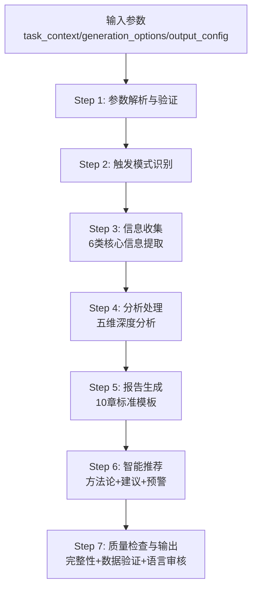
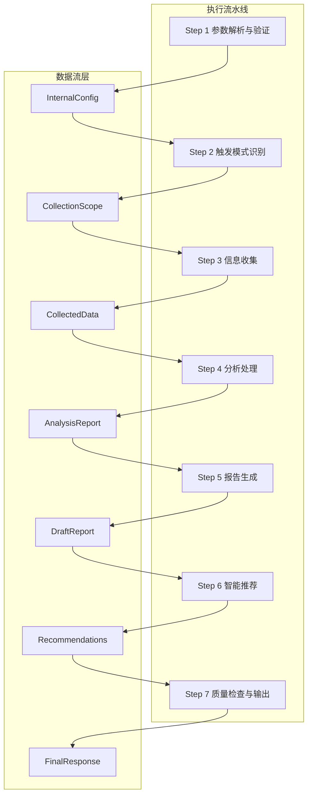
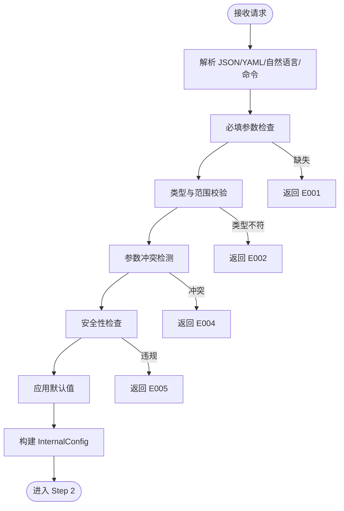
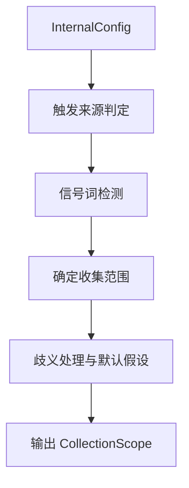
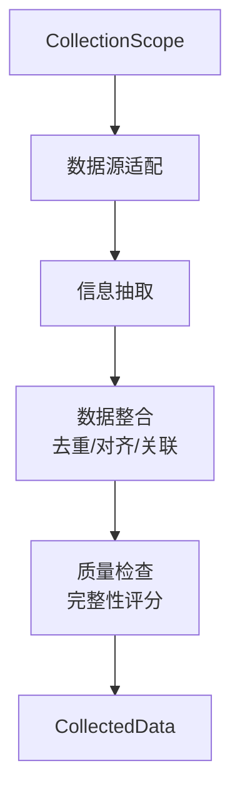
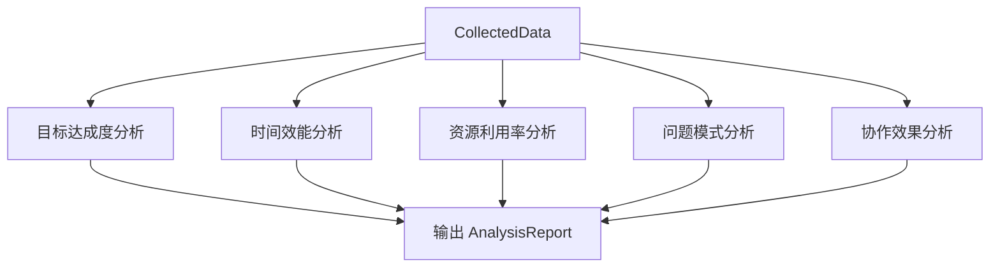
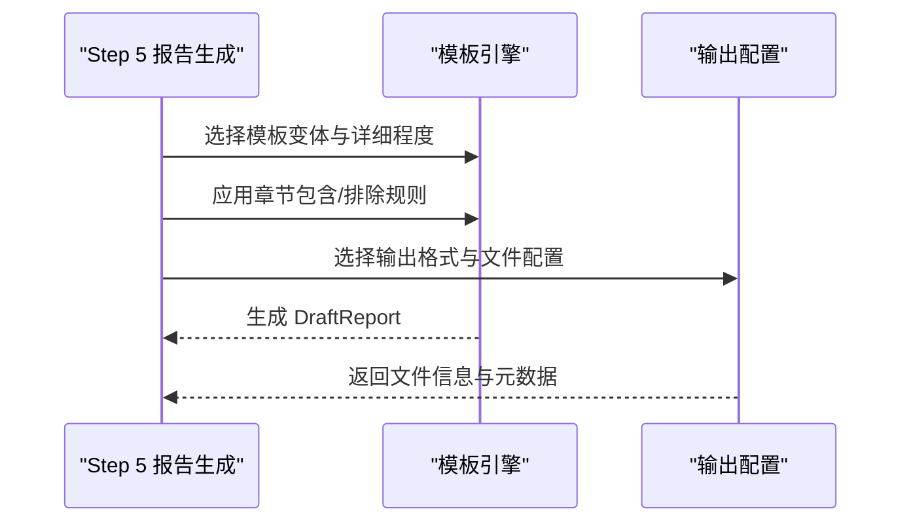
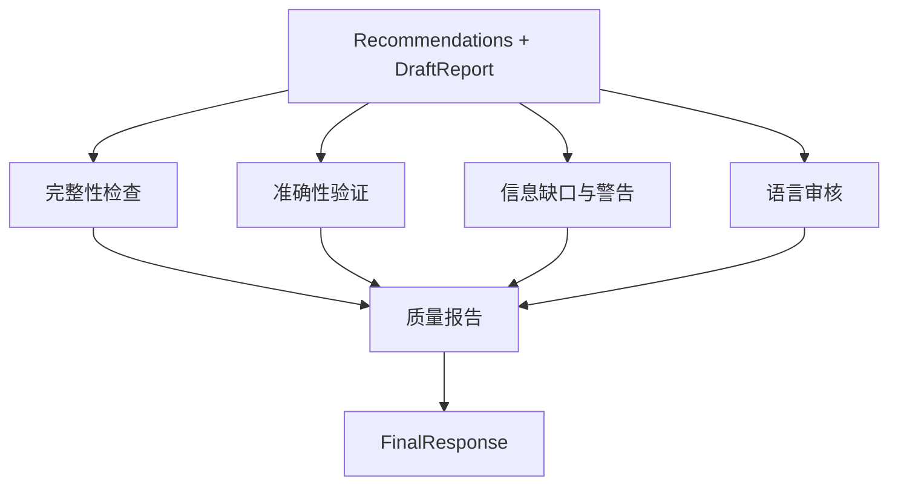

# 执行流程详解

<cite>
**本文引用的文件**
- [execution-flow.md](file://references/execution-flow.md)
- [api-reference.md](file://references/api-reference.md)
- [error-codes.md](file://references/error-codes.md)
- [examples-v2.md](file://references/examples-v2.md)
- [terminology.md](file://references/terminology.md)
- [v3-user-research-spec.md](file://references/v3-user-research-spec.md)
</cite>

## 目录
1. [简介](#简介)
2. [项目结构](#项目结构)
3. [核心组件](#核心组件)
4. [架构总览](#架构总览)
5. [详细组件分析](#详细组件分析)
6. [依赖分析](#依赖分析)
7. [性能考量](#性能考量)
8. [故障排查指南](#故障排查指南)
9. [结论](#结论)
10. [附录](#附录)

## 简介
本文件面向开发者与技术维护人员，系统化阐述“任务执行总结报告生成器”的7步标准执行流程，覆盖参数解析验证、触发模式识别、信息收集（六大核心信息提取）、多维分析（五维深度分析）、报告生成（十章标准模板）、智能推荐（方法论+建议+预警）与质量输出（完整性检查+数据验证+语言审核）的全流程实现与质量控制点。文档以参考文件为依据，提供流程图、数据流说明与边界情况处理指引，并给出调试与内部原理的理解方法。

## 项目结构
仓库包含技能接口规范、错误码体系、完整示例与术语表等资料，形成“输入规范—执行流程—输出质量—异常处理—术语对齐”的闭环文档体系：
- references/api-reference.md：接口规范与参数定义
- references/execution-flow.md：7步执行流程与架构
- references/error-codes.md：错误码与处理策略
- references/examples-v2.md：标准请求-响应示例
- references/terminology.md：术语表（用于报告结构与分析维度）
- references/v3-user-research-spec.md：用户研究方案（与报告生成的用户需求对齐）

**图表来源**
- [execution-flow.md:175-196](file://references/execution-flow.md#L175-L196)
- [execution-flow.md:313-332](file://references/execution-flow.md#L313-L332)
- [execution-flow.md:441-474](file://references/execution-flow.md#L441-L474)
- [execution-flow.md:701-722](file://references/execution-flow.md#L701-L722)
- [execution-flow.md:100-132](file://references/execution-flow.md#L100-L132)

**章节来源**
- [execution-flow.md:1-171](file://references/execution-flow.md#L1-L171)
- [api-reference.md:183-716](file://references/api-reference.md#L183-L716)

## 核心组件
- 参数解析与验证（Step 1）：统一解析原始请求，执行必填性、类型、范围、冲突与安全检查，构建内部配置对象 InternalConfig。
- 触发模式识别（Step 2）：识别自动/手动/命令行触发模式，确认信息收集范围、时间窗口与用户意图，输出 CollectionScope。
- 信息收集（Step 3）：从对话历史、操作记录、文件变更等多源提取6类核心信息（目标、时间、决策、问题、资源、协作），进行去重、对齐与质量检查。
- 分析处理（Step 4）：五维分析（目标达成度、时间效能、资源利用率、问题模式、协作效果），输出 AnalysisReport。
- 报告生成（Step 5）：按模板变体与详细程度生成10章结构化报告，支持Markdown/JSON/HTML输出。
- 智能推荐（Step 6）：基于分析结果生成方法论、建议与预警，形成 Recommendations。
- 质量检查与输出（Step 7）：完整性评分、准确性置信度、信息缺口与警告汇总，输出 FinalResponse。

**章节来源**
- [execution-flow.md:175-311](file://references/execution-flow.md#L175-L311)
- [execution-flow.md:313-439](file://references/execution-flow.md#L313-L439)
- [execution-flow.md:441-699](file://references/execution-flow.md#L441-L699)
- [execution-flow.md:701-800](file://references/execution-flow.md#L701-L800)

## 架构总览
系统采用“确定性、可观测性、容错性”三大设计原则，7步流水线串联数据流层（InternalConfig→CollectionScope→CollectedData→AnalysisReport→DraftReport→Recommendations→FinalResponse），异常处理层统一管理错误码与降级策略。

**图表来源**
- [execution-flow.md:97-141](file://references/execution-flow.md#L97-L141)
- [execution-flow.md:100-132](file://references/execution-flow.md#L100-L132)

**章节来源**
- [execution-flow.md:28-171](file://references/execution-flow.md#L28-L171)

## 详细组件分析

### Step 1：参数解析与验证
- 输入：原始请求（JSON/YAML/自然语言/命令）
- 处理：
  - 解析与类型推断
  - 必填参数校验（task_context.task_name 等）
  - 类型与范围校验（枚举、长度、数值范围）
  - 参数冲突检测（如 detail_level 与章节组合）
  - 安全性检查（非法内容）
  - 应用默认值，构建 InternalConfig
- 输出：InternalConfig 或 ErrorResponse（含错误码与恢复建议）

**图表来源**
- [execution-flow.md:175-196](file://references/execution-flow.md#L175-L196)
- [error-codes.md:177-246](file://references/error-codes.md#L177-L246)
- [error-codes.md:249-320](file://references/error-codes.md#L249-L320)
- [error-codes.md:401-474](file://references/error-codes.md#L401-L474)

**章节来源**
- [execution-flow.md:175-311](file://references/execution-flow.md#L175-L311)
- [error-codes.md:177-246](file://references/error-codes.md#L177-L246)
- [error-codes.md:249-320](file://references/error-codes.md#L249-L320)
- [error-codes.md:401-474](file://references/error-codes.md#L401-L474)

### Step 2：触发模式识别
- 输入：InternalConfig
- 处理：
  - 触发来源判定（自动/手动/命令行）
  - 信号词检测（完成信号、隐含意图、上下文暗示）
  - 收集范围确定（时间窗口、信息类别、数据源）
  - 歧义处理（时间范围不明、任务边界模糊、协作信息存疑）
- 输出：CollectionScope（含置信度与歧义消除措施）

**图表来源**
- [execution-flow.md:313-332](file://references/execution-flow.md#L313-L332)
- [execution-flow.md:340-406](file://references/execution-flow.md#L340-L406)

**章节来源**
- [execution-flow.md:313-439](file://references/execution-flow.md#L313-L439)

### Step 3：信息收集（六大核心信息提取）
- 输入：CollectionScope
- 处理：
  - 数据源适配：对话历史解析器、操作记录提取器、文件变更追踪器
  - 信息抽取：目标实体、时间实体、决策实体、问题实体、资源实体、协作实体
  - 数据整合：去重（相似度聚类）、时序对齐（统一时间基准）、关联建立（因果/依赖）
  - 质量检查：完整性评分（目标、时间、决策、问题、资源、协作）
- 输出：CollectedData（含元数据、质量评分、覆盖率）

**图表来源**
- [execution-flow.md:441-474](file://references/execution-flow.md#L441-L474)
- [execution-flow.md:482-699](file://references/execution-flow.md#L482-L699)

**章节来源**
- [execution-flow.md:441-699](file://references/execution-flow.md#L441-L699)

### Step 4：分析处理（五维深度分析）
- 输入：CollectedData
- 处理：
  - 目标达成度分析：目标分解、基线建立、逐项测量、偏差计算、综合评定
  - 时间效能分析：总体时效比、阶段均衡度、瓶颈集中度、响应延迟、有效工作率
  - 资源利用率分析：必要性、充分性、适配性、性价比评估与浪费识别
  - 问题模式分析：问题分类统计、高频模式、根因归类
  - 协作效果分析：沟通效率、分工合理性、协同顺畅度
- 输出：AnalysisReport（五维分析结果）

**图表来源**
- [execution-flow.md:701-722](file://references/execution-flow.md#L701-L722)
- [execution-flow.md:730-800](file://references/execution-flow.md#L730-L800)

**章节来源**
- [execution-flow.md:701-800](file://references/execution-flow.md#L701-L800)

### Step 5：报告生成（十章标准模板）
- 输入：AnalysisReport + InternalConfig（详细程度、模板变体、章节选择、输出格式）
- 处理：
  - 模板选择：摘要/标准/详细/学习模板
  - 章节控制：包含/排除章节组合校验
  - 输出格式：Markdown/JSON/HTML
  - 元数据与文件信息：生成时间、路径、大小、校验
- 输出：DraftReport（含 report.content、metadata、file_info）

**图表来源**
- [api-reference.md:380-716](file://references/api-reference.md#L380-L716)

**章节来源**
- [api-reference.md:380-716](file://references/api-reference.md#L380-L716)

### Step 6：智能推荐（方法论+建议+预警）
- 输入：AnalysisReport + DraftReport
- 处理：
  - 方法论提取：从成功实践抽象可复用方法
  - 建议生成：基于分析结果提出可执行的改进建议
  - 预警机制：识别潜在风险与脆弱点
- 输出：Recommendations（方法论、建议清单、预警提示）

**章节来源**
- [execution-flow.md:100-132](file://references/execution-flow.md#L100-L132)

### Step 7：质量检查与输出
- 输入：Recommendations + DraftReport
- 处理：
  - 完整性检查：覆盖率阈值与降级策略
  - 准确性验证：置信度评估与异常标注
  - 信息缺口与警告：结构化质量报告
  - 语言审核：风格一致性与可读性
- 输出：FinalResponse（success/degraded/warnings/quality_check/statistics/file_info）

**图表来源**
- [execution-flow.md:175-196](file://references/execution-flow.md#L175-L196)
- [error-codes.md:560-668](file://references/error-codes.md#L560-L668)

**章节来源**
- [execution-flow.md:175-196](file://references/execution-flow.md#L175-L196)
- [error-codes.md:560-668](file://references/error-codes.md#L560-L668)

## 依赖分析
- 参数与流程耦合：Step 1 的 InternalConfig 为后续所有步骤提供统一输入契约，降低输入差异带来的不确定性。
- 数据流依赖：Step 3 的 CollectedData 是 Step 4 分析与 Step 5 报告生成的唯一数据源，质量直接影响输出。
- 模板与配置：Step 5 的模板变体与章节控制依赖 Step 2 的 CollectionScope 与 Step 1 的 generation_options。
- 质量与异常：Step 7 的质量检查贯穿全流程，异常码体系（E001-E032）定义了错误分类与降级策略。

**图表来源**
- [execution-flow.md:97-141](file://references/execution-flow.md#L97-L141)

**章节来源**
- [execution-flow.md:97-141](file://references/execution-flow.md#L97-L141)

## 性能考量
- 总耗时分布（标准版报告，中等复杂度任务）：Step 3（40-50%）、Step 4（35-40%）、Step 5（15-20%）、Step 6（5-10%）、Step 7（<2%）、Step 2（<2%）、Step 1（<1%）。
- 性能影响因素：对话轮数、详细程度（摘要/标准/详细）、模板变体（学习模板更详尽）。
- 降级策略：当信息覆盖率不足时，系统自动降级详细程度并返回带警告的成功响应，保证可用性。

**章节来源**
- [execution-flow.md:142-171](file://references/execution-flow.md#L142-L171)
- [examples-v2.md:461-688](file://references/examples-v2.md#L461-L688)

## 故障排查指南
- 参数错误（E001-E005）：立即终止，返回详细错误与恢复建议；优先修复必填参数与类型/范围/冲突问题。
- 数据不足（E010）：降级继续，标注受影响章节与信息缺口，建议补充对话记录或手动输入关键信息。
- 数据源不可用（E011）：提示权限/服务/路径问题，提供手动输入替代方案。
- 分析/生成错误（E021-E032）：部分功能跳过或回退到简化模板，保证报告基本可用。
- 超时（E051）：终止或返回部分结果，建议优化输入或降低详细程度。

调试建议：
- 使用最小参数调用（仅 task_name）验证流程是否可走通
- 逐步增加 generation_options 与 output_config，定位问题来源
- 查看 quality_check 与 warnings 字段，识别信息缺口与质量影响
- 对照 examples-v2.md 的成功/失败示例，核对参数与约束

**章节来源**
- [error-codes.md:177-246](file://references/error-codes.md#L177-L246)
- [error-codes.md:249-320](file://references/error-codes.md#L249-L320)
- [error-codes.md:401-474](file://references/error-codes.md#L401-L474)
- [error-codes.md:560-668](file://references/error-codes.md#L560-L668)
- [examples-v2.md:278-422](file://references/examples-v2.md#L278-L422)
- [examples-v2.md:461-688](file://references/examples-v2.md#L461-L688)

## 结论
7步标准执行流程以“确定性、可观测性、容错性”为核心，通过严格的参数验证、智能触发识别、六类信息提取、五维深度分析、十章模板生成、智能推荐与质量输出，形成闭环的报告生成体系。错误码与降级策略确保在不完美输入下仍能产出可用报告，质量检查与警告机制帮助用户识别与弥补信息缺口。配合术语表与用户研究方案，可进一步提升报告的可读性、一致性与用户价值。

## 附录
- 术语表：涵盖任务执行基础、目标与成果评估、时间与效率分析、问题与风险、资源与协作、报告结构、项目管理、软件开发、学习方法论、质量与改进等术语，用于报告结构与分析维度的统一口径。
- 用户研究方案：提供V3功能需求的定量调研方法（问卷设计、样本量、投放策略）与定性访谈提纲，支撑报告生成的用户需求对齐与优先级排序。

**章节来源**
- [terminology.md:1-800](file://references/terminology.md#L1-L800)
- [v3-user-research-spec.md:1-800](file://references/v3-user-research-spec.md#L1-L800)