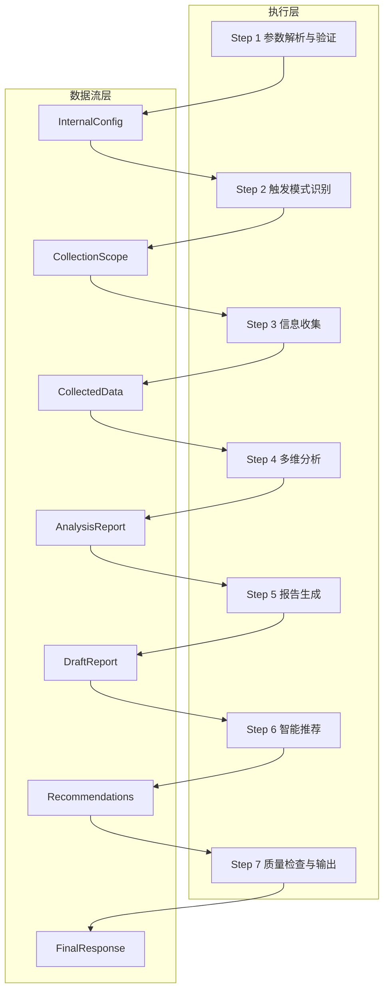
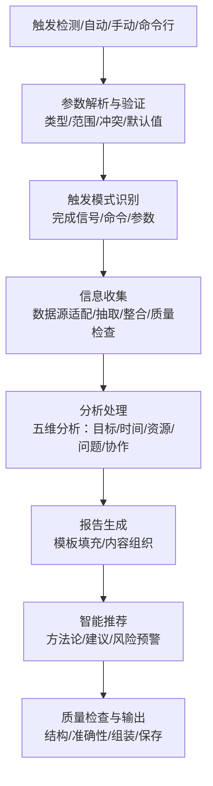
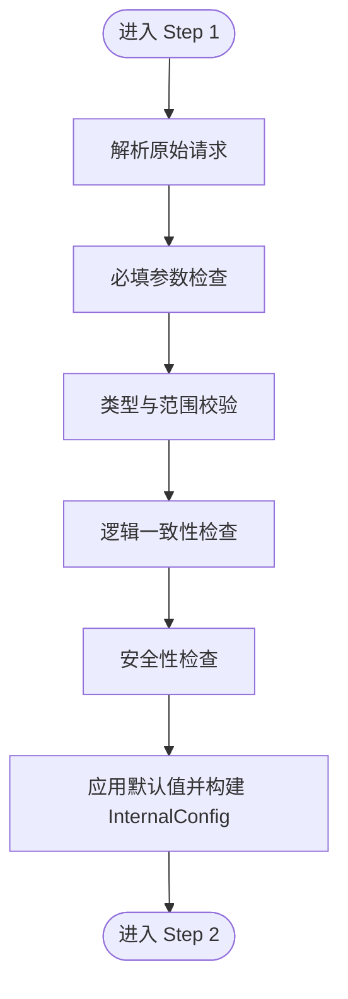
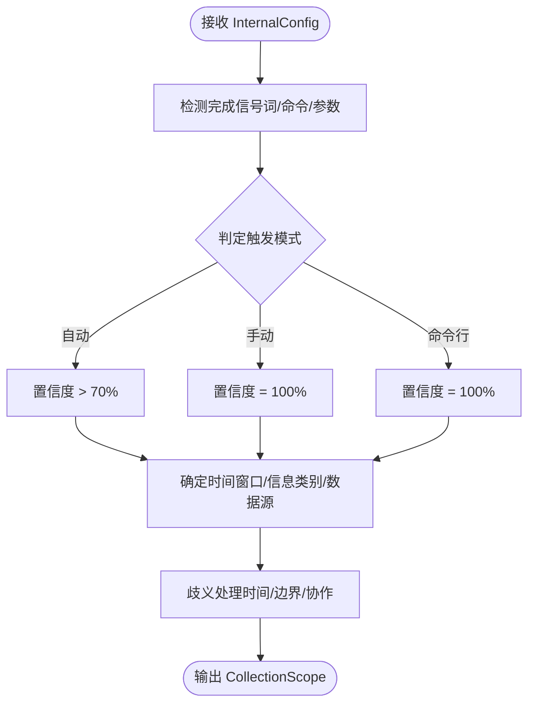
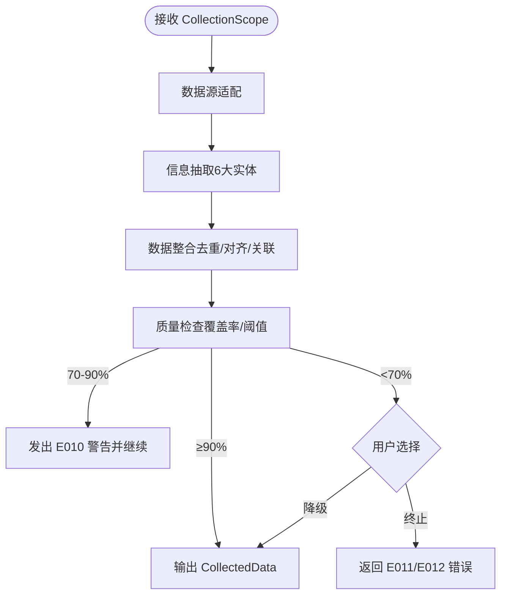
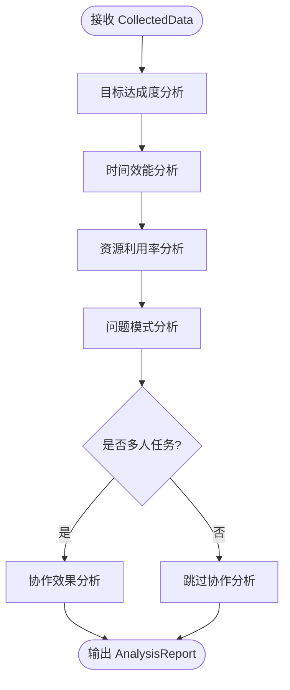
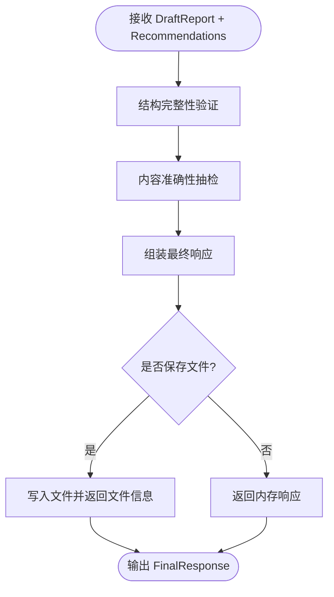
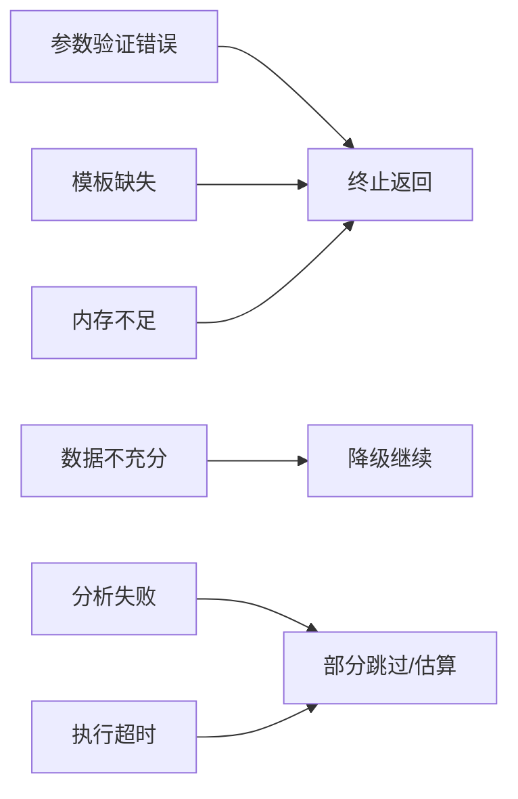

# 七步执行流程

<cite>
**本文引用的文件**
- [执行流程文档 (Execution Flow)](file://references/execution-flow.md)
- [任务执行总结报告生成器 - API 接口参考文档](file://references/api-reference.md)
- [任务执行总结报告生成器 - V2 完整使用示例](file://references/examples-v2.md)
- [错误码定义文档 (Error Codes Reference)](file://references/error-codes.md)
- [术语表 (Glossary)](file://references/terminology.md)
</cite>

## 目录
1. [简介](#简介)
2. [项目结构](#项目结构)
3. [核心组件](#核心组件)
4. [架构总览](#架构总览)
5. [详细组件分析](#详细组件分析)
6. [依赖分析](#依赖分析)
7. [性能考量](#性能考量)
8. [故障排查指南](#故障排查指南)
9. [结论](#结论)
10. [附录](#附录)

## 简介
本文件面向“任务执行总结报告生成器”技能的使用者与维护者，系统化阐述七步执行流程：Step 1 参数解析与验证、Step 2 触发模式识别、Step 3 信息收集、Step 4 多维分析、Step 5 报告生成、Step 6 智能推荐、Step 7 质量输出与语言审核。文档以仓库中的执行流程、API 参考、示例与错误码为依据，提供流程图、执行示例与可操作的最佳实践，兼顾初学者与专家的阅读需求。

## 项目结构
- references/
  - execution-flow.md：完整执行流程与数据流、异常层、性能基线、状态机说明
  - api-reference.md：输入参数、输出格式、调用示例、版本与认证
  - examples-v2.md：4类典型场景（标准/最小/参数错误/降级）的请求-响应示例
  - error-codes.md：错误码体系、处理策略、降级机制与HTTP映射
  - terminology.md：术语表（目标、时间、问题、资源、报告结构、项目管理、软件开发、学习方法论等）

**图表来源**
- [执行流程文档 (Execution Flow):99-131](file://references/execution-flow.md#L99-L131)

**章节来源**
- [执行流程文档 (Execution Flow):97-141](file://references/execution-flow.md#L97-L141)

## 核心组件
- InternalConfig：Step 1 输出的标准化内部配置对象，承载任务范围、详细程度、章节选择、输出格式、语言、时间范围、生成选项等
- CollectionScope：Step 2 输出的收集范围定义，包含时间窗口、信息类别、数据源、触发模式与置信度
- CollectedData：Step 3 输出的结构化数据集，包含元数据、任务信息、执行信息、资源信息与协作信息
- AnalysisReport：Step 4 输出的五维分析结果（目标达成度、时间效能、资源利用率、问题模式、协作效果）
- DraftReport：Step 5 输出的报告草稿（模板填充后的结构化内容）
- Recommendations：Step 6 输出的智能推荐（方法论提炼、改进建议、风险预警）
- FinalResponse：Step 7 输出的最终响应（结构完整性、内容准确性、质量指标、文件保存）

**章节来源**
- [执行流程文档 (Execution Flow):175-301](file://references/execution-flow.md#L175-L301)
- [执行流程文档 (Execution Flow):441-693](file://references/execution-flow.md#L441-L693)
- [执行流程文档 (Execution Flow):701-721](file://references/execution-flow.md#L701-L721)
- [执行流程文档 (Execution Flow):1154-1174](file://references/execution-flow.md#L1154-L1174)
- [执行流程文档 (Execution Flow):1336-1366](file://references/execution-flow.md#L1336-L1366)

## 架构总览
七步流程以“确定性、可观测性、容错性”为设计原则，通过数据流层串联各步骤，异常处理层统一管理错误分类与降级策略，性能基线给出典型耗时分布。

**图表来源**
- [执行流程文档 (Execution Flow):99-131](file://references/execution-flow.md#L99-L131)

**章节来源**
- [执行流程文档 (Execution Flow):28-96](file://references/execution-flow.md#L28-L96)

## 详细组件分析

### Step 1 参数解析与验证
- 输入：原始请求（JSON/YAML/自然语言/快捷命令）
- 处理：
  - 请求解析：结构化解析、NLP参数提取、命令映射
  - 必填参数校验：task_scope、detail_level、include_sections、output_format、language、time_range
  - 类型与范围校验：枚举值、长度、数值范围、时间先后
  - 逻辑一致性：章节组合、模式冲突
  - 安全性检查：非法内容过滤
  - 默认值应用：未提供时的合理默认
- 输出：InternalConfig 或 ErrorResponse（错误码 E001-E005）

**图表来源**
- [执行流程文档 (Execution Flow):175-285](file://references/execution-flow.md#L175-L285)

**章节来源**
- [执行流程文档 (Execution Flow):175-311](file://references/execution-flow.md#L175-L311)
- [任务执行总结报告生成器 - API 接口参考文档:183-236](file://references/api-reference.md#L183-L236)
- [错误码定义文档 (Error Codes Reference):177-246](file://references/error-codes.md#L177-L246)

### Step 2 触发模式识别
- 输入：InternalConfig
- 处理：
  - 触发来源判定：自动触发（完成信号+任务复杂度）、手动触发（显式命令）、命令行触发（配置化）
  - 触发置信度：>70%（自动）/100%（手动/命令行）
  - 收集范围确定：时间窗口、信息类别、数据源选择
  - 歧义处理：时间范围不明、任务边界模糊、协作信息存疑
- 输出：CollectionScope（含触发模式、置信度、应用的歧义消除措施）

**图表来源**
- [执行流程文档 (Execution Flow):313-438](file://references/execution-flow.md#L313-L438)

**章节来源**
- [执行流程文档 (Execution Flow):313-439](file://references/execution-flow.md#L313-L439)

### Step 3 信息收集阶段
- 输入：CollectionScope
- 处理：
  - 数据源适配：对话历史解析器、操作记录提取器、文件变更追踪器
  - 信息抽取：任务目标、时间节点、决策、问题、资源、协作六大实体
  - 数据整合：去重（相似度聚类、保留 richest）、时序对齐（统一时间基准）、关联建立（决策-问题-资源-时间线）
  - 质量检查：覆盖率计算与阈值判断（综合覆盖率≥90%为优秀；70-90%为良好并带警告；<70%为差并提示降级或终止）
- 输出：CollectedData 或 E010/E011/E012

**图表来源**
- [执行流程文档 (Execution Flow):441-698](file://references/execution-flow.md#L441-L698)

**章节来源**
- [执行流程文档 (Execution Flow):441-699](file://references/execution-flow.md#L441-L699)
- [错误码定义文档 (Error Codes Reference):560-668](file://references/error-codes.md#L560-L668)

### Step 4 多维分析阶段
- 输入：CollectedData
- 处理：
  - 目标达成度分析：目标分解、基线建立、逐项测量、偏差计算、综合评定（优秀/良好/合格/待改进）
  - 时间效能分析：总体时效比、阶段均衡度、瓶颈集中度、响应延迟、有效工作率
  - 资源利用率分析：必要性、充分性、适配性、性价比评估与浪费识别
  - 问题模式分析：常见时间浪费模式（前期拖沓、中段膨胀、尾部拖延、等待黑洞、反复返工）
  - 协作效果分析（条件）：团队协作维度评估
- 输出：AnalysisReport

**图表来源**
- [执行流程文档 (Execution Flow):701-721](file://references/execution-flow.md#L701-L721)

**章节来源**
- [执行流程文档 (Execution Flow):701-722](file://references/execution-flow.md#L701-L722)

### Step 5 报告生成阶段
- 输入：AnalysisReport + CollectedData
- 处理：
  - 模板选择与填充：根据 detail_level、template_variant、章节包含/排除、语言风格等
  - 内容组织：章节顺序、数据映射、图表与清单生成
  - 输出格式：Markdown/JSON/HTML
- 输出：DraftReport

**章节来源**
- [执行流程文档 (Execution Flow):1154-1174](file://references/execution-flow.md#L1154-L1174)
- [任务执行总结报告生成器 - API 接口参考文档:534-586](file://references/api-reference.md#L534-L586)

### Step 6 智能推荐生成
- 输入：DraftReport + AnalysisReport + CollectedData
- 处理：
  - 方法论提取：有效性证明、普适性、可描述性、优势明显
  - 改进建议：基于分析结果提出针对性建议
  - 风险预警：识别潜在风险与缓解措施
- 输出：Recommendations（嵌入报告第9-10章）

**章节来源**
- [执行流程文档 (Execution Flow):1154-1174](file://references/execution-flow.md#L1154-L1174)

### Step 7 质量检查与输出
- 输入：DraftReport + Recommendations
- 处理：
  - 结构完整性验证：10章齐全、必填字段存在、表格格式正确
  - 内容准确性抽检：数字一致性、逻辑自洽性、引用有效性
  - 组装最终响应：构建 success 响应、附加质量指标、保存文件（如配置）
- 输出：FinalResponse（含质量评分、统计信息、文件信息）

**图表来源**
- [执行流程文档 (Execution Flow):1336-1366](file://references/execution-flow.md#L1336-L1366)

**章节来源**
- [执行流程文档 (Execution Flow):1336-1367](file://references/execution-flow.md#L1336-L1367)

## 依赖分析
- 组件耦合与内聚：
  - Step 1 与 Step 2 通过 InternalConfig 与 CollectionScope 传递配置与范围
  - Step 3 与 Step 4 通过 CollectedData 与 AnalysisReport 串联数据与分析
  - Step 5 与 Step 6 通过 DraftReport 与 Recommendations 串联生成与推荐
  - Step 7 作为收尾，对前序产物进行质量把关
- 异常处理层：
  - 参数验证错误（E001-E005）：终止返回 ErrorResponse
  - 数据质量问题（E010-E012）：Warning 级别降级继续或终止
  - 分析引擎错误（E021-E022）：部分跳过或降级输出
  - 报告生成错误（E031-E032）：回退到简化模板或部分输出
  - 系统资源错误（E041）：致命错误，终止并释放资源
  - 超时错误（E051）：全局超时，支持部分输出或延长

**图表来源**
- [执行流程文档 (Execution Flow):123-131](file://references/execution-flow.md#L123-L131)
- [错误码定义文档 (Error Codes Reference):1337-1376](file://references/error-codes.md#L1337-L1376)

**章节来源**
- [执行流程文档 (Execution Flow):123-141](file://references/execution-flow.md#L123-L141)
- [错误码定义文档 (Error Codes Reference):1337-1376](file://references/error-codes.md#L1337-L1376)

## 性能考量
- 阶段耗时分布（标准版报告，中等复杂度任务）：
  - Step 3：40-50%（核心瓶颈）
  - Step 4：35-40%
  - Step 5：15-20%
  - Step 6：5-10%
  - Step 7：<2%
  - Step 2：<2%
  - Step 1：<1%
- 总耗时：2-8 分钟（随对话轮数与详细程度变化）
- 影响因素：
  - 对话轮数：<20轮（低影响）、20-50轮（中等）、>50轮（高影响）
  - 详细程度：摘要版（-30%）、标准版（基准）、详细版（+50%~+80%）

**章节来源**
- [执行流程文档 (Execution Flow):142-158](file://references/execution-flow.md#L142-L158)

## 故障排查指南
- 参数错误（E001-E005）：
  - 缺少必填参数、类型错误、值越界、参数冲突、无效章节组合
  - 处理：立即终止，返回 ErrorResponse，附带修复建议与文档引用
- 数据不足（E010）：
  - 信息覆盖率不足，触发降级继续，报告中标注受影响章节与降级说明
- 数据源错误（E011-E012）：
  - 对话历史不可用、文件访问被拒，支持部分输出或手动输入替代
- 分析引擎错误（E021-E022）：
  - 目标分析失败、时间线重建精度受限，使用估算值或简化分析
- 报告生成错误（E031-E032）：
  - 模板不存在、生成超时，回退到简化模板或部分输出
- 系统资源错误（E041）：
  - 内存不足，致命错误，需释放资源或升级硬件
- 超时错误（E051）：
  - 全局执行超时，支持拆分任务或降低复杂度

**章节来源**
- [错误码定义文档 (Error Codes Reference):177-1594](file://references/error-codes.md#L177-L1594)

## 结论
七步执行流程以“确定性”确保相同输入产生可复现输出，“可观测性”提供中间结果与决策依据，“容错性”在非致命错误下降级继续。通过严格的参数验证、信息收集质量控制、五维分析与智能推荐，最终输出高质量、可追溯、可改进的报告。建议在任务执行过程中保持详细记录，以提升信息覆盖率与报告质量。

## 附录
- 执行示例（来自 V2 示例文档）：
  - 软件开发任务标准调用：展示默认配置与完整章节
  - Sprint 复盘最小化调用：仅提供任务名称，系统自动推断
  - 参数验证错误：展示多类错误码与恢复建议
  - 数据不足时的降级执行：展示降级流程与报告标注
- 术语索引（来自术语表）：
  - 目标与成果评估、时间与效率分析、问题与风险、资源与协作、报告结构、项目管理、软件开发、学习方法论等

**章节来源**
- [任务执行总结报告生成器 - V2 完整使用示例:29-769](file://references/examples-v2.md#L29-L769)
- [术语表 (Glossary):1-1104](file://references/terminology.md#L1-L1104)