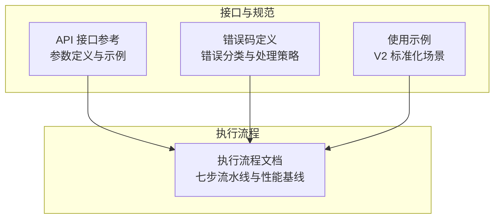
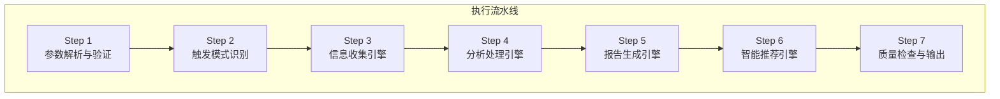
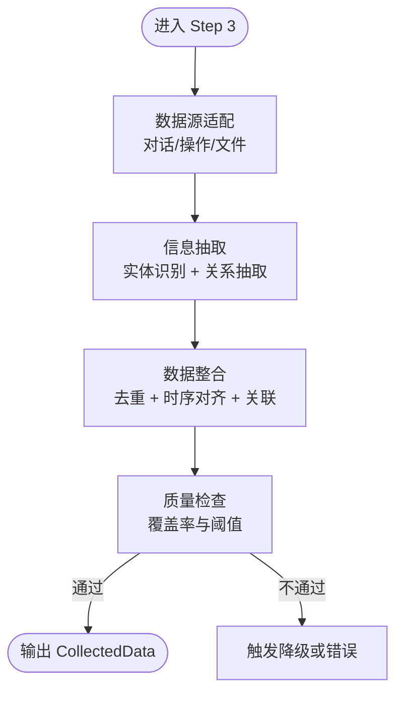
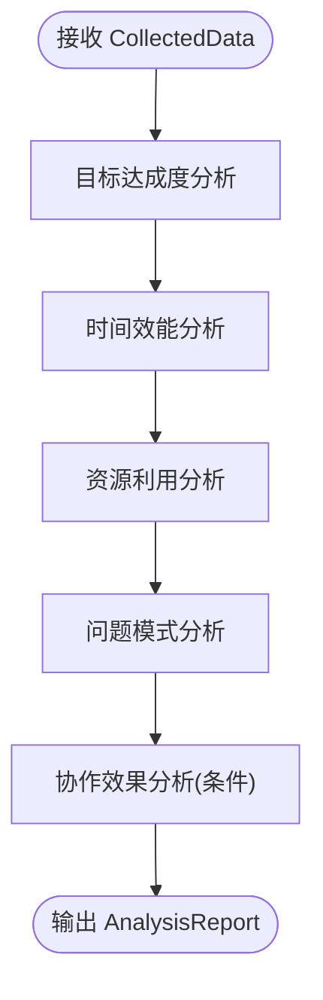
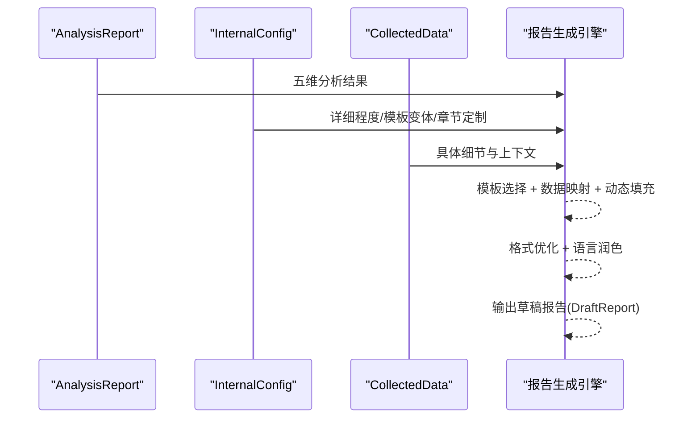
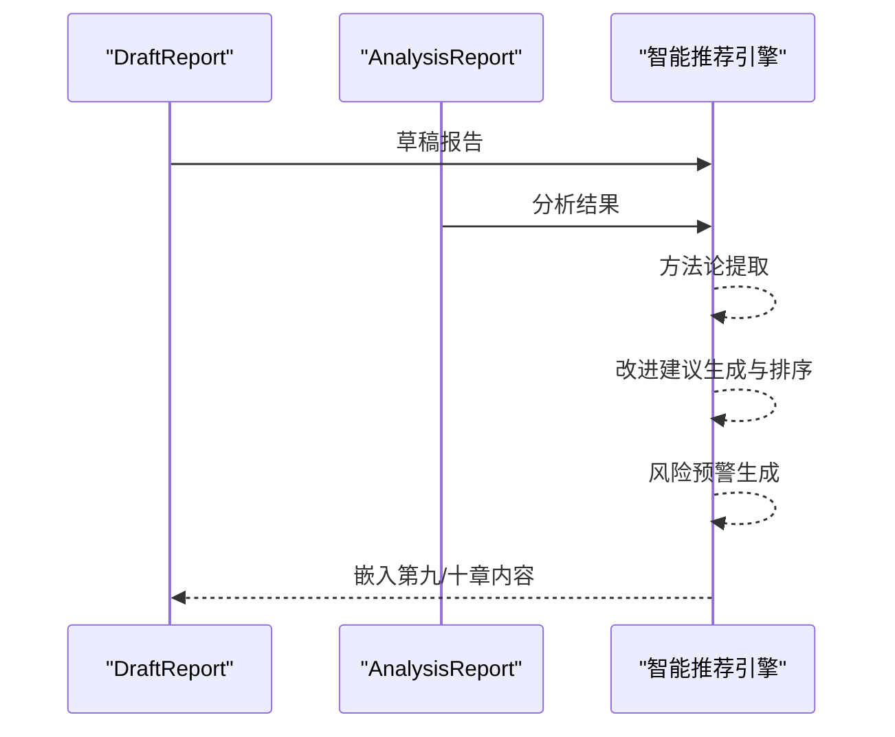
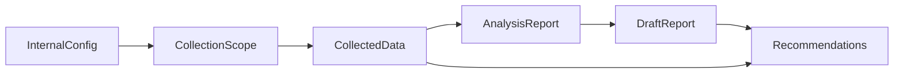
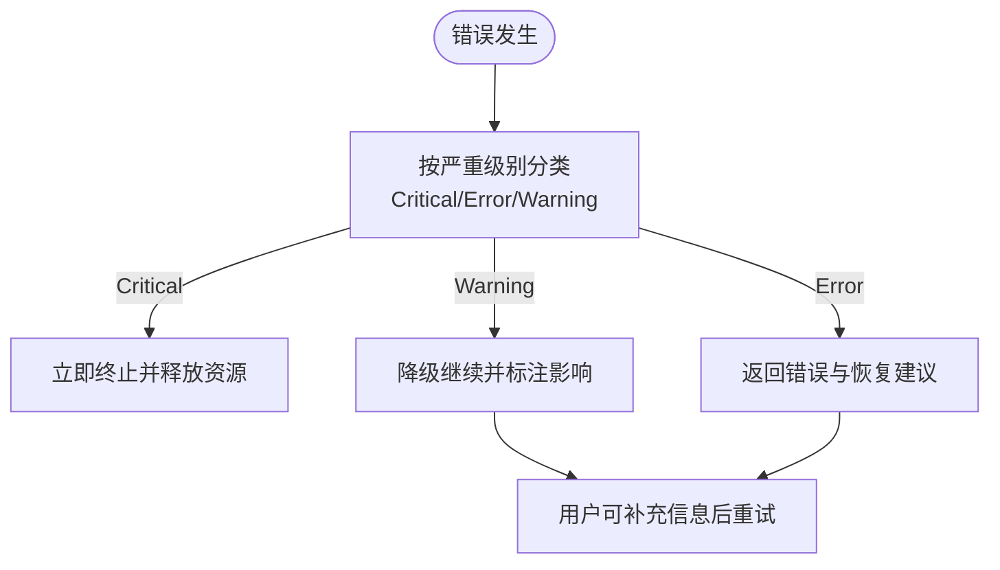

# 四大核心引擎

<cite>
**本文档引用的文件**
- [api-reference.md](file://references/api-reference.md)
- [execution-flow.md](file://references/execution-flow.md)
- [examples-v2.md](file://references/examples-v2.md)
- [error-codes.md](file://references/error-codes.md)
</cite>

## 目录
1. [简介](#简介)
2. [项目结构](#项目结构)
3. [核心组件](#核心组件)
4. [架构总览](#架构总览)
5. [详细组件分析](#详细组件分析)
6. [依赖分析](#依赖分析)
7. [性能考虑](#性能考虑)
8. [故障排除指南](#故障排除指南)
9. [结论](#结论)
10. [附录](#附录)

## 简介
本项目围绕“任务执行总结报告生成器”技能，构建了四大核心引擎协同工作的完整流水线：信息收集引擎、分析处理引擎、报告生成引擎、智能推荐引擎。四大引擎通过统一的执行流程串联，实现从多源数据采集到结构化报告输出的全链路自动化，并在质量保障与容错降级方面提供完善的机制。

## 项目结构
- 文档化接口与参数规范：提供完整的 API 参考、参数定义、调用示例与错误码体系
- 执行流程与性能基线：定义七步执行流程、各阶段耗时分布与关键性能指标
- 使用示例与集成测试：提供四种典型场景的请求-响应示例，便于集成与回归测试
- 错误码与降级策略：覆盖参数验证、数据源、分析引擎、报告生成、资源与超时等全链路错误处理

**图表来源**
- [api-reference.md:1-120](file://references/api-reference.md#L1-L120)
- [execution-flow.md:1-120](file://references/execution-flow.md#L1-L120)
- [error-codes.md:1-120](file://references/error-codes.md#L1-L120)
- [examples-v2.md:1-120](file://references/examples-v2.md#L1-L120)

**章节来源**
- [api-reference.md:1-120](file://references/api-reference.md#L1-L120)
- [execution-flow.md:1-120](file://references/execution-flow.md#L1-L120)
- [error-codes.md:1-120](file://references/error-codes.md#L1-L120)
- [examples-v2.md:1-120](file://references/examples-v2.md#L1-L120)

## 核心组件
- 信息收集引擎：从对话历史、文件变更、命令日志等多源数据中抽取结构化信息，完成去重、时序对齐与质量检查
- 分析处理引擎：基于五维分析模型（目标达成度、时间效能、资源利用、问题模式、协作效果）生成量化评估与指标
- 报告生成引擎：将分析结果映射到标准化模板，动态填充内容并进行格式优化与语言润色
- 智能推荐引擎：从成功实践中提炼方法论，生成可执行的改进建议与风险预警，并进行优先级排序

**章节来源**
- [execution-flow.md:441-722](file://references/execution-flow.md#L441-L722)
- [execution-flow.md:701-866](file://references/execution-flow.md#L701-L866)
- [execution-flow.md:921-1153](file://references/execution-flow.md#L921-L1153)
- [execution-flow.md:1154-1335](file://references/execution-flow.md#L1154-L1335)

## 架构总览
四大核心引擎在统一的执行流水线上协同工作，形成“参数解析→触发识别→信息收集→分析处理→报告生成→智能推荐→质量检查与输出”的闭环。

**图表来源**
- [execution-flow.md:173-1335](file://references/execution-flow.md#L173-L1335)

**章节来源**
- [execution-flow.md:173-1335](file://references/execution-flow.md#L173-L1335)

## 详细组件分析

### 信息收集引擎
- 数据源适配：对话历史解析器、操作记录提取器、文件变更追踪器
- 信息抽取：实体识别（目标、时间、决策、问题、资源、协作）、关系抽取与事件检测
- 数据整合：去重（相似度聚类与 richest 合并）、时序对齐（统一 ISO 8601 与相对时间）、关联建立（决策-问题-资源-时间线）
- 质量检查：按类别计算覆盖率（目标、时间、决策、问题、资源、协作），阈值判断与降级策略

**图表来源**
- [execution-flow.md:441-698](file://references/execution-flow.md#L441-L698)

**章节来源**
- [execution-flow.md:441-698](file://references/execution-flow.md#L441-L698)

### 分析处理引擎（五维深度分析）
- 目标达成度：目标分解→基线建立→逐项测量→偏差计算→综合评定
- 时间效能：总体时效比、阶段均衡度、瓶颈集中度、响应延迟、有效工作率
- 资源利用：必要性、充分性、适配性、性价比评估与浪费类型检测
- 问题模式：技术/环境/流程/认知四维分类与解决有效性评估
- 协作效果：沟通效率、分工合理、协同效果（多人任务时启用）

**图表来源**
- [execution-flow.md:701-866](file://references/execution-flow.md#L701-L866)

**章节来源**
- [execution-flow.md:701-866](file://references/execution-flow.md#L701-L866)

### 报告生成引擎（标准化10章模板）
- 模板选择：根据详细程度（摘要/标准/详细）与模板变体（标准/学习）选择
- 数据映射：将 AnalysisReport 的结果映射到10章模板字段（执行概览、背景与目标、执行过程、关键决策、问题与方案、资源使用、协作分析、多维分析、经验与方法论、改进建议）
- 内容填充：动态生成文本、表格、列表，章节裁剪与定制
- 格式优化与语言润色：统一格式、专业语言风格与可读性提升

**图表来源**
- [execution-flow.md:921-1153](file://references/execution-flow.md#L921-L1153)

**章节来源**
- [execution-flow.md:921-1153](file://references/execution-flow.md#L921-L1153)

### 智能推荐引擎（方法论、建议与风险）
- 方法论提取：从成功实践中抽象可复用方法论，形成名称、理念、适用场景、步骤、关键要素、实战案例等结构化输出
- 改进建议生成：基于证据、具体可行、优先级明确、量化预期、责任明确、确信度评估，采用加权评分进行优先级排序（P0-P4）
- 风险预警：从技术、流程、依赖、人员四个维度识别风险，给出标题、描述、触发条件、可能性、影响、预防与应急预案

**图表来源**
- [execution-flow.md:1154-1335](file://references/execution-flow.md#L1154-L1335)

**章节来源**
- [execution-flow.md:1154-1335](file://references/execution-flow.md#L1154-L1335)

## 依赖分析
- 组件耦合与内聚：各引擎通过统一的数据契约（InternalConfig、CollectedData、AnalysisReport、DraftReport、Recommendations）进行弱耦合协作，内聚于各自分析与生成职责
- 直接与间接依赖：信息收集引擎为分析处理引擎提供输入；分析处理引擎为报告生成引擎提供结构化结果；智能推荐引擎在报告生成后进行内容增强
- 外部依赖与集成点：模板系统、LLM/推理服务（用于语言润色与建议生成）、文件系统（保存报告）、错误码与降级策略贯穿全流程

**图表来源**
- [execution-flow.md:286-301](file://references/execution-flow.md#L286-L301)
- [execution-flow.md:470-473](file://references/execution-flow.md#L470-L473)
- [execution-flow.md:718-721](file://references/execution-flow.md#L718-L721)
- [execution-flow.md:1130-1146](file://references/execution-flow.md#L1130-L1146)
- [execution-flow.md:1307-1327](file://references/execution-flow.md#L1307-L1327)

**章节来源**
- [execution-flow.md:286-301](file://references/execution-flow.md#L286-L301)
- [execution-flow.md:470-473](file://references/execution-flow.md#L470-L473)
- [execution-flow.md:718-721](file://references/execution-flow.md#L718-L721)
- [execution-flow.md:1130-1146](file://references/execution-flow.md#L1130-L1146)
- [execution-flow.md:1307-1327](file://references/execution-flow.md#L1307-L1327)

## 性能考虑
- 各阶段耗时分布（标准版报告，中等复杂度任务）：信息收集阶段（40-50%）、分析处理阶段（35-40%）、报告生成阶段（15-20%）、智能推荐阶段（5-10%）、质量检查阶段（<2%）
- 主要性能影响因素：对话轮数、详细程度、模板变体、章节裁剪、输出格式
- 降级与容错：当数据不足时自动降级，质量评分与警告提示清晰标注，支持用户补充信息后重新生成

**章节来源**
- [execution-flow.md:142-170](file://references/execution-flow.md#L142-L170)
- [error-codes.md:1379-1421](file://references/error-codes.md#L1379-L1421)

## 故障排除指南
- 参数验证错误（E001-E005）：缺少必填参数、类型错误、值越界、参数冲突、章节组合无效
- 数据源错误（E010-E012）：数据不足警告、对话历史不可用、文件访问被拒
- 分析引擎错误（E021-E022）：目标分析失败、时间线重建失败
- 报告生成错误（E031-E032）：模板不存在、报告生成超时
- 系统资源与超时（E041、E051）：内存不足、执行超时

**图表来源**
- [error-codes.md:1337-1376](file://references/error-codes.md#L1337-L1376)

**章节来源**
- [error-codes.md:173-1594](file://references/error-codes.md#L173-L1594)

## 结论
四大核心引擎通过清晰的职责划分与统一的数据契约，实现了从多源数据采集到结构化报告输出的自动化与智能化。信息收集引擎确保数据质量与覆盖面，分析处理引擎提供五维量化评估，报告生成引擎实现标准化模板动态填充，智能推荐引擎则将经验沉淀为可复用的方法论与可执行的改进建议。配合完善的错误码体系与降级策略，系统在复杂任务场景下仍能提供稳定、可解释、可优化的输出。

## 附录
- API 接口参考与参数定义：涵盖 task_context、generation_options、output_config 的完整字段说明与示例
- 执行流程与性能基线：七步流水线、阶段耗时分布、关键性能指标
- 使用示例与集成测试：四种典型场景（标准调用、最小参数、参数错误、降级执行）的请求-响应示例
- 错误码与降级策略：全链路错误分类、处理策略与质量门禁

**章节来源**
- [api-reference.md:1-1216](file://references/api-reference.md#L1-L1216)
- [execution-flow.md:1-1335](file://references/execution-flow.md#L1-L1335)
- [examples-v2.md:1-769](file://references/examples-v2.md#L1-L769)
- [error-codes.md:1-1594](file://references/error-codes.md#L1-L1594)