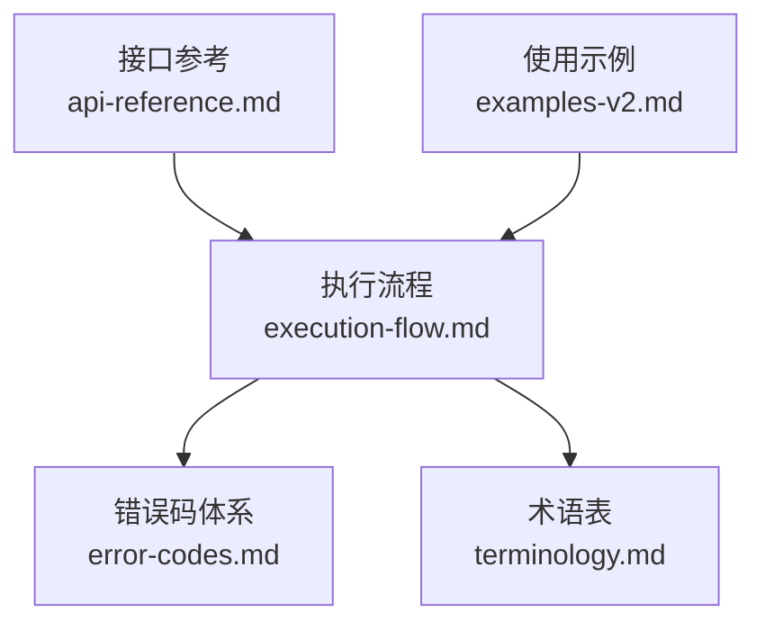
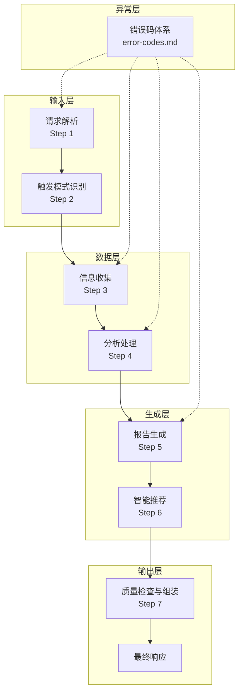
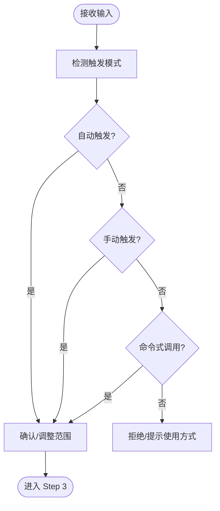
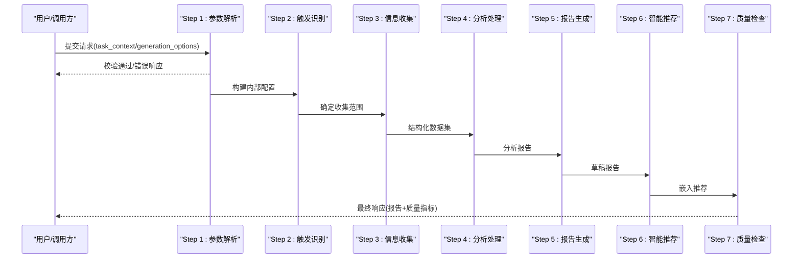
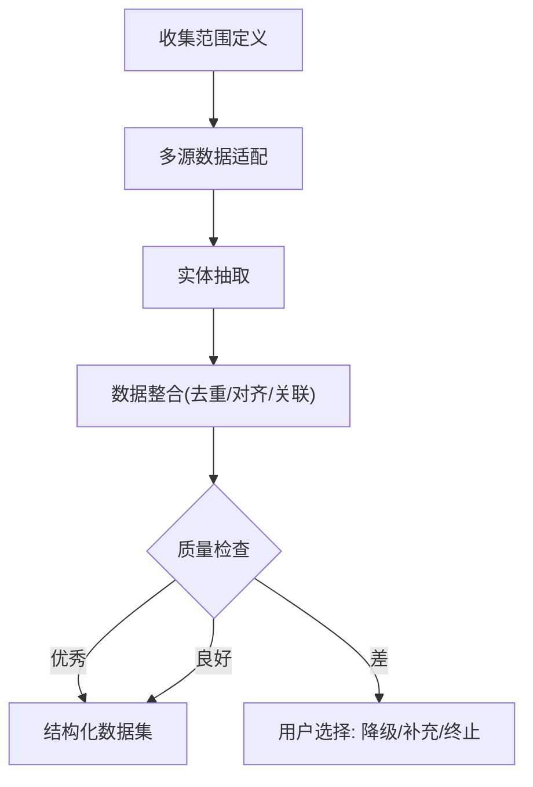
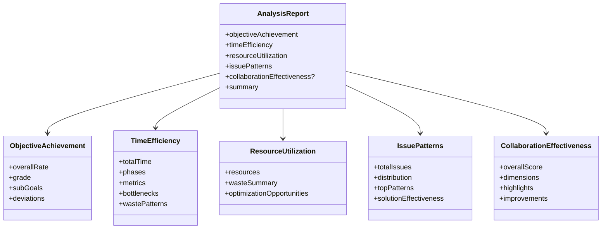
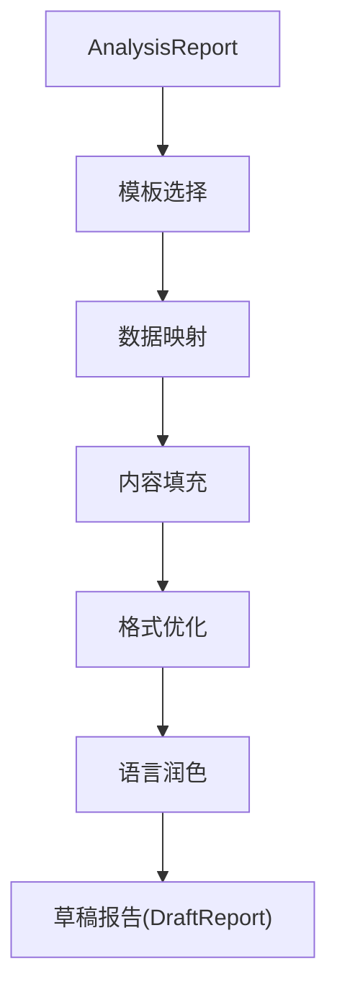
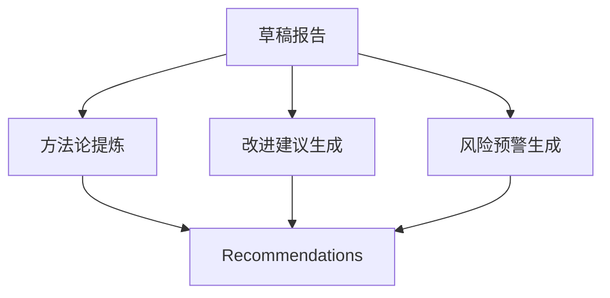
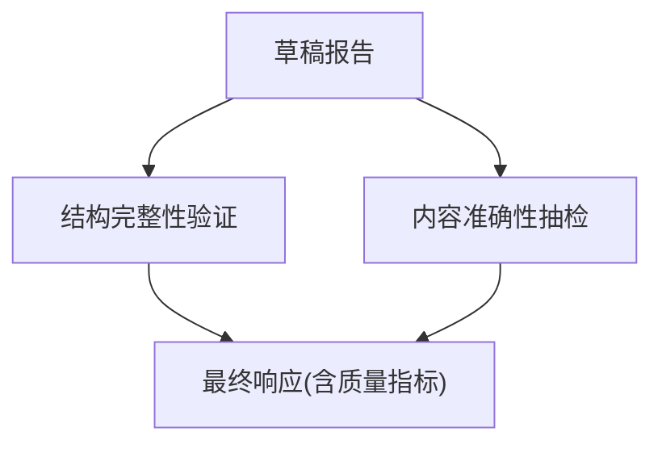
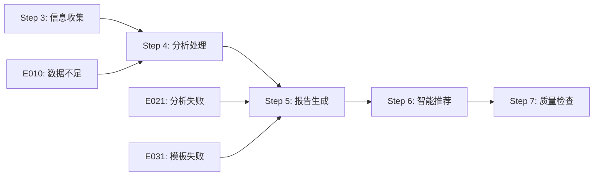

# 技能核心功能

<cite>
**本文引用的文件**
- [api-reference.md](file://references/api-reference.md)
- [examples-v2.md](file://references/examples-v2.md)
- [execution-flow.md](file://references/execution-flow.md)
- [error-codes.md](file://references/error-codes.md)
- [terminology.md](file://references/terminology.md)
</cite>

## 目录
1. [简介](#简介)
2. [项目结构](#项目结构)
3. [核心组件](#核心组件)
4. [架构总览](#架构总览)
5. [详细组件分析](#详细组件分析)
6. [依赖分析](#依赖分析)
7. [性能考量](#性能考量)
8. [故障排查指南](#故障排查指南)
9. [结论](#结论)
10. [附录](#附录)

## 简介
本文件面向“任务执行总结报告生成器”技能的核心功能，系统阐述触发条件与使用方式（自动触发、手动触发、命令式调用），并完整解析七步标准执行流程（从参数解析到质量输出）。同时，深入说明四大核心引擎的工作原理与相互关系：信息收集引擎的数据提取机制、分析处理引擎的五维分析方法、报告生成引擎的模板化输出、智能推荐引擎的方法论提炼与风险预警。文档提供可操作的使用模式与示例路径，兼顾初学者易读性与专家级技术深度。

## 项目结构
本技能的参考文档由以下核心文件构成：
- 接口参考与参数规范：定义输入输出、参数约束、调用方式与认证策略
- 使用示例：提供标准、最小化、参数错误、降级执行四种典型场景
- 执行流程：详细描述七步执行流程、异常路径与性能基线
- 错误码体系：统一的错误分类、处理策略与降级机制
- 术语表：贯穿全文的专业术语与定义

**图表来源**
- [api-reference.md:1-120](file://references/api-reference.md#L1-L120)
- [execution-flow.md:1-60](file://references/execution-flow.md#L1-L60)
- [error-codes.md:1-60](file://references/error-codes.md#L1-L60)
- [terminology.md:1-60](file://references/terminology.md#L1-L60)

**章节来源**
- [api-reference.md:1-120](file://references/api-reference.md#L1-L120)
- [execution-flow.md:1-60](file://references/execution-flow.md#L1-L60)
- [error-codes.md:1-60](file://references/error-codes.md#L1-L60)
- [terminology.md:1-60](file://references/terminology.md#L1-L60)

## 核心组件
- 信息收集引擎：从对话历史、操作记录、文件变更等多源数据中抽取任务目标、时间线、决策、问题、资源与协作等结构化信息，进行去重、时序对齐与质量检查。
- 分析处理引擎：基于五维分析（目标达成度、时间效能、资源利用率、问题模式、协作效果）生成结构化分析报告。
- 报告生成引擎：根据 generation_options 选择模板变体，将分析结果映射到章节字段，动态生成 Markdown 内容并进行格式优化与语言润色。
- 智能推荐引擎：从成功实践中提炼方法论，生成改进建议与风险预警，嵌入报告第九、十章。

**章节来源**
- [execution-flow.md:441-918](file://references/execution-flow.md#L441-L918)
- [execution-flow.md:921-1151](file://references/execution-flow.md#L921-L1151)
- [execution-flow.md:1154-1332](file://references/execution-flow.md#L1154-L1332)
- [execution-flow.md:1336-1466](file://references/execution-flow.md#L1336-L1466)

## 架构总览
技能采用“流水线式”分层架构，七步执行流程串联四大引擎，异常层统一管理错误分类与降级策略，可观测性贯穿每个步骤。

**图表来源**
- [execution-flow.md:175-196](file://references/execution-flow.md#L175-L196)
- [execution-flow.md:313-438](file://references/execution-flow.md#L313-L438)
- [execution-flow.md:441-918](file://references/execution-flow.md#L441-L918)
- [execution-flow.md:921-1151](file://references/execution-flow.md#L921-L1151)
- [execution-flow.md:1154-1332](file://references/execution-flow.md#L1154-L1332)
- [execution-flow.md:1336-1466](file://references/execution-flow.md#L1336-L1466)
- [error-codes.md:152-170](file://references/error-codes.md#L152-L170)

## 详细组件分析

### 触发模式与使用方式
- 自动触发：通过完成信号词、隐含意图与上下文暗示识别任务完成，置信度高于阈值时自动进入信息收集。
- 手动触发：显式命令（如“/summary”）或自然语言指令直接触发。
- 命令式调用：REST/JSON-RPC 请求，携带 task_context、generation_options、output_config 等参数。

**图表来源**
- [execution-flow.md:313-438](file://references/execution-flow.md#L313-L438)

**章节来源**
- [execution-flow.md:313-438](file://references/execution-flow.md#L313-L438)
- [api-reference.md:97-132](file://references/api-reference.md#L97-L132)

### 七步标准执行流程
- Step 1：参数解析与验证（类型、范围、冲突、安全）
- Step 2：触发模式识别（完成信号、命令、配置化）
- Step 3：信息收集（多源适配、实体抽取、数据整合、质量检查）
- Step 4：分析处理（五维分析：目标达成、时间效能、资源利用率、问题模式、协作效果）
- Step 5：报告生成（模板选择、数据映射、内容填充、格式优化、语言润色）
- Step 6：智能推荐（方法论提炼、改进建议、风险预警）
- Step 7：质量检查与输出（结构完整性、内容准确性抽检、组装最终响应）

**图表来源**
- [execution-flow.md:175-196](file://references/execution-flow.md#L175-L196)
- [execution-flow.md:313-438](file://references/execution-flow.md#L313-L438)
- [execution-flow.md:441-918](file://references/execution-flow.md#L441-L918)
- [execution-flow.md:921-1151](file://references/execution-flow.md#L921-L1151)
- [execution-flow.md:1154-1332](file://references/execution-flow.md#L1154-L1332)
- [execution-flow.md:1336-1466](file://references/execution-flow.md#L1336-L1466)

**章节来源**
- [execution-flow.md:175-196](file://references/execution-flow.md#L175-L196)
- [execution-flow.md:313-438](file://references/execution-flow.md#L313-L438)
- [execution-flow.md:441-918](file://references/execution-flow.md#L441-L918)
- [execution-flow.md:921-1151](file://references/execution-flow.md#L921-L1151)
- [execution-flow.md:1154-1332](file://references/execution-flow.md#L1154-L1332)
- [execution-flow.md:1336-1466](file://references/execution-flow.md#L1336-L1466)

### 信息收集引擎（Step 3）
- 数据源适配：对话历史解析器、操作记录提取器、文件变更追踪器
- 信息抽取：任务目标、时间节点、决策、问题、资源、协作六大实体
- 数据整合：去重、时序对齐、实体关联
- 质量检查：按类别计算覆盖率，阈值判断与处理

**图表来源**
- [execution-flow.md:441-698](file://references/execution-flow.md#L441-L698)

**章节来源**
- [execution-flow.md:441-698](file://references/execution-flow.md#L441-L698)

### 分析处理引擎（Step 4）
- 五维分析：目标达成度、时间效能、资源利用率、问题模式、协作效果
- 输出：AnalysisReport（包含各维度结果与摘要）

**图表来源**
- [execution-flow.md:701-918](file://references/execution-flow.md#L701-L918)

**章节来源**
- [execution-flow.md:701-918](file://references/execution-flow.md#L701-L918)

### 报告生成引擎（Step 5）
- 模板选择：根据 detail_level 选择摘要/标准/详细模板
- 数据映射：将 AnalysisReport 映射到章节字段
- 内容填充：文本、表格、列表动态生成
- 格式优化与语言润色：Markdown 规范化、表格、标题层级、代码块语言标注、一致性检查

**图表来源**
- [execution-flow.md:921-1151](file://references/execution-flow.md#L921-L1151)

**章节来源**
- [execution-flow.md:921-1151](file://references/execution-flow.md#L921-L1151)

### 智能推荐引擎（Step 6）
- 方法论提炼：从成功实践中抽象可复用方法，命名、步骤化、验证
- 改进建议：基于证据、具体可行、优先级明确、量化预期、责任明确
- 风险预警：技术、流程、依赖、人事维度的风险识别与呈现

**图表来源**
- [execution-flow.md:1154-1332](file://references/execution-flow.md#L1154-L1332)

**章节来源**
- [execution-flow.md:1154-1332](file://references/execution-flow.md#L1154-L1332)

### 质量检查与输出（Step 7）
- 结构完整性验证：章节齐全、表格格式、标题层级、代码块语言标注、附录存在性
- 内容准确性抽检：数字一致性、逻辑自洽、引用有效性、时间线连贯性、建议可操作性
- 组装最终响应：构建 success 响应、附加质量指标、保存文件（如配置）

**图表来源**
- [execution-flow.md:1336-1466](file://references/execution-flow.md#L1336-L1466)

**章节来源**
- [execution-flow.md:1336-1466](file://references/execution-flow.md#L1336-L1466)

## 依赖分析
- 组件耦合：Step 3 的 CollectedData 为 Step 4 的 AnalysisReport 提供输入；Step 5 的 DraftReport 与 Step 6 的 Recommendations 共同组成最终报告；Step 7 对前序结果进行质量把关。
- 异常路径：参数验证错误（E001-E005）直接终止；数据质量错误（E010-E012）触发降级或用户选择；分析/生成错误（E021-E032）触发回退或简化输出。
- 外部依赖：模板引擎、文件系统、对话历史服务、数据源可用性。

**图表来源**
- [execution-flow.md:1470-1584](file://references/execution-flow.md#L1470-L1584)
- [error-codes.md:152-170](file://references/error-codes.md#L152-L170)

**章节来源**
- [execution-flow.md:1470-1584](file://references/execution-flow.md#L1470-L1584)
- [error-codes.md:152-170](file://references/error-codes.md#L152-L170)

## 性能考量
- 各阶段耗时分布（标准版报告，中等复杂度任务）：Step 3（40-50%）、Step 4（35-40%）、Step 5（15-20%）、Step 6（5-10%）、Step 7（<2%）、Step 2（<2%）、Step 1（<1%）。
- 影响因素：对话轮数、详细程度、数据量。
- 优化建议：减少冗余对话、合理选择 detail_level、提供结构化输入以降低解析与收集成本。

**章节来源**
- [execution-flow.md:142-158](file://references/execution-flow.md#L142-L158)

## 故障排查指南
- 参数验证错误（E001-E005）：检查必填参数、类型、范围与冲突；参考接口参考文档与示例。
- 数据质量错误（E010-E012）：关注信息覆盖率与数据源可用性；可选择降级继续或补充信息后重试。
- 分析/生成错误（E021-E032）：检查模板可用性与分析数据完整性；必要时回退到简化模式。
- 常见场景示例：最小化调用、参数错误、降级执行等，可参考使用示例文档中的响应结构与恢复建议。

**章节来源**
- [error-codes.md:173-800](file://references/error-codes.md#L173-L800)
- [examples-v2.md:278-688](file://references/examples-v2.md#L278-L688)

## 结论
本技能通过七步流水线与四大引擎协同，实现了从多源信息抽取到结构化报告与智能推荐的完整闭环。其设计强调确定性、可观测性与容错性，支持自动/手动/命令式三种触发模式，并提供丰富的参数与模板变体以满足多样化场景。通过严格的错误码体系与降级策略，系统在数据不足或异常情况下仍能输出可用结果，保障用户体验与质量。

## 附录
- 使用示例路径（不含代码内容，仅提供路径）：
  - 标准调用示例：[示例 1: 软件开发任务标准调用:29-165](file://references/examples-v2.md#L29-L165)
  - 最小参数调用示例：[示例 2: Sprint 复盘最小化调用:168-275](file://references/examples-v2.md#L168-L275)
  - 参数错误示例：[示例 3: 参数验证错误（异常场景）:278-422](file://references/examples-v2.md#L278-L422)
  - 降级执行示例：[示例 4: 数据不足时的降级执行:461-688](file://references/examples-v2.md#L461-L688)
- 接口参考路径：
  - 输入参数与输出格式：[api-reference.md:183-786](file://references/api-reference.md#L183-L786)
  - 触发端点与认证：[api-reference.md:97-179](file://references/api-reference.md#L97-L179)
- 术语索引：
  - 术语表：[terminology.md:1-1104](file://references/terminology.md#L1-L1104)