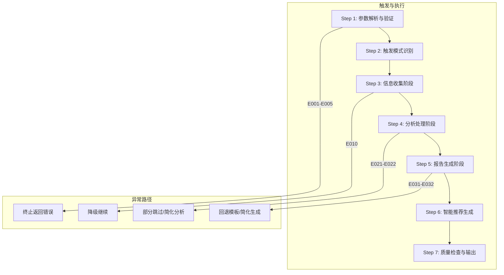
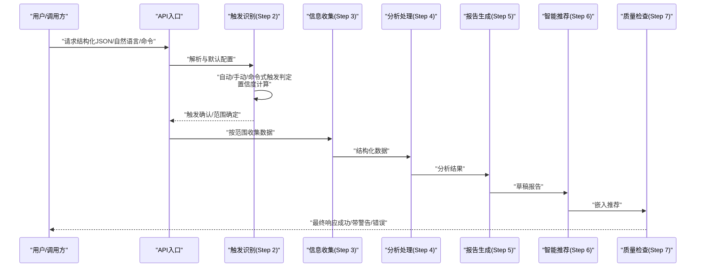
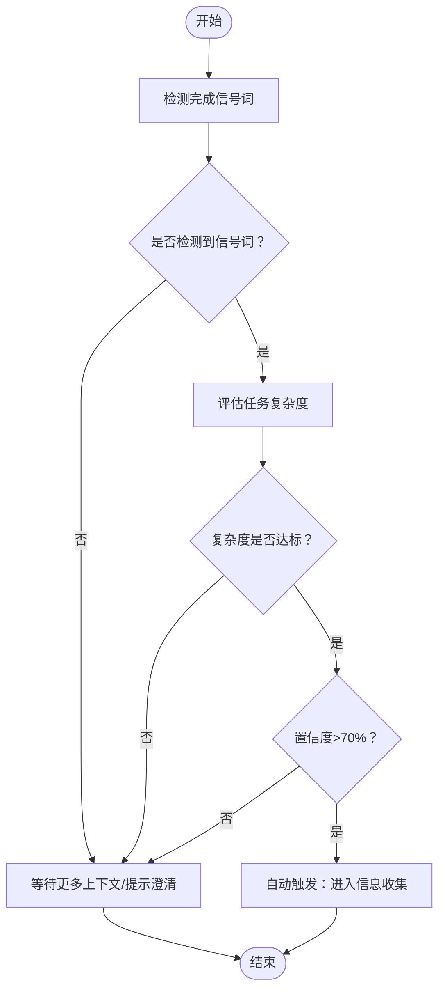
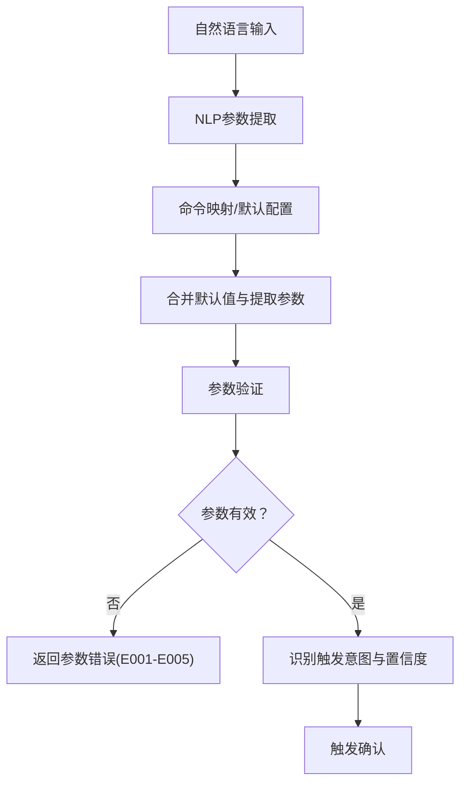
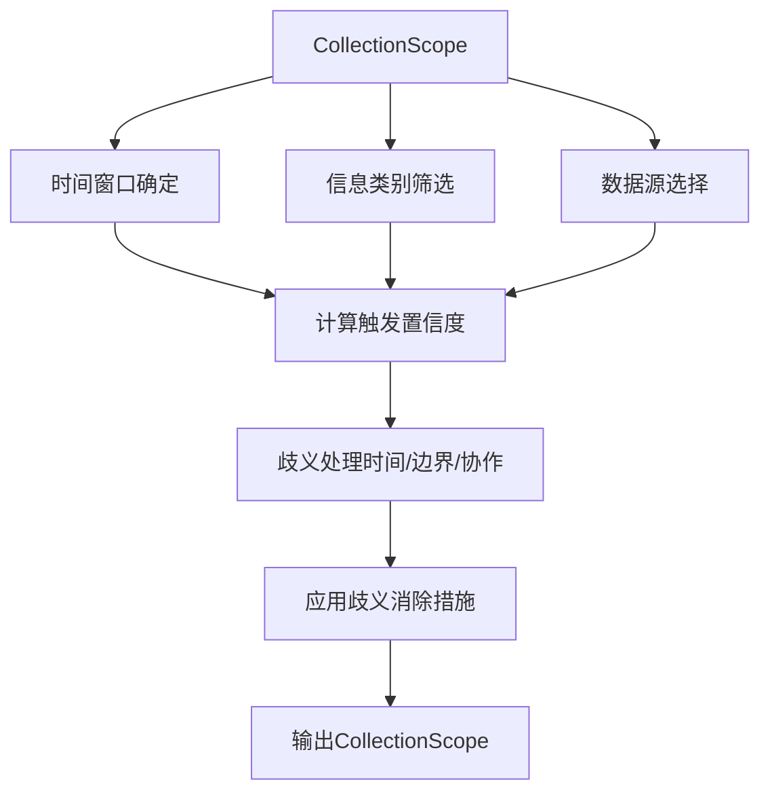
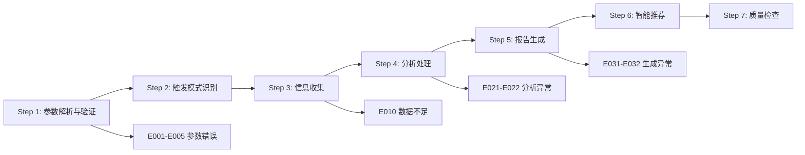

# 触发机制与条件

<cite>
**本文档引用的文件**
- [api-reference.md](file://references/api-reference.md)
- [execution-flow.md](file://references/execution-flow.md)
- [error-codes.md](file://references/error-codes.md)
- [examples-v2.md](file://references/examples-v2.md)
- [terminology.md](file://references/terminology.md)
</cite>

## 目录
1. [简介](#简介)
2. [项目结构](#项目结构)
3. [核心组件](#核心组件)
4. [架构总览](#架构总览)
5. [详细组件分析](#详细组件分析)
6. [依赖分析](#依赖分析)
7. [性能考量](#性能考量)
8. [故障排查指南](#故障排查指南)
9. [结论](#结论)
10. [附录](#附录)

## 简介
本文件系统性阐述“任务执行总结报告生成器”的触发机制与条件，覆盖三种触发模式（自动触发、隐式意图识别、场景推断）与两种触发入口（手动触发、命令式调用），并详细说明触发确认策略（任务复杂度评估、重要性判断、重复性分析）与触发边界场景。文档同时提供可操作的触发示例与降级策略，兼顾初学者易读性与专家级技术深度。

## 项目结构
- 触发与执行流程由“执行流程文档”定义，包含7步主流程与异常路径。
- 触发模式识别位于第2步，涵盖自动触发、手动触发与命令式触发的判定逻辑与置信度要求。
- API参考文档定义了输入参数、输出格式与错误码，为触发确认策略提供参数与约束基础。
- 示例文档展示了最小化调用、参数错误与降级执行等典型场景，有助于理解触发边界与降级条件。
- 术语表提供了触发与分析相关的专业术语，便于准确理解触发与评估维度。

**图表来源**
- [execution-flow.md: 173-1600:173-1600](file://references/execution-flow.md#L173-L1600)

**章节来源**
- [execution-flow.md: 173-1600:173-1600](file://references/execution-flow.md#L173-L1600)

## 核心组件
- 触发模式识别（Step 2）
  - 自动触发：基于完成信号词与任务复杂度阈值，置信度>70%时触发。
  - 手动触发：显式命令关键词（如“/summary”、“请生成总结”）100%置信度触发。
  - 命令式触发：API调用、脚本触发等配置化参数调用。
- 触发确认策略
  - 任务复杂度评估：通过对话轮数、章节数量、分析维度等综合评估。
  - 重要性判断：结合任务类型（development/management/operations/research/learning）与目标达成度。
  - 重复性分析：检测是否为重复触发（如相同时间窗口与任务主题），避免冗余生成。
- 触发边界与降级
  - 参数验证错误（E001-E005）直接终止。
  - 数据不足（E010）触发降级继续，生成带警告的成功响应。
  - 分析/生成异常（E021-E032）触发部分跳过或回退策略。

**章节来源**
- [execution-flow.md: 313-439:313-439](file://references/execution-flow.md#L313-L439)
- [error-codes.md: 173-800:173-800](file://references/error-codes.md#L173-L800)

## 架构总览
触发机制与确认策略贯穿执行流程的前两步，随后进入信息收集与分析阶段。异常路径在各阶段均有覆盖，确保系统在参数错误、数据不足、分析/生成异常时仍能提供可接受的输出或明确的错误信息。

**图表来源**
- [execution-flow.md: 173-1600:173-1600](file://references/execution-flow.md#L173-L1600)

## 详细组件分析

### 自动触发：关键词匹配算法
- 触发条件
  - 明确完成信号词：如“完成了”“好了”“成功了”“可以了”“搞定了”“搞定”“OK”“没问题”。
  - 隐含完成意图：如“帮我总结一下”“回顾一下”“复盘”“做得怎么样”“有什么收获”“记录一下”。
  - 上下文暗示：连续多个操作后停顿、用户切换话题前的过渡语、询问保存或导出等。
- 置信度与任务复杂度
  - 置信度>70%方可触发。
  - 任务复杂度评估：对话轮数、决策/问题/资源/协作等信息覆盖率。
- 处理流程
  - 若满足条件，进入Step 3确定收集范围；若不满足，系统可提示澄清或保持等待。

**图表来源**
- [execution-flow.md: 340-406:340-406](file://references/execution-flow.md#L340-L406)

**章节来源**
- [execution-flow.md: 313-439:313-439](file://references/execution-flow.md#L313-L439)

### 隐式意图识别：自然语言处理逻辑
- 识别目标
  - 从自然语言中抽取任务名称、任务类型、时间范围、描述、参与者、上下文数据等。
- NLP流程
  - 命令映射：将自然语言映射为默认配置（如“生成详细版的总结，重点关注时间分析”）。
  - 参数提取：从自然语言中提取结构化参数，与默认值合并。
- 触发判定
  - 若能提取到任务名称与足够上下文，且置信度达标，则触发自动或手动模式。

**图表来源**
- [execution-flow.md: 210-277:210-277](file://references/execution-flow.md#L210-L277)

**章节来源**
- [execution-flow.md: 175-312:175-312](file://references/execution-flow.md#L175-L312)

### 场景推断：上下文分析机制
- 时间窗口与范围
  - 基于任务开始/结束时间、最近活动时间与对话历史，确定信息收集的时间窗口。
- 信息类别筛选
  - 根据任务类型（development/management/operations/research/learning/auto-detect）与参与者数量，筛选需要收集的信息类别（目标、时间、决策、问题、资源、协作）。
- 数据源选择
  - 对话历史、文件变更、命令日志等数据源按类别需求选择。
- 置信度与歧义处理
  - 时间范围不明：使用全量范围。
  - 任务边界模糊：采用最近完整任务周期。
  - 协作信息存疑：检测参与者数量，单人任务时简化协作章节。

**图表来源**
- [execution-flow.md: 376-433:376-433](file://references/execution-flow.md#L376-L433)

**章节来源**
- [execution-flow.md: 376-439:376-439](file://references/execution-flow.md#L376-L439)

### 手动触发：快捷命令、直接请求、对话结束时触发
- 快捷命令
  - “/summary”“/report”等命令式触发，100%置信度。
- 直接请求
  - 结构化JSON请求（task_context、generation_options、output_config）。
- 对话结束时触发
  - 用户表达“可以了”“完成了”等完成信号词，结合上下文与复杂度评估触发。

**章节来源**
- [execution-flow.md: 340-406:340-406](file://references/execution-flow.md#L340-L406)

### 命令式调用：参数化调用方法
- task_context
  - task_name（必填）、task_type（可选，默认auto-detect）、time_range（可选）、description（可选）、participants（可选）、context_data（可选）。
- generation_options
  - detail_level（summary/standard/detailed，默认standard）、template_variant（summary/standard/detailed/learning）、included_chapters/excluded_chapters（章节选择）、language_style（professional/casual/academic）、focus_dimensions（目标达成/time效率/resource利用/问题模式/协作）、output_format（markdown/json/html）。
- output_config
  - save_to_file、file_path、include_metadata、append_to_existing、encoding、custom_header/custom_footer。
- 触发确认
  - 参数验证通过后进入触发模式识别，随后进入信息收集与分析。

**章节来源**
- [api-reference.md: 183-715:183-715](file://references/api-reference.md#L183-L715)

### 触发确认策略：判断逻辑
- 任务复杂度评估
  - 基于对话轮数、决策/问题/资源/协作等覆盖率阈值（如E010的70%阈值）。
- 重要性判断
  - 任务类型与目标达成度、时间效率、问题模式等维度综合评估。
- 重复性分析
  - 检测相同时间窗口与任务主题的重复触发，避免冗余生成。

**章节来源**
- [error-codes.md: 560-668:560-668](file://references/error-codes.md#L560-L668)
- [execution-flow.md: 376-439:376-439](file://references/execution-flow.md#L376-L439)

### 触发示例与边界情况
- 最小化调用（仅提供task_name）
  - 触发自动或手动模式，系统自动推断任务类型与默认参数，生成标准版报告。
- 参数错误（E001-E005）
  - 缺少必填参数、类型错误、值越界、参数冲突、无效章节组合等，直接返回错误响应。
- 降级执行（E010）
  - 数据不足时降级为standard或更简版本，生成带警告的成功响应，并在报告中标注信息不足的章节。
- 命令式调用
  - 通过API调用、脚本触发等方式，提供结构化参数，触发确认策略与默认值应用。

**章节来源**
- [examples-v2.md: 168-275:168-275](file://references/examples-v2.md#L168-L275)
- [examples-v2.md: 278-422:278-422](file://references/examples-v2.md#L278-L422)
- [examples-v2.md: 461-688:461-688](file://references/examples-v2.md#L461-L688)

## 依赖分析
- 触发识别依赖
  - 参数解析与默认配置（Step 1）为触发识别提供标准化输入。
  - 信息类别与数据源选择（Step 2）决定后续信息收集的范围与质量。
- 异常路径依赖
  - 参数验证错误（E001-E005）阻断后续步骤。
  - 数据不足（E010）触发降级继续，影响分析与生成阶段。
  - 分析/生成异常（E021-E032）触发部分跳过或回退策略。

**图表来源**
- [execution-flow.md: 1470-1584:1470-1584](file://references/execution-flow.md#L1470-L1584)

**章节来源**
- [execution-flow.md: 1470-1584:1470-1584](file://references/execution-flow.md#L1470-L1584)

## 性能考量
- 触发识别（Step 2）耗时<2秒，主要为信号词检测与范围确定。
- 信息收集（Step 3）耗时30-120秒，取决于对话长度与数据量。
- 分析处理（Step 4）耗时60-180秒，取决于数据量与分析深度。
- 报告生成（Step 5）耗时30-120秒，取决于详细程度与内容量。
- 智能推荐（Step 6）耗时30-60秒。
- 质量检查（Step 7）耗时<10秒。

**章节来源**
- [execution-flow.md: 142-158:142-158](file://references/execution-flow.md#L142-L158)

## 故障排查指南
- 参数验证错误（E001-E005）
  - 缺少必填参数：检查task_context与generation_options的必填字段。
  - 类型错误：核对参数类型（如detail_level应为字符串枚举）。
  - 值越界：检查章节编号、长度限制等。
  - 参数冲突：避免同时指定冲突参数组合。
- 数据不足（E010）
  - 提供更详细的对话记录，补充决策、问题、资源与协作信息。
  - 使用降级继续或稍后重试。
- 分析/生成异常（E021-E032）
  - 简化分析维度或回退到标准模板。
  - 检查模板可用性与内容生成器状态。

**章节来源**
- [error-codes.md: 173-800:173-800](file://references/error-codes.md#L173-L800)

## 结论
触发机制与条件通过“自动触发（关键词匹配）+ 隐式意图识别（NLP）+ 场景推断（上下文）”三位一体，结合手动触发与命令式调用，形成灵活可靠的触发体系。触发确认策略以任务复杂度、重要性与重复性为核心，辅以参数验证与数据质量检查，确保在参数错误、数据不足、分析/生成异常等边界情况下仍能提供可接受的输出或明确的错误信息。建议在任务执行过程中保持详细的对话记录，以提升触发置信度与报告质量。

## 附录
- 术语参考
  - 任务、项目、里程碑、阶段、工作项、交付物、产出物、任务分解、目标、子目标、验收标准、完成定义、达成率、偏差、耗时、估算时间、瓶颈、时效比、关键路径、约束、依赖、问题、风险、应急预案、严重程度、根因、资源、利用率、浪费、效率、效能、生产力、优先级、技术栈、技术选型、决策、权衡、执行概览、方法论提炼、经验教训、最佳实践、模式、报告模板、附录、Sprint、用户故事、Backlog、回顾会议、Sprint Planning、Velocity、迭代、Story Point、增量交付、MVP、缺陷、技术债务、重构、代码质量、Code Review、PR/MR、CI/CD、质量门禁、回归测试、制品、SLA等。

**章节来源**
- [terminology.md: 1-1104:1-1104](file://references/terminology.md#L1-L1104)