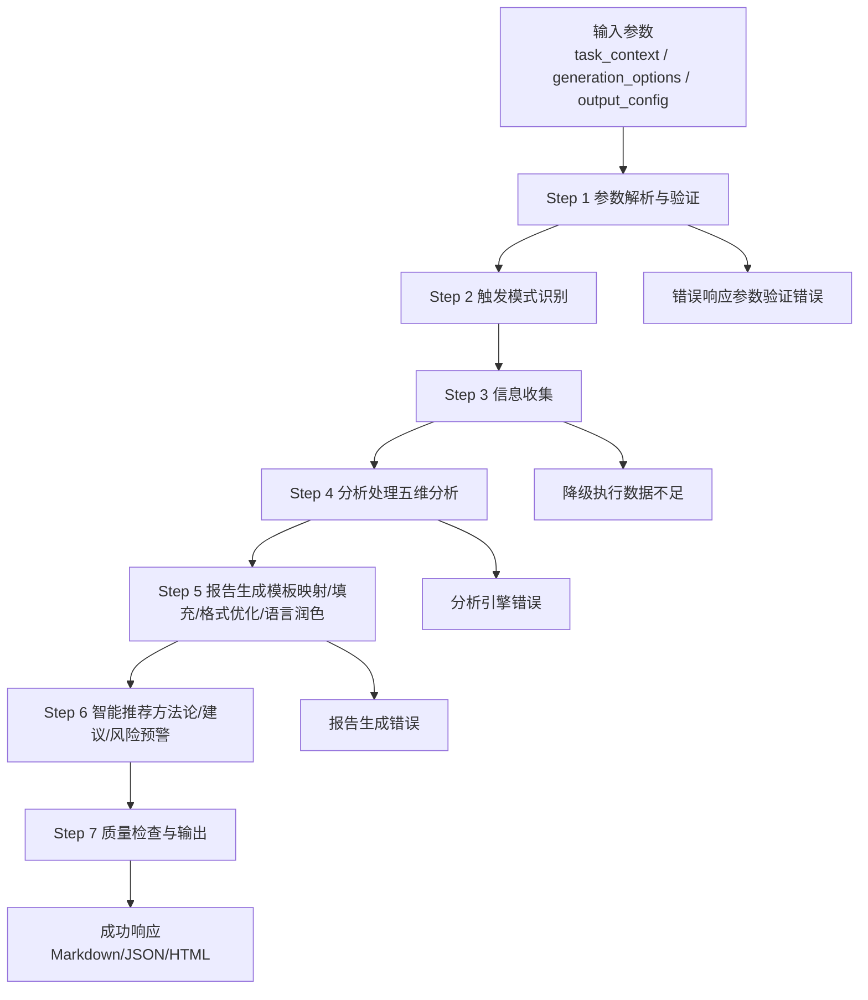
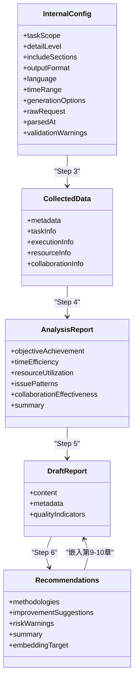

# 输出报告结构

<cite>
**本文档引用的文件**
- [api-reference.md](file://references/api-reference.md)
- [examples-v2.md](file://references/examples-v2.md)
- [execution-flow.md](file://references/execution-flow.md)
- [error-codes.md](file://references/error-codes.md)
- [terminology.md](file://references/terminology.md)
</cite>

## 目录
1. [简介](#简介)
2. [项目结构](#项目结构)
3. [核心组件](#核心组件)
4. [架构总览](#架构总览)
5. [详细组件分析](#详细组件分析)
6. [依赖分析](#依赖分析)
7. [性能考量](#性能考量)
8. [故障排除指南](#故障排除指南)
9. [结论](#结论)
10. [附录](#附录)

## 简介
本文件面向“任务执行总结报告生成器”技能的使用者与集成者，系统阐述标准10章报告的结构、内容要求与必填性说明，并深入解析定制选项的实现机制与适用场景。文档同时提供模板使用指南、示例参考与最佳实践，兼顾初学者的易用性与专家的技术深度。

## 项目结构
该技能以“输入参数 → 执行流程 → 输出响应”的结构化方式组织，核心参考文档包括：
- API 接口参考：定义输入参数、输出格式与调用方式
- 使用示例：提供标准、最小化、错误与降级四种典型场景
- 执行流程：7步执行流水线与异常路径
- 错误码：完整的错误分类与处理策略
- 术语表：报告与分析相关的专业术语



**图表来源**
- [execution-flow.md:147-1486](file://references/execution-flow.md#L147-L1486)

**章节来源**
- [execution-flow.md:1-1783](file://references/execution-flow.md#L1-L1783)
- [api-reference.md:1-1378](file://references/api-reference.md#L1-L1378)

## 核心组件
- 输入参数体系
  - task_context：任务标识、类型、时间范围、描述、参与者、上下文数据
  - generation_options：详细程度、模板变体、章节选择、语言风格、焦点维度、输出格式
  - output_config：文件保存、路径、元数据、追加写入、编码、自定义头尾
- 执行流水线
  - Step 1-7：参数解析、触发识别、信息收集、分析处理、报告生成、智能推荐、质量检查与输出
- 错误与降级
  - E001-E005：参数验证错误（致命）
  - E010-E012：数据质量错误（警告/可降级）
  - E021-E022：分析引擎错误（警告/可降级）
  - E031-E032：报告生成错误（可回退）

**章节来源**
- [api-reference.md:183-715](file://references/api-reference.md#L183-L715)
- [execution-flow.md:173-1467](file://references/execution-flow.md#L173-L1467)
- [error-codes.md:1-1594](file://references/error-codes.md#L1-L1594)

## 架构总览
技能采用“确定性、可观测性、容错性”三大设计原则：
- 确定性：统一内部配置对象，确保相同输入产生可复现输出
- 可观测性：每步产出中间结果，支持调试与质量追踪
- 容错性：非致命错误降级运行，最终报告仍具价值



**图表来源**
- [execution-flow.md:286-1328](file://references/execution-flow.md#L286-L1328)

**章节来源**
- [execution-flow.md:28-1467](file://references/execution-flow.md#L28-L1467)

## 详细组件分析

### 标准10章报告结构与写作要求
- 第一章：执行概览（必填）
  - 内容：任务基本信息、一句话总结、核心成果、关键数据速览、Top 3亮点与挑战
  - 写作要点：高度凝练、数据量化、结论先行
- 第二章：任务背景与目标（建议完整）
  - 内容：任务背景、初始目标、目标演进、约束条件
  - 写作要点：目标可衡量、演进有据、约束清晰
- 第三章：执行过程详解（建议完整）
  - 内容：阶段划分、详细记录、决策索引
  - 写作要点：时间线连贯、步骤可追溯、关键节点标注
- 第四章：关键决策分析（建议完整）
  - 内容：决策清单、决策详情、备选方案对比、选择理由
  - 写作要点：有“为什么”、有“替代方案”、有“影响评估”
- 第五章：问题与解决方案（必填）
  - 内容：问题总览、问题详情、模式分析
  - 写作要点：问题可复现、根因可追溯、方案可验证
- 第六章：资源使用情况（建议完整）
  - 内容：人力资源、技术栈、工具与服务、效率评估
  - 写作要点：资源与产出匹配、浪费可识别
- 第七章：团队协作分析（可选，多人任务建议完整）
  - 内容：协作概况、效能评估、亮点与问题
  - 写作要点：沟通效率、分工合理性、协同效果
- 第八章：多维分析（建议完整）
  - 内容：目标达成、时间效能、资源效率、问题模式、雷达图
  - 写作要点：指标可量化、对比有基准、洞察有建议
- 第九章：经验总结与方法论（必填）
  - 内容：方法论提炼、最佳实践、知识图谱、成长记录
  - 写作要点：抽象可复用、步骤可复制、命名有体系
- 第十章：改进建议与行动计划（必填）
  - 内容：建议、行动计划、风险预警
  - 写作要点：基于证据、具体可行、优先级明确、量化预期

**章节来源**
- [api-reference.md:460-474](file://references/api-reference.md#L460-L474)
- [execution-flow.md:1000-1060](file://references/execution-flow.md#L1000-L1060)

### 定制选项实现机制
- 详细程度（detail_level）
  - summary：仅核心章节（第一章完整 + 第十章摘要 + 其他章节标题+要点），适用于快速汇报
  - standard：完整10章，标准详细度，适用于常规复盘
  - detailed：10章完整且深入，详尽数据与建议，适用于深度复盘
- 模板变体（template_variant）
  - standard：标准通用模板
  - learning：学习专用模板，强调知识掌握与方法论沉淀
  - 与详细程度冲突时，模板变体优先
- 章节选择（included_chapters/excluded_chapters）
  - 互斥使用，至少保留第1、9、10章
  - 建议保留：执行概览、问题与解决方案、经验与方法论、改进建议
- 语言风格（language_style）
  - professional/casual/academic，分别适用于正式报告、团队内部、学术场景
- 焦点维度（focus_dimensions）
  - 指定维度进行深度分析，其他维度简化处理
- 输出格式（output_format）
  - markdown/json/html，分别适用于渲染、程序化处理、分享展示

**章节来源**
- [api-reference.md:380-574](file://references/api-reference.md#L380-L574)

### 执行流程与质量控制
- Step 1：参数解析与验证（<1秒）
  - 必填参数校验、类型与范围校验、默认值应用
- Step 2：触发模式识别（<2秒）
  - 自动/手动/命令行触发，收集范围与时间窗口确认
- Step 3：信息收集（30-120秒）
  - 数据源适配、信息抽取、数据整合、质量检查
- Step 4：分析处理（60-180秒）
  - 五维分析：目标达成、时间效能、资源利用、问题模式、协作效果
- Step 5：报告生成（30-120秒）
  - 模板选择、数据映射、内容填充、格式优化、语言润色
- Step 6：智能推荐（30-60秒）
  - 方法论提炼、改进建议生成、风险预警
- Step 7：质量检查与输出（<10秒）
  - 结构完整性验证、内容准确性抽检、最终响应组装

**章节来源**
- [execution-flow.md:173-1467](file://references/execution-flow.md#L173-L1467)

### 错误处理与降级机制
- 参数验证错误（E001-E005）
  - 致命错误，直接返回错误响应
- 数据质量错误（E010-E012）
  - E010：信息覆盖不足，带警告降级继续
  - E011：对话历史不可用，用户选择降级/补充/终止
  - E012：文件访问被拒，部分可恢复
- 分析引擎错误（E021-E022）
  - 部分分析失败：跳过该维度或简化输出
- 报告生成错误（E031-E032）
  - 模板渲染失败：回退备用模板
  - 内容生成失败：结构化数据直接嵌入

**章节来源**
- [error-codes.md:1470-1584](file://references/error-codes.md#L1470-L1584)
- [execution-flow.md:1470-1584](file://references/execution-flow.md#L1470-L1584)

### 示例与模板使用指南
- 示例1：软件开发任务标准调用
  - 适用：常规软件开发任务，获取高质量标准版报告
  - 关键点：默认配置即可，质量评分高，章节完整
- 示例2：Sprint复盘最小化调用
  - 适用：快速回顾会议，零配置触发
  - 关键点：系统自动检测任务类型与默认模板
- 示例3：参数验证错误
  - 适用：集成测试与参数调试
  - 关键点：一次性返回所有错误详情与修复建议
- 示例4：数据不足时的降级执行
  - 适用：短对话或简单任务
  - 关键点：自动降级为standard，报告中标注“信息有限”

**章节来源**
- [examples-v2.md:29-769](file://references/examples-v2.md#L29-L769)

## 依赖分析
- 输入参数依赖
  - task_context.task_name为必填，缺失将触发E001
  - generation_options与output_config依赖task_context的解析结果
- 执行阶段依赖
  - Step 1-2为前置条件，决定Step 3的数据源可用性
  - Step 3质量决定Step 4-6的分析深度
  - Step 5-6依赖Step 4的分析结果
- 错误传播
  - 参数错误在Step 1阻断后续流程
  - 数据质量错误在Step 3触发降级或终止
  - 分析与生成错误在Step 4-6触发回退或简化

```mermaid
flowchart TD
Start(["请求到达"]) --> Parse["Step 1 参数解析与验证"]
Parse --> |通过| Trigger["Step 2 触发模式识别"]
Parse --> |失败(E001-E005)| ErrResp["返回错误响应"]
Trigger --> Collect["Step 3 信息收集"]
Collect --> |数据不足(E010)| Degraded["降级执行"]
Collect --> |数据可用| Analyze["Step 4 分析处理"]
Collect --> |数据源不可用(E011-E012)| ErrResp
Analyze --> Gen["Step 5 报告生成"]
Gen --> Rec["Step 6 智能推荐"]
Rec --> QCheck["Step 7 质量检查与输出"]
Degraded --> Analyze
QCheck --> Success["返回成功响应"]
```

**图表来源**
- [execution-flow.md:1470-1486](file://references/execution-flow.md#L1470-L1486)
- [error-codes.md:1487-1584](file://references/error-codes.md#L1487-L1584)

**章节来源**
- [execution-flow.md:1470-1584](file://references/execution-flow.md#L1470-L1584)
- [error-codes.md:1487-1584](file://references/error-codes.md#L1487-L1584)

## 性能考量
- 总耗时分布（标准版报告，中等复杂度任务）
  - Step 3：40-50%（核心瓶颈）
  - Step 4：35-40%
  - Step 5：15-20%
  - Step 6：5-10%
  - Step 7：<2%
  - Step 2：<2%
  - Step 1：<1%
- 影响因素
  - 对话轮数：越长耗时越高
  - 详细程度：摘要版-30%，标准版基准，详细版+50-80%
- 建议
  - 复杂任务优先使用异步端点
  - 精简对话以降低Step 3耗时
  - 合理选择详细程度与模板变体

**章节来源**
- [execution-flow.md:142-170](file://references/execution-flow.md#L142-L170)

## 故障排除指南
- 常见错误与处理
  - E001：缺少必填参数（如task_name）→ 补充后重试
  - E002：参数类型错误 → 按示例修正类型
  - E003：参数值越界 → 调整到有效范围
  - E004：参数冲突 → 移除或修改冲突参数
  - E005：章节组合无效 → 选择推荐组合或使用默认模板
  - E010：信息覆盖不足 → 降级继续或补充信息后重试
  - E011：对话历史不可用 → 手动输入或更换会话
  - E012：文件访问被拒 → 更换路径或修复权限
  - E021-E022：分析引擎异常 → 稍后重试或简化分析
  - E031-E032：报告生成异常 → 使用备用模板或结构化输出
- 降级与恢复
  - 降级后报告仍可用，标注受影响章节
  - 可通过补充信息或切换模式恢复完整质量

**章节来源**
- [error-codes.md:173-800](file://references/error-codes.md#L173-L800)
- [examples-v2.md:278-769](file://references/examples-v2.md#L278-L769)

## 结论
本技能通过标准化的输入参数、确定性的执行流程与完善的错误处理机制，为不同场景提供可定制的10章报告。建议用户根据任务性质选择合适的详细程度与模板变体，并在对话中提供足够细节以获得高质量输出。对于复杂任务与集成场景，优先采用异步端点与参数验证示例，确保稳定与可预期的交付。

## 附录
- 术语速查
  - 任务、项目、里程碑、阶段、工作项、交付物、产出物、任务分解
  - 目标、子目标、验收标准、完成定义、达成率、偏差
  - 耗时、估算时间、瓶颈、时效比、关键路径、约束、依赖
  - 问题、风险、应急预案、严重程度、根因
  - 资源、利用率、浪费、效率、效能、生产力、优先级、技术栈、技术选型、决策、权衡
  - 执行概览、方法论提炼、经验教训、最佳实践、模式、报告模板、附录
  - Sprint、用户故事、Backlog、回顾会议、Sprint Planning、Velocity、迭代、Story Point、增量交付、MVP
  - 缺陷、技术债务、重构、代码质量、Code Review、PR/MR、CI/CD、质量门禁、回归测试、制品、SLA
  - 学习曲线、技能矩阵、胜任力模型
- 参考文档
  - API接口参考、使用示例、执行流程、错误码、术语表

**章节来源**
- [terminology.md:1-1104](file://references/terminology.md#L1-L1104)