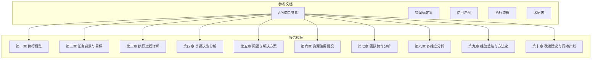
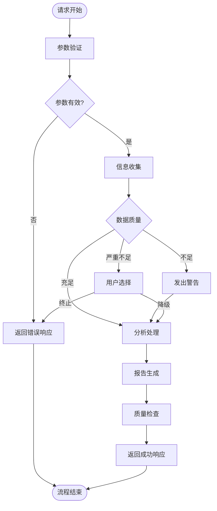
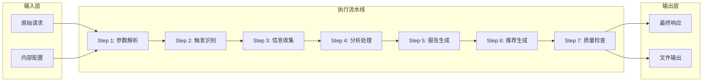
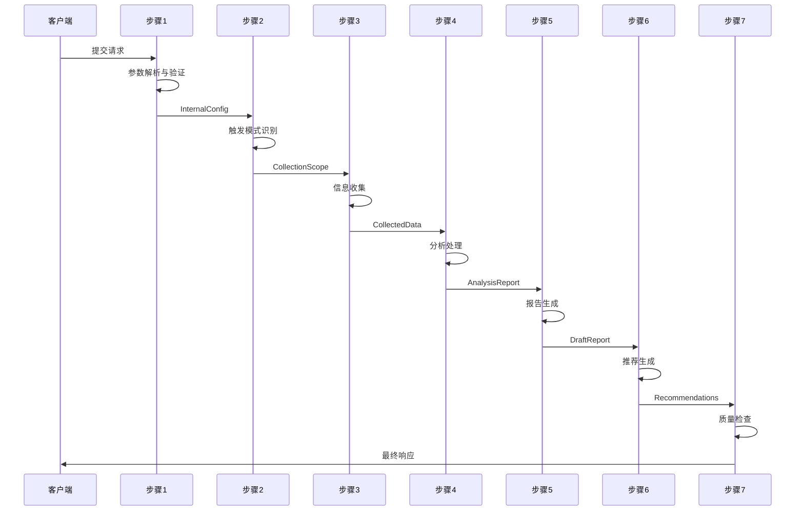
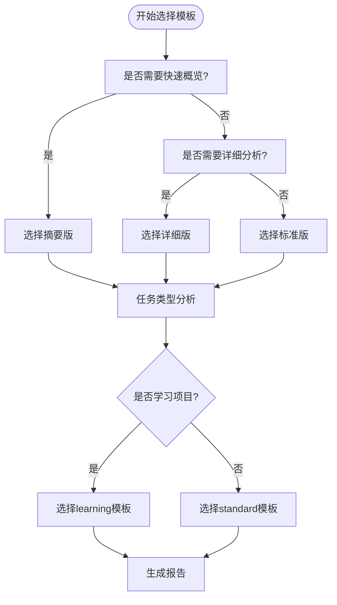
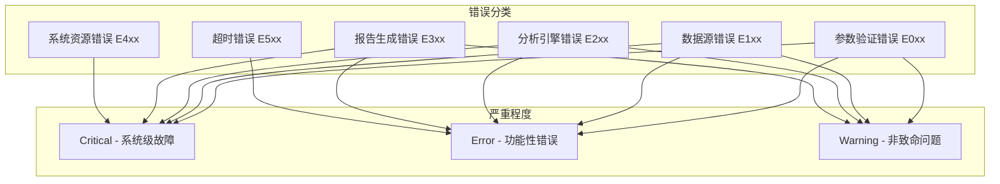
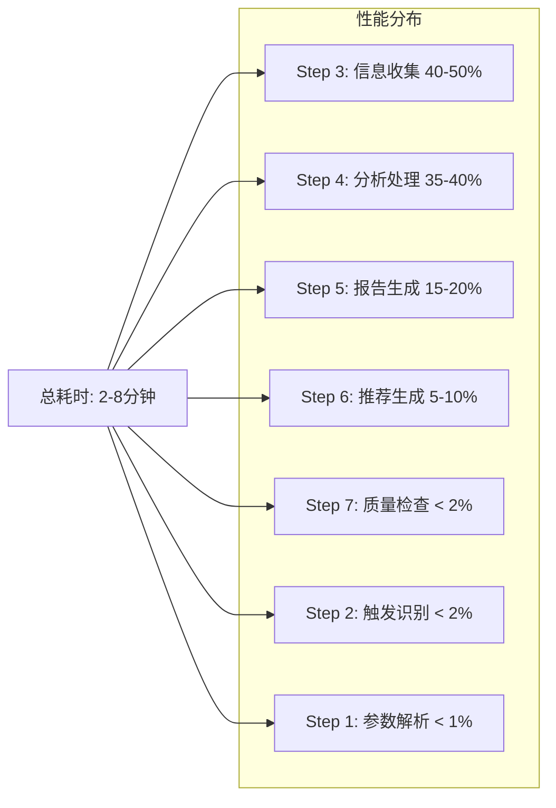
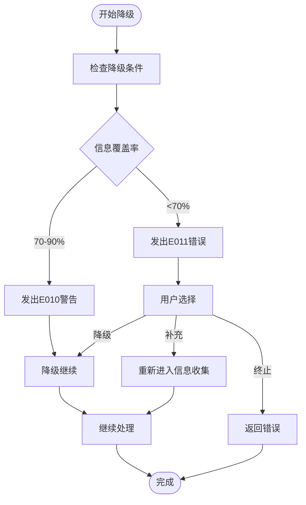

# 报告模板系统

<cite>
**本文档引用的文件**
- [api-reference.md](file://references/api-reference.md)
- [error-codes.md](file://references/error-codes.md)
- [examples-v2.md](file://references/examples-v2.md)
- [execution-flow.md](file://references/execution-flow.md)
- [terminology.md](file://references/terminology.md)
</cite>

## 目录
1. [简介](#简介)
2. [项目结构](#项目结构)
3. [核心组件](#核心组件)
4. [架构概览](#架构概览)
5. [详细组件分析](#详细组件分析)
6. [依赖关系分析](#依赖关系分析)
7. [性能考量](#性能考量)
8. [故障排除指南](#故障排除指南)
9. [结论](#结论)
10. [附录](#附录)

## 简介
本文件为"任务执行总结报告生成器"的报告模板系统提供全面文档。该系统基于四大核心引擎协同工作：信息收集引擎、分析处理引擎、报告生成引擎和智能推荐引擎。系统支持标准10章报告结构，提供三种详细程度（摘要版、标准版、详细版），两种模板变体（standard和learning），以及多种语言风格选择（professional、casual、academic）。本文档详细说明各章节内容、核心要点、填写指南，并提供模板选择决策框架和自定义配置最佳实践。

## 项目结构
项目采用文档驱动的参考文档结构，包含以下核心文件：



**图表来源**
- [api-reference.md:1-1378](file://references/api-reference.md#L1-L1378)
- [execution-flow.md:1-1783](file://references/execution-flow.md#L1-L1783)

**章节来源**
- [api-reference.md:1-1378](file://references/api-reference.md#L1-L1378)
- [execution-flow.md:1-1783](file://references/execution-flow.md#L1-L1783)

## 核心组件
系统包含七个核心执行步骤，每个步骤都有明确的输入输出和质量控制机制：

### 执行步骤概览
1. **参数解析与验证** - 验证输入参数的完整性、类型和范围
2. **触发模式识别** - 识别自动/手动/命令行触发模式
3. **信息收集阶段** - 从多源数据中提取任务相关信息
4. **分析处理阶段** - 五维分析（目标达成度、时间效能、资源利用率、问题模式、协作效果）
5. **报告生成阶段** - 模板选择、数据映射、内容填充、格式优化、语言润色
6. **智能推荐生成** - 方法论提炼、改进建议、风险预警
7. **质量检查与输出** - 结构完整性验证、内容准确性抽检、最终响应组装

### 错误处理机制
系统采用分层防御设计，包含参数验证、数据源、分析引擎、报告生成四个层面的错误处理：



**图表来源**
- [execution-flow.md:1470-1584](file://references/execution-flow.md#L1470-L1584)

**章节来源**
- [execution-flow.md:175-1467](file://references/execution-flow.md#L175-L1467)

## 架构概览
系统采用流水线式架构，七个步骤按顺序执行，每个步骤都有明确的职责分离：



**图表来源**
- [execution-flow.md:97-132](file://references/execution-flow.md#L97-L132)

### 数据流架构
系统定义了七种关键数据对象，按顺序传递：



**图表来源**
- [execution-flow.md:100-118](file://references/execution-flow.md#L100-L118)

**章节来源**
- [execution-flow.md:97-1467](file://references/execution-flow.md#L97-L1467)

## 详细组件分析

### 标准10章报告结构详解

#### 第一章：执行概览
**核心要点**：
- 提供任务的全局视图和关键数据
- 包含一句话总结、核心成果、关键数据速览
- 标识Top3亮点和Top3挑战

**填写指南**：
- 使用简洁明了的语言概括任务成果
- 突出最重要的3个成就和3个挑战
- 提供可量化的关键指标

**章节来源**
- [api-reference.md:460-468](file://references/api-reference.md#L460-L468)

#### 第二章：任务背景与目标
**核心要点**：
- 任务背景和初始目标设定
- 目标调整记录和最终成果清单
- 约束条件和假设条件

**填写指南**：
- 详细描述任务启动的背景和动机
- 明确列出所有初始目标和验收标准
- 记录目标演进过程和调整原因

**章节来源**
- [api-reference.md:462-468](file://references/api-reference.md#L462-L468)

#### 第三章：执行过程详解
**核心要点**：
- 任务执行的详细过程记录
- 阶段划分和关键里程碑
- 详细的操作记录和时间线

**填写指南**：
- 按时间顺序记录关键活动
- 标注每个阶段的开始和结束时间
- 详细描述重要决策点和转折点

**章节来源**
- [api-reference.md:462-468](file://references/api-reference.md#L462-L468)

#### 第四章：关键决策分析
**核心要点**：
- 重要决策的详细分析
- 决策依据和备选方案对比
- 决策结果的评估和反思

**填写指南**：
- 详细记录每个重要决策的背景
- 列出所有备选方案及其优缺点
- 说明最终选择的理由和依据

**章节来源**
- [api-reference.md:462-468](file://references/api-reference.md#L462-L468)

#### 第五章：问题与解决方案
**核心要点**：
- 遇到的问题和挑战
- 问题的根本原因分析
- 解决方案的实施过程

**填写指南**：
- 详细描述每个问题的症状和影响
- 进行根因分析，避免表面处理
- 记录解决方案的实施细节和效果

**章节来源**
- [api-reference.md:462-468](file://references/api-reference.md#L462-L468)

#### 第六章：资源使用情况
**核心要点**：
- 人力资源的投入和分配
- 技术栈和工具的使用
- 资源利用效率评估

**填写指南**：
- 详细记录人员投入和职责分工
- 列出使用的技术工具和框架
- 评估资源使用的合理性和效率

**章节来源**
- [api-reference.md:462-468](file://references/api-reference.md#L462-L468)

#### 第七章：团队协作分析
**核心要点**：
- 团队协作的总体效果
- 沟通效率和分工合理性
- 协作中的亮点和待改进项

**填写指南**：
- 评估团队协作的整体表现
- 分析沟通渠道的有效性
- 识别协作中的优势和不足

**章节来源**
- [api-reference.md:462-468](file://references/api-reference.md#L462-L468)

#### 第八章：多维度分析
**核心要点**：
- 目标达成度的详细分析
- 时间效能的深入评估
- 资源利用效率的量化分析
- 问题模式的统计分析

**填写指南**：
- 使用量化指标评估各项表现
- 提供详细的统计数据和图表
- 进行横向对比和趋势分析

**章节来源**
- [api-reference.md:462-468](file://references/api-reference.md#L462-L468)

#### 第九章：经验总结与方法论
**核心要点**：
- 从任务中提炼的经验教训
- 可复用的方法论和最佳实践
- 知识体系的构建和沉淀

**填写指南**：
- 总结成功的经验和失败的教训
- 抽象出可复用的方法论
- 建立知识体系和学习路径

**章节来源**
- [api-reference.md:462-468](file://references/api-reference.md#L462-L468)

#### 第十章：改进建议与行动计划
**核心要点**：
- 基于分析结果的改进建议
- 具体的行动计划和责任分工
- 风险预警和预防措施

**填写指南**：
- 提出具体、可执行的改进建议
- 明确责任人和完成时限
- 识别潜在风险并制定应对措施

**章节来源**
- [api-reference.md:462-468](file://references/api-reference.md#L462-L468)

### 详细程度配置详解

#### 摘要版（summary）
**适用场景**：
- 快速汇报、周报、管理层简报
- 日常站会纪要、项目简要回顾

**内容特点**：
- 第一章完整（执行概览）
- 第十章摘要（改进建议摘要）
- 其他章节仅包含标题和关键数据点

**预期篇幅**：2-3页（500-800字）

**章节来源**
- [api-reference.md:391-403](file://references/api-reference.md#L391-L403)

#### 标准版（standard）
**适用场景**：
- 常规任务复盘、项目文档归档
- 知识分享、月度/季度总结

**内容特点**：
- 完整10章结构
- 标准详细程度的分析
- 标准数量的建议（5-8条）

**预期篇幅**：8-15页（3000-5000字）

**章节来源**
- [api-reference.md:391-409](file://references/api-reference.md#L391-L409)

#### 详细版（detailed）
**适用场景**：
- 复杂项目深度复盘
- 审计需求、培训材料
- 重大故障事后分析

**内容特点**：
- 所有10章完整且深入
- 细粒度原始数据和趋势图表
- 更多方法论和建议（10-15条）
- 完整的附录（代码清单、执行日志、监控数据、通信记录、参考资料索引）

**预期篇幅**：20-30页（8000-15000字）

**章节来源**
- [api-reference.md:391-417](file://references/api-reference.md#L391-L417)

### 模板变体配置详解

#### standard模板
**特点**：
- 标准通用模板（默认）
- 适用于大多数任务类型
- 保持传统的10章结构

**适用场景**：
- 软件开发、项目管理、运维排查、技术研究

**章节来源**
- [api-reference.md:431-436](file://references/api-reference.md#L431-L436)

#### learning模板
**特点**：
- 学习专用模板
- 强调知识掌握、学习方法论、成长路径
- 调整章节角度

**适用场景**：
- 学习项目、课程总结、技能认证备考回顾

**内容调整**：
- 将第七章从"团队协作分析"替换为"学习支持系统"
- 强化第九章（知识体系与方法论沉淀）和第十章（后续学习路线图）
- 增加学习效率评估、技能等级自评等学习特有维度

**章节来源**
- [api-reference.md:431-444](file://references/api-reference.md#L431-L444)

### 语言风格选择指南

#### professional（专业风格）
**特点**：
- 专业、客观、准确
- 使用书面语，技术术语规范
- 适合正式报告、项目归档、对外分享

**适用场景**：
- 商务汇报、技术文档、学术报告、对外展示

**章节来源**
- [api-reference.md:494-498](file://references/api-reference.md#L494-L498)

#### casual（休闲风格）
**特点**：
- 轻松、亲切、易懂
- 适当使用口语化表达
- 适合团队内部交流、个人笔记、非正式场合

**适用场景**：
- 团队内部分享、学习笔记、非正式汇报

**章节来源**
- [api-reference.md:494-498](file://references/api-reference.md#L494-L498)

#### academic（学术风格）
**特点**：
- 严谨、学术化，引用规范
- 逻辑严密，论证充分
- 适合研究报告、论文支撑材料、学术交流

**适用场景**：
- 学术论文、研究报告、教学材料

**章节来源**
- [api-reference.md:494-498](file://references/api-reference.md#L494-L498)

### 输出格式规范

#### markdown格式
**特点**：
- 结构化标记，层次清晰
- 广泛支持的开放格式
- 可直接渲染为HTML/PDF
- 适合Git版本控制
- 支持代码高亮和表格

**适用场景**：
- 大多数技术文档和报告
- 需要版本控制的文档

**章节来源**
- [api-reference.md:541-555](file://references/api-reference.md#L541-L555)

#### json格式
**特点**：
- 便于程序化处理和数据分析
- 可轻松转换为其他格式
- 支持字段选择性提取
- 不适合直接人工阅读
- 文件体积相对较大

**适用场景**：
- 数据分析和二次处理
- 系统集成和自动化工作流

**章节来源**
- [api-reference.md:556-562](file://references/api-reference.md#L556-L562)

#### html格式
**特点**：
- 可直接在浏览器中打开查看
- 内置CSS样式，视觉效果好
- 适合分享和非技术人员阅读
- 不利于版本控制
- 编辑需要HTML知识

**适用场景**：
- 在线展示和分享
- 非技术受众阅读

**章节来源**
- [api-reference.md:563-569](file://references/api-reference.md#L563-L569)

### 模板定制选项

#### 章节选择
**included_chapters**：
- 仅包含指定的章节
- 有效范围：1-10
- 至少保留第1章、第9章、第10章

**excluded_chapters**：
- 排除指定的章节
- 不能同时排除所有章节
- included_chapters和excluded_chapters不能同时使用

**章节建议保留程度**：
- 第1章：★★★★★ 必须
- 第2章：★★★★☆ 推荐
- 第3章：★★★★☆ 推荐
- 第4章：★★★☆☆ 可选
- 第5章：★★★★★ 必须
- 第6章：★★★☆☆ 可选
- 第7章：★★☆☆☆ 可选（多人任务时建议包含）
- 第8章：★★★★☆ 推荐
- 第9章：★★★★★ 必须
- 第10章：★★★★★ 必须

**章节来源**
- [api-reference.md:450-485](file://references/api-reference.md#L450-L485)

#### focus_dimensions（专注维度）
**可选值**：
- goal_achievement：目标达成度
- time_efficiency：时间管理效能
- resource_utilization：资源利用效率
- problem_patterns：问题解决模式
- collaboration：协作效果

**使用场景**：
- 重点关注特定维度的深度分析
- 其他维度进行简化处理

**约束条件**：
- 最多指定5个维度（即全部）
- 最少1个维度

**章节来源**
- [api-reference.md:505-533](file://references/api-reference.md#L505-L533)

### 文件命名规范

#### 自动生成命名规则
```
task-summary-[任务名称简写]-YYYYMMDD-HHmmss.[ext]
```

**示例**：
- task-summary-payment-refactor-20260409.md
- task-summary-sprint24-review-20260409-143022.json

#### 自定义命名规则
- 必须是有效的文件路径
- 父目录必须存在或可创建
- 文件扩展名应与output_format匹配
- 支持自定义目录结构

**章节来源**
- [api-reference.md:624-633](file://references/api-reference.md#L624-L633)

### 模板选择决策框架

#### 选择流程图



**图表来源**
- [api-reference.md:384-448](file://references/api-reference.md#L384-L448)

#### 详细程度选择矩阵

| 场景类型 | 详细程度 | 章节选择 | 语言风格 | 输出格式 |
|---------|---------|---------|---------|---------|
| 快速汇报 | summary | 第1、10章 | professional/casual | markdown |
| 常规复盘 | standard | 全部章节 | professional | markdown/json |
| 深度分析 | detailed | 全部章节+附录 | professional | markdown/html |
| 学习总结 | learning | 第1-10章 | professional | markdown |
| 系统集成 | standard | 全部章节 | professional | json |
| 对外展示 | standard | 全部章节 | professional | html |

**章节来源**
- [api-reference.md:384-586](file://references/api-reference.md#L384-L586)

### 自定义配置最佳实践

#### 参数验证最佳实践
1. **必填参数优先**：确保task_name、task_type等关键参数完整
2. **参数范围控制**：使用合理的枚举值和数值范围
3. **类型匹配验证**：确保参数类型与预期一致
4. **逻辑一致性检查**：避免参数间的冲突和矛盾

#### 章节定制最佳实践
1. **保留核心章节**：至少包含第1、5、9、10章
2. **平衡信息密度**：避免过度简化或过度详细
3. **考虑读者需求**：根据受众调整详细程度
4. **保持结构完整性**：确保章节间的逻辑连贯性

#### 输出配置最佳实践
1. **格式选择策略**：
   - 技术文档：markdown
   - 系统集成：json
   - 在线展示：html
2. **文件管理策略**：
   - 版本控制：使用markdown格式
   - 系统集成：使用json格式
   - 分享展示：使用html格式
3. **命名规范**：遵循统一的命名约定

**章节来源**
- [examples-v2.md:691-769](file://references/examples-v2.md#L691-L769)

## 依赖关系分析

### 错误码体系
系统采用统一的错误码管理体系，按类别和严重程度进行分类：



**图表来源**
- [error-codes.md:152-162](file://references/error-codes.md#L152-L162)

### 关键性能指标
系统在不同阶段的性能特征如下：



**图表来源**
- [execution-flow.md:147-158](file://references/execution-flow.md#L147-L158)

**章节来源**
- [error-codes.md:152-171](file://references/error-codes.md#L152-L171)
- [execution-flow.md:142-170](file://references/execution-flow.md#L142-L170)

## 性能考量
系统性能受以下因素影响：

### 性能影响因素
1. **对话轮数**：影响信息收集阶段的处理时间
2. **详细程度**：详细程度越高，处理时间越长
3. **数据量**：任务复杂度和数据量直接影响处理时间
4. **模板选择**：不同模板变体的处理复杂度不同

### 性能优化建议
1. **合理选择详细程度**：根据需求选择合适的详细程度
2. **优化参数配置**：避免不必要的参数组合
3. **批量处理**：对相似任务进行批量处理
4. **缓存策略**：对重复使用的模板和配置进行缓存

## 故障排除指南

### 常见错误类型及处理

#### 参数验证错误（E001-E005）
**触发条件**：
- 缺少必填参数
- 参数类型错误
- 参数值越界
- 参数冲突
- 安全策略违规

**处理策略**：
- 立即返回错误响应
- 提供具体的修复建议
- 指导用户如何修正参数

**章节来源**
- [error-codes.md:177-320](file://references/error-codes.md#L177-L320)

#### 数据质量错误（E010-E012）
**触发条件**：
- 信息覆盖不足（70-90%）
- 信息严重缺失（<70%）
- 数据源不可用

**处理策略**：
- E010：发出警告，降级继续
- E011：提供用户选择（降级/补充/终止）
- E012：尝试备用数据源或终止

**章节来源**
- [error-codes.md:560-779](file://references/error-codes.md#L560-L779)

#### 分析引擎错误（E021-E022）
**触发条件**：
- 部分分析失败
- 核心分析引擎错误

**处理策略**：
- E021：跳过该维度，其他维度正常输出
- E022：激活简化分析模式

**章节来源**
- [error-codes.md:173-200](file://references/error-codes.md#L173-L200)

#### 报告生成错误（E031-E032）
**触发条件**：
- 模板渲染失败
- 内容生成失败

**处理策略**：
- E031：回退到备用模板
- E032：使用已有数据直接组装

**章节来源**
- [error-codes.md:173-200](file://references/error-codes.md#L173-L200)

### 降级执行机制
系统支持多种降级策略：



**图表来源**
- [execution-flow.md:1522-1535](file://references/execution-flow.md#L1522-L1535)

**章节来源**
- [execution-flow.md:1522-1584](file://references/execution-flow.md#L1522-L1584)

## 结论
报告模板系统通过标准化的10章结构、灵活的详细程度配置、多样化的模板变体和语言风格选择，为不同场景下的任务执行总结提供了全面的解决方案。系统采用分层防御的错误处理机制和优雅降级策略，确保在各种情况下都能提供有价值的输出。通过合理的模板选择和参数配置，用户可以根据具体需求生成高质量的报告，实现知识沉淀和经验传承。

## 附录

### 术语表
系统包含86个专业术语，涵盖任务执行、目标评估、时间效率、问题风险、资源协作、报告结构、项目管理、软件开发、学习方法论和质量改进等十个类别。

**章节来源**
- [terminology.md:1-1104](file://references/terminology.md#L1-L1104)

### 使用示例
系统提供四个完整的使用示例，涵盖正常调用、最小参数调用、参数错误和数据不足等典型场景，为用户理解和使用系统提供了直观的参考。

**章节来源**
- [examples-v2.md:1-769](file://references/examples-v2.md#L1-L769)

### API接口参考
完整的API接口规范，包括输入参数定义、输出响应格式、参数验证规则和调用示例，为系统集成和自动化开发提供了详细的技术规范。

**章节来源**
- [api-reference.md:1-1378](file://references/api-reference.md#L1-L1378)