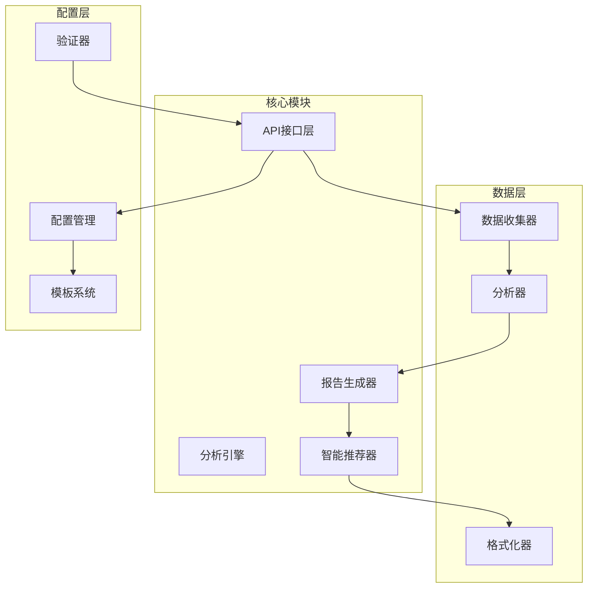
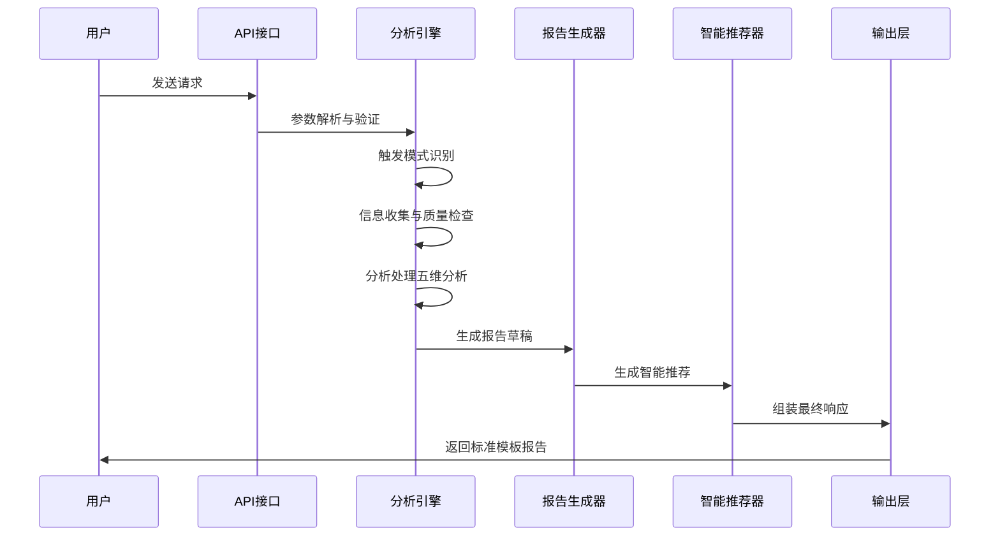
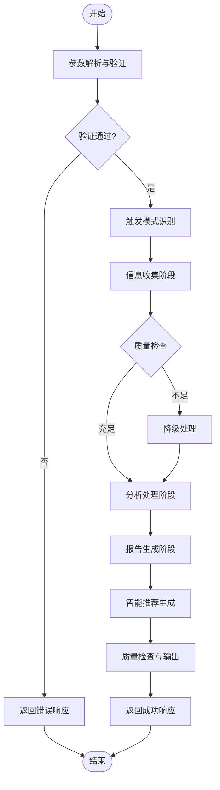
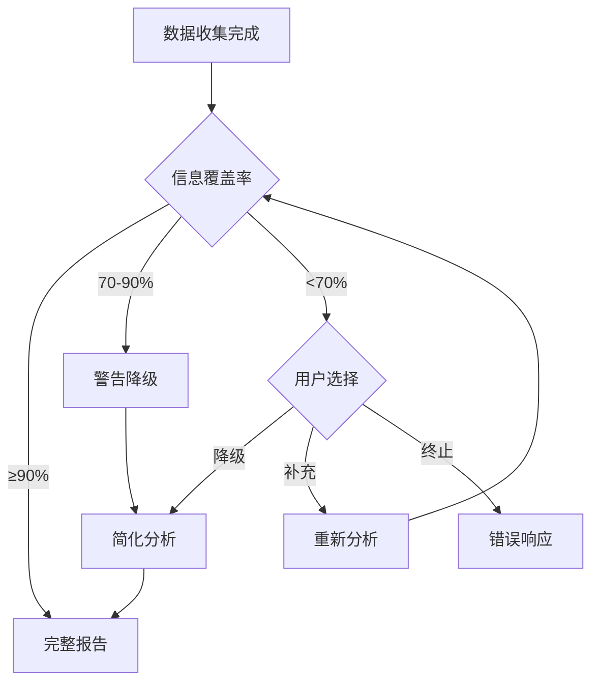
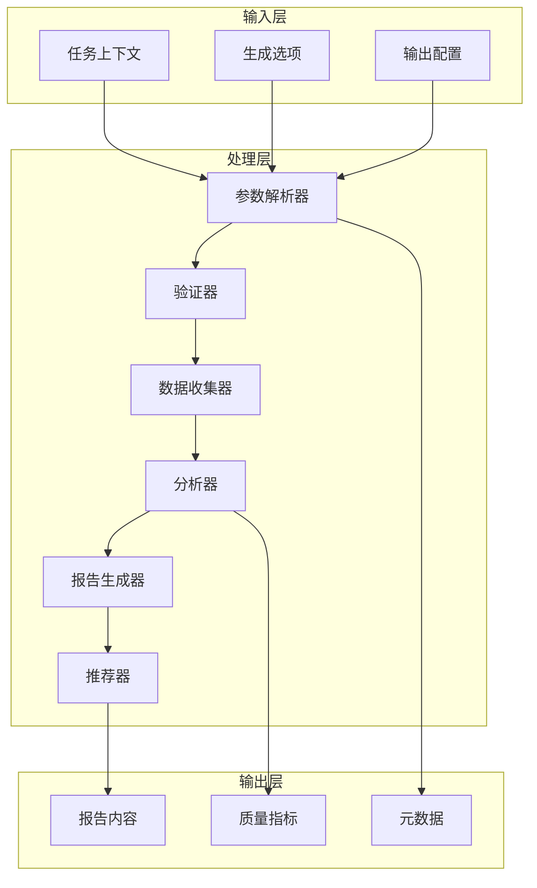
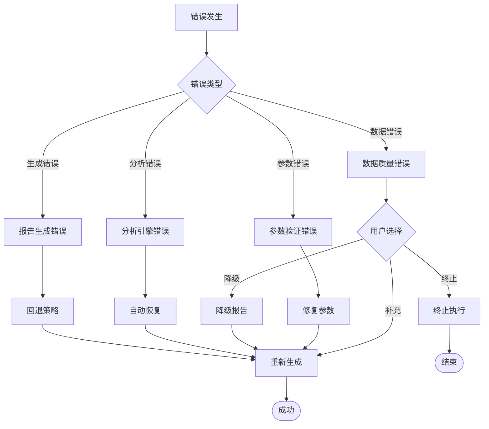

# 标准模板详解

<cite>
**本文档引用的文件**
- [api-reference.md](file://references/api-reference.md)
- [error-codes.md](file://references/error-codes.md)
- [examples-v2.md](file://references/examples-v2.md)
- [execution-flow.md](file://references/execution-flow.md)
- [terminology.md](file://references/terminology.md)
</cite>

## 目录
1. [简介](#简介)
2. [项目结构](#项目结构)
3. [核心组件](#核心组件)
4. [架构概览](#架构概览)
5. [详细组件分析](#详细组件分析)
6. [依赖分析](#依赖分析)
7. [性能考虑](#性能考虑)
8. [故障排除指南](#故障排除指南)
9. [结论](#结论)
10. [附录](#附录)

## 简介

标准模板是"任务执行总结报告生成器"技能的核心输出格式，专为软件开发、项目管理、运维排查、技术研究和学习成长等五大任务类型设计。该模板采用完整的10章结构，确保报告的系统性和完整性。

### 模板适用场景

标准模板适用于以下典型场景：
- **软件开发任务**：功能开发完成、Bug修复、技术重构
- **项目管理任务**：Sprint结束、里程碑达成、项目收尾  
- **运维排查任务**：故障处理、性能优化、安全加固
- **技术研究任务**：技术选型、POC验证、架构设计
- **学习成长任务**：课程学习、技能培训、认证备考

### 模板核心特点

- **结构化输出**：10个标准化章节，确保分析维度的完整性
- **多维度分析**：目标达成度、时间效能、资源利用率、问题模式、协作效果
- **智能降级**：在数据不足时自动降级，保证报告可用性
- **质量保障**：内置质量检查机制，提供质量评分和改进建议

## 项目结构

该项目采用模块化设计，包含以下核心组件：



**图表来源**
- [execution-flow.md:100-132](file://references/execution-flow.md#L100-L132)
- [api-reference.md:64-69](file://references/api-reference.md#L64-L69)

### 文件组织结构

项目采用按功能模块划分的文件组织方式：

- **references/**：核心参考文档
  - api-reference.md：API接口规范
  - error-codes.md：错误码定义
  - examples-v2.md：使用示例
  - execution-flow.md：执行流程
  - terminology.md：术语表

- **evals/**：评估和测试文件
  - 包含各种评估场景和测试用例

**章节来源**
- [execution-flow.md:1-25](file://references/execution-flow.md#L1-L25)

## 核心组件

### 10章结构详解

标准模板包含完整的10个章节，每个章节都有明确的内容要求和质量标准：

#### 第一章：执行概览
- **核心内容**：任务基本信息、核心成果总结、关键数据速览
- **填写要点**：一句话总结、Top3亮点、Top3挑战
- **数据要求**：目标达成率、耗时统计、问题数量
- **质量标准**：1-2分钟可读性、数据准确性、语言专业性

#### 第二章：任务背景与目标  
- **核心内容**：任务背景、初始目标、目标演进、约束条件
- **填写要点**：SMART原则、目标分解、约束分析
- **数据要求**：目标清单、变更记录、验收标准
- **质量标准**：逻辑完整性、可衡量性、可达成性

#### 第三章：执行过程详解
- **核心内容**：阶段划分、详细记录、决策索引
- **填写要点**：时间线、关键节点、里程碑
- **数据要求**：阶段统计、时间分配、活动清单
- **质量标准**：过程完整性、时间准确性、逻辑连贯性

#### 第四章：关键决策分析
- **核心内容**：决策清单、决策详情、决策依据
- **填写要点**：备选方案对比、选择理由、影响评估
- **数据要求**：决策记录、时间戳、相关证据
- **质量标准**：决策完整性、分析深度、可追溯性

#### 第五章：问题与解决方案
- **核心内容**：问题总览、问题详情、模式分析
- **填写要点**：问题分类、解决过程、经验教训
- **数据要求**：问题清单、解决记录、根因分析
- **质量标准**：问题完整性、解决有效性、模式识别

#### 第六章：资源使用情况
- **核心内容**：人力资源、技术栈、工具与服务、效率评估
- **填写要点**：资源分配、使用效率、成本分析
- **数据要求**：人员统计、工具清单、使用记录
- **质量标准**：资源完整性、效率评估、成本合理性

#### 第七章：团队协作分析
- **核心内容**：协作概况、效能评估、亮点与问题
- **填写要点**：沟通效率、分工合理性、协同效果
- **数据要求**：参与者信息、沟通记录、协作统计
- **质量标准**：协作完整性、评估客观性、改进建议

#### 第八章：多维度分析
- **核心内容**：目标达成、时间效能、资源效率、问题模式、雷达图
- **填写要点**：五维分析、指标对比、趋势分析
- **数据要求**：量化指标、对比数据、统计分析
- **质量标准**：分析深度、数据准确性、洞察价值

#### 第九章：经验总结与方法论
- **核心内容**：方法论提炼、最佳实践、知识图谱、成长记录
- **填写要点**：成功要素、方法论抽象、知识沉淀
- **数据要求**：成功案例、实践总结、知识清单
- **质量标准**：方法论可复用性、实践指导性、知识完整性

#### 第十章：改进建议与行动计划
- **核心内容**：建议、行动计划、风险预警
- **填写要点**：SMART建议、优先级排序、风险评估
- **数据要求**：建议清单、行动计划、风险清单
- **质量标准**：建议可行性、行动可操作性、风险可控性

**章节来源**
- [execution-flow.md:921-1146](file://references/execution-flow.md#L921-L1146)
- [api-reference.md:398-417](file://references/api-reference.md#L398-L417)

### 模板变体与详细程度

标准模板提供三种详细程度：

#### 摘要版（summary）
- **适用场景**：快速汇报、周报、管理层简报
- **篇幅**：2-3页（500-800字）
- **包含内容**：第一章完整 + 第十章摘要 + 其他章节仅标题和数据点
- **特点**：精简高效、重点突出

#### 标准版（standard）【默认推荐】
- **适用场景**：常规任务复盘、项目文档归档
- **篇幅**：8-15页（3000-5000字）
- **包含内容**：完整10章结构，标准详细程度分析
- **特点**：结构完整、内容翔实

#### 详细版（detailed）
- **适用场景**：复杂项目深度复盘、审计需求
- **篇幅**：20-30页（8000-15000字）
- **包含内容**：所有10章完整且深入，细粒度数据和图表
- **特点**：极度详尽、数据丰富

**章节来源**
- [api-reference.md:391-417](file://references/api-reference.md#L391-L417)

## 架构概览

### 执行流程架构

标准模板的生成采用七步执行流程，确保报告质量的一致性和可靠性：



**图表来源**
- [execution-flow.md:175-196](file://references/execution-flow.md#L175-L196)
- [execution-flow.md:1474-1485](file://references/execution-flow.md#L1474-L1485)

### 数据流架构



**图表来源**
- [execution-flow.md:1470-1599](file://references/execution-flow.md#L1470-L1599)

## 详细组件分析

### 参数配置系统

标准模板的生成依赖于完善的参数配置系统，确保报告的个性化和质量。

#### 任务上下文配置

任务上下文是报告生成的核心输入，包含以下关键字段：

| 字段名称 | 类型 | 必填 | 默认值 | 描述 |
|---------|------|------|--------|------|
| task_name | string | 是 | 无 | 任务名称或标题 |
| task_type | enum | 否 | "auto-detect" | 任务类型分类 |
| time_range | object | 否 | 自动提取 | 任务执行时间范围 |
| description | string | 否 | 自动摘要 | 任务简要描述 |
| participants | array | 否 | [] | 参与人员列表 |
| context_data | object | 否 | {} | 额外上下文数据 |

**章节来源**
- [api-reference.md:185-376](file://references/api-reference.md#L185-L376)

#### 生成选项配置

生成选项控制报告的详细程度、模板选择和内容定制：

| 选项名称 | 类型 | 默认值 | 描述 |
|---------|------|--------|------|
| detail_level | enum | "standard" | 报告详细程度 |
| template_variant | enum | "standard" | 模板变体选择 |
| included_chapters | array | 全部章节 | 包含的章节列表 |
| language_style | enum | "professional" | 语言风格 |
| focus_dimensions | array | 全部维度 | 重点关注的分析维度 |

**章节来源**
- [api-reference.md:380-586](file://references/api-reference.md#L380-L586)

#### 输出配置系统

输出配置确保报告能够满足不同的存储和分享需求：

| 配置项 | 类型 | 默认值 | 描述 |
|-------|------|--------|------|
| save_to_file | boolean | true | 是否保存到文件 |
| file_path | string | 自动生成 | 报告保存路径 |
| include_metadata | boolean | true | 是否包含元数据 |
| encoding | enum | "utf-8" | 文件编码格式 |
| custom_header | string | 空 | 自定义头部内容 |

**章节来源**
- [api-reference.md:590-714](file://references/api-reference.md#L590-L714)

### 质量控制机制

标准模板内置多层次的质量控制机制，确保报告的可靠性和一致性。

#### 质量检查指标

| 指标类别 | 检查内容 | 评分标准 | 影响程度 |
|---------|---------|---------|---------|
| 结构完整性 | 10章齐全、章节格式正确 | 100分制 | 高 |
| 数据准确性 | 数字一致性、逻辑自洽性 | 100分制 | 高 |
| 内容完整性 | 关键信息覆盖度 | 100分制 | 中 |
| 语言质量 | 专业性、清晰性、准确性 | 100分制 | 中 |
| 建议质量 | 可操作性、优先级、量化预期 | 100分制 | 低 |

#### 质量降级机制

当数据不足时，系统采用智能降级策略：



**图表来源**
- [execution-flow.md:627-649](file://references/execution-flow.md#L627-L649)

**章节来源**
- [execution-flow.md:1336-1467](file://references/execution-flow.md#L1336-L1467)

### 智能推荐系统

标准模板不仅提供报告内容，还包含智能化的改进建议和方法论提炼。

#### 方法论提取流程


**图表来源**
- [execution-flow.md:1185-1215](file://references/execution-flow.md#L1185-L1215)

#### 建议生成算法

建议生成采用多因子评分算法：

| 因子 | 权重 | 评估标准 | 评分范围 |
|------|------|---------|---------|
| 影响程度 | 35% | 对目标的影响大小 | 1-10分 |
| 紧迫程度 | 25% | 解决的紧急性 | 1-10分 |
| 实施难度 | 20% | 反向评分（易=高分） | 1-10分 |
| 确信度 | 20% | 对效果的把握程度 | 1-10分 |

**章节来源**
- [execution-flow.md:1216-1266](file://references/execution-flow.md#L1216-L1266)

## 依赖分析

### 组件耦合关系

标准模板的各个组件之间存在紧密的依赖关系：



**图表来源**
- [execution-flow.md:286-301](file://references/execution-flow.md#L286-L301)

### 数据依赖关系

各章节之间存在明确的依赖关系：

| 章节 | 前置依赖 | 依赖关系 | 说明 |
|------|---------|---------|------|
| 第一章 | 无 | 基础概览 | 独立完整 |
| 第二章 | 第一章 | 背景支撑 | 目标设定基础 |
| 第三章 | 第二章 | 过程记录 | 执行过程基础 |
| 第四章 | 第三章 | 决策依据 | 关键决策基础 |
| 第五章 | 第三章 | 问题记录 | 问题解决基础 |
| 第六章 | 第三章 | 资源使用 | 资源分析基础 |
| 第七章 | 第三章 | 团队协作 | 协作效果基础 |
| 第八章 | 第二章-第七章 | 综合分析 | 多维分析基础 |
| 第九章 | 第八章 | 方法论提炼 | 经验总结基础 |
| 第十章 | 第八章 | 改进建议 | 行动计划基础 |

**章节来源**
- [api-reference.md:460-474](file://references/api-reference.md#L460-L474)

## 性能考虑

### 执行性能基线

标准模板的生成性能在不同场景下有明确的基线：

| 场景类型 | 步骤占比 | 总耗时范围 | 主要影响因素 |
|---------|---------|-----------|-------------|
| 标准版报告 | 40-50% | 2-8分钟 | 对话轮数、详细程度 |
| 摘要版报告 | 35-40% | 1-4分钟 | 参数完整性、数据量 |
| 详细版报告 | 50-60% | 4-12分钟 | 分析深度、数据丰富度 |
| 降级报告 | 40-50% | 1-6分钟 | 数据覆盖率、降级策略 |

### 性能优化策略

1. **参数预验证**：在Step 1中进行参数完整性检查，避免无效请求
2. **智能降级**：在数据不足时自动降级，保证响应时间
3. **并行处理**：多数据源并行收集和分析
4. **缓存机制**：常用模板和配置的缓存使用

**章节来源**
- [execution-flow.md:142-170](file://references/execution-flow.md#L142-L170)

## 故障排除指南

### 常见错误类型

标准模板系统包含完整的错误处理机制：

#### 参数验证错误 (E001-E005)

| 错误码 | 错误名称 | 触发条件 | 处理方式 |
|-------|---------|---------|---------|
| E001 | 缺少必填参数 | 必填参数未提供 | 返回错误，提示补充 |
| E002 | 参数类型错误 | 类型不符合要求 | 返回错误，给出正确格式 |
| E003 | 参数值越界 | 值超出允许范围 | 自动修正并发出警告 |
| E004 | 参数冲突 | 参数间存在矛盾 | 返回错误，指出冲突对 |
| E005 | 安全策略违规 | 包含非法内容 | 返回错误，拒绝处理 |

#### 数据质量错误 (E010-E012)

| 错误码 | 错误名称 | 触发条件 | 处理方式 |
|-------|---------|---------|---------|
| E010 | 信息覆盖不足 | 综合覆盖率70-90% | 标注缺失项，降级继续 |
| E011 | 信息严重缺失 | 综合覆盖率<70% | 用户选择：降级/补充/终止 |
| E012 | 数据源不可用 | 关键数据源无法访问 | 尝试备用源或终止 |

#### 分析引擎错误 (E021-E022)

| 错误码 | 错误名称 | 触发条件 | 处理方式 |
|-------|---------|---------|---------|
| E021 | 部分分析失败 | 某维度数据不足 | 跳过该维度，其他正常输出 |
| E022 | 核心分析引擎错误 | 分析引擎异常 | 回退到简化分析模式 |

#### 报告生成错误 (E031-E032)

| 错误码 | 错误名称 | 触发条件 | 处理方式 |
|-------|---------|---------|---------|
| E031 | 模板渲染失败 | 模板引擎异常 | 回退到备用模板 |
| E032 | 内容生成失败 | 内容生成器异常 | 使用已有数据直接组装 |

**章节来源**
- [error-codes.md:173-557](file://references/error-codes.md#L173-L557)

### 故障诊断流程



**图表来源**
- [error-codes.md:1470-1599](file://references/error-codes.md#L1470-L1599)

## 结论

标准模板作为"任务执行总结报告生成器"的核心输出格式，具有以下显著优势：

### 核心价值

1. **完整性保障**：10章结构确保分析维度的全面性
2. **质量控制**：多层质量检查机制保证报告质量
3. **智能降级**：在数据不足时保证报告可用性
4. **个性化定制**：支持多种模板变体和详细程度
5. **智能推荐**：提供可操作的改进建议和方法论

### 最佳实践建议

1. **参数配置**：提供完整的任务上下文信息
2. **数据质量**：保持详细的对话记录和操作日志
3. **模板选择**：根据使用场景选择合适的模板变体
4. **质量监控**：关注质量评分和警告信息
5. **持续改进**：基于报告建议持续优化工作流程

### 适用场景总结

标准模板最适合以下场景：
- **日常任务复盘**：使用标准版模板进行常规总结
- **重要项目回顾**：使用详细版模板进行深度分析
- **快速汇报**：使用摘要版模板进行高层汇报
- **知识沉淀**：使用学习模板进行经验总结

通过遵循本文档的指导原则和最佳实践，用户可以充分发挥标准模板的价值，生成高质量的任务执行总结报告。

## 附录

### 版本管理规范

标准模板遵循语义化版本控制：

- **主版本号**：不兼容的API变更
- **次版本号**：向后兼容的功能新增  
- **修订号**：向后兼容的问题修复

### 输出格式规范

标准模板支持多种输出格式：

| 格式类型 | 文件扩展名 | 适用场景 | 特点 |
|---------|-----------|---------|------|
| Markdown | .md | 默认格式 | 结构清晰、广泛支持 |
| JSON | .json | 程序化处理 | 结构化数据、便于解析 |
| HTML | .html | 浏览器查看 | 美观展示、易于分享 |

### 元信息配置

标准模板包含完整的元信息配置：

```yaml
---
name: task-execution-summary
version: 1.0
template_type: standard
generated_by: Task Execution Summary Generator v1.0
task_name: 示例任务
generated_at: 2026-04-09T14:30:00+08:00
---
```

**章节来源**
- [api-reference.md:634-652](file://references/api-reference.md#L634-L652)