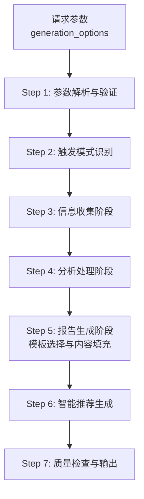
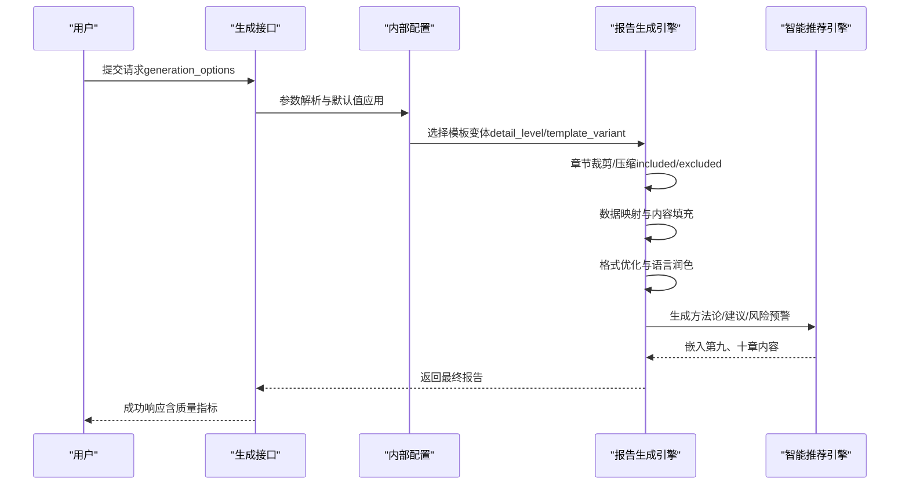
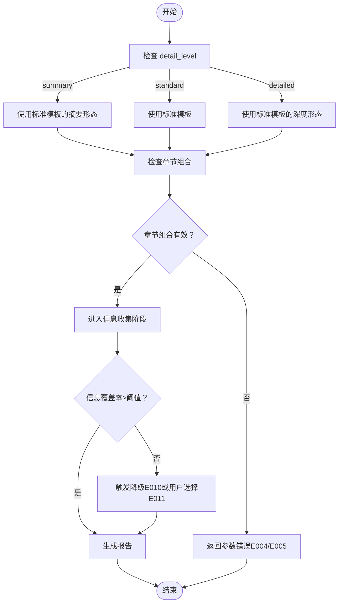

# 模板变体对比

<cite>
**本文档引用的文件**
- [examples-v2.md](file://references/examples-v2.md)
- [api-reference.md](file://references/api-reference.md)
- [execution-flow.md](file://references/execution-flow.md)
- [error-codes.md](file://references/error-codes.md)
- [terminology.md](file://references/terminology.md)
</cite>

## 目录
1. [简介](#简介)
2. [项目结构](#项目结构)
3. [核心组件](#核心组件)
4. [架构总览](#架构总览)
5. [详细组件分析](#详细组件分析)
6. [依赖分析](#依赖分析)
7. [性能考量](#性能考量)
8. [故障排查指南](#故障排查指南)
9. [结论](#结论)
10. [附录](#附录)

## 简介
本文件围绕“任务执行总结报告生成器”的三种模板变体（快速摘要版、标准版、详细深度版）进行全面对比，帮助用户根据任务复杂度、时间投入和报告目的选择合适的模板变体，并提供生成命令、使用示例与质量检查要点。

## 项目结构
本仓库与模板变体相关的核心文档集中在 references 目录：
- examples-v2.md：包含四种典型使用场景（标准调用、最小参数调用、参数错误、降级执行），并明确展示了三种详细程度（summary/standard/detailed）与模板变体（standard/learning）的组合效果与差异。
- api-reference.md：定义 generation_options 中 detail_level、template_variant 等关键参数，明确三种详细程度的篇幅与内容深度预期。
- execution-flow.md：描述从参数解析到报告生成的完整流程，其中 Step 5 的模板选择与内容填充直接决定了三种变体的呈现。
- error-codes.md：定义 E010 等与数据质量相关的错误码，解释降级机制与质量影响。
- terminology.md：提供“报告模板”“摘要版”等术语定义，便于理解变体间的差异。

**图表来源**
- [execution-flow.md: 921-1175:921-1175](file://references/execution-flow.md#L921-L1175)

**章节来源**
- [execution-flow.md: 921-1175:921-1175](file://references/execution-flow.md#L921-L1175)

## 核心组件
- 详细程度（detail_level）
  - summary：快速摘要版，仅核心章节完整，其他章节仅标题与关键数据点，篇幅约 500-800 字。
  - standard：标准版，完整10章，标准详细程度，篇幅约 3000-5000 字。
  - detailed：详细深度版，完整10章且深入展开，包含更多图表与细分数据，篇幅约 8000-15000 字。
- 模板变体（template_variant）
  - standard：标准通用模板（默认），适用于大多数任务类型。
  - learning：学习专用模板，强调知识掌握、学习方法论与成长路径，调整章节角度与侧重点。
- 章节定制（included_chapters/excluded_chapters）
  - 可按需裁剪章节，但需保留基础章节（如第1、9、10章）。
- 输出格式（output_format）
  - markdown、json、html，分别适用于渲染、程序化处理与直接浏览。

**章节来源**
- [api-reference.md: 384-586:384-586](file://references/api-reference.md#L384-L586)
- [execution-flow.md: 966-1060:966-1060](file://references/execution-flow.md#L966-L1060)

## 架构总览
模板变体的差异主要体现在 Step 5 的“模板选择与内容填充”阶段：
- 根据 detail_level 选择对应模板变体（summary→标准模板的摘要形态；standard→标准模板；detailed→标准模板的深度形态）。
- 结合 included_chapters/excluded_chapters 对章节进行裁剪或压缩。
- 将分析结果映射到模板字段，生成草稿报告，再进行格式优化与语言润色。

**图表来源**
- [execution-flow.md: 921-1175:921-1175](file://references/execution-flow.md#L921-L1175)

**章节来源**
- [execution-flow.md: 921-1175:921-1175](file://references/execution-flow.md#L921-L1175)

## 详细组件分析

### 快速摘要版（summary）
- 特点
  - 仅第一章完整，第十章为摘要；其他章节仅保留标题与关键数据点。
  - 篇幅短、重点突出、便于快速浏览与高层汇报。
- 适用场景
  - 日常站会纪要、周报、管理层简报、快速回顾。
- 数据要求
  - 至少包含任务基本信息、核心成果与关键数据速览。
- 输出格式
  - 默认 markdown，亦可按需切换为 json/html。
- 生成命令与示例
  - 参考示例：最小参数调用（示例2）展示了仅提供 task_name 的场景，系统默认 detail_level 为 standard；若需摘要版，需显式设置 detail_level 为 summary。
- 质量检查要点
  - 关注信息覆盖率是否满足摘要版要求，避免关键数据缺失导致解读困难。

**章节来源**
- [api-reference.md: 391-418:391-418](file://references/api-reference.md#L391-L418)
- [examples-v2.md: 168-276:168-276](file://references/examples-v2.md#L168-L276)

### 标准版（standard）
- 特点
  - 完整10章结构，标准详细程度的分析，标准数量的建议。
  - 篇幅约 3000-5000 字，结构完整、内容翔实、分析深入。
- 适用场景
  - 常规任务复盘、项目文档归档、知识分享、月度/季度总结。
- 数据要求
  - 需要较为完整的对话历史与任务执行记录，以支撑目标达成度、时间效能、资源利用、问题模式、协作效果等多维分析。
- 输出格式
  - 默认 markdown，亦可按需切换为 json/html。
- 生成命令与示例
  - 参考示例：标准调用（示例1）展示了默认 detail_level 为 standard 的完整请求与响应。
- 质量检查要点
  - 关注章节完整性、数据一致性与建议可操作性。

**章节来源**
- [api-reference.md: 391-418:391-418](file://references/api-reference.md#L391-L418)
- [examples-v2.md: 29-166:29-166](file://references/examples-v2.md#L29-L166)

### 详细深度版（detailed）
- 特点
  - 完整10章且深入展开，包含更多图表与细分数据，详尽的问题解决过程，更多方法论与建议，完整附录。
  - 篇幅约 8000-15000 字，极度详尽、数据丰富、可追溯性强。
- 适用场景
  - 复杂项目深度复盘、审计需求、培训材料、重大故障事后分析。
- 数据要求
  - 需要丰富的对话历史、详细的操作记录、问题排查细节、协作信息等，以支撑深度分析与溯源。
- 输出格式
  - 默认 markdown，亦可按需切换为 json/html。
- 生成命令与示例
  - 参考示例：参数错误（示例3）与降级执行（示例4）展示了在数据不足或参数错误时的处理策略与质量影响。
- 质量检查要点
  - 关注信息覆盖率阈值（如 E010 的 70%/80% 阈值），避免因数据不足导致降级。

**章节来源**
- [api-reference.md: 391-418:391-418](file://references/api-reference.md#L391-L418)
- [examples-v2.md: 278-688:278-688](file://references/examples-v2.md#L278-L688)
- [error-codes.md: 560-669:560-669](file://references/error-codes.md#L560-L669)

### 模板变体与详细程度的关系
- 当 detail_level 为 summary 时，即便 template_variant 为 detailed，系统仍会使用标准模板的摘要形态。
- 当 detail_level 为 detailed 时，即便 template_variant 为 standard，系统仍会使用标准模板的深度形态。
- learning 模板变体主要用于学习项目、课程总结等场景，强调知识掌握与方法论沉淀。

**章节来源**
- [api-reference.md: 424-448:424-448](file://references/api-reference.md#L424-L448)
- [execution-flow.md: 966-996:966-996](file://references/execution-flow.md#L966-L996)

## 依赖分析
- 参数依赖
  - detail_level 与 template_variant 的组合决定最终模板形态。
  - included_chapters/excluded_chapters 与 detail_level 存在约束关系，需满足章节完整性要求。
- 数据依赖
  - 详细程度越高，对对话历史与任务记录的依赖越大；数据不足将触发降级（E010）或终止（E011）。
- 质量依赖
  - 信息覆盖率直接影响最终报告质量评分与建议数量；建议在任务执行过程中保持详细记录以避免降级。

**图表来源**
- [execution-flow.md: 1470-1584:1470-1584](file://references/execution-flow.md#L1470-L1584)
- [error-codes.md: 560-669:560-669](file://references/error-codes.md#L560-L669)

**章节来源**
- [execution-flow.md: 1470-1584:1470-1584](file://references/execution-flow.md#L1470-L1584)
- [error-codes.md: 560-669:560-669](file://references/error-codes.md#L560-L669)

## 性能考量
- 生成耗时与详细程度正相关：summary < standard < detailed。
- 信息收集阶段（Step 3）通常占总耗时的 40-50%，是性能瓶颈所在。
- 建议在任务执行过程中保持详细记录，以减少降级与重试带来的额外耗时。

**章节来源**
- [execution-flow.md: 142-170:142-170](file://references/execution-flow.md#L142-L170)

## 故障排查指南
- 参数错误（E001-E005）
  - 缺少必填参数、类型错误、值越界、参数冲突、无效章节组合等，均会导致请求失败或警告。
- 数据不足（E010/E011）
  - 当信息覆盖率低于阈值时，系统可能降级继续或要求用户选择降级/补充/终止。
- 分析引擎错误（E021-E022）
  - 某些维度分析失败时，系统会跳过该维度或回退到简化分析模式。
- 报告生成错误（E031-E032）
  - 模板渲染失败或内容生成失败时，系统会回退到备用模板或简化内容生成。

**章节来源**
- [error-codes.md: 177-320:177-320](file://references/error-codes.md#L177-L320)
- [error-codes.md: 560-669:560-669](file://references/error-codes.md#L560-L669)

## 结论
- 快速摘要版适合高层简报与快速回顾，标准版适合常规复盘与知识沉淀，详细深度版适合复杂项目与审计需求。
- 选择模板变体时，应综合考虑任务复杂度、时间投入与报告目的，并在任务执行过程中保持详细记录以避免降级。
- 若需学习导向的报告，可选择 learning 模板变体，强化方法论与成长路径。

## 附录

### 模板变体选择决策框架
- 任务复杂度
  - 简单任务：优先选择 summary。
  - 常规任务：选择 standard。
  - 复杂/审计任务：选择 detailed。
- 时间投入
  - 极短时间：summary。
  - 标准时间：standard。
  - 充足时间：detailed。
- 报告目的
  - 快速汇报：summary。
  - 正式归档/分享：standard。
  - 深度分析/培训：detailed。
- 学习导向
  - 学习项目/课程总结：选择 learning 模板变体。

### 生成命令与示例路径
- 快速摘要版示例（最小参数调用）
  - 请求示例：[references/examples-v2.md: 176-182:176-182](file://references/examples-v2.md#L176-L182)
  - 响应示例：[references/examples-v2.md: 197-255:197-255](file://references/examples-v2.md#L197-L255)
- 标准版示例（完整请求）
  - 请求示例：[references/examples-v2.md: 38-59:38-59](file://references/examples-v2.md#L38-L59)
  - 响应示例：[references/examples-v2.md: 76-144:76-144](file://references/examples-v2.md#L76-L144)
- 详细深度版示例（降级执行）
  - 请求示例：[references/examples-v2.md: 469-482:469-482](file://references/examples-v2.md#L469-L482)
  - 响应示例：[references/examples-v2.md: 492-621:492-621](file://references/examples-v2.md#L492-L621)

### 质量检查要点
- 信息覆盖率：确保达到阈值（如 70%-80%），避免降级。
- 章节完整性：保留基础章节（第1、9、10章），按需裁剪可选章节。
- 建议可操作性：建议应具体、量化、明确责任人与截止时间。
- 输出格式一致性：确保 Markdown 表格、标题层级与代码块语言标注规范。

**章节来源**
- [api-reference.md: 450-586:450-586](file://references/api-reference.md#L450-L586)
- [execution-flow.md: 1377-1430:1377-1430](file://references/execution-flow.md#L1377-L1430)