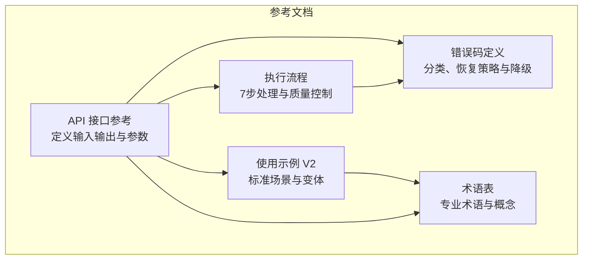
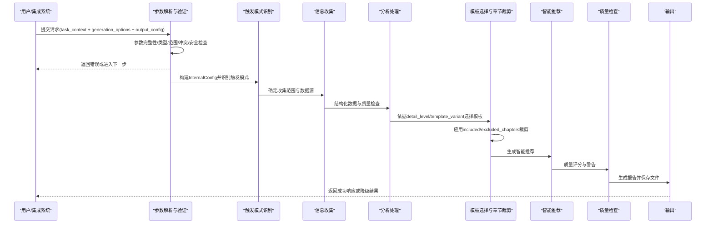
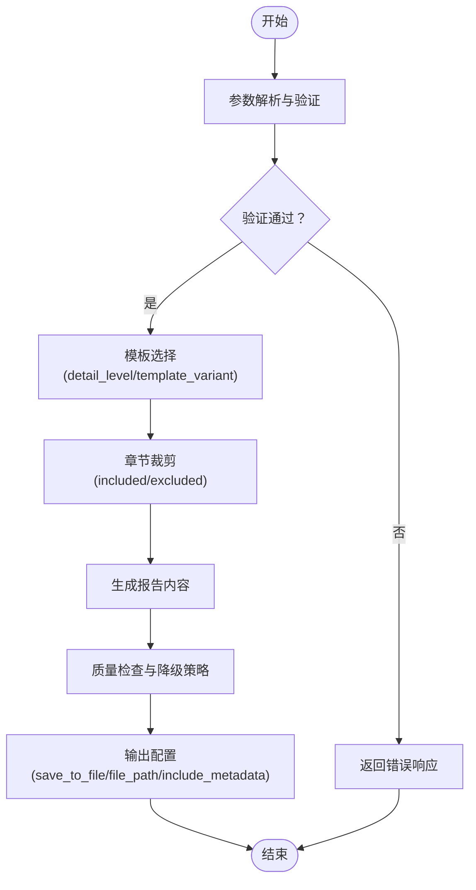
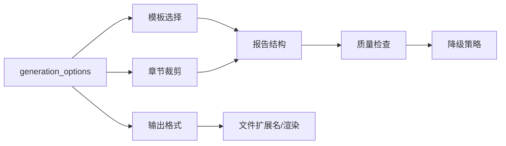
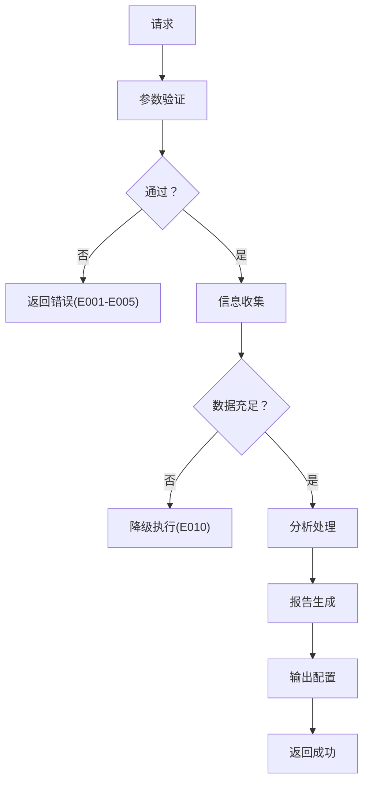

# 模板定制与配置

<cite>
**本文档引用的文件**
- [api-reference.md](file://references/api-reference.md)
- [examples-v2.md](file://references/examples-v2.md)
- [execution-flow.md](file://references/execution-flow.md)
- [error-codes.md](file://references/error-codes.md)
- [terminology.md](file://references/terminology.md)
</cite>

## 目录
1. [简介](#简介)
2. [项目结构](#项目结构)
3. [核心组件](#核心组件)
4. [架构概览](#架构概览)
5. [详细组件分析](#详细组件分析)
6. [依赖分析](#依赖分析)
7. [性能考虑](#性能考虑)
8. [故障排除指南](#故障排除指南)
9. [结论](#结论)
10. [附录](#附录)

## 简介
本文件专注于"任务执行总结报告生成器"的模板定制与配置，系统阐述可定制选项（语言风格、输出格式、章节内容、个性化配置）、模板元数据配置方法、模板扩展与自定义最佳实践，以及版本管理与兼容性注意事项。内容基于官方接口参考文档、示例文档、执行流程文档和错误码文档，确保技术与非技术读者都能有效理解和应用。

## 项目结构
该项目采用文档驱动的参考文档结构，围绕接口规范、执行流程、错误处理和术语表构建，便于集成商、开发者和高级用户理解与使用。

**图表来源**
- [api-reference.md:1-1346](file://references/api-reference.md#L1-L1346)
- [examples-v2.md:1-769](file://references/examples-v2.md#L1-L769)
- [execution-flow.md:1-1783](file://references/execution-flow.md#L1-L1783)
- [error-codes.md:1-1594](file://references/error-codes.md#L1-L1594)
- [terminology.md:1-1104](file://references/terminology.md#L1-L1104)

**章节来源**
- [api-reference.md:1-1346](file://references/api-reference.md#L1-L1346)
- [examples-v2.md:1-769](file://references/examples-v2.md#L1-L769)
- [execution-flow.md:1-1783](file://references/execution-flow.md#L1-L1783)
- [error-codes.md:1-1594](file://references/error-codes.md#L1-L1594)
- [terminology.md:1-1104](file://references/terminology.md#L1-L1104)

## 核心组件
- 输入参数体系：task_context（任务上下文）、generation_options（生成选项）、output_config（输出配置）
- 生成选项：detail_level（详细程度）、template_variant（模板变体）、included_chapters/excluded_chapters（章节选择）、language_style（语言风格）、focus_dimensions（聚焦维度）、output_format（输出格式）
- 输出配置：save_to_file（保存开关）、file_path（文件路径）、include_metadata（元数据）、append_to_existing（追加模式）、encoding（编码）、custom_header/custom_footer（自定义页眉页脚）

**章节来源**
- [api-reference.md:183-717](file://references/api-reference.md#L183-L717)
- [examples-v2.md:29-166](file://references/examples-v2.md#L29-L166)

## 架构概览
模板定制与配置贯穿参数解析、触发识别、信息收集、分析处理、报告生成、智能推荐、质量检查与输出七个阶段。参数验证与默认值应用确保输入一致性；章节裁剪与模板选择决定报告结构；输出配置控制文件保存与元数据。

**图表来源**
- [execution-flow.md:175-1226](file://references/execution-flow.md#L175-L1226)
- [api-reference.md:183-717](file://references/api-reference.md#L183-L717)

**章节来源**
- [execution-flow.md:175-1226](file://references/execution-flow.md#L175-L1226)
- [api-reference.md:183-717](file://references/api-reference.md#L183-L717)

## 详细组件分析

### 语言风格选择（professional、casual、academic）
- 作用：控制报告语言风格，适用于正式、团队内部或学术场景
- 配置位置：generation_options.language_style
- 默认值：professional
- 适用场景：正式报告（professional）、团队内部交流（casual）、学术/研究（academic）

**章节来源**
- [api-reference.md:487-504](file://references/api-reference.md#L487-L504)

### 输出格式设置（markdown、json、html）
- 作用：控制报告输出格式与文件扩展名
- 配置位置：generation_options.output_format
- 默认值：markdown
- 特点：
  - markdown：结构化、可渲染、Git友好
  - json：便于程序化处理与二次加工
  - html：浏览器直接查看、样式美观

**章节来源**
- [api-reference.md:534-574](file://references/api-reference.md#L534-L574)

### 章节内容调整（included_chapters、excluded_chapters）
- 作用：灵活选择或排除报告的10个标准章节
- 配置位置：generation_options.included_chapters / excluded_chapters
- 约束：
  - 互斥使用（不能同时指定）
  - 至少保留第1、9、10章
  - 不能排除全部章节
- 建议：
  - 精简场景：仅包含第1、5、9、10章
  - 排除团队协作：排除第7章
  - 标准场景：不指定，使用默认全包含

**章节来源**
- [api-reference.md:450-486](file://references/api-reference.md#L450-L486)
- [examples-v2.md:167-276](file://references/examples-v2.md#L167-L276)

### 个性化配置（focus_dimensions、custom_header、custom_footer）
- focus_dimensions：聚焦分析维度（目标达成、时间效率、资源利用、问题模式、协作），提升针对性
- custom_header/custom_footer：自定义报告头部/尾部（支持Markdown），添加声明、保密提示、联系方式等
- 配置位置：generation_options.focus_dimensions、output_config.custom_header、output_config.custom_footer

**章节来源**
- [api-reference.md:505-533](file://references/api-reference.md#L505-L533)
- [api-reference.md:685-701](file://references/api-reference.md#L685-L701)

### 模板元数据配置
- include_metadata：是否包含YAML Frontmatter元数据块
- 元数据字段示例：name、version、template_type、generated_by、task_name、generated_at
- 配置位置：output_config.include_metadata
- 用途：便于文档管理、检索与版本追踪

**章节来源**
- [api-reference.md:634-658](file://references/api-reference.md#L634-L658)

### 模板变体与详细程度
- detail_level：summary（摘要）、standard（标准）、detailed（详细）
- template_variant：standard（标准通用）、learning（学习专用）、与detail_level冲突时优先
- 影响：决定报告结构、篇幅与分析深度

**章节来源**
- [api-reference.md:384-449](file://references/api-reference.md#L384-L449)

### 执行流程中的模板定制
- 模板选择：依据detail_level选择对应模板变体
- 章节裁剪：apply_section_customization按includeSections进行裁剪，基础章节可压缩而非删除
- 质量控制：降级执行与警告标注，确保可用性

**图表来源**
- [execution-flow.md:966-996](file://references/execution-flow.md#L966-L996)
- [api-reference.md:384-449](file://references/api-reference.md#L384-L449)

**章节来源**
- [execution-flow.md:966-996](file://references/execution-flow.md#L966-L996)
- [api-reference.md:384-449](file://references/api-reference.md#L384-L449)

## 依赖分析
- 参数验证依赖：存在性检查 → 类型匹配 → 值域范围 → 逻辑一致性 → 安全性检查
- 模板与章节依赖：章节间存在前置依赖关系，需满足最小组合
- 输出格式依赖：output_format影响文件扩展名与渲染方式
- 降级机制依赖：数据覆盖率阈值与质量评分

**图表来源**
- [execution-flow.md:241-250](file://references/execution-flow.md#L241-L250)
- [api-reference.md:450-486](file://references/api-reference.md#L450-L486)
- [api-reference.md:534-574](file://references/api-reference.md#L534-L574)

**章节来源**
- [execution-flow.md:241-250](file://references/execution-flow.md#L241-L250)
- [api-reference.md:450-486](file://references/api-reference.md#L450-L486)
- [api-reference.md:534-574](file://references/api-reference.md#L534-L574)

## 性能考虑
- 参数解析与验证：< 1 秒
- 触发模式识别：< 2 秒
- 信息收集阶段：30-120 秒（取决于对话长度与数据量）
- 详细程度对耗时影响：summary(-30%) → standard(基准) → detailed(+50%-60%)
- 建议：在复杂任务场景使用异步端点，合理选择详细程度与聚焦维度

**章节来源**
- [execution-flow.md:142-170](file://references/execution-flow.md#L142-L170)
- [api-reference.md:1-1346](file://references/api-reference.md#L1-L1346)

## 故障排除指南
- 参数错误（E001-E005）：缺少必填参数、类型错误、值越界、参数冲突、无效章节组合
- 数据不足（E010）：降级执行，标注受影响章节，建议补充信息后重试
- 数据源错误（E011）：对话历史不可用，建议手动输入或更换会话
- 模板不存在（E031）：检查模板名称或使用默认模板
- 超时（E051）：检查系统资源与网络状况

**图表来源**
- [error-codes.md:177-557](file://references/error-codes.md#L177-L557)
- [execution-flow.md:175-699](file://references/execution-flow.md#L175-L699)

**章节来源**
- [error-codes.md:177-557](file://references/error-codes.md#L177-L557)
- [execution-flow.md:175-699](file://references/execution-flow.md#L175-L699)

## 结论
通过系统化的参数配置与模板定制，用户可在不同场景下灵活生成符合需求的报告。建议优先使用默认配置以获得稳定质量，再根据需要调整详细程度、语言风格、输出格式与章节选择。遇到数据不足或参数错误时，遵循错误响应中的恢复建议与降级策略，确保获得可用的报告结果。

## 附录

### 模板扩展与自定义最佳实践
- 新增章节：在现有10章基础上，结合业务需求提出新增维度（需评估与既有章节的依赖关系）
- 修改现有结构：通过included_chapters/excluded_chapters进行裁剪，避免删除基础章节
- 适应特定行业需求：利用focus_dimensions聚焦关键分析维度，或使用template_variant（如learning）调整章节角度
- 元数据管理：启用include_metadata，统一记录模板类型、生成器版本与任务信息，便于检索与版本追踪

**章节来源**
- [api-reference.md:450-486](file://references/api-reference.md#L450-L486)
- [api-reference.md:634-658](file://references/api-reference.md#L634-L658)
- [execution-flow.md:978-996](file://references/execution-flow.md#L978-L996)

### 版本管理与兼容性注意事项
- 版本策略：主版本（不兼容变更）、次版本（向后兼容新增）、修订版（向后兼容修复）
- 向后兼容承诺：v1.x系列保持API向后兼容
- 废弃策略：至少提前2个小版本通过warnings通知
- 已知限制：当前版本不支持用户自定义模板上传、多语言报告、报告版本管理与差异对比、批量生成、Webhook回调、协作编辑、外部知识库集成、AI增强分析
- 兼容性说明：升级不影响历史报告文件

**章节来源**
- [api-reference.md:71-1310](file://references/api-reference.md#L71-L1310)