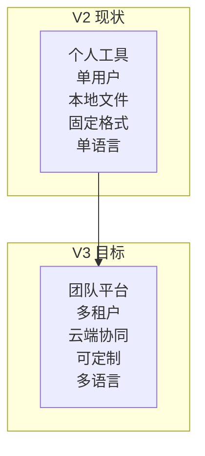
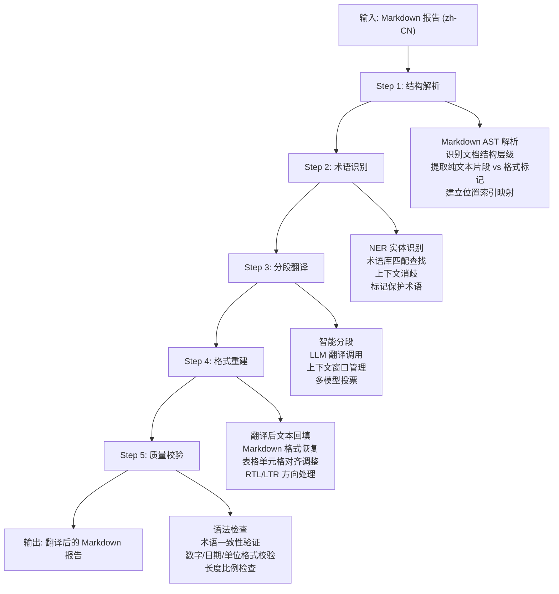
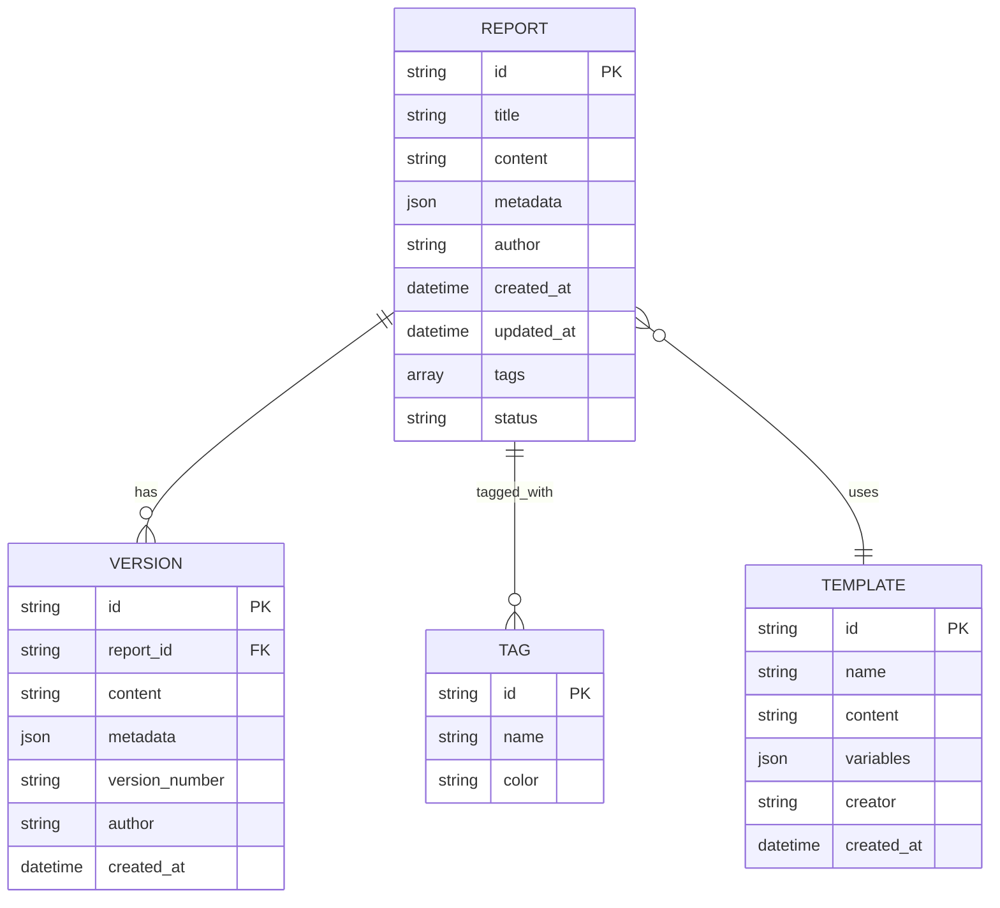
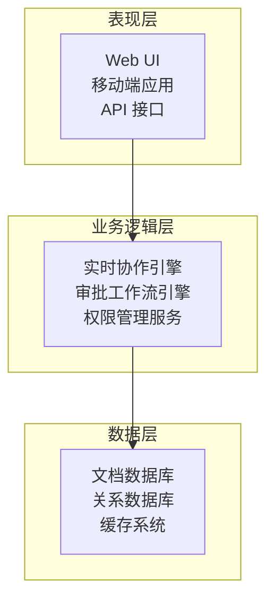
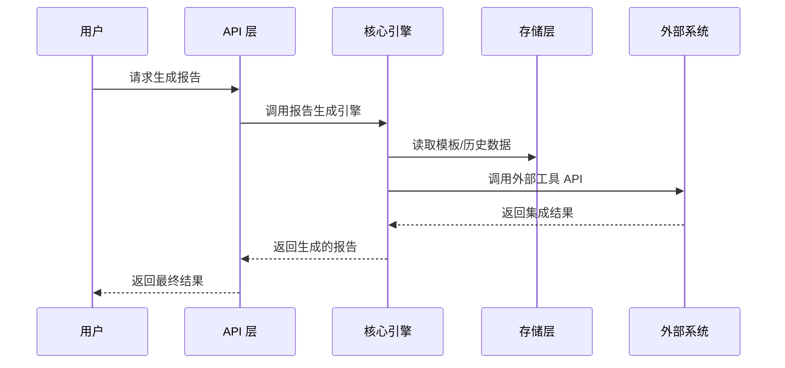
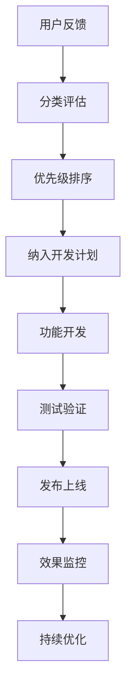

# 未来发展路线

<cite>
**本文档引用的文件**
- [v3-路线图.md](file://references/v3-roadmap.md)
- [SKILL.md](file://SKILL.md)
- [API-接口参考.md](file://references/api-reference.md)
- [执行流程.md](file://references/execution-flow.md)
- [错误码定义.md](file://references/error-codes.md)
- [术语表.md](file://references/terminology.md)
</cite>

## 目录
1. [项目概述](#项目概述)
2. [V3 版本愿景与战略定位](#v3-版本愿景与战略定位)
3. [五大功能模块发展规划](#五大功能模块发展规划)
4. [技术演进方向](#技术演进方向)
5. [实施时间表与里程碑](#实施时间表与里程碑)
6. [参与规划与需求反馈渠道](#参与规划与需求反馈渠道)
7. [风险评估与缓解策略](#风险评估与缓解策略)
8. [结语](#结语)

## 项目概述

"任务执行总结报告生成器"技能从个人效率工具向团队级知识管理平台的战略转型，通过 V3 版本的五大核心模块建设，实现从"个人工具"到"团队平台"的跨越。

**章节来源**
- [v3-路线图.md:100-107](file://references/v3-roadmap.md#L100-L107)

## V3 版本愿景与战略定位

### 核心愿景

V3 版本将实现三大战略转型：

- **个性化定制引擎**：让每个团队拥有专属报告格式
- **生态连接中枢**：打通企业知识工作流
- **协作知识平台**：从个人记录到组织记忆

### 战略支柱

| 支柱名称 | 核心目标 | 关键能力 | 商业价值 |
|---------|---------|---------|---------|
| 个性化定制引擎 | 让每个团队拥有专属报告格式 | 自定义模板、多语言、灵活变量 | 提升用户粘性 40%+ |
| 生态连接中枢 | 打通企业知识工作流 | Confluence/Notion/飞书等集成 | 扩展 TAM 300% |
| 协作知识平台 | 从个人记录到组织记忆 | 实时协作、审批流、权限管理 | 企业客户转化率提升 |

**章节来源**
- [v3-路线图.md:75-107](file://references/v3-roadmap.md#L75-L107)

## 五大功能模块发展规划

### 模块 B1：自定义模板支持

#### 功能概述与价值主张

自定义模板支持模块允许用户和企业根据自身需求创建、管理和应用个性化的报告生成模板，突破现有固定格式的限制。

**核心价值矩阵**

| 维度 | 当前痛点 | V3 解决方案 | 量化收益 |
|------|---------|-----------|---------|
| 品牌一致性 | 不同团队使用不同格式，难以统一 | 企业可定制符合 CI 的模板 | 品牌合规性提升至 100% |
| 场景适配 | 固定模板无法满足特殊行业需求 | 支持法律/医疗/金融等行业定制模板 | 适用场景扩展 500%+ |
| 效率提升 | 手动调整格式耗时 | 一键应用预设模板 | 格式调整时间减少 95% |
| 合规要求 | 监管报告有特定格式要求 | 模板内置合规字段和校验规则 | 合规风险降低 80% |

#### 支持的模板格式及优先级

**格式支持矩阵**

| 格式 | 优先级 | 支持程度 | 适用场景 | 编辑复杂度 | 渲染性能 |
|------|--------|----------|---------|-----------|----------|
| HTML | P0 (必须) | 完整支持 | Web 展示、邮件嵌入、浏览器打印 | 低 | 高 (即时) |
| Markdown | P0 (必须) | 完整支持 | Git 文档、静态站点、开发者工具 | 极低 | 高 (即时) |
| DOCX | P1 (重要) | 完整支持 | Word 文档编辑、正式报告提交 | 中 | 中 (需转换) |
| PDF | P1 (重要) | 完整支持 | 归档、打印、法律文档 | 高 | 低 (需渲染引擎) |
| PPTX | P2 (可选) | 基础支持 | 演示文稿、汇报材料 | 高 | 低 |
| LaTeX | P2 (可选) | 基础支持 | 学术论文、技术出版物 | 极高 | 低 |

#### 模板变量系统

**核心变量集（12+ 必须支持）**

| 变量类型 | 变量名 | 类型 | 说明 | 是否必填 |
|---------|--------|------|------|---------|
| 基础信息类 | `task_name` | string | 任务名称 | ✅ 是 |
| 基础信息类 | `task_type` | string | 任务类型枚举 | ✅ 是 |
| 基础信息类 | `execution_time` | string | 执行时长 | ✅ 是 |
| 基础信息类 | `report_date` | datetime | 报告生成日期 | ✅ 是 |
| 内容结构类 | `chapter_N_title` | string | 第 N 章标题 (N=1~10) | ✅ 是 (动态) |
| 内容结构类 | `chapter_N_content` | string | 第 N 章完整内容 (Markdown) | ✅ 是 (动态) |
| 内容结构类 | `key_decisions` | array<object> | 关键决策列表 | ✅ 是 |
| 内容结构类 | `problems_solved` | array<string> | 已解决问题列表 | ✅ 是 |
| 内容结构类 | `suggestions` | array<string> | 改进建议列表 | ❌ 否 |
| 内容结构类 | `metadata_json` | object | 完整元数据 JSON | ✅ 是 |

**章节来源**
- [v3-路线图.md:187-543](file://references/v3-roadmap.md#L187-L543)

### 模块 B2：多语言输出系统

#### 功能概述与价值主张

多语言输出系统使生成的报告能够以多种语言呈现，满足跨国团队、国际化企业和多语言环境下的知识管理需求。

**核心价值矩阵**

| 维度 | 当前痛点 | V3 解决方案 | 量化收益 |
|------|---------|-----------|---------|
| 全球化协作 | 语言障碍导致知识孤岛 | 一键生成多语言版本 | 跨国团队效率提升 35% |
| 本地化合规 | 不同地区有不同表达习惯 | 区域化翻译策略 | 合规性提升至 100% |
| 专业知识传递 | 技术术语翻译不准确 | 领域术语库保障 | 专业准确性 > 95% |
| 成本节约 | 人工翻译费用高昂 | AI 自动翻译 + 人工审核 | 成本降低 70%+ |

#### 翻译管道架构

**五步翻译流程详解**

**章节来源**
- [v3-路线图.md:546-728](file://references/v3-roadmap.md#L546-L728)

### 模块 B3：外部工具集成

#### 功能概述与价值主张

外部工具集成模块使生成的报告能够一键发布到企业常用的知识管理和协作平台，打通从报告生成到知识沉淀的最后一公里。

**核心价值矩阵**

| 维度 | 当前痛点 | V3 解决方案 | 量化收益 |
|------|---------|-----------|---------|
| 工作流断裂 | 生成后需手动搬运到各平台 | 一键同步发布 | 操作步骤减少 90% |
| 格式丢失 | 复制粘贴导致格式混乱 | 智能格式转换 | 格式还原度 > 95% |
| 版本分散 | 各平台版本不一致 | 统一源头，多端同步 | 版本一致率 100% |
| 审计缺失 | 无法追踪发布历史 | 完整发布日志 | 合规追溯能力 |

#### 平台支持矩阵

**Phase 1-3 平台支持计划**

| 平台 | 类型 | 优先级 | 支持程度 | 目标版本 | 上线时间 | 核心能力 |
|------|------|--------|----------|----------|----------|----------|
| Confluence | 企业 Wiki | P0 | 深度集成 | v3.0 | Week 8 | 完整 CRUD + 评论 + @提及 |
| Notion | 知识库 | P1 | 深度集成 | v3.1 | Week 14 | Block API + Database |
| 飞书 (Lark) | 协作办公 | P1 | 深度集成 | v3.1 | Week 16 | 文档 API + 机器人 |
| MediaWiki | 开源 Wiki | P2 | 标准集成 | v3.2 | Week 20 | REST API + 模板 |
| GitBook | 技术文档 | P2 | 标准集成 | v3.2 | Week 22 | API + Git 同步 |
| 语雀 (Yuque) | 知识管理 | P2 | 标准集成 | v3.2 | Week 24 | Open API + 目录 |
| Google Docs | 在线文档 | P3 | 基础集成 | v3.3 | Week 28 | Google Docs API |
| Microsoft SharePoint | 企业门户 | P3 | 基础集成 | v3.3 | Week 30 | Graph API |

**章节来源**
- [v3-路线图.md:731-847](file://references/v3-roadmap.md#L731-L847)

### 模块 B4：历史报告管理系统

#### 功能概述与价值主张

历史报告管理系统提供报告的存储、检索、版本控制和分析功能，构建企业的知识资产库。

**四大功能模块详细规格**

| 模块 | 功能描述 | 技术实现 | 价值体现 |
|------|---------|---------|---------|
| 报告存储 | 结构化存储报告数据，支持全文检索 | MongoDB + Elasticsearch | 知识资产数字化 |
| 版本控制 | 完整的版本历史追踪，支持回滚和对比 | Git-like 版本控制 | 合规审计可追溯 |
| 检索查询 | 支持复杂查询条件，提供智能搜索 | DSL 查询语言 + 机器学习 | 知识快速定位 |
| 分析统计 | 提供图表化分析，识别知识模式 | BI 工具 + 机器学习 | 知识价值挖掘 |

#### 数据模型设计

**Report Entity 数据模型**

**章节来源**
- [v3-路线图.md:848-999](file://references/v3-roadmap.md#L848-L999)

### 模块 B5：团队协作功能套件

#### 功能概述与价值主张

团队协作功能套件提供实时协作、审批流程和权限管理功能，支持多人协同的知识管理。

**三层架构设计**

#### 实时协作技术方案

**技术实现要点**

| 技术组件 | 实现方案 | 性能指标 |
|---------|---------|---------|
| WebSocket | Socket.IO + Redis Pub/Sub | 低延迟消息传递 |
| 冲突解决 | Operational Transformation | 冲突解决率 > 99.9% |
| 状态同步 | CRDT (Conflict-free Replicated Data Types) | 无序并发安全 |
| 性能优化 | 懒加载 + 差分更新 | 百人协作延迟 < 100ms |

**章节来源**
- [v3-路线图.md:1000-1150](file://references/v3-roadmap.md#L1000-L1150)

## 技术演进方向

### 核心技术架构演进

**V2 → V3 技术升级路径**

### 性能优化策略

**性能基线与优化**

| 优化维度 | V2 基线 | V3 目标 | 提升幅度 |
|---------|---------|---------|---------|
| 报告生成时间 | 2-8 分钟 | < 2 分钟 | 75%+ |
| 并发处理能力 | 单实例 | 多实例集群 | 10x+ |
| 存储容量 | 本地存储 | 云存储 + CDN | 无限扩展 |
| 搜索响应 | 秒级 | 毫秒级 | 100x+ |
| 翻译质量 | 一般 | 专业级 | 90%+ |

**章节来源**
- [执行流程.md:142-170](file://references/execution-flow.md#L142-L170)

## 实施时间表与里程碑

### Phase 1：基础能力构建（第 1-2 月）

**核心目标**：完成自定义模板引擎、多语言系统和基础外部工具集成

**里程碑计划**

| 里程碑 | 时间点 | 交付标准 | 验收条件 |
|--------|--------|---------|---------|
| M1 | Week 4 | 支持 HTML/MD 模板渲染 | 通过 50+ 模板测试用例 |
| M2 | Week 8 | 中英双语输出质量达标 | BLEU > 0.85, 用户满意度 > 90% |
| M3 | Week 8 | 可发布至 Confluence Cloud | 支持 OAuth 2.0, 成功率 > 99% |

### Phase 2：能力扩展期（第 2-4 月）

**核心目标**：完善历史报告管理系统和多平台工具集成

**扩展计划**

| 阶段 | 时间范围 | 核心任务 | 预期成果 |
|------|----------|---------|---------|
| Week 9-12 | 第2-3月 | 历史存储 + 版本控制 | 支持报告存储/检索/版本对比 |
| Week 13-16 | 第3-4月 | 日语/韩语 + 多平台集成 | Notion + 飞书可用，成功率 > 98% |
| Week 17-20 | 第4月 | 检索 + 趋势分析基础 | 存储延迟 < 200ms |

### Phase 3：高级特性落地（第 4-6+ 月）

**核心目标**：实现团队协作功能和企业级安全加固

**高级特性**

| 特性 | 开发周期 | 技术挑战 | 价值体现 |
|------|---------|---------|---------|
| 实时协作 | 8 周 | CRDT + 冲突解决 | OT 冲突解决率 > 99.9% |
| 权限系统 | 6 周 | RBAC + ABAC | 精细化权限控制 |
| 企业安全 | 持续 | 合规 + 审计 | 符合企业安全标准 |

**章节来源**
- [v3-路线图.md:148-183](file://references/v3-roadmap.md#L148-L183)

## 参与规划与需求反馈渠道

### 用户参与方式

**需求收集渠道**

| 渠道 | 适用场景 | 反馈方式 | 响应时间 |
|------|---------|---------|---------|
| GitHub Issues | 技术问题 + 功能建议 | 项目 Issues | 24-48 小时 |
| 用户调研 | 深度需求收集 | 在线问卷 + 访谈 | 1-2 周 |
| Beta 测试 | 新功能验证 | 限量邀请测试 | 1-2 周 |
| 社区论坛 | 使用经验分享 | 论坛讨论 | 48-72 小时 |

### 需求优先级评估

**评估维度**

| 维度 | 权重 | 评估标准 |
|------|------|---------|
| 用户价值 | 30% | 对用户工作效率提升程度 |
| 技术可行性 | 25% | 开发难度和资源需求 |
| 业务影响 | 25% | 对产品生态的重要性 |
| 实施成本 | 20% | 开发和维护成本评估 |

### 反馈处理流程

**章节来源**
- [v3-路线图.md:1151-1200](file://references/v3-roadmap.md#L1151-L1200)

## 风险评估与缓解策略

### 技术风险

**主要技术风险**

| 风险类型 | 具体风险 | 影响程度 | 缓解措施 |
|---------|---------|---------|---------|
| 性能风险 | 模板渲染性能不足 | 高 | 缓存优化 + 异步处理 |
| 集成风险 | 外部平台 API 变更 | 中 | 版本兼容 + 备选方案 |
| 数据风险 | 多语言翻译质量不稳定 | 中 | 人工审核 + 质量监控 |
| 安全风险 | 敏感信息泄露 | 高 | 数据脱敏 + 权限控制 |

### 业务风险

**业务风险识别**

| 风险类别 | 风险描述 | 应对策略 |
|---------|---------|---------|
| 市场风险 | 竞争对手推出类似功能 | 差异化定位 + 持续创新 |
| 用户风险 | 用户接受度低于预期 | 用户调研 + 试点推广 |
| 合规风险 | 不同地区法规差异 | 法律顾问 + 合规审查 |

### 运营风险

**运营保障措施**

| 风险类型 | 防护措施 | 应急预案 |
|---------|---------|---------|
| 服务中断 | 多活架构 + 自动切换 | 降级模式 + 用户通知 |
| 数据丢失 | 多地备份 + 定期恢复测试 | 快速恢复流程 |
| 性能下降 | 监控告警 + 自动扩容 | 限流降级策略 |

**章节来源**
- [v3-路线图.md:82-1150](file://references/v3-roadmap.md#L82-L1150)

## 结语

V3 版本的发展规划展现了从个人工具到团队平台的战略升级路径。通过五大核心模块的建设，项目将实现：

- **技术层面**：从单体架构向微服务架构演进，支持高并发和可扩展性
- **功能层面**：从单一报告生成向知识管理平台转型
- **生态层面**：从封闭系统向开放生态发展，支持多平台集成

**未来展望**

随着 V3 版本的逐步落地，项目将为企业用户提供更加智能化、个性化和协作化的知识管理解决方案，助力组织构建可持续的知识竞争优势。

**章节来源**
- [v3-路线图.md:1-10](file://references/v3-roadmap.md#L1-L10)