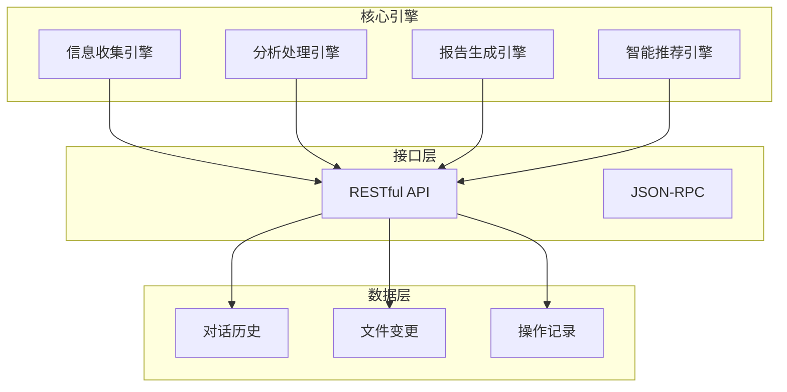
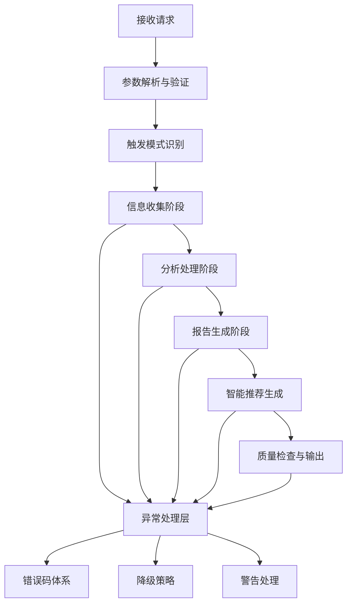
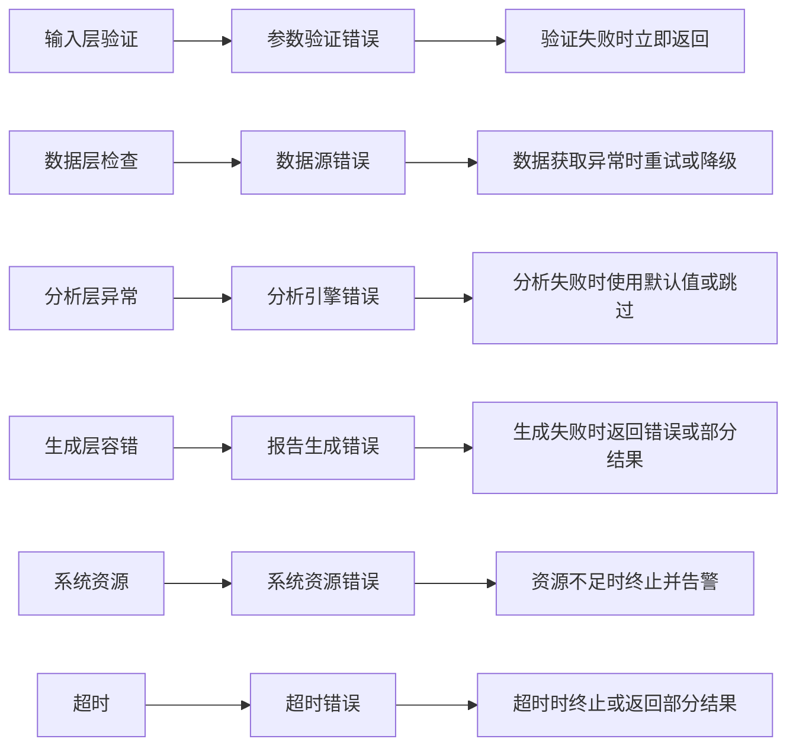
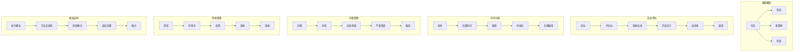
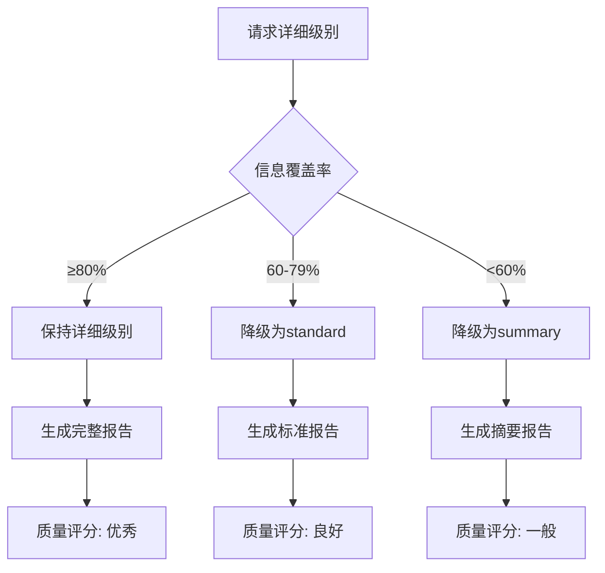

# 术语表与概念解释

<cite>
**本文档引用的文件**
- [terminology.md](file://references/terminology.md)
- [api-reference.md](file://references/api-reference.md)
- [error-codes.md](file://references/error-codes.md)
- [execution-flow.md](file://references/execution-flow.md)
- [examples-v2.md](file://references/examples-v2.md)
</cite>

## 目录
1. [简介](#简介)
2. [项目结构](#项目结构)
3. [核心术语体系](#核心术语体系)
4. [架构概览](#架构概览)
5. [详细术语分析](#详细术语分析)
6. [依赖关系分析](#依赖关系分析)
7. [性能考量](#性能考量)
8. [故障排除指南](#故障排除指南)
9. [结论](#结论)
10. [附录](#附录)

## 简介

本文档为"任务执行总结报告生成器"技能提供完整的术语表与概念解释。该技能通过四大核心引擎协同工作，为用户提供专业的任务执行总结报告生成服务。本文档收录了86个专业术语，涵盖任务执行、复盘分析、经验总结等相关领域的核心概念。

## 项目结构

项目采用模块化设计，包含以下核心组件：

**图表来源**
- [api-reference.md:64-69](file://references/api-reference.md#L64-L69)

**章节来源**
- [api-reference.md:36-79](file://references/api-reference.md#L36-L79)

## 核心术语体系

术语体系按照十大类别组织，每个类别包含相关的专业概念和使用场景。

### 一、任务执行基础术语

| 术语 | 英文 | 定义 | 使用场景 |
|------|------|------|----------|
| 任务 | Task | 具有明确目标、起止时间和可衡量产出的基本工作单元 | "本次任务的目标是开发商品价格爬虫系统" |
| 项目 | Project | 由多个相互关联的任务组成的临时性工作集合 | "电商平台支付模块重构项目" |
| 里程碑 | Milestone | 项目执行过程中的关键时间节点 | "里程碑M3要求完成订单API性能优化" |
| 阶段 | Phase | 任务执行过程中的逻辑时间段落 | "功能实现阶段耗时最长（占比45%）" |

**章节来源**
- [terminology.md:24-98](file://references/terminology.md#L24-L98)

### 二、目标与成果评估术语

| 术语 | 英文 | 定义 | 使用场景 |
|------|------|------|----------|
| 目标 | Objective/Goal | 任务期望达成的最终状态或结果，遵循SMART原则 | "在3小时内开发商品爬虫，数据准确率≥95%" |
| 子目标 | Sub-goal | 总目标拆分后的分项目标，具有明确权重 | "基础抓取功能（权重30%）" |
| 验收标准 | Acceptance Criteria | 判断任务完成的明确条件清单 | "登录响应时间<500ms" |
| 达成率 | Achievement Rate | 实际成果与预期目标的比值 | "Sprint达成率91.3%" |

**章节来源**
- [terminology.md:114-181](file://references/terminology.md#L114-L181)

### 三、时间与效率分析术语

| 术语 | 英文 | 定义 | 使用场景 |
|------|------|------|----------|
| 耗时 | Duration | 完成工作所消耗的实际时间长度 | "Bug修复的总耗时3小时20分钟" |
| 估算时间 | Estimation | 基于经验对任务所需时间的预测值 | "PERT方法估算8.67小时" |
| 瓶颈 | Bottleneck | 限制整体效率的关键约束环节 | "等待第三方API响应是瓶颈阶段" |
| 时效比 | Time Efficiency Ratio | 计划时间与实际时间的比值 | "Sprint的时效比为0.89" |

**章节来源**
- [terminology.md:186-251](file://references/terminology.md#L186-L251)

### 四、问题与风险术语

| 术语 | 英文 | 定义 | 使用场景 |
|------|------|------|----------|
| 问题 | Issue/Problem | 任务执行过程中阻碍正常进展的异常情况 | "本次任务共遇到5个问题" |
| 风险 | Risk | 未来可能发生并对任务目标产生负面影响的不确定事件 | "第三方支付服务商可能服务降级" |
| 应急预案 | Contingency Plan | 针对已识别风险的预先应对方案 | "准备备用支付渠道" |
| 严重程度 | Severity | 问题对任务目标影响程度分级 | "P0-Critical严重程度" |

**章节来源**
- [terminology.md:267-328](file://references/terminology.md#L267-L328)

### 五、资源与协作术语

| 术语 | 英文 | 定义 | 使用场景 |
|------|------|------|----------|
| 资源 | Resource | 完成任务所需的各种要素的总称 | "开发人员的有效编码利用率为65%" |
| 利用率 | Utilization Rate | 资源实际被有效使用的时间比例 | "服务器CPU利用率92%" |
| 浪费 | Waste | 消耗资源但未产生相应价值的活动 | "等待Code Review的时间约4小时" |
| 效率 | Efficiency | 单位资源投入所产生的产出量 | "回归测试效率提升了5倍" |

**章节来源**
- [terminology.md:333-455](file://references/terminology.md#L333-L455)

### 六、报告结构术语

| 术语 | 英文 | 定义 | 使用场景 |
|------|------|------|----------|
| 执行概览 | Executive Summary | 报告的首页概述，提供核心成果一句话 | "核心成果一句话、关键数据速览" |
| 方法论提炼 | Methodology Extraction | 从实践中抽象出的通用方法和步骤 | "提炼出'分层对抗策略方法论'" |
| 经验教训 | Lesson Learned | 从任务执行中获得的指导性认知 | "在开发初期就应该考虑反爬策略" |
| 报告模板 | Report Template | 预定义的报告结构和格式规范 | "快速摘要版（2-3页）" |

**章节来源**
- [terminology.md:460-534](file://references/terminology.md#L460-L534)

### 七、项目管理专用术语

| 术语 | 英文 | 定义 | 使用场景 |
|------|------|------|----------|
| Sprint | Sprint | Scrum敏捷开发中的固定长度迭代周期 | "Sprint 23为期两周" |
| 用户故事 | User Story | 以用户视角描述的功能需求 | "作为买家，我想要..." |
| Backlog | Backlog | 按优先级排序的待完成工作项列表 | "Product Backlog目前共有47个条目" |
| Velocity | Velocity | 团队在每个Sprint中实际完成的Story Points总数 | "团队近3个Sprint的Velocity为36-42 SP" |

**章节来源**
- [terminology.md:539-657](file://references/terminology.md#L539-L657)

### 八、软件开发专用术语

| 术语 | 英文 | 定义 | 使用场景 |
|------|------|------|----------|
| 缺陷 | Defect/Bug | 软件中存在的导致程序未能按预期行为运行的问题 | "本次版本发布前共发现并修复了17个缺陷" |
| 技术债务 | Technical Debt | 为短期利益采取的权宜之计 | "缺少单元测试的遗留模块" |
| 重构 | Refactoring | 在不改变软件外部行为的前提下改善内部结构 | "将800行的God Class拆分为6个类" |
| CI/CD | CI/CD | 持续集成和持续部署的工程实践 | "每次Push触发自动构建→运行420个单元测试" |

**章节来源**
- [terminology.md:662-780](file://references/terminology.md#L662-L780)

### 九、学习方法论术语

| 术语 | 英文 | 定义 | 使用场景 |
|------|------|------|----------|
| 学习曲线 | Learning Curve | 表示掌握某项技能所需的时间和努力程度 | "React Hooks的学习曲线呈现S形" |
| 技能矩阵 | Skill Matrix | 以表格形式展示个人或团队在不同技能领域的掌握程度 | "HTML/CSS ★★★★★（精通）" |
| 胜任力模型 | Competency Model | 描述某岗位或角色所需的知识、技能和能力要求 | "参照公司的前端工程师胜任力模型" |
| 成长路径 | Growth Pathway | 个人职业或技能发展的阶段性路线图 | "从React基础到技术专家的成长路径" |

**章节来源**
- [terminology.md:784-826](file://references/terminology.md#L784-L826)

### 十、质量与改进术语

| 术语 | 英文 | 定义 | 使用场景 |
|------|------|------|----------|
| PDCA循环 | PDCA Cycle | 计划-执行-检查-处理的持续改进方法 | "采用PDCA循环改进Code Review流程" |
| 持续改进 | Continuous Improvement | 通过不断的渐进式优化提升质量 | "团队的持续改进机制包括每周Retro会议" |
| Kaizen | Kaizen | 通过全员参与的小步快跑式持续改进 | "践行Kaizen理念，每位成员每周提出改进建议" |
| MTTR | MTTR | 平均恢复时间，从故障发生到服务完全恢复正常 | "本次故障的MTTR为1小时47分钟" |

**章节来源**
- [terminology.md:831-993](file://references/terminology.md#L831-L993)

## 架构概览

系统采用分层架构设计，包含执行流水线、数据流层和异常处理层：

**图表来源**
- [execution-flow.md:100-132](file://references/execution-flow.md#L100-L132)

**章节来源**
- [execution-flow.md:28-141](file://references/execution-flow.md#L28-L141)

## 详细术语分析

### 核心执行流程详解

系统执行流程包含七个主要步骤，每个步骤都有明确的输入输出和质量保证机制：

#### Step 1: 参数解析与验证
- **输入**: 原始请求（JSON/YAML/自然语言）
- **处理**: 参数完整性检查、类型匹配、值域范围、逻辑一致性
- **输出**: InternalConfig标准化配置对象

#### Step 2: 触发模式识别
- **识别模式**: 自动触发、手动触发、命令行触发
- **置信度要求**: >70%（自动触发）
- **输出**: CollectionScope收集范围定义

#### Step 3: 信息收集阶段（核心瓶颈）
- **数据源适配**: 对话历史解析器、操作记录提取器、文件变更追踪器
- **信息抽取**: 实体识别、关系抽取、事件检测
- **数据整合**: 去重处理、时序对齐、关联建立
- **质量检查**: 完整性评分、阈值判断

**章节来源**
- [execution-flow.md:175-698](file://references/execution-flow.md#L175-L698)

### 错误处理机制

系统采用分层防御的错误处理策略：

**图表来源**
- [error-codes.md:37-64](file://references/error-codes.md#L37-L64)

**章节来源**
- [error-codes.md:173-474](file://references/error-codes.md#L173-L474)

### 报告生成配置体系

系统提供灵活的报告生成配置选项：

| 配置项 | 可选值 | 默认值 | 适用场景 |
|--------|--------|--------|----------|
| detail_level | summary/standard/detailed | standard | 快速汇报/常规任务/深度复盘 |
| template_variant | summary/standard/detailed/learning | standard | 模板变体选择 |
| language_style | professional/casual/academic | professional | 语言风格 |
| output_format | markdown/json/html | markdown | 输出格式 |

**章节来源**
- [api-reference.md:380-586](file://references/api-reference.md#L380-L586)

## 依赖关系分析

术语体系内部存在复杂的依赖关系：

**图表来源**
- [terminology.md:22-1096](file://references/terminology.md#L22-L1096)

**章节来源**
- [terminology.md:1007-1096](file://references/terminology.md#L1007-L1096)

## 性能考量

系统性能特征如下：

| 阶段 | 耗时占比 | 主要影响因素 | 优化建议 |
|------|----------|-------------|----------|
| Step 1 | < 1% | 参数解析复杂度 | 优化JSON解析器 |
| Step 2 | < 2% | 触发模式识别 | 缓存常用模式 |
| Step 3 | 40-50% | 信息收集与质量检查 | 并行处理、缓存机制 |
| Step 4 | 35-40% | 分析处理引擎 | 算法优化、索引改进 |
| Step 5 | 15-20% | 报告生成 | 模板缓存、增量生成 |
| Step 6 | 5-10% | 智能推荐 | 向量化计算 |
| Step 7 | < 2% | 质量检查与输出 | 批量处理 |

**章节来源**
- [execution-flow.md:142-170](file://references/execution-flow.md#L142-L170)

## 故障排除指南

### 常见错误类型及处理

| 错误类型 | 错误码 | 严重级别 | 处理策略 | 预防措施 |
|----------|--------|----------|----------|----------|
| 参数验证错误 | E001-E005 | Error/Warning | 验证失败时立即返回或降级 | 客户端预校验 |
| 数据源错误 | E011-E015 | Error/Warning | 数据获取异常时重试或降级 | 健壮性设计 |
| 分析引擎错误 | E021-E025 | Error/Warning | 分析失败时使用默认值或跳过 | 容错机制 |
| 报告生成错误 | E031-E035 | Error | 生成失败时返回错误或部分结果 | 备份模板 |
| 系统资源错误 | E041-E045 | Critical | 资源不足时终止并告警 | 监控告警 |
| 超时错误 | E051 | Error | 超时时终止或返回部分结果 | 超时配置 |

**章节来源**
- [error-codes.md:152-170](file://references/error-codes.md#L152-L170)

### 降级执行策略

当信息不足时，系统采用智能降级策略：

**图表来源**
- [execution-flow.md:642-649](file://references/execution-flow.md#L642-L649)

**章节来源**
- [examples-v2.md:490-622](file://references/examples-v2.md#L490-L622)

## 结论

本文档建立了完整的术语体系，涵盖了任务执行总结报告生成的核心概念。通过86个专业术语的详细定义、使用场景和相关概念说明，为用户理解和使用该技能提供了坚实的基础。

系统采用分层架构设计，具备完善的错误处理机制和降级策略，能够适应不同复杂度的任务场景。术语体系的建立有助于：

1. **统一沟通语言**：为不同背景的用户提供一致的专业术语
2. **提升报告质量**：通过标准化的概念体系确保报告的完整性
3. **促进知识传承**：将实践经验转化为可复用的方法论
4. **支持持续改进**：为后续的技能优化和功能扩展奠定基础

## 附录

### 术语速查表

| 序号 | 中文术语 | 英文术语 | 所属类别 | 页内链接 |
|------|----------|----------|----------|----------|
| 1 | 任务 | Task | 任务执行基础 | [#:24-31](file://references/terminology.md#L24-L31) |
| 2 | 项目 | Project | 任务执行基础 | [#:35-43](file://references/terminology.md#L35-L43) |
| 3 | 里程碑 | Milestone | 任务执行基础 | [#:46-54](file://references/terminology.md#L46-L54) |
| 4 | 阶段 | Phase | 任务执行基础 | [#:57-65](file://references/terminology.md#L57-L65) |
| 5 | 工作项 | Work Item | 任务执行基础 | [#:68-76](file://references/terminology.md#L68-L76) |
| 6 | 交付物 | Deliverable | 任务执行基础 | [#:79-87](file://references/terminology.md#L79-L87) |
| 7 | 产出物 | Output | 任务执行基础 | [#:90-98](file://references/terminology.md#L90-L98) |
| 8 | 任务分解 | Work Breakdown | 任务执行基础 | [#:101-109](file://references/terminology.md#L101-L109) |
| 9 | 目标 | Objective/Goal | 目标与成果评估 | [#:114-122](file://references/terminology.md#L114-L122) |
| 10 | 子目标 | Sub-goal | 目标与成果评估 | [#:125-133](file://references/terminology.md#L125-L133) |

**章节来源**
- [terminology.md:1007-1096](file://references/terminology.md#L1007-L1096)