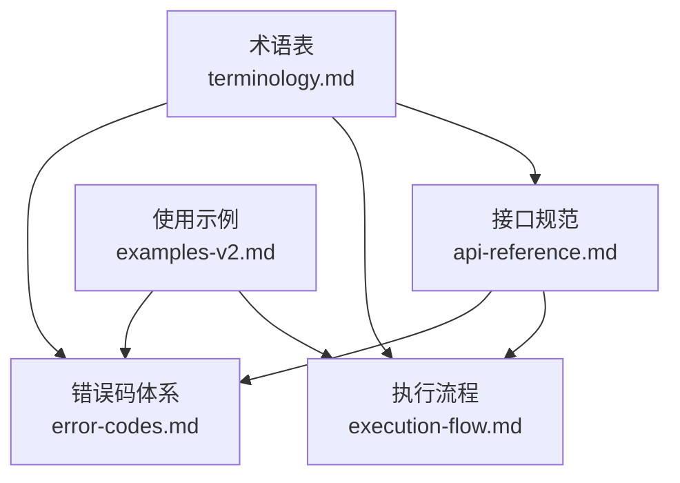
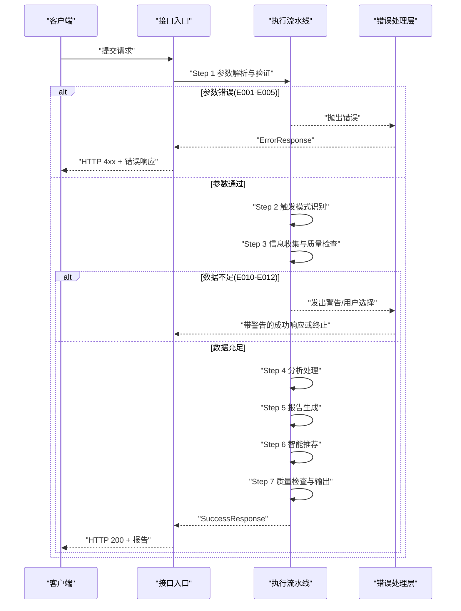
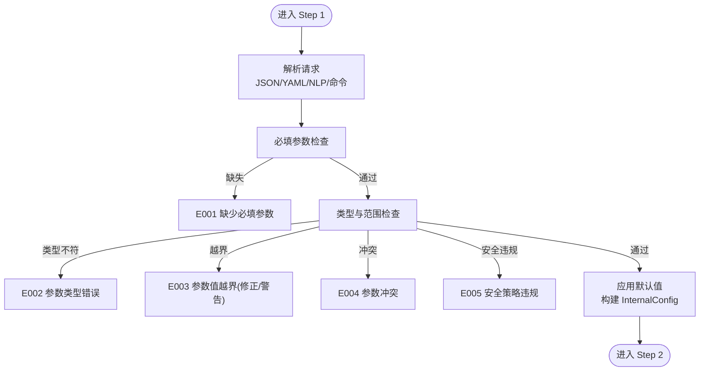
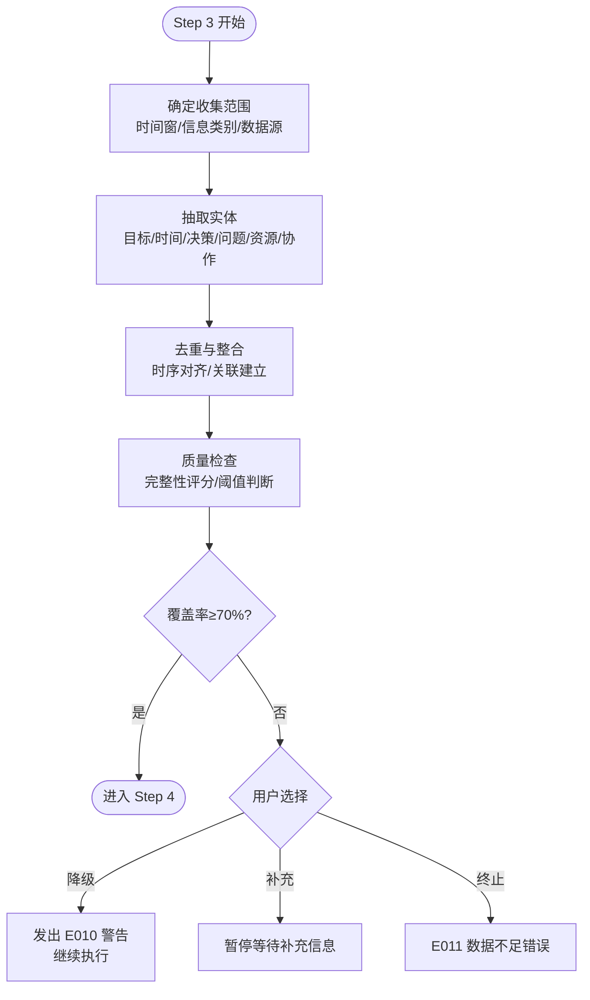
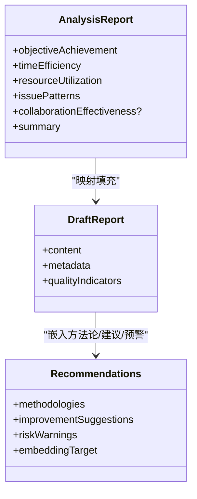
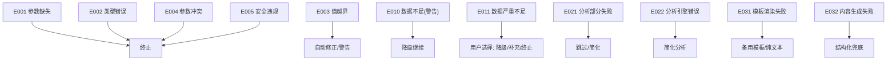
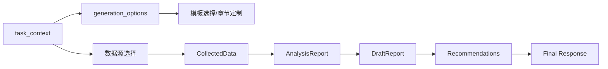

# 测试用例与验证

<cite>
**本文档引用的文件**
- [api-reference.md](file://references/api-reference.md)
- [error-codes.md](file://references/error-codes.md)
- [examples-v2.md](file://references/examples-v2.md)
- [execution-flow.md](file://references/execution-flow.md)
- [terminology.md](file://references/terminology.md)
</cite>

## 目录
1. [简介](#简介)
2. [项目结构](#项目结构)
3. [核心组件](#核心组件)
4. [架构总览](#架构总览)
5. [详细组件分析](#详细组件分析)
6. [依赖分析](#依赖分析)
7. [性能考量](#性能考量)
8. [故障排查指南](#故障排查指南)
9. [结论](#结论)
10. [附录](#附录)

## 简介
本文件面向开发者与测试工程师，系统化梳理“任务执行总结报告生成器”的测试用例与验证体系，覆盖四大核心场景（标准生成、最小参数、参数错误、数据不足降级），明确验证标准、质量保证机制与执行流程，并提供可操作的测试建议与持续改进策略，确保技能在不同输入与环境下稳定、可靠地交付高质量报告。

## 项目结构
- 文档化接口与参数规范：api-reference.md
- 错误码与处理策略：error-codes.md
- 完整使用示例与期望响应：examples-v2.md
- 执行流程与异常路径：execution-flow.md
- 术语与概念定义：terminology.md

**图表来源**
- [api-reference.md:1-1378](file://references/api-reference.md#L1-L1378)
- [error-codes.md:1-1594](file://references/error-codes.md#L1-L1594)
- [examples-v2.md:1-769](file://references/examples-v2.md#L1-L769)
- [execution-flow.md:1-1783](file://references/execution-flow.md#L1-L1783)
- [terminology.md:1-1104](file://references/terminology.md#L1-L1104)

**章节来源**
- [api-reference.md:1-1378](file://references/api-reference.md#L1-L1378)
- [error-codes.md:1-1594](file://references/error-codes.md#L1-L1594)
- [examples-v2.md:1-769](file://references/examples-v2.md#L1-L769)
- [execution-flow.md:1-1783](file://references/execution-flow.md#L1-L1783)
- [terminology.md:1-1104](file://references/terminology.md#L1-L1104)

## 核心组件
- 接口与参数模型：task_context、generation_options、output_config 的字段定义、约束与默认值
- 执行流水线：Step 1-7 的数据流与质量检查
- 错误码与降级策略：参数验证、数据质量、分析引擎、报告生成四类错误的分级与处理
- 质量指标：完整性、准确性、结构完整性、建议质量等

**章节来源**
- [api-reference.md:183-716](file://references/api-reference.md#L183-L716)
- [execution-flow.md:173-1467](file://references/execution-flow.md#L173-L1467)
- [error-codes.md:152-171](file://references/error-codes.md#L152-L171)

## 架构总览
技能执行采用“分层流水线 + 分级异常处理”的设计，确保在参数错误、数据不足、分析异常、生成失败等情况下仍能提供可接受的输出或清晰的错误信息。

**图表来源**
- [execution-flow.md:1474-1485](file://references/execution-flow.md#L1474-L1485)
- [error-codes.md:1470-1584](file://references/error-codes.md#L1470-L1584)
- [api-reference.md:718-800](file://references/api-reference.md#L718-L800)

**章节来源**
- [execution-flow.md:1470-1584](file://references/execution-flow.md#L1470-L1584)
- [error-codes.md:1470-1584](file://references/error-codes.md#L1470-L1584)

## 详细组件分析

### 组件A：参数验证与默认值（Step 1）
- 验证维度：必填性、类型、取值范围、参数冲突、安全策略
- 默认值策略：未提供时按规范应用默认值，确保后续步骤稳定执行
- 失败模式：直接返回错误响应，不进入后续步骤

**图表来源**
- [execution-flow.md:175-310](file://references/execution-flow.md#L175-L310)
- [error-codes.md:173-474](file://references/error-codes.md#L173-L474)

**章节来源**
- [execution-flow.md:175-310](file://references/execution-flow.md#L175-L310)
- [error-codes.md:173-474](file://references/error-codes.md#L173-L474)

### 组件B：信息收集与质量检查（Step 3）
- 数据源：对话历史、操作记录、文件变更、命令日志
- 质量阈值：综合覆盖率≥90%（优秀）、70-90%（良好+警告）、<70%（需用户选择）
- 降级策略：覆盖率不足时发出警告或允许用户选择降级继续

**图表来源**
- [execution-flow.md:441-699](file://references/execution-flow.md#L441-L699)
- [error-codes.md:560-758](file://references/error-codes.md#L560-L758)

**章节来源**
- [execution-flow.md:441-699](file://references/execution-flow.md#L441-L699)
- [error-codes.md:560-758](file://references/error-codes.md#L560-L758)

### 组件C：分析处理与报告生成（Step 4-5）
- 分析维度：目标达成度、时间效能、资源利用率、问题模式、协作效果
- 模板选择：摘要/标准/详细模板，章节裁剪与定制
- 质量检查：结构完整性、内容准确性抽检、最终响应组装

**图表来源**
- [execution-flow.md:868-1146](file://references/execution-flow.md#L868-L1146)
- [execution-flow.md:1307-1328](file://references/execution-flow.md#L1307-L1328)

**章节来源**
- [execution-flow.md:868-1146](file://references/execution-flow.md#L868-L1146)
- [execution-flow.md:1307-1328](file://references/execution-flow.md#L1307-L1328)

### 组件D：异常路径与降级（Step 1-7）
- 参数错误：直接终止，返回错误响应
- 数据质量：发出警告或允许降级继续
- 分析引擎：部分维度跳过或简化分析
- 报告生成：模板回退或结构化兜底

**图表来源**
- [execution-flow.md:1470-1584](file://references/execution-flow.md#L1470-L1584)
- [error-codes.md:1470-1584](file://references/error-codes.md#L1470-L1584)

**章节来源**
- [execution-flow.md:1470-1584](file://references/execution-flow.md#L1470-L1584)
- [error-codes.md:1470-1584](file://references/error-codes.md#L1470-L1584)

## 依赖分析
- 输入依赖：task_context（必填）、generation_options（可选）、output_config（可选）
- 参数依赖：detail_level 与 included/excluded_chapters 的互斥关系、章节编号范围约束
- 数据依赖：对话历史可用性、文件/命令等数据源可达性
- 输出依赖：模板可用性、文件系统写权限

**图表来源**
- [api-reference.md:183-716](file://references/api-reference.md#L183-L716)
- [execution-flow.md:966-1146](file://references/execution-flow.md#L966-L1146)

**章节来源**
- [api-reference.md:183-716](file://references/api-reference.md#L183-L716)
- [execution-flow.md:966-1146](file://references/execution-flow.md#L966-L1146)

## 性能考量
- 总耗时分布：Step 3（信息收集）40-50%、Step 4（分析处理）35-40%、Step 5（报告生成）15-20%
- 性能影响因素：对话轮数、详细程度、数据量
- 建议：在测试中模拟不同规模数据与不同 detail_level，记录各阶段耗时，识别瓶颈

**章节来源**
- [execution-flow.md:142-170](file://references/execution-flow.md#L142-L170)

## 故障排查指南
- 参数错误（E001-E005）：核对必填参数、类型与取值范围、参数间冲突；参考错误响应中的 recovery.suggestions
- 数据不足（E010-E012）：检查对话历史可用性、数据源权限；必要时补充信息后重试
- 分析引擎（E021-E022）：关注缺失数据维度；可稍后重试或简化分析
- 报告生成（E031-E032）：检查模板可用性与内容生成器；系统会自动回退到备用方案

**章节来源**
- [error-codes.md:173-800](file://references/error-codes.md#L173-L800)
- [execution-flow.md:1512-1584](file://references/execution-flow.md#L1512-L1584)

## 结论
通过覆盖四大核心场景的测试用例设计与执行流程验证，结合分级异常处理与降级策略，技能能够在多样化输入与异常条件下稳定交付报告。建议在持续集成中加入参数校验、数据质量、分析完整性与报告结构的自动化检查，以进一步提升质量与可靠性。

## 附录

### A. 四大核心场景测试用例设计
- 场景一：标准开发任务（正向）
  - 输入：完整 task_context + generation_options（detail_level=standard）+ output_config
  - 断言：success=true，质量评分>90，章节完整，文件保存
- 场景二：最小参数调用（正向）
  - 输入：仅 task_name
  - 断言：success=true，使用默认配置，生成报告
- 场景三：参数验证错误（反向）
  - 输入：缺少 task_name、无效 detail_level、章节编号越界、排除全部章节
  - 断言：success=false，error.code=E001/E002/E003/E005，severity=error
- 场景四：数据不足降级（边界）
  - 输入：短对话 + 请求 detailed
  - 断言：success=true，degraded=true，effective_detail_level<requested，质量评分下降，警告标注

**章节来源**
- [examples-v2.md:278-742](file://references/examples-v2.md#L278-L742)
- [execution-flow.md:1470-1584](file://references/execution-flow.md#L1470-L1584)

### B. 质量评估指标
- 质量指标：完整性评分、准确性置信度、结构完整性、建议质量
- 统计指标：总阶段数、总决策数、总问题数、建议数量、方法论提取数、关键指标（达成率、时间效能、资源利用率、问题解决率）

**章节来源**
- [api-reference.md:718-800](file://references/api-reference.md#L718-L800)
- [execution-flow.md:1403-1467](file://references/execution-flow.md#L1403-L1467)

### C. 测试执行标准流程
- 准备：准备测试数据（不同规模对话、不同参数组合）
- 执行：按场景逐一调用接口，记录响应状态、耗时、质量指标
- 校验：比对响应结构、字段类型、数值范围、警告/错误码
- 回归：在变更后执行回归测试，关注关键路径（Step 3-5）

**章节来源**
- [examples-v2.md:708-742](file://references/examples-v2.md#L708-L742)
- [execution-flow.md:1403-1467](file://references/execution-flow.md#L1403-L1467)

### D. 持续改进建议
- 增加边界与异常测试：超长任务名、特殊字符、极端数据量
- 性能回归测试：不同 detail_level 与数据规模下的耗时基线
- 可观测性增强：在流水线中记录各步骤耗时与质量指标，便于趋势分析
- 用户反馈闭环：收集真实使用场景中的问题，补充测试用例

**章节来源**
- [execution-flow.md:142-170](file://references/execution-flow.md#L142-L170)
- [terminology.md:1-1104](file://references/terminology.md#L1-L1104)