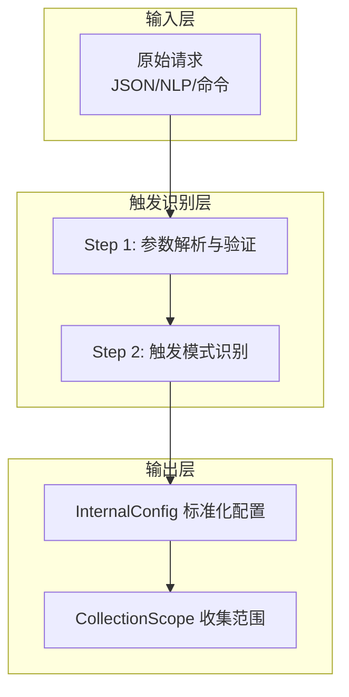
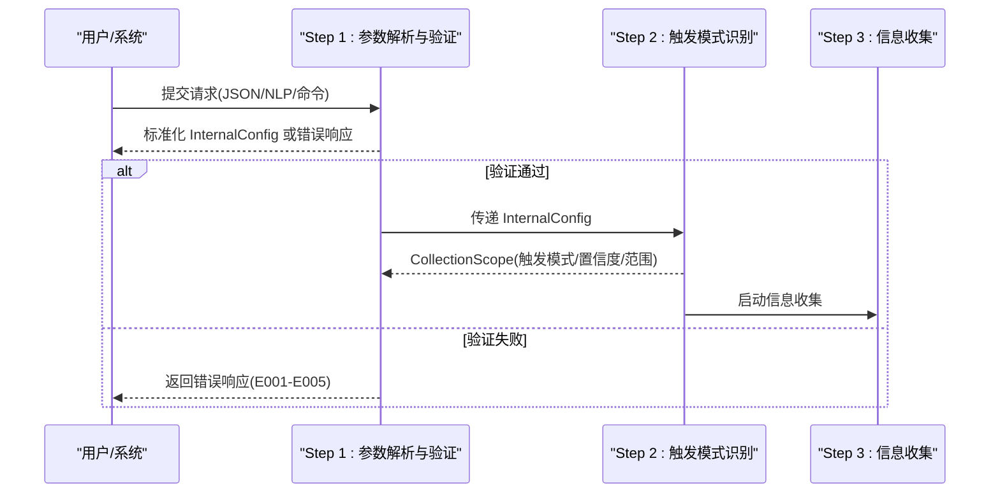
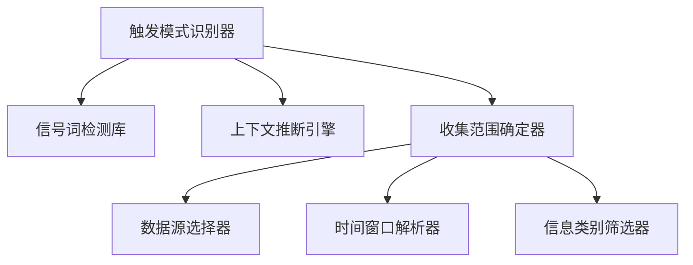

# 触发机制详解

<cite>
**本文档引用的文件**
- [api-reference.md](file://references/api-reference.md)
- [execution-flow.md](file://references/execution-flow.md)
- [error-codes.md](file://references/error-codes.md)
- [examples-v2.md](file://references/examples-v2.md)
- [terminology.md](file://references/terminology.md)
</cite>

## 目录
1. [简介](#简介)
2. [项目结构](#项目结构)
3. [核心组件](#核心组件)
4. [架构总览](#架构总览)
5. [详细组件分析](#详细组件分析)
6. [依赖分析](#依赖分析)
7. [性能考量](#性能考量)
8. [故障排查指南](#故障排查指南)
9. [结论](#结论)
10. [附录](#附录)

## 简介
本文件聚焦“任务执行总结报告生成器”的触发机制，系统阐述三种触发模式的工作原理、应用场景与选择策略，并详细说明触发确认策略（任务复杂度判断、重要决策识别、重复性操作处理）与边界情况处理。文档基于技能的执行流程与错误码体系，提供面向开发者与用户的实用指南。

## 项目结构
本技能的触发机制贯穿执行流程的前两个步骤：Step 1（参数解析与验证）与Step 2（触发模式识别）。二者共同决定后续信息收集与分析的范围与质量。

**图表来源**
- [execution-flow.md: Step 1 参数解析与验证:175-311](file://references/execution-flow.md#L175-L311)
- [execution-flow.md: Step 2 触发模式识别:313-439](file://references/execution-flow.md#L313-L439)

**章节来源**
- [execution-flow.md: Step 1 参数解析与验证:175-311](file://references/execution-flow.md#L175-L311)
- [execution-flow.md: Step 2 触发模式识别:313-439](file://references/execution-flow.md#L313-L439)

## 核心组件
- 触发模式识别器：根据信号词、显式命令与上下文推断，判定自动/手动/命令式触发，并输出置信度与收集范围。
- 触发确认策略：基于任务复杂度、重要决策识别与重复性操作处理，决定是否进入信息收集阶段及收集范围。
- 触发确认指标：完成信号词、隐含意图、上下文暗示、时间窗口、协作信息存疑等。

**章节来源**
- [execution-flow.md: Step 2 触发模式识别:313-439](file://references/execution-flow.md#L313-L439)

## 架构总览
触发机制在执行流程中的位置如下：

**图表来源**
- [execution-flow.md: Step 1 参数解析与验证:175-311](file://references/execution-flow.md#L175-L311)
- [execution-flow.md: Step 2 触发模式识别:313-439](file://references/execution-flow.md#L313-L439)

**章节来源**
- [execution-flow.md: Step 1 参数解析与验证:175-311](file://references/execution-flow.md#L175-L311)
- [execution-flow.md: Step 2 触发模式识别:313-439](file://references/execution-flow.md#L313-L439)

## 详细组件分析

### 自动触发（显式关键词匹配、隐式意图识别、场景推断）
- 显式关键词匹配：检测明确的完成信号词（如“完成了”、“好了”、“成功了”等），结合任务复杂度阈值（>中等）判定触发。
- 隐式意图识别：通过“帮我总结一下”“回顾一下”“复盘”“做得怎么样”等表达，识别潜在触发意图。
- 场景推断：基于上下文暗示（连续多个操作后停顿、用户切换话题前的过渡语、询问保存或导出）进行推断。
- 触发确认策略：
  - 任务复杂度判断：通过对话轮数、决策数量、问题数量等指标评估复杂度，仅在复杂度高于阈值时自动触发。
  - 重要决策识别：若对话中存在“决定用/选择了/改为/采用”等决策信号，则提升触发置信度。
  - 重复性操作处理：对频繁出现的“生成总结”“导出报告”等重复请求，采用静默确认或快速通道。
- 典型场景：用户在完成一系列开发/运维/学习任务后，自然表达“完成了”，系统据此自动触发生成流程。

**章节来源**
- [execution-flow.md: Step 2 触发模式识别:313-439](file://references/execution-flow.md#L313-L439)
- [execution-flow.md: Step 3 信息收集阶段:441-699](file://references/execution-flow.md#L441-L699)

### 手动触发（快捷命令、直接请求、明确要求）
- 快捷命令：以“/summary”“/report”等命令触发，置信度100%，直接进入信息收集阶段。
- 直接请求：用户明确表达“请生成总结”“做个复盘”等，系统解析为手动触发。
- 明确要求：用户指定任务类型、详细程度、模板变体等，系统据此调整收集范围与生成策略。
- 触发确认策略：
  - 时间范围不明：使用全量范围（从首次需求到最后操作）。
  - 任务边界模糊：优先最近一个完整任务周期。
  - 协作信息存疑：检测参与者数量，单人模式默认不包含团队协作章节。
- 典型场景：项目管理场景中，PM在回顾会议前直接请求生成Sprint复盘报告。

**章节来源**
- [execution-flow.md: Step 2 触发模式识别:313-439](file://references/execution-flow.md#L313-L439)
- [execution-flow.md: Step 3 信息收集阶段:441-699](file://references/execution-flow.md#L441-L699)

### 命令式调用（参数化定制）
- 参数化定制：通过API调用或脚本触发，显式提供任务上下文、生成选项与输出配置。
- 触发确认策略：
  - 信息收集范围：根据任务类型、时间范围、参与者等参数确定数据源与信息类别。
  - 用户意图澄清：若参数冲突或歧义，系统提供恢复建议或默认假设。
- 典型场景：CI/CD流水线中，自动触发生成部署后的任务总结报告。

**章节来源**
- [api-reference.md: 输入参数完整定义:183-715](file://references/api-reference.md#L183-L715)
- [execution-flow.md: Step 2 触发模式识别:313-439](file://references/execution-flow.md#L313-L439)

### 触发确认策略与边界情况
- 任务复杂度判断：对话轮数、决策数量、问题数量、资源使用情况等综合评估，仅在复杂度高于阈值时自动触发。
- 重要决策识别：通过实体抽取识别“决策实体”，并建立与问题、资源的关联，提升触发置信度。
- 重复性操作处理：对高频触发请求采用快速通道或静默确认，避免重复生成。
- 边界情况处理：
  - 时间范围不明：使用全量范围。
  - 任务边界模糊：优先最近完整任务周期。
  - 协作信息存疑：单人任务默认不包含团队协作章节。
  - 参数冲突：提供恢复建议，引导用户选择或移除冲突参数。

**章节来源**
- [execution-flow.md: Step 2 触发模式识别:313-439](file://references/execution-flow.md#L313-L439)
- [execution-flow.md: Step 3 信息收集阶段:441-699](file://references/execution-flow.md#L441-L699)
- [error-codes.md: E004 冲突参数:401-474](file://references/error-codes.md#L401-L474)

### 触发模式之间的区别与选择策略
- 自动触发：适用于用户完成任务后自然表达完成意图的场景，需满足复杂度阈值与置信度要求。
- 手动触发：适用于明确表达需求或使用快捷命令的场景，置信度最高，适合快速生成。
- 命令式调用：适用于自动化集成与参数化定制场景，适合CI/CD、批量生成等。
- 选择策略：
  - 若用户表达模糊或任务简单，优先手动触发或命令式调用。
  - 若用户已完成复杂任务且表达完成意图，可采用自动触发。
  - 在自动化场景中，优先使用命令式调用以确保可控性与可追溯性。

**章节来源**
- [execution-flow.md: Step 2 触发模式识别:313-439](file://references/execution-flow.md#L313-L439)
- [api-reference.md: 输入参数完整定义:183-715](file://references/api-reference.md#L183-L715)

## 依赖分析
触发机制的依赖关系如下：

**图表来源**
- [execution-flow.md: Step 2 触发模式识别:313-439](file://references/execution-flow.md#L313-L439)

**章节来源**
- [execution-flow.md: Step 2 触发模式识别:313-439](file://references/execution-flow.md#L313-L439)

## 性能考量
- 触发识别耗时：< 2 秒，主要消耗在信号词匹配与上下文推断。
- 参数解析与验证：< 1 秒，确保输入合法性与默认值应用。
- 信息收集阶段为核心瓶颈，占总耗时的 40-50%，触发确认策略有助于缩小收集范围，提升整体性能。

**章节来源**
- [execution-flow.md: Step 1 参数解析与验证:175-311](file://references/execution-flow.md#L175-L311)
- [execution-flow.md: Step 2 触发模式识别:313-439](file://references/execution-flow.md#L313-L439)

## 故障排查指南
- 参数验证错误（E001-E005）：检查必填参数、类型、范围与冲突，参考错误响应中的恢复建议。
- 数据质量错误（E010-E012）：当信息覆盖率不足时，系统可能降级或要求用户补充信息。
- 分析引擎错误（E021-E022）：部分分析失败时跳过该维度，核心分析失败时回退到简化模式。
- 报告生成错误（E031-E032）：模板渲染失败时回退到备用模板，内容生成失败时直接组装基础报告。

**章节来源**
- [error-codes.md: 错误码定义:1-800](file://references/error-codes.md#L1-L800)
- [execution-flow.md: 异常路径汇总:1470-1600](file://references/execution-flow.md#L1470-L1600)

## 结论
触发机制通过“自动触发+手动触发+命令式调用”的组合，覆盖从自然语言到自动化集成的全场景需求。触发确认策略以任务复杂度、重要决策识别与重复性操作处理为核心，结合信号词检测、隐式意图识别与上下文推断，确保在合适时机生成高质量的总结报告。开发者可根据场景选择合适的触发模式，并利用错误码与降级策略提升系统的鲁棒性与用户体验。

## 附录
- 触发模式示例与边界情况可参考示例文档中的“最小参数调用”“参数验证错误”“数据不足时的降级执行”等场景。
- 术语表提供了任务执行、目标评估、时间效率、问题与风险、资源与协作、报告结构、项目管理、软件开发、学习方法论与质量改进等专业术语，便于理解触发确认策略中的关键概念。

**章节来源**
- [examples-v2.md: 示例 2 最小参数调用:168-275](file://references/examples-v2.md#L168-L275)
- [examples-v2.md: 示例 3 参数验证错误:278-422](file://references/examples-v2.md#L278-L422)
- [examples-v2.md: 示例 4 数据不足时的降级执行:461-688](file://references/examples-v2.md#L461-L688)
- [terminology.md: 术语表:1-800](file://references/terminology.md#L1-L800)