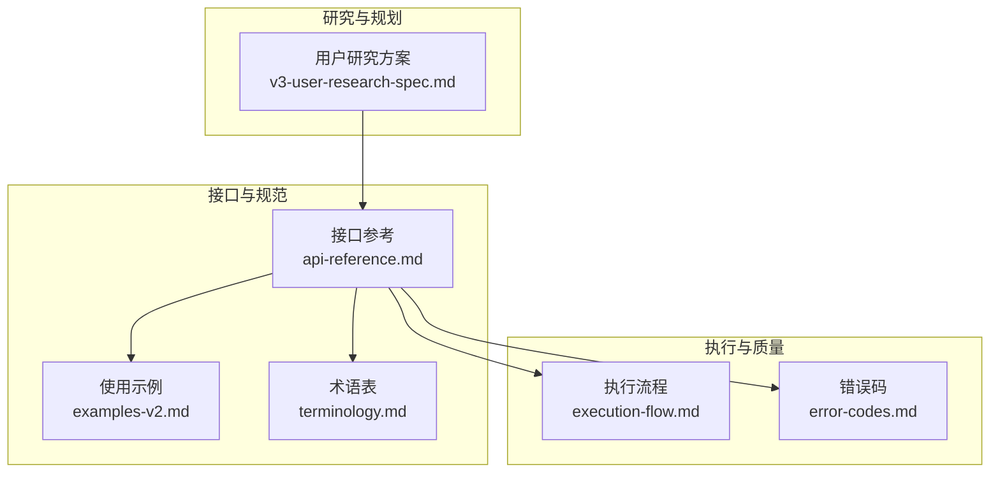
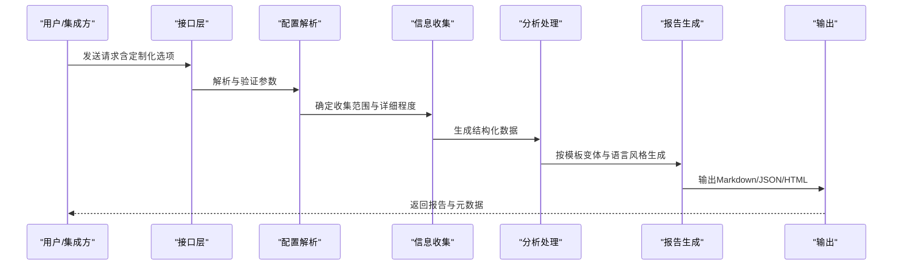
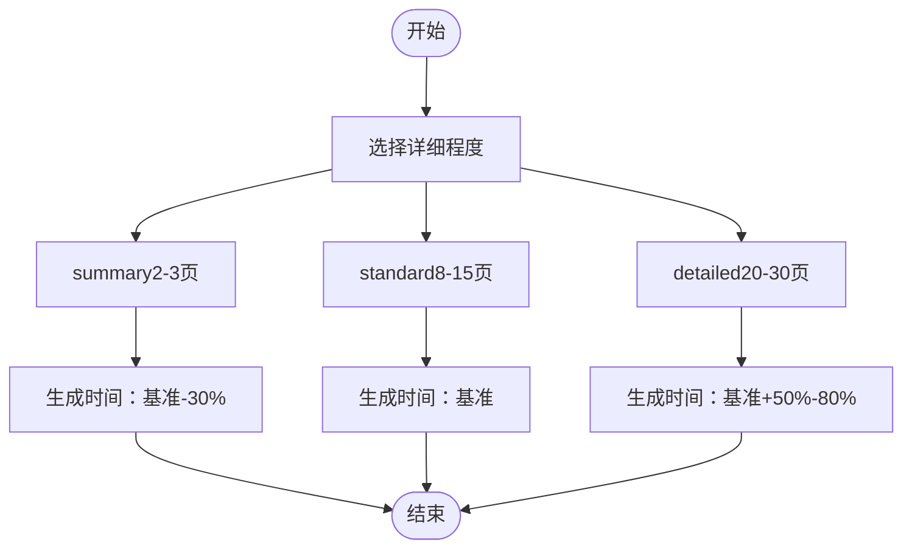
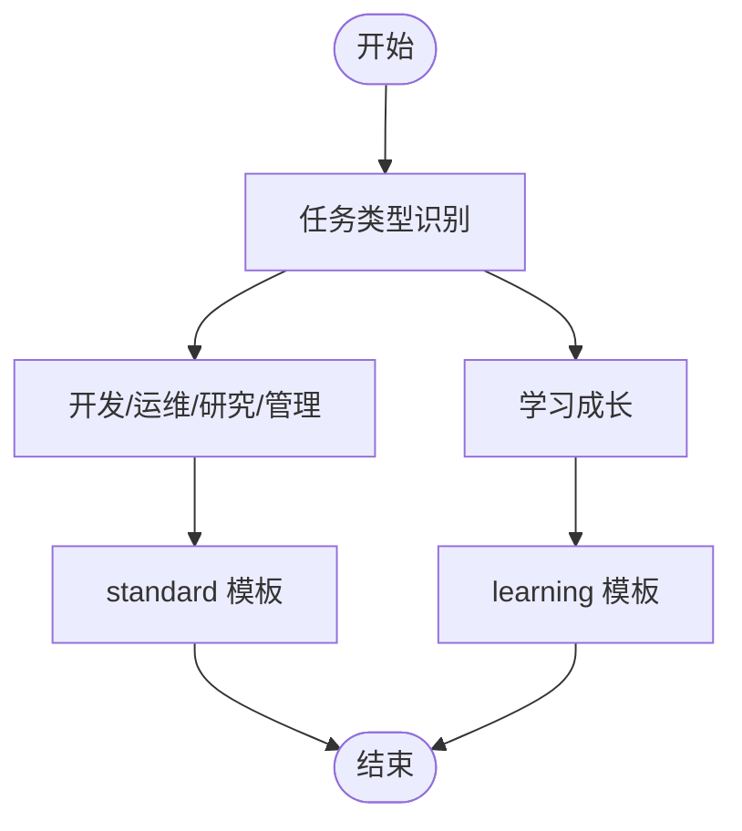
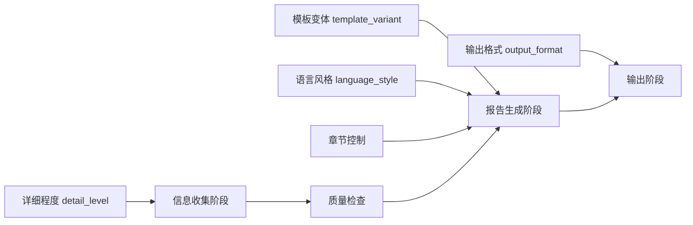

# 定制化选项配置

<cite>
**本文档引用的文件**
- [api-reference.md](file://references/api-reference.md)
- [examples-v2.md](file://references/examples-v2.md)
- [execution-flow.md](file://references/execution-flow.md)
- [error-codes.md](file://references/error-codes.md)
- [terminology.md](file://references/terminology.md)
- [v3-user-research-spec.md](file://references/v3-planning/v3-user-research-spec.md)
</cite>

## 目录
1. [简介](#简介)
2. [项目结构](#项目结构)
3. [核心组件](#核心组件)
4. [架构总览](#架构总览)
5. [详细组件分析](#详细组件分析)
6. [依赖分析](#依赖分析)
7. [性能考量](#性能考量)
8. [故障排查指南](#故障排查指南)
9. [结论](#结论)
10. [附录](#附录)

## 简介
本文件面向“任务执行总结报告生成器”的使用者与集成者，系统化阐述定制化选项的配置与使用策略，包括：
- 详细程度配置（摘要版、标准版、详细版）的适用场景、包含内容、预计篇幅与生成时间
- 模板变体选择（通用标准模板、学习专用模板）的特点与适用场景
- 语言风格设置（专业风格、轻松风格、学术风格）的使用指南
- 输出格式规范（Markdown主格式、JSON结构化、HTML可读格式）与命名约定
- 各种组合配置的最佳实践与选择策略，帮助用户根据不同受众与场景选择最优报告配置

## 项目结构
本项目以“接口参考文档”为核心，配套“使用示例”“执行流程”“错误码”“术语表”“用户研究方案”等资料，形成“输入参数—生成流程—输出规范—质量保障”的完整闭环。

**图表来源**
- [api-reference.md:1-1378](file://references/api-reference.md#L1-L1378)
- [examples-v2.md:1-769](file://references/examples-v2.md#L1-L769)
- [execution-flow.md:1-1783](file://references/execution-flow.md#L1-L1783)
- [error-codes.md:1-1594](file://references/error-codes.md#L1-L1594)
- [terminology.md:1-1104](file://references/terminology.md#L1-L1104)
- [v3-user-research-spec.md:1-1204](file://references/v3-planning/v3-user-research-spec.md#L1-L1204)

**章节来源**
- [api-reference.md:1-1378](file://references/api-reference.md#L1-L1378)
- [examples-v2.md:1-769](file://references/examples-v2.md#L1-L769)
- [execution-flow.md:1-1783](file://references/execution-flow.md#L1-L1783)
- [error-codes.md:1-1594](file://references/error-codes.md#L1-L1594)
- [terminology.md:1-1104](file://references/terminology.md#L1-L1104)
- [v3-user-research-spec.md:1-1204](file://references/v3-planning/v3-user-research-spec.md#L1-L1204)

## 核心组件
- 详细程度配置（detail_level）
  - summary（摘要版）：仅核心章节，适合快速汇报、周报、管理层简报、日常站会纪要
  - standard（标准版，默认）：完整10章结构，标准详细程度，适合常规任务复盘、项目文档归档、知识分享、月度/季度总结
  - detailed（详细深度版）：所有10章完整且深入，包含细粒度原始数据、趋势图表、10-15条建议、完整附录，适合复杂项目深度复盘、审计需求、培训材料、重大故障事后分析
- 模板变体（template_variant）
  - standard（默认）：适用于大多数任务类型
  - learning（学习专用模板）：强调知识掌握、学习方法论、成长路径，章节角度调整，适合学习项目、课程总结、技能认证备考回顾
- 语言风格（language_style）
  - professional（默认）：专业、客观、准确，适合正式报告、项目归档、对外分享
  - casual：轻松、亲切、易懂，适合团队内部交流、个人笔记、非正式场合
  - academic：严谨、学术化，适合研究报告、论文支撑材料、学术交流
- 输出格式（output_format）
  - markdown（默认）：结构化标记，层次清晰，广泛支持，可直接渲染为HTML/PDF
  - json：结构化数据，便于程序解析和二次处理
  - html：可直接在浏览器中查看，样式美观
- 文件命名与存储（output_config）
  - 自动生成命名规范：task-summary-[任务名称简写]-YYYYMMDD-HHmmss.[ext]
  - 可自定义文件路径，扩展名需与输出格式匹配
  - 支持追加到已有文件、编码设置、自定义头部/尾部

**章节来源**
- [api-reference.md:380-714](file://references/api-reference.md#L380-L714)
- [examples-v2.md:1-769](file://references/examples-v2.md#L1-L769)

## 架构总览
定制化选项贯穿“参数解析—触发识别—信息收集—分析处理—报告生成—智能推荐—质量检查—输出”的全流程，确保在不同配置下稳定产出符合预期的报告。

**图表来源**
- [execution-flow.md:173-721](file://references/execution-flow.md#L173-L721)
- [api-reference.md:380-714](file://references/api-reference.md#L380-L714)

**章节来源**
- [execution-flow.md:1-1783](file://references/execution-flow.md#L1-L1783)
- [api-reference.md:1-1378](file://references/api-reference.md#L1-L1378)

## 详细组件分析

### 详细程度配置（summary/standard/detailed）
- 适用场景与篇幅
  - summary：2-3页（500-800字），仅核心章节（第1章完整 + 第10章摘要 + 其他章节仅标题和数据点），适合快速汇报、管理层简报
  - standard：8-15页（3000-5000字），完整10章结构，标准详细程度，适合常规复盘与归档
  - detailed：20-30页（8000-15000字），所有10章深入展开，细粒度数据与图表、10-15条建议、完整附录，适合深度复盘与审计
- 生成时间与性能
  - 详细程度越高，信息收集与分析处理阶段耗时越长，标准版通常在2-8分钟范围内，详细版可能增加50%-80%
- 选择策略
  - 管理层简报：summary
  - 常规复盘：standard
  - 审计/培训/重大事件：detailed

**图表来源**
- [execution-flow.md:142-170](file://references/execution-flow.md#L142-L170)
- [api-reference.md:384-418](file://references/api-reference.md#L384-L418)

**章节来源**
- [api-reference.md:384-418](file://references/api-reference.md#L384-L418)
- [execution-flow.md:142-170](file://references/execution-flow.md#L142-L170)

### 模板变体（standard/learning）
- standard（默认）：结构完整、分析深入，适合绝大多数任务类型
- learning（学习专用模板）：将第七章从“团队协作分析”替换为“学习支持系统”，强化第九章（知识体系与方法论沉淀）和第十章（后续学习路线图），增加学习效率评估、技能等级自评等学习特有维度，适合学习项目、课程总结、技能认证备考回顾
- 选择策略
  - 学习/成长类任务：learning
  - 其他任务：standard

**图表来源**
- [api-reference.md:424-448](file://references/api-reference.md#L424-L448)

**章节来源**
- [api-reference.md:424-448](file://references/api-reference.md#L424-L448)

### 语言风格（professional/casual/academic）
- professional（默认）：适合正式报告、项目归档、对外分享
- casual：适合团队内部交流、个人笔记、非正式场合
- academic：适合研究报告、论文支撑材料、学术交流
- 选择策略
  - 正式对外：professional
  - 内部沟通：casual
  - 学术场景：academic

**章节来源**
- [api-reference.md:487-503](file://references/api-reference.md#L487-L503)

### 输出格式与命名规范
- 输出格式
  - markdown（默认）：结构清晰、广泛支持、可渲染为HTML/PDF
  - json：便于程序化处理与二次加工
  - html：可直接浏览器查看
- 命名规范
  - 自动生成：task-summary-[任务名称简写]-YYYYMMDD-HHmmss.[ext]
  - 自定义路径：需与输出格式扩展名匹配（.md/.json/.html）
- 选择策略
  - 需要版本控制与渲染：markdown
  - 需要程序化处理：json
  - 需要直接分享与阅读：html

**章节来源**
- [api-reference.md:534-573](file://references/api-reference.md#L534-L573)
- [api-reference.md:624-632](file://references/api-reference.md#L624-L632)

### 章节选择与质量控制
- 章节控制
  - included_chapters/excluded_chapters：章节编号1-10，至少保留第1、9、10章，且二者互斥
  - 建议保留：执行概览、经验总结、改进建议（核心价值章节）
- 质量控制
  - 信息覆盖率不足时触发降级（E010），报告仍可生成但标注“信息有限”
  - 严重参数错误（E001-E005）将终止执行并返回错误

**章节来源**
- [api-reference.md:450-486](file://references/api-reference.md#L450-L486)
- [error-codes.md:560-668](file://references/error-codes.md#L560-L668)

## 依赖分析
定制化选项与执行流程的耦合关系如下：

**图表来源**
- [execution-flow.md:173-721](file://references/execution-flow.md#L173-L721)
- [api-reference.md:380-714](file://references/api-reference.md#L380-L714)

**章节来源**
- [execution-flow.md:173-721](file://references/execution-flow.md#L173-L721)
- [api-reference.md:380-714](file://references/api-reference.md#L380-L714)

## 性能考量
- 详细程度对耗时影响显著：标准版为基准，摘要版可降低30%，详细版增加50%-80%
- 信息收集阶段（Step 3）是核心瓶颈，对话轮数越多耗时越高
- 降级执行（E010）可在数据不足时继续生成，但质量评分下降

**章节来源**
- [execution-flow.md:142-170](file://references/execution-flow.md#L142-L170)
- [error-codes.md:560-668](file://references/error-codes.md#L560-L668)

## 故障排查指南
- 参数错误（E001-E005）
  - 缺少必填参数、类型错误、值越界、参数冲突、无效章节组合
  - 处理：根据错误详情与恢复建议修正参数后重试
- 数据不足（E010）
  - 信息覆盖率不足触发降级，报告仍可生成但标注“信息有限”
  - 处理：补充任务细节后重新生成，或在报告中标注处手动补充
- 文件/权限问题（E012）
  - 输出目录无写入权限或路径不存在
  - 处理：检查权限与路径，更换到有权限位置

**章节来源**
- [error-codes.md:177-800](file://references/error-codes.md#L177-L800)
- [api-reference.md:590-714](file://references/api-reference.md#L590-L714)

## 结论
- 选择“标准版+通用模板+专业风格+Markdown”作为默认配置，覆盖绝大多数场景
- 管理层简报与快速汇报使用“摘要版”，复杂项目与审计使用“详细版”
- 学习成长类任务优先使用“学习模板”，其他任务使用“通用模板”
- 输出格式按受众选择：正式对外用Markdown，程序化处理用JSON，直接分享用HTML
- 遇到参数错误与数据不足时，依据错误码与恢复建议快速修复与补充

## 附录
- 术语参考：可快速查阅“任务执行基础术语”“报告结构术语”“项目管理术语”“软件开发术语”“学习方法论术语”等，辅助理解报告结构与分析维度
- 用户研究方案：为V3功能规划提供用户需求与优先级依据，有助于在定制化选项基础上进一步优化报告内容与呈现

**章节来源**
- [terminology.md:1-1104](file://references/terminology.md#L1-L1104)
- [v3-user-research-spec.md:1-1204](file://references/v3-user-research-spec.md#L1-L1204)