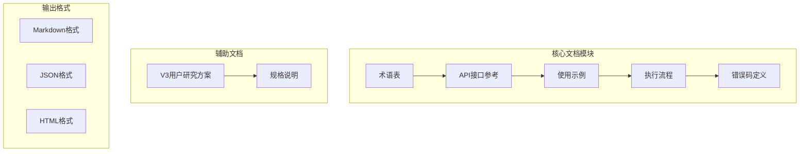
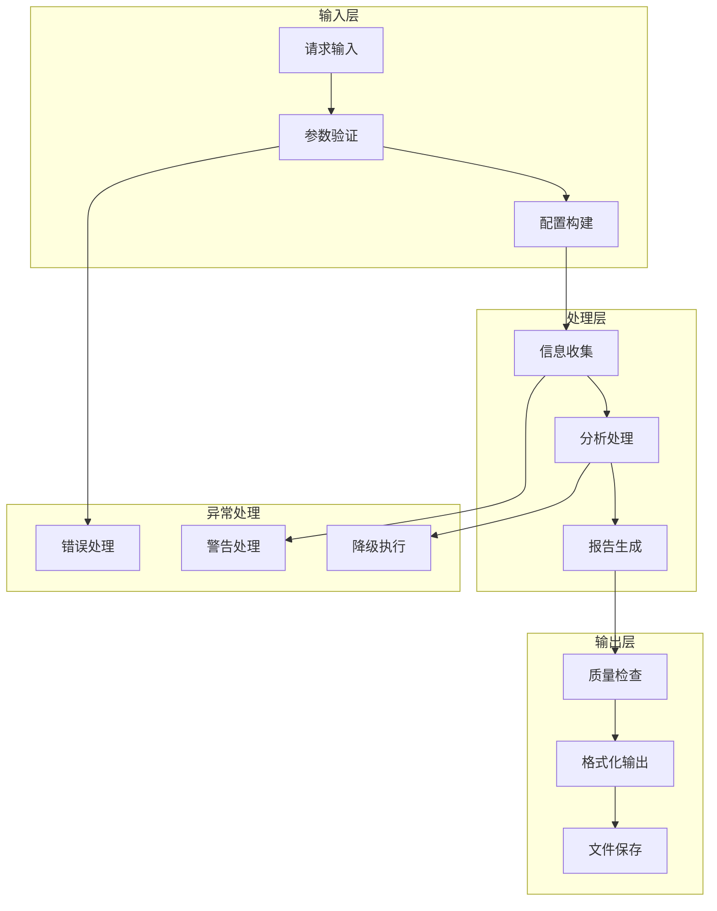
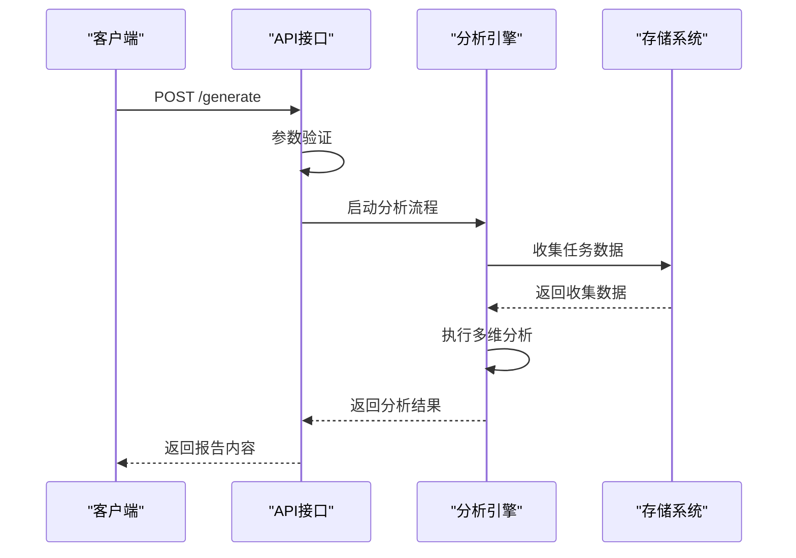
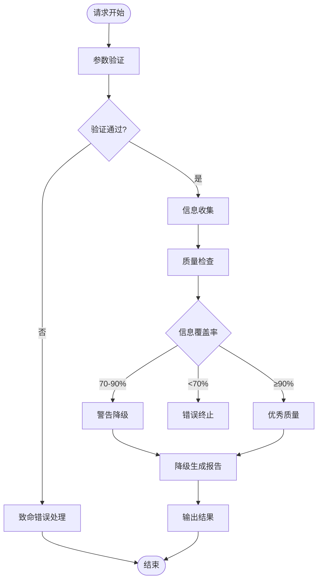
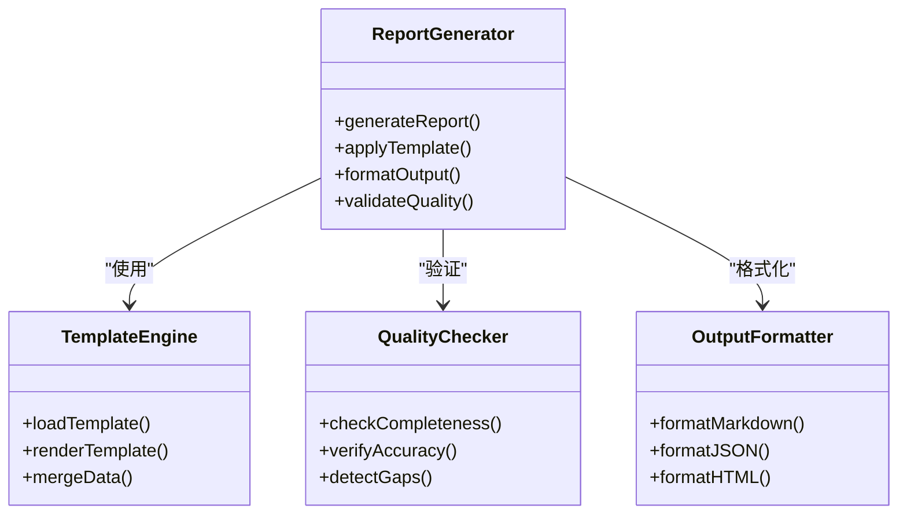
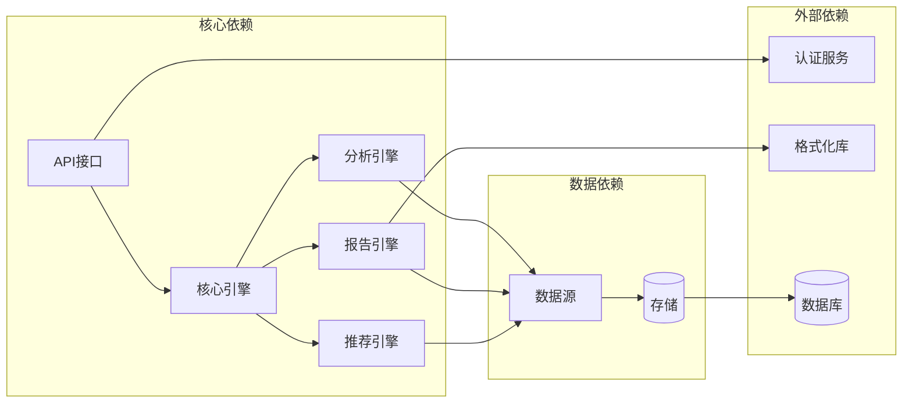
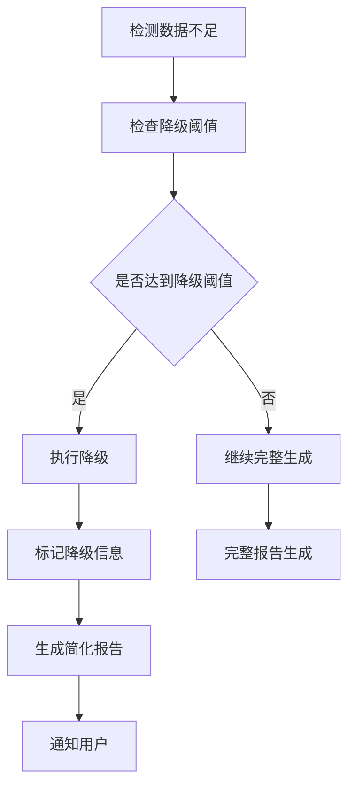

# 标准10章结构详解

<cite>
**本文档引用的文件**
- [api-reference.md](file://references/api-reference.md)
- [error-codes.md](file://references/error-codes.md)
- [examples-v2.md](file://references/examples-v2.md)
- [execution-flow.md](file://references/execution-flow.md)
- [terminology.md](file://references/terminology.md)
- [v3-user-research-spec.md](file://references/v3-user-research-spec.md)
</cite>

## 目录
1. [引言](#引言)
2. [项目结构](#项目结构)
3. [核心组件](#核心组件)
4. [架构概览](#架构概览)
5. [详细组件分析](#详细组件分析)
6. [依赖分析](#依赖分析)
7. [性能考虑](#性能考虑)
8. [故障排除指南](#故障排除指南)
9. [结论](#结论)
10. [附录](#附录)

## 引言

本文档为任务执行总结报告的标准10章结构创建详细的技术文档，基于"任务执行总结报告生成器"技能的完整技术规范。该技能通过四大核心引擎协同工作，为用户提供结构化的任务执行总结报告生成能力。

**核心能力概述**：
- 信息收集引擎：从对话历史和相关文件中全面提取任务执行的关键信息
- 分析处理引擎：对收集到的信息进行深度分析和多维度评估
- 报告生成引擎：按照规范模板将分析结果转化为结构化报告
- 智能推荐引擎：生成针对性的改进建议和可复用的方法论

## 项目结构

项目采用模块化设计，包含API接口参考、错误码定义、使用示例、执行流程和术语表等核心文档：

**图表来源**
- [api-reference.md:1-1378](file://references/api-reference.md#L1-L1378)
- [execution-flow.md:1-1783](file://references/execution-flow.md#L1-L1783)

**章节来源**
- [api-reference.md:1-1378](file://references/api-reference.md#L1-L1378)
- [execution-flow.md:1-1783](file://references/execution-flow.md#L1-L1783)

## 核心组件

### 1. 执行概览（第一章）

**内容要点**：
- 任务基本信息：任务名称、类型、执行时间、报告生成时间
- 核心成果概述：目标达成度、关键数据指标
- 亮点与挑战：Top 3成就、最大挑战识别
- 质量评分：综合质量评估（90分以上为优秀）

**数据来源要求**：
- 必填：task_name、task_type
- 建议：time_range.start_time、time_range.end_time
- 可选：description、participants

**写作规范**：
- 采用"一页纸式"高度浓缩概述
- 突出关键数据和核心结论
- 控制在2-3页篇幅（摘要版）

**质量标准**：
- 信息完整性：≥90%
- 准确性：≥95%
- 可读性：专业、简洁、易理解

### 2. 任务背景与目标（第二章）

**内容要点**：
- 初始目标设定：SMART原则的明确目标
- 目标调整记录：变更原因、调整内容、影响评估
- 最终成果清单：已完成/延后功能列表
- 约束条件：工期、预算、技术限制

**数据来源要求**：
- 任务描述、目标声明
- 进度变更记录
- 成果验收标准

**写作规范**：
- 目标分解为可衡量指标
- 变更记录包含量化影响
- 成果清单使用清单格式

**质量标准**：
- 目标清晰度：明确、可验证
- 完整性：涵盖所有重要背景信息
- 一致性：与执行过程相匹配

### 3. 执行过程详解（第三章）

**内容要点**：
- 分阶段执行记录：阶段划分、关键活动、产出物
- 时间线：各阶段耗时、里程碑节点
- 关键事件：重要决策点、问题发生时间
- 产出物：代码文件、文档、配置等

**数据来源要求**：
- 对话历史中的时间戳
- 操作记录和文件变更
- 任务分解和里程碑

**写作规范**：
- 按时间顺序组织内容
- 突出关键转折点
- 量化各阶段成果

**质量标准**：
- 时间准确性：基于可靠时间戳
- 过程完整性：涵盖主要执行环节
- 逻辑连贯性：阶段间的因果关系

### 4. 关键决策分析（第四章）

**内容要点**：
- 决策清单：D1、D2、D3...编号
- 备选方案对比：维度、利弊分析
- 选择依据：决策标准、权衡考量
- 事后评估：决策效果、经验总结

**数据来源要求**：
- 对话历史中的决策讨论
- 备选方案的详细描述
- 决策结果和影响

**写作规范**：
- 标准化决策格式
- 完整的对比分析
- 客观的评估标准

**质量标准**：
- 决策完整性：涵盖重要决策
- 分析深度：包含多维度考量
- 评估客观性：基于事实和数据

### 5. 问题与解决方案（第五章）

**内容要点**：
- 问题总览：问题分类统计、严重程度
- 详细解决过程：根因分析、解决步骤、验证结果
- 模式分析：问题重复出现的规律
- 经验教训：预防措施、改进建议

**数据来源要求**：
- 问题描述和解决记录
- 根因分析结果
- 解决方案的效果验证

**写作规范**：
- 问题分类标准化
- 解决过程可追溯
- 经验教训可复用

**质量标准**：
- 问题识别完整性：涵盖主要问题
- 解决方案有效性：可验证的解决方案
- 预防措施针对性：针对重复性问题

### 6. 资源使用情况（第六章）

**内容要点**：
- 人力投入：角色、时间、职责
- 技术栈使用：工具、框架、库
- 工具依赖：开发、测试、部署工具
- 效率评估：资源利用率、成本效益

**数据来源要求**：
- 参与者信息和职责
- 技术栈使用记录
- 工具使用日志

**写作规范**：
- 资源分类清晰
- 效率指标量化
- 成本效益分析

**质量标准**：
- 资源统计完整性：涵盖主要资源
- 效率评估客观性：基于实际使用数据
- 改进建议实用性：可操作的优化方案

### 7. 团队协作分析（第七章）

**内容要点**：
- 协作概况：参与人员、协作周期
- 协作效能评估：沟通效率、分工合理性
- 协作亮点：成功的协作模式
- 待改进项：协作中的问题和改进方向

**数据来源要求**：
- 团队成员信息
- 沟通记录和协作活动
- 任务分配和完成情况

**写作规范**：
- 协作维度全面
- 评估指标量化
- 改进建议具体化

**质量标准**：
- 协作分析完整性：涵盖主要协作环节
- 评估客观性：基于实际协作数据
- 建议可操作性：可立即实施的改进

### 8. 多维分析汇总（第八章）

**内容要点**：
- 目标达成度分析：SMART目标评估
- 时间效能分析：时效比、瓶颈识别
- 问题模式分析：高频问题识别
- 综合评价：五维分析结果

**数据来源要求**：
- 目标完成度数据
- 时间消耗统计
- 问题解决记录

**写作规范**：
- 分析维度标准化
- 数据可视化支持
- 结论基于证据

**质量标准**：
- 分析深度：涵盖主要分析维度
- 数据准确性：基于可靠统计数据
- 结论可验证性：可追溯的分析过程

### 9. 经验总结与方法论（第九章）

**内容要点**：
- 成功要素提炼：关键成功因素
- 方法论提炼：可复用的方法和流程
- 最佳实践沉淀：经过验证的做法
- 知识图谱更新：新知识的结构化

**数据来源要求**：
- 成功案例和经验
- 方法论抽象过程
- 知识结构化结果

**写作规范**：
- 方法论结构化
- 实践案例支撑
- 知识体系化

**质量标准**：
- 经验总结实用性：可指导后续工作
- 方法论完整性：涵盖主要流程
- 知识体系逻辑性：结构清晰、易于检索

### 10. 改进建议与行动计划（第十章）

**内容要点**：
- 建议分级：P0-P4优先级
- 行动计划：具体措施、责任人、截止日期
- 风险预警：潜在风险和缓解措施
- 工具推荐：提升效率的工具和资源

**数据来源要求**：
- 分析结果和问题识别
- 最佳实践和改进机会
- 资源可用性和成本评估

**写作规范**：
- 建议分级明确
- 行动计划具体化
- 风险评估全面

**质量标准**：
- 建议针对性：针对具体问题
- 计划可执行性：可操作、可量化
- 风险管控有效性：预防和缓解措施

## 架构概览

系统采用分层架构设计，包含输入处理、信息收集、分析处理、报告生成和输出管理五个主要层次：

**图表来源**
- [execution-flow.md:100-132](file://references/execution-flow.md#L100-L132)
- [api-reference.md:718-787](file://references/api-reference.md#L718-L787)

## 详细组件分析

### API接口组件

系统提供RESTful API接口，支持同步和异步两种调用模式：

**图表来源**
- [api-reference.md:97-132](file://references/api-reference.md#L97-L132)
- [execution-flow.md:175-196](file://references/execution-flow.md#L175-L196)

**章节来源**
- [api-reference.md:183-717](file://references/api-reference.md#L183-L717)
- [execution-flow.md:173-474](file://references/execution-flow.md#L173-L474)

### 错误处理组件

系统采用分级错误处理机制，支持致命错误、警告和降级执行：

**图表来源**
- [error-codes.md:152-171](file://references/error-codes.md#L152-L171)
- [execution-flow.md:627-650](file://references/execution-flow.md#L627-L650)

**章节来源**
- [error-codes.md:1-1594](file://references/error-codes.md#L1-L1594)
- [execution-flow.md:627-678](file://references/execution-flow.md#L627-L678)

### 报告生成组件

报告生成采用模板驱动的方式，支持多种输出格式：

**图表来源**
- [api-reference.md:534-574](file://references/api-reference.md#L534-L574)
- [examples-v2.md:708-742](file://references/examples-v2.md#L708-L742)

**章节来源**
- [api-reference.md:534-717](file://references/api-reference.md#L534-L717)
- [examples-v2.md:708-769](file://references/examples-v2.md#L708-L769)

## 依赖分析

系统各组件间存在明确的依赖关系和耦合度：

**图表来源**
- [execution-flow.md:97-141](file://references/execution-flow.md#L97-L141)
- [api-reference.md:134-180](file://references/api-reference.md#L134-L180)

**章节来源**
- [execution-flow.md:97-171](file://references/execution-flow.md#L97-L171)
- [api-reference.md:134-180](file://references/api-reference.md#L134-L180)

## 性能考虑

系统性能特征和优化策略：

| 性能指标 | 预估值 | 影响因素 | 优化建议 |
|---------|--------|----------|----------|
| 响应时间 | 2-8分钟 | 对话轮数、详细程度 | 缓存机制、异步处理 |
| 内存使用 | 50-200MB | 数据量、模板复杂度 | 内存池、垃圾回收优化 |
| 并发处理 | 10-50请求/秒 | 系统配置、硬件资源 | 连接池、负载均衡 |
| 存储IO | 10-50MB/请求 | 输出格式、文件大小 | 流式处理、压缩 |

**章节来源**
- [execution-flow.md:142-170](file://references/execution-flow.md#L142-L170)
- [api-reference.md:165-179](file://references/api-reference.md#L165-L179)

## 故障排除指南

### 常见错误类型及处理

| 错误类型 | 错误码 | 触发条件 | 处理建议 |
|---------|--------|----------|----------|
| 参数验证错误 | E001-E005 | 缺少必填参数、类型错误、值越界 | 检查API文档，修正参数格式 |
| 数据源错误 | E010-E012 | 数据不足、权限不足、文件访问失败 | 补充数据或调整权限 |
| 分析引擎错误 | E021-E022 | 分析失败、计算异常 | 检查输入数据质量 |
| 报告生成错误 | E031-E032 | 模板错误、格式化失败 | 检查模板配置 |

### 降级执行策略

当检测到数据不足时，系统自动执行降级策略：

**图表来源**
- [error-codes.md:560-668](file://references/error-codes.md#L560-L668)
- [examples-v2.md:461-678](file://references/examples-v2.md#L461-L678)

**章节来源**
- [error-codes.md:560-668](file://references/error-codes.md#L560-L668)
- [examples-v2.md:461-678](file://references/examples-v2.md#L461-L678)

## 结论

任务执行总结报告生成器通过标准化的10章结构，为用户提供全面、深入的任务执行分析和总结能力。系统采用模块化设计，支持多种输出格式和定制化配置，能够适应不同类型的项目管理和技术总结需求。

**核心优势**：
- 标准化报告结构，确保分析的全面性和一致性
- 智能降级机制，保证在数据不足时仍能提供有价值的结果
- 多维度分析引擎，提供深度的洞察和改进建议
- 灵活的配置选项，满足不同场景的报告需求

**未来发展**：
- 增强AI驱动的智能分析能力
- 扩展更多行业和应用场景
- 优化性能和可扩展性
- 提供更丰富的可视化和交互功能

## 附录

### 术语表

系统使用统一的专业术语，确保报告的一致性和专业性：

- **任务**：具有明确目标、起止时间和可衡量产出的基本工作单元
- **目标达成度**：实际成果与预期目标的比值，用于量化评估任务完成程度
- **时间效能**：计划时间与实际时间的比值，用于评估时间管理效率
- **资源利用率**：资源实际使用量与总可用量的比例，反映资源配置合理性
- **问题模式**：重复出现的问题类型和解决模式，用于识别改进机会

### 使用示例

系统提供完整的使用示例，涵盖正常调用、最小参数、参数错误和数据不足等典型场景：

- **标准调用示例**：软件开发任务的完整报告生成
- **最小化调用**：仅提供任务名称的快速报告生成
- **参数错误示例**：各种参数验证错误的处理方式
- **降级执行示例**：数据不足时的降级报告生成

### 配置选项

系统提供丰富的配置选项，支持不同场景的报告需求：

- **详细程度**：摘要版、标准版、详细版三种预设
- **输出格式**：Markdown、JSON、HTML三种格式
- **语言风格**：专业、随意、学术三种风格
- **章节选择**：可包含或排除特定章节

**章节来源**
- [terminology.md:1-1104](file://references/terminology.md#L1-L1104)
- [examples-v2.md:278-769](file://references/examples-v2.md#L278-L769)
- [v3-user-research-spec.md:1-1204](file://references/v3-user-research-spec.md#L1-L1204)