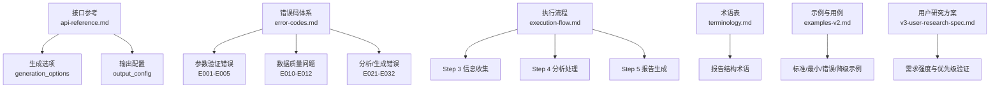
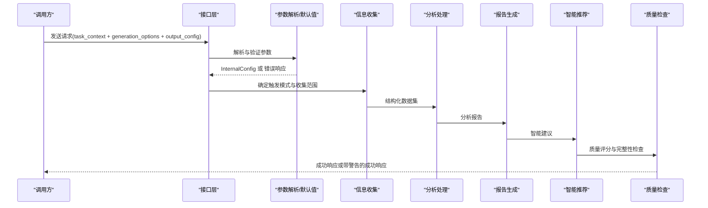
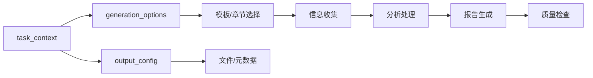

# 输出报告结构

<cite>
**本文档引用的文件**
- [api-reference.md](file://references/api-reference.md)
- [error-codes.md](file://references/error-codes.md)
- [examples-v2.md](file://references/examples-v2.md)
- [execution-flow.md](file://references/execution-flow.md)
- [terminology.md](file://references/terminology.md)
- [v3-user-research-spec.md](file://references/v3-user-research-spec.md)
</cite>

## 目录
1. [简介](#简介)
2. [项目结构](#项目结构)
3. [核心组件](#核心组件)
4. [架构总览](#架构总览)
5. [详细组件分析](#详细组件分析)
6. [依赖分析](#依赖分析)
7. [性能考量](#性能考量)
8. [故障排查指南](#故障排查指南)
9. [结论](#结论)
10. [附录](#附录)

## 简介
本文件面向“任务执行总结报告生成器”的使用者与集成者，系统化阐述标准10章报告的完整结构、内容要求与必填性说明，配套定制选项（详细程度、模板变体、语言风格）的选择策略与适用场景，输出格式规范、命名约定与转换选项，以及质量控制机制与完整性检查标准。文档严格基于仓库现有参考文件进行归纳与可视化，确保技术细节与实现约束可追溯。

## 项目结构
本仓库以“参考文档”为核心，围绕接口规范、错误码体系、执行流程、术语表与用户研究方案等维度形成完整的技术文档体系：
- 接口参考：定义输入参数、生成选项、输出格式与错误响应
- 错误码：定义错误分类、处理策略与降级机制
- 执行流程：描述7步执行流水线、数据流与异常路径
- 术语表：统一报告与分析中的专业术语
- 示例与用例：提供标准调用、最小化调用、参数错误与降级执行的完整示例
- 用户研究：为产品演进提供需求验证与优先级排序依据

**图表来源**
- [api-reference.md:183-716](file://references/api-reference.md#L183-L716)
- [error-codes.md:152-162](file://references/error-codes.md#L152-L162)
- [execution-flow.md:173-132](file://references/execution-flow.md#L173-L132)
- [terminology.md:458-534](file://references/terminology.md#L458-L534)
- [examples-v2.md:29-769](file://references/examples-v2.md#L29-L769)
- [v3-user-research-spec.md:1-800](file://references/v3-user-research-spec.md#L1-L800)

**章节来源**
- [api-reference.md:183-716](file://references/api-reference.md#L183-L716)
- [error-codes.md:152-162](file://references/error-codes.md#L152-L162)
- [execution-flow.md:173-132](file://references/execution-flow.md#L173-L132)
- [terminology.md:458-534](file://references/terminology.md#L458-L534)
- [examples-v2.md:29-769](file://references/examples-v2.md#L29-L769)
- [v3-user-research-spec.md:1-800](file://references/v3-user-research-spec.md#L1-L800)

## 核心组件
- 输入参数体系
  - task_context：任务名称、类型、时间范围、描述、参与者、上下文数据
  - generation_options：详细程度、模板变体、章节选择、语言风格、焦点维度、输出格式
  - output_config：保存到文件、文件路径、元数据、追加写入、编码、自定义头尾
- 输出响应结构
  - 成功响应：报告ID、时间戳、处理耗时、报告主体、质量检查、统计摘要、文件信息
  - 错误响应：错误码、名称、消息、分类、严重级别、HTTP状态、上下文与恢复建议
- 质量控制与降级
  - 信息覆盖率阈值驱动的降级决策
  - 警告与降级标记，保留可升级路径

**章节来源**
- [api-reference.md:185-716](file://references/api-reference.md#L185-L716)
- [error-codes.md:173-769](file://references/error-codes.md#L173-L769)
- [examples-v2.md:29-769](file://references/examples-v2.md#L29-L769)

## 架构总览
系统采用“参数解析—触发识别—信息收集—分析处理—报告生成—智能推荐—质量检查与输出”的7步流水线，配合错误码体系与降级策略，确保在参数错误、数据不足、分析异常、生成失败等情况下仍能提供可接受的输出或明确的恢复指引。

**图表来源**
- [execution-flow.md:173-132](file://references/execution-flow.md#L173-L132)
- [error-codes.md:173-769](file://references/error-codes.md#L173-L769)
- [examples-v2.md:29-769](file://references/examples-v2.md#L29-L769)

**章节来源**
- [execution-flow.md:173-132](file://references/execution-flow.md#L173-L132)
- [error-codes.md:173-769](file://references/error-codes.md#L173-L769)
- [examples-v2.md:29-769](file://references/examples-v2.md#L29-L769)

## 详细组件分析

### 标准10章报告结构与内容要求
- 第一章：执行概览（必填）
  - 内容要点：任务基本信息、核心成果一句话、关键数据速览（达成率、耗时、问题数）、Top亮点与最大挑战
  - 必填性：必须完整
- 第二章：任务背景与目标（建议保留）
  - 内容要点：初始目标设定、目标调整记录、最终成果清单
  - 必填性：建议完整，作为后续分析基准
- 第三章：执行过程详解（建议保留）
  - 内容要点：分阶段执行记录、关键活动、产出物、时间线
  - 必填性：建议完整，记录完整执行过程
- 第四章：关键决策分析（可选）
  - 内容要点：决策点、备选方案对比、最终选择与事后评估
  - 必填性：可选，信息不足时可简化
- 第五章：问题与解决方案（必须）
  - 内容要点：问题描述、根因分析、解决过程、经验教训
  - 必填性：必须完整，核心价值章节
- 第六章：资源使用情况（可选）
  - 内容要点：人力投入、技术栈使用、工具与依赖、成本与效率
  - 必填性：可选，信息不足时可简化
- 第七章：团队协作分析（可选）
  - 内容要点：协作概况、协作效能评估、协作亮点与待改进项
  - 必填性：可选，多人任务时建议包含
- 第八章：多维度分析（建议保留）
  - 内容要点：目标达成度、时间效能、问题模式、资源利用率、协作效果等
  - 必填性：建议完整，深度数据分析
- 第九章：经验总结与方法论（必须）
  - 内容要点：成功要素、方法论提炼、知识图谱更新
  - 必填性：必须完整，核心价值章节
- 第十章：改进建议与行动计划（必须）
  - 内容要点：即时改进建议、短期改进计划、中长期规划
  - 必填性：必须完整，核心价值章节

章节保留建议与约束（摘自章节选择规则）：
- 至少保留第1、9、10章
- included_chapters 与 excluded_chapters 互斥
- 排除所有章节为无效组合

**章节来源**
- [api-reference.md:450-474](file://references/api-reference.md#L450-L474)
- [examples-v2.md:29-769](file://references/examples-v2.md#L29-L769)

### 定制选项与选择策略
- 详细程度（detail_level）
  - summary：2-3页，仅核心章节完整，其他章节仅标题与数据点
  - standard：8-15页，完整10章，标准分析与建议数量
  - detailed：20-30页，深入展开、详尽数据与图表、完整附录
  - 适用场景：摘要版用于快速汇报，标准版用于常规复盘，详细版用于深度分析与审计
- 模板变体（template_variant）
  - standard：标准通用模板
  - learning：学习专用模板，强调知识掌握、学习方法论与成长路径
  - 适用场景：学习项目、课程总结、技能认证回顾
- 章节选择（included_chapters/excluded_chapters）
  - 互斥约束，至少保留第1、9、10章
  - 适用场景：精简模式（仅核心章节）、专题聚焦（仅某几章）
- 语言风格（language_style）
  - professional：正式、客观、准确
  - casual：轻松、亲切、易懂
  - academic：严谨、学术化
  - 适用场景：正式报告、团队内部、学术交流
- 焦点维度（focus_dimensions）
  - 目标达成度、时间管理效能、资源利用效率、问题解决模式、协作效果
  - 适用场景：突出特定分析维度，提高报告针对性
- 输出格式（output_format）
  - markdown：结构清晰、广泛支持、可直接渲染
  - json：结构化数据，便于程序化处理
  - html：可直接在浏览器查看，适合分享与非技术人员阅读

**章节来源**
- [api-reference.md:384-574](file://references/api-reference.md#L384-L574)

### 输出格式规范、命名约定与转换选项
- 输出格式
  - markdown：默认格式，适合Git版本控制与Markdown生态
  - json：便于二次处理与数据分析
  - html：适合直接浏览与分享
- 文件命名规范（自动生成时）
  - 格式：task-summary-[任务名称简写]-YYYYMMDD-HHmmss.[ext]
  - 示例：task-summary-payment-refactor-20260409.md、task-summary-sprint24-review-20260409-143022.json
- 文件路径与编码
  - file_path：支持绝对/相对路径，扩展名需与输出格式匹配
  - encoding：默认UTF-8，可选GBK/GB2312/ASCII
- 元数据与自定义头尾
  - include_metadata：是否包含YAML Frontmatter元数据块
  - custom_header/custom_footer：自定义头部/尾部内容（支持Markdown）

**章节来源**
- [api-reference.md:594-714](file://references/api-reference.md#L594-L714)

### 质量控制机制与完整性检查标准
- 信息覆盖率阈值
  - 优秀：≥90%（直接进入下一步）
  - 良好：70-90%（发出E010警告，标注缺失项，继续）
  - 差：<70%（发出E011错误，提示降级/补充/终止）
- 降级策略
  - 当请求为detailed但覆盖率不足时，降级为standard
  - 降级时在报告中添加“信息有限”声明与标注
- 警告与恢复
  - E010：InsufficientDataWarning（数据不充分）
  - E011：ConversationHistoryUnavailable（数据源不可用）
  - E012：FileAccessDenied（文件访问被拒绝）
  - 错误响应包含恢复建议与预防措施
- 质量评分与统计
  - quality_check：完整性评分、准确性置信度、信息缺口、警告
  - statistics：阶段数、决策数、问题数、建议数、方法论数、关键指标

**章节来源**
- [error-codes.md:560-769](file://references/error-codes.md#L560-L769)
- [execution-flow.md:627-649](file://references/execution-flow.md#L627-L649)
- [examples-v2.md:461-769](file://references/examples-v2.md#L461-L769)

## 依赖分析
- 参数验证与默认值
  - generation_options与output_config依赖task_context的完整性
  - 默认值体系确保边界情况下的稳定行为
- 数据源与质量检查
  - 信息收集阶段的覆盖率直接影响后续分析与生成
  - 质量检查阈值决定是否降级或终止
- 模板与章节组合
  - detail_level与template_variant共同决定章节深度与结构
  - included_chapters/excluded_chapters与章节依赖关系存在约束

**图表来源**
- [api-reference.md:185-716](file://references/api-reference.md#L185-L716)
- [execution-flow.md:441-693](file://references/execution-flow.md#L441-L693)

**章节来源**
- [api-reference.md:185-716](file://references/api-reference.md#L185-L716)
- [execution-flow.md:441-693](file://references/execution-flow.md#L441-L693)

## 性能考量
- 总耗时分布（标准版报告，中等复杂度任务）
  - Step 3 信息收集：40-50%
  - Step 4 分析处理：35-40%
  - Step 5 报告生成：15-20%
  - 其他步骤：≤10%
- 性能影响因素
  - 对话轮数：20-50轮为中等复杂度
  - 详细程度：摘要版-30%、标准版基准、详细版+50-80%
- 建议
  - 控制对话轮数与信息密度，提升Step 3效率
  - 合理选择详细程度，平衡生成质量与性能

**章节来源**
- [execution-flow.md:142-170](file://references/execution-flow.md#L142-L170)

## 故障排查指南
- 参数验证错误（E001-E005）
  - 缺少必填参数、类型不符、值越界、参数冲突
  - 处理策略：立即返回错误，提供修复建议与示例
- 数据质量问题（E010-E012）
  - E010：数据不充分（Warning）→ 降级继续或用户选择
  - E011：对话历史不可用（Error）→ 恢复方案（手动输入/重试/导出）
  - E012：文件访问被拒绝（Error）→ 权限修复/更换路径/检查磁盘
- 分析/生成错误（E021-E032）
  - 分析引擎错误：部分跳过/降级输出
  - 报告生成错误：回退到简化模板
- 超时错误（E051）
  - 执行超时：终止或返回部分结果

**章节来源**
- [error-codes.md:173-769](file://references/error-codes.md#L173-L769)
- [examples-v2.md:278-769](file://references/examples-v2.md#L278-L769)

## 结论
本技术文档系统化梳理了标准10章报告的结构与内容要求，明确了定制选项的选择策略与适用场景，给出了输出格式规范、命名约定与转换选项，并建立了以信息覆盖率为核心的降级与质量控制机制。通过接口参考、错误码体系、执行流程与示例用例的协同，确保报告生成在参数错误、数据不足、分析异常等复杂场景下仍能提供可接受的输出与清晰的恢复路径。

## 附录
- 术语表（报告结构相关）
  - 执行概览、方法论提炼、经验教训、最佳实践、模式、报告模板、附录
- 用户研究方案（需求验证与优先级）
  - 通过定量+定性混合研究，验证V3五大模块的需求强度与优先级排序

**章节来源**
- [terminology.md:458-534](file://references/terminology.md#L458-L534)
- [v3-user-research-spec.md:1-800](file://references/v3-user-research-spec.md#L1-L800)