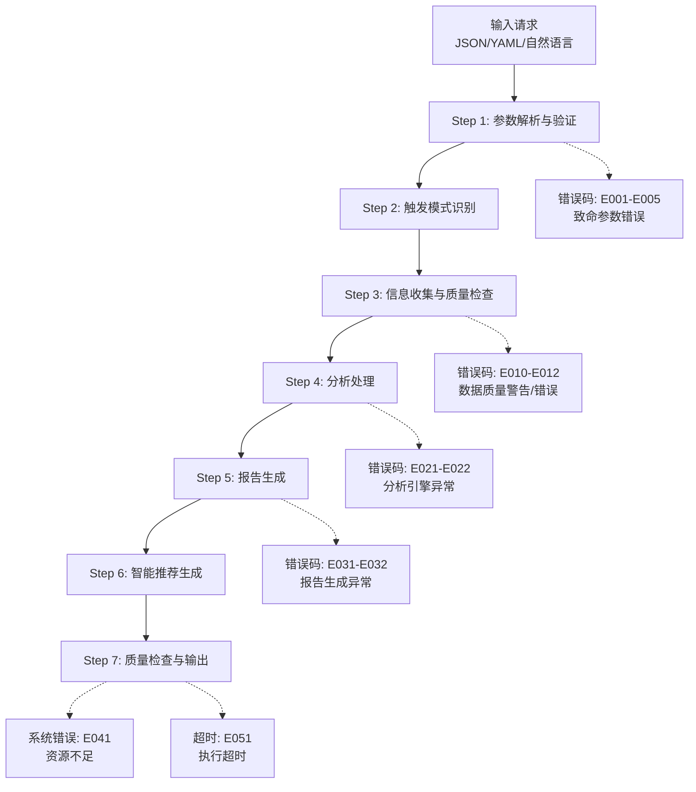
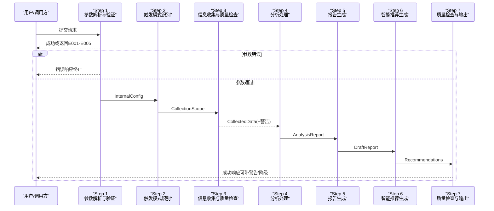
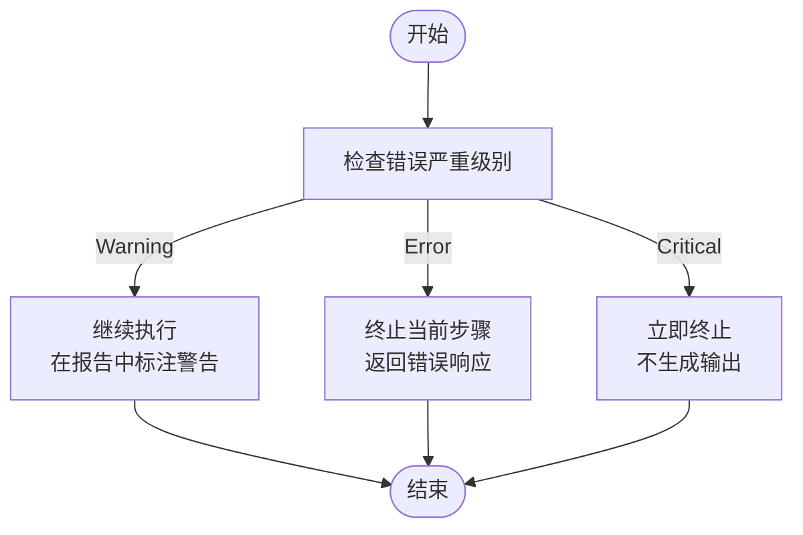
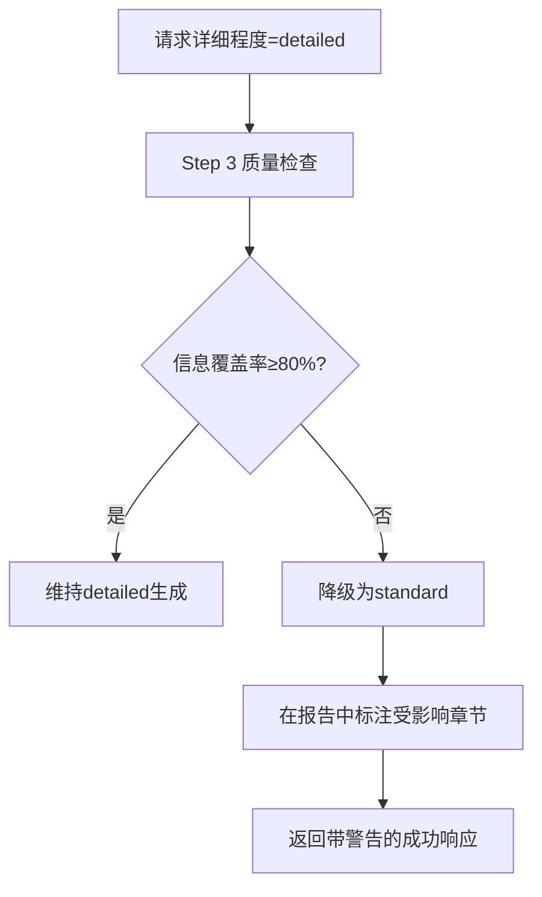
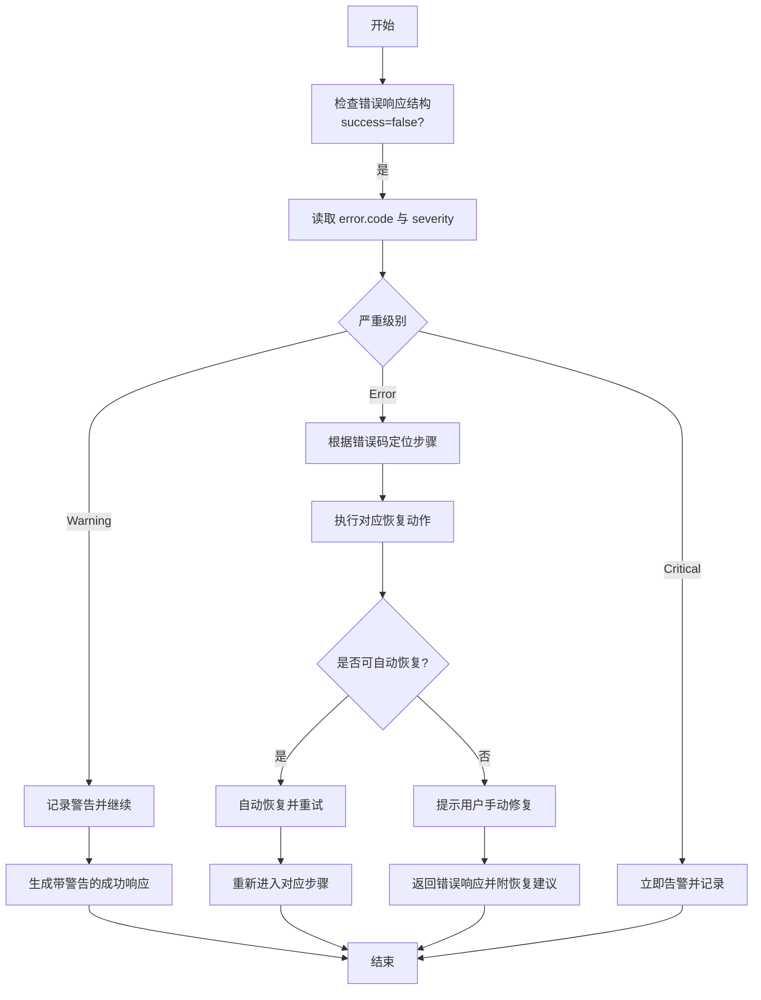

# 错误处理与故障排除

<cite>
**本文档引用的文件**
- [error-codes.md](file://references/error-codes.md)
- [api-reference.md](file://references/api-reference.md)
- [execution-flow.md](file://references/execution-flow.md)
- [examples-v2.md](file://references/examples-v2.md)
- [terminology.md](file://references/terminology.md)
</cite>

## 目录
1. [简介](#简介)
2. [项目结构](#项目结构)
3. [核心组件](#核心组件)
4. [架构总览](#架构总览)
5. [详细组件分析](#详细组件分析)
6. [依赖分析](#依赖分析)
7. [性能考量](#性能考量)
8. [故障排除指南](#故障排除指南)
9. [结论](#结论)
10. [附录](#附录)

## 简介
本文件面向“任务执行总结报告生成器”的使用者与维护者，提供系统化的错误处理与故障排除文档。内容覆盖错误分级体系（Critical/Error/Warning）、错误码定义与恢复策略、降级与容错机制、常见问题诊断与解决方案、性能优化建议、调试技巧与监控方法，并给出可执行的故障排除流程与最佳实践。

## 项目结构
本技能的错误处理与故障排除能力由以下参考文档共同构成：
- 错误码定义与处理策略：references/error-codes.md
- 接口规范与参数约束：references/api-reference.md
- 执行流程与异常路径：references/execution-flow.md
- 示例与用例：references/examples-v2.md
- 术语与概念：references/terminology.md

**图表来源**
- [execution-flow.md: 1474-1485:1474-1485](file://references/execution-flow.md#L1474-L1485)

**章节来源**
- [execution-flow.md: 1-120:1-120](file://references/execution-flow.md#L1-L120)

## 核心组件
- 错误分级与响应结构
  - 分级：Critical（红色）、Error（橙色）、Warning（黄色）
  - 统一错误响应结构包含：success=false、error.code、error.name、error.message、error.category、error.severity、error.http_status、timestamp、request_id、context、recovery
- 错误码分类与范围
  - E0xx：参数验证（E001-E010）
  - E1xx：数据源（E011-E015）
  - E2xx：分析引擎（E021-E025）
  - E3xx：报告生成（E031-E035）
  - E4xx：系统资源（E041-E045）
  - E5xx：超时（E051）
- 降级与容错
  - Warning级错误允许继续执行并标注影响
  - 降级继续：在信息不足时降低详细程度或简化分析
  - 部分失败：数据源不可用时尝试备用源或回退模板

**章节来源**
- [error-codes.md: 98-170:98-170](file://references/error-codes.md#L98-L170)
- [error-codes.md: 154-170:154-170](file://references/error-codes.md#L154-L170)

## 架构总览
技能执行流程分为7个步骤，每个步骤都有明确的输入/输出契约与异常处理策略。异常路径在流程图中以错误码标注，展示从致命错误直接返回到降级继续的完整路径。

**图表来源**
- [execution-flow.md: 1474-1485:1474-1485](file://references/execution-flow.md#L1474-L1485)

**章节来源**
- [execution-flow.md: 175-196:175-196](file://references/execution-flow.md#L175-L196)
- [execution-flow.md: 441-474:441-474](file://references/execution-flow.md#L441-L474)
- [execution-flow.md: 921-956:921-956](file://references/execution-flow.md#L921-L956)
- [execution-flow.md: 1154-1175:1154-1175](file://references/execution-flow.md#L1154-L1175)
- [execution-flow.md: 1336-1367:1336-1367](file://references/execution-flow.md#L1336-L1367)

## 详细组件分析

### 错误分级与处理策略
- Critical（红色）
  - 定义：系统级故障，无法继续运行
  - 处理：立即终止，不生成任何输出
  - 示例：E041（内存不足）、E051（执行超时）
- Error（橙色）
  - 定义：功能性错误，当前操作无法完成
  - 处理：终止当前步骤，可能返回部分结果
  - 示例：E001（缺少必填参数）、E011（对话历史不可用）、E012（文件访问被拒绝）、E021（部分分析失败）、E022（核心分析引擎错误）、E031（模板渲染失败）、E032（内容生成失败）
- Warning（黄色）
  - 定义：非致命问题，可以继续但质量受损
  - 处理：标记警告，继续执行，最终报告标注
  - 示例：E010（信息覆盖不足）

**图表来源**
- [error-codes.md: 163-170:163-170](file://references/error-codes.md#L163-L170)

**章节来源**
- [error-codes.md: 163-170:163-170](file://references/error-codes.md#L163-L170)

### 错误码定义与恢复策略

#### 参数验证错误（E001-E005）
- E001 缺少必填参数
  - 触发：task_context.task_name 等必填字段缺失
  - 处理：终止，提示补充参数
  - 恢复：补齐缺失参数后重试
- E002 参数类型错误
  - 触发：detail_level 等参数类型不符
  - 处理：终止，提示正确类型
  - 恢复：修正参数类型后重试
- E003 参数值越界
  - 触发：chapters 超出 1-10，或字符串长度超限
  - 处理：尝试修正到合法值，发出警告
  - 恢复：调整到合法范围后重试
- E004 参数冲突
  - 触发：detail_level 与 chapters 冲突
  - 处理：终止，提示移除或修改冲突参数
  - 恢复：选择一致的参数组合
- E005 无效章节组合
  - 触发：缺少前置章节或组合非法
  - 处理：终止，提示推荐组合
  - 恢复：补充前置章节或使用预设组合

**章节来源**
- [error-codes.md: 177-246:177-246](file://references/error-codes.md#L177-L246)
- [error-codes.md: 249-320:249-320](file://references/error-codes.md#L249-L320)
- [error-codes.md: 323-398:323-398](file://references/error-codes.md#L323-L398)
- [error-codes.md: 401-474:401-474](file://references/error-codes.md#L401-L474)
- [error-codes.md: 477-557:477-557](file://references/error-codes.md#L477-L557)

#### 数据质量错误（E010-E012）
- E010 信息覆盖不足（Warning）
  - 触发：综合覆盖率 < 90%（具体阈值依详细程度而定）
  - 处理：降级继续，标注受影响章节，降低质量评分
  - 恢复：补充信息后重新生成或接受降级结果
- E011 对话历史不可用（Error）
  - 触发：权限不足、服务不可用、会话不存在
  - 处理：提供降级/补充/终止三选一
  - 恢复：修复权限或切换到手动输入模式
- E012 文件访问被拒绝（Error）
  - 触发：输出目录无写入权限、路径不存在、磁盘配额不足
  - 处理：尝试更换路径或修复权限
  - 恢复：修正路径/权限/配额后重试

**章节来源**
- [error-codes.md: 560-669:560-669](file://references/error-codes.md#L560-L669)
- [error-codes.md: 671-758:671-758](file://references/error-codes.md#L671-L758)
- [error-codes.md: 761-868:761-868](file://references/error-codes.md#L761-L868)

#### 分析引擎错误（E021-E022）
- E021 部分分析失败（Warning）
  - 触发：某一维度数据不足
  - 处理：跳过该维度，其他维度正常输出
  - 恢复：自动恢复，报告中标注
- E022 核心分析引擎错误（Error）
  - 触发：分析引擎异常
  - 处理：回退到简化分析模式
  - 恢复：建议稍后重试

**章节来源**
- [error-codes.md: 869-930:869-930](file://references/error-codes.md#L869-L930)

#### 报告生成错误（E031-E032）
- E031 模板渲染失败（Error）
  - 触发：模板引擎异常
  - 处理：回退到备用模板或最小可用模板
  - 恢复：自动恢复
- E032 内容生成失败（Error）
  - 触发：内容生成器异常
  - 处理：使用已有数据直接组装
  - 恢复：自动恢复

**章节来源**
- [error-codes.md: 931-990:931-990](file://references/error-codes.md#L931-L990)

#### 系统资源错误（E041）
- E041 内存不足（Critical）
  - 触发：系统资源不足
  - 处理：终止并告警
  - 恢复：扩容资源或降低并发

**章节来源**
- [error-codes.md: 991-1020:991-1020](file://references/error-codes.md#L991-L1020)

#### 超时错误（E051）
- E051 执行超时（Error）
  - 触发：执行时间超过阈值
  - 处理：终止或返回部分结果
  - 恢复：优化输入或提升资源

**章节来源**
- [error-codes.md: 1021-1040:1021-1040](file://references/error-codes.md#L1021-L1040)

### 降级策略详解
- 降级触发点
  - 信息覆盖率不足：Step 3 质量检查阶段
  - 详细程度与信息覆盖率不匹配：请求 detailed 但覆盖率 < 80%
- 降级行为
  - 降低详细程度（如 detailed → standard，或 standard → summary）
  - 在报告中标注受影响章节与信息不足提示
  - 调整质量评分与 warnings
- 用户升级路径
  - 补充信息后重新生成
  - 手动编辑报告
  - 结合外部数据源（如 Git 历史）增强时间线

**图表来源**
- [execution-flow.md: 640-649:640-649](file://references/execution-flow.md#L640-L649)
- [examples-v2.md: 644-678:644-678](file://references/examples-v2.md#L644-L678)

**章节来源**
- [execution-flow.md: 627-649:627-649](file://references/execution-flow.md#L627-L649)
- [examples-v2.md: 461-688:461-688](file://references/examples-v2.md#L461-L688)

### 容错与恢复策略矩阵
- 参数验证阶段（E001-E005）
  - 立即终止，返回错误响应
  - 提供修复建议与示例
- 数据质量阶段（E010-E012）
  - E010：降级继续，标注影响
  - E011：三选一（降级/补充/终止）
  - E012：修复权限/路径/配额后重试
- 分析阶段（E021-E022）
  - E021：跳过不足维度，保留其他分析
  - E022：简化分析模式
- 生成阶段（E031-E032）
  - E031：回退备用模板
  - E032：直接组装基础内容
- 系统与超时（E041, E051）
  - E041：终止并告警
  - E051：终止或返回部分结果

**章节来源**
- [execution-flow.md: 1487-1584:1487-1584](file://references/execution-flow.md#L1487-L1584)

## 依赖分析
- 错误码与执行步骤的映射
  - Step 1：E001-E005
  - Step 3：E010-E012
  - Step 4：E021-E022
  - Step 5：E031-E032
  - Step 7：E041, E051
- 依赖关系
  - 参数验证通过是后续步骤的前提
  - 数据质量决定分析与生成的深度
  - 系统资源与超时影响整体执行时长与成功率

**图表来源**
- [execution-flow.md: 1487-1584:1487-1584](file://references/execution-flow.md#L1487-L1584)

**章节来源**
- [execution-flow.md: 1470-1584:1470-1584](file://references/execution-flow.md#L1470-L1584)

## 性能考量
- 性能基线与瓶颈
  - Step 3（信息收集）通常占 40-50%，Step 4（分析处理）占 35-40%
  - 详细程度越高，耗时增长越明显（摘要版 -30%，标准版基准，详细版 +50-80%）
- 优化建议
  - 控制对话轮数与数据量，减少 Step 3/4 的处理时间
  - 合理选择详细程度，避免不必要的深度分析
  - 提前准备与结构化输入，减少参数验证与歧义处理时间
  - 监控系统资源与超时阈值，及时扩容或调整并发

**章节来源**
- [execution-flow.md: 142-170:142-170](file://references/execution-flow.md#L142-L170)

## 故障排除指南

### 系统化故障排除流程

**图表来源**
- [error-codes.md: 98-170:98-170](file://references/error-codes.md#L98-L170)

### 常见问题与诊断
- 参数错误（E001-E005）
  - 现象：请求被立即拒绝，返回错误响应
  - 诊断：检查必填参数、类型、范围与组合
  - 解决：参考错误响应中的 suggestions 与示例
- 数据不足（E010）
  - 现象：报告可用但质量评分下降，标注受影响章节
  - 诊断：查看 quality_check.information_gaps 与 warnings
  - 解决：补充对话记录或手动输入关键信息
- 数据源不可用（E011）
  - 现象：无法访问历史会话
  - 诊断：检查权限、服务状态、会话ID
  - 解决：修复权限或切换到手动输入模式
- 文件权限问题（E012）
  - 现象：无法写入输出文件
  - 诊断：检查目录权限、磁盘配额
  - 解决：修正权限或更换输出路径
- 分析失败（E021-E022）
  - 现象：部分分析缺失或简化
  - 诊断：查看受影响维度与错误上下文
  - 解决：补充数据或稍后重试
- 模板渲染失败（E031）
  - 现象：报告生成异常
  - 诊断：检查模板可用性
  - 解决：自动回退备用模板
- 内容生成失败（E032）
  - 现象：内容生成器异常
  - 诊断：检查数据完整性
  - 解决：直接组装基础内容
- 资源不足（E041）
  - 现象：系统终止执行
  - 诊断：监控内存/CPU使用
  - 解决：扩容资源或降低并发
- 执行超时（E051）
  - 现象：执行时间过长
  - 诊断：检查输入规模与详细程度
  - 解决：优化输入或提升资源

**章节来源**
- [error-codes.md: 177-1040:177-1040](file://references/error-codes.md#L177-L1040)
- [examples-v2.md: 278-688:278-688](file://references/examples-v2.md#L278-L688)

### 调试技巧与监控
- 调试技巧
  - 使用最小参数调用快速定位问题
  - 逐步调整 generation_options 以缩小问题范围
  - 检查 request_id 与 timestamp，串联日志
  - 对照 examples-v2.md 中的示例进行对比
- 监控方法
  - 关注 processing_time_ms 与各步骤耗时
  - 记录 warnings 与 degradation_info
  - 跟踪 quality_metrics 与 quality_score
  - 建立错误统计与趋势分析

**章节来源**
- [api-reference.md: 718-786:718-786](file://references/api-reference.md#L718-L786)
- [examples-v2.md: 691-706:691-706](file://references/examples-v2.md#L691-L706)

## 结论
本技能通过分层防御、优雅降级、透明告知与可观测性，构建了完善的错误处理与故障排除体系。建议在集成与使用中：
- 严格遵循参数验证与约束
- 在数据不足时接受降级并补充信息
- 建立监控与告警机制
- 使用示例与术语表辅助排障
- 按照系统化流程进行诊断与恢复

## 附录

### 错误码快速查询表
- 参数验证（E001-E005）
  - E001：缺少必填参数
  - E002：参数类型错误
  - E003：参数值越界
  - E004：参数冲突
  - E005：无效章节组合
- 数据质量（E010-E012）
  - E010：信息覆盖不足（Warning）
  - E011：对话历史不可用（Error）
  - E012：文件访问被拒绝（Error）
- 分析引擎（E021-E022）
  - E021：部分分析失败（Warning）
  - E022：核心分析引擎错误（Error）
- 报告生成（E031-E032）
  - E031：模板渲染失败（Error）
  - E032：内容生成失败（Error）
- 系统资源（E041）
  - E041：内存不足（Critical）
- 超时（E051）
  - E051：执行超时（Error）

**章节来源**
- [error-codes.md: 154-170:154-170](file://references/error-codes.md#L154-L170)