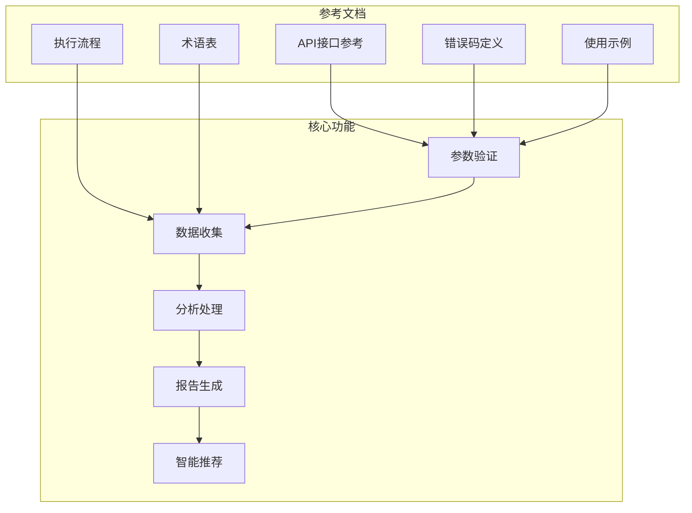
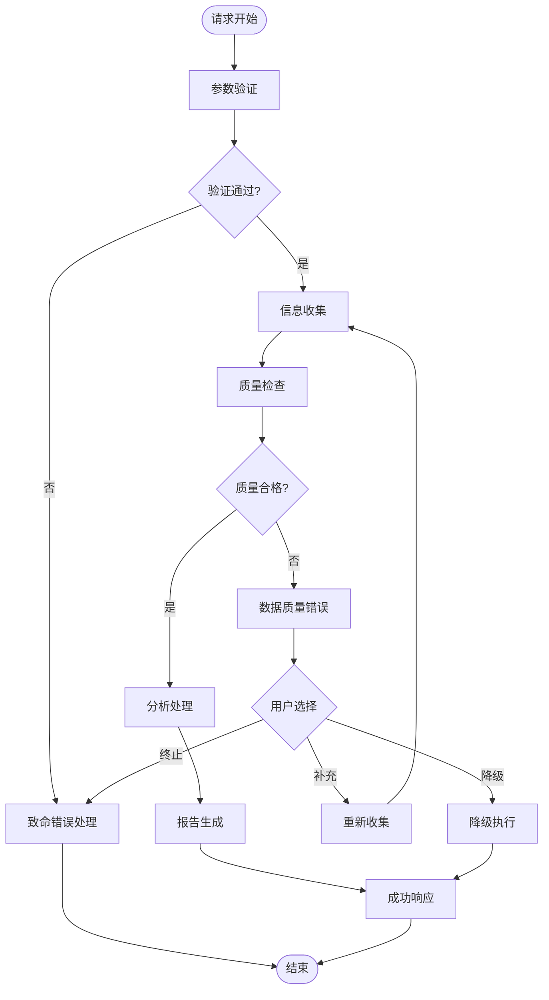
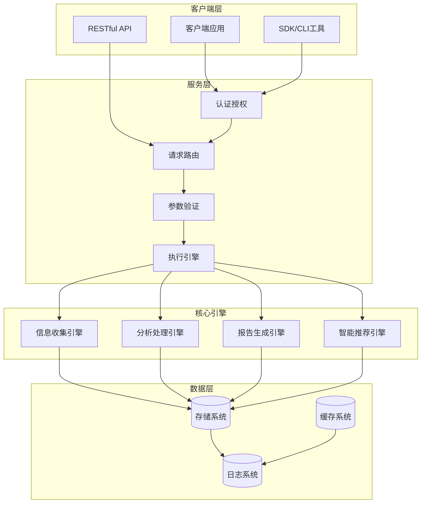
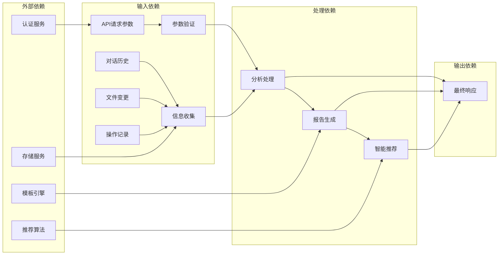
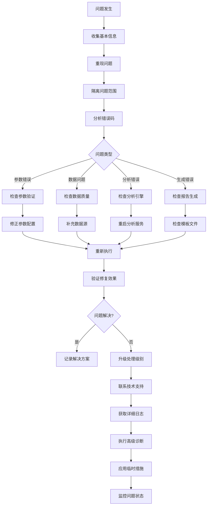
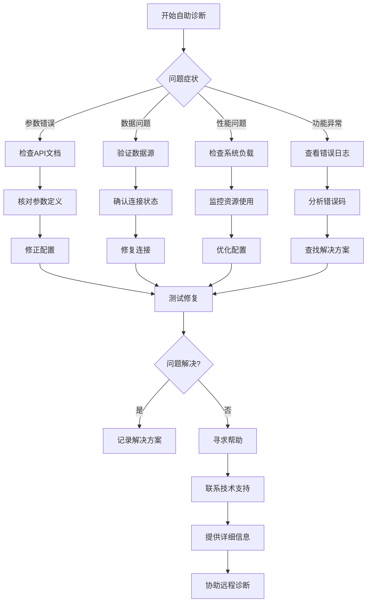

# 故障排除与诊断指南

<cite>
**本文档引用的文件**
- [api-reference.md](file://references/api-reference.md)
- [error-codes.md](file://references/error-codes.md)
- [examples-v2.md](file://references/examples-v2.md)
- [execution-flow.md](file://references/execution-flow.md)
- [terminology.md](file://references/terminology.md)
</cite>

## 目录
1. [简介](#简介)
2. [项目结构](#项目结构)
3. [核心组件](#核心组件)
4. [架构概览](#架构概览)
5. [详细组件分析](#详细组件分析)
6. [依赖分析](#依赖分析)
7. [性能考虑](#性能考虑)
8. [故障排除指南](#故障排除指南)
9. [结论](#结论)
10. [附录](#附录)

## 简介

本指南为"任务执行总结报告生成器"技能提供系统性的故障排除与诊断知识库。该技能通过四大核心引擎协同工作，基于对话历史和相关信息生成结构化报告。

### 技能核心能力
- **信息收集引擎**：从对话历史和相关文件中全面提取任务执行的关键信息
- **分析处理引擎**：对收集到的信息进行深度分析和多维度评估
- **报告生成引擎**：按照规范模板将分析结果转化为结构化报告
- **智能推荐引擎**：生成针对性的改进建议和可复用的方法论

## 项目结构

**图表来源**
- [api-reference.md:1-100](file://references/api-reference.md#L1-L100)
- [execution-flow.md:1-100](file://references/execution-flow.md#L1-L100)

**章节来源**
- [api-reference.md:1-100](file://references/api-reference.md#L1-L100)
- [execution-flow.md:1-100](file://references/execution-flow.md#L1-L100)

## 核心组件

### 参数验证系统
参数验证是整个执行流程的第一道防线，负责拦截非法请求并提供明确的错误信息。

**验证层次结构**：
1. **存在性检查** → 缺少必填参数 → E001
2. **类型匹配** → 类型不符 → E002  
3. **值域范围** → 超出允许范围 → E003
4. **逻辑一致性** → 参数间冲突 → E004
5. **安全性检查** → 含非法内容 → E005

**章节来源**
- [execution-flow.md:175-310](file://references/execution-flow.md#L175-L310)
- [error-codes.md:177-246](file://references/error-codes.md#L177-L246)

### 数据质量控制系统
数据质量检查贯穿整个信息收集阶段，通过多维度评分确保报告质量。

**质量评估维度**：
- 任务目标完整性：权重25%
- 时间节点准确性：权重20%  
- 决策记录完整性：权重20%
- 问题记录完整性：权重20%
- 资源使用统计：权重10%
- 协作信息可用性：权重5%

**章节来源**
- [execution-flow.md:627-699](file://references/execution-flow.md#L627-L699)
- [error-codes.md:560-668](file://references/error-codes.md#L560-L668)

### 异常处理机制
系统采用分层异常处理策略，将错误分为致命错误和非致命警告两类。

**图表来源**
- [execution-flow.md:1470-1584](file://references/execution-flow.md#L1470-L1584)
- [error-codes.md:152-170](file://references/error-codes.md#L152-L170)

**章节来源**
- [execution-flow.md:1470-1584](file://references/execution-flow.md#L1470-L1584)
- [error-codes.md:152-170](file://references/error-codes.md#L152-L170)

## 架构概览

**图表来源**
- [execution-flow.md:97-132](file://references/execution-flow.md#L97-L132)
- [api-reference.md:87-132](file://references/api-reference.md#L87-L132)

## 详细组件分析

### 执行流程分析

#### 步骤1：参数解析与验证
这是整个流程的入口点，负责确保输入数据的完整性和正确性。

**处理流程**：
1. **请求解析**：支持JSON/YAML结构化输入和自然语言提取
2. **参数完整性检查**：验证必填参数的存在
3. **类型与范围验证**：检查参数类型和取值范围
4. **逻辑一致性检查**：确保参数间的逻辑关系正确
5. **默认值应用**：为可选参数应用合理的默认值

**章节来源**
- [execution-flow.md:175-310](file://references/execution-flow.md#L175-L310)
- [api-reference.md:183-211](file://references/api-reference.md#L183-L211)

#### 步骤2：触发模式识别
智能识别任务触发的不同模式，确保分析范围的准确性。

**触发模式分类**：
- **自动触发**：基于完成信号词检测
- **手动触发**：显式命令触发
- **命令行触发**：配置化参数调用

**章节来源**
- [execution-flow.md:313-439](file://references/execution-flow.md#L313-L439)

#### 步骤3：信息收集阶段
这是最复杂的阶段，占总耗时的40-50%，负责从多源数据中提取有用信息。

**数据源类型**：
- **对话历史解析器**：提取任务相关内容
- **操作记录提取器**：识别具体操作行为
- **文件变更追踪器**：获取文件系统变更记录

**章节来源**
- [execution-flow.md:441-699](file://references/execution-flow.md#L441-L699)

#### 步骤4：分析处理阶段
五维分析引擎提供全面的任务执行评估。

**分析维度**：
1. **目标达成度分析**：量化目标完成程度
2. **时间效能分析**：评估时间利用效率
3. **资源利用率分析**：分析资源使用效果
4. **问题模式分析**：识别问题解决模式
5. **协作效果分析**：评估团队协作质量

**章节来源**
- [execution-flow.md:701-918](file://references/execution-flow.md#L701-L918)

#### 步骤5：报告生成阶段
将分析结果映射到标准模板，生成最终报告。

**模板变体**：
- **摘要版模板**：2-3页，适用于快速汇报
- **标准版模板**：8-15页，适用于正式复盘
- **详细版模板**：20-30页，适用于深度分析

**章节来源**
- [execution-flow.md:921-1151](file://references/execution-flow.md#L921-L1151)

#### 步骤6：智能推荐生成
从成功实践中提取可复用的方法论。

**推荐生成原则**：
- **基于证据**：必须有分析数据支撑
- **具体可行**：可以直接执行
- **优先级明确**：区分紧急重要程度
- **量化预期**：能预估效果或收益

**章节来源**
- [execution-flow.md:1154-1333](file://references/execution-flow.md#L1154-L1333)

#### 步骤7：质量检查与输出
最终的质量控制和响应组装。

**检查项目**：
- YAML Frontmatter完整性
- 10章齐全性检查
- 表格格式正确性
- 代码块语言标注
- 标题层级连续性

**章节来源**
- [execution-flow.md:1336-1467](file://references/execution-flow.md#L1336-L1467)

### 错误码体系分析

#### 错误分类总览
系统采用E001-E051的错误码体系，按严重程度分为三类：

**严重级别**：
- **Critical（红色）**：系统级故障，无法继续运行
- **Error（橙色）**：功能性错误，当前操作无法完成  
- **Warning（黄色）**：非致命问题，可以继续但质量受损

**章节来源**
- [error-codes.md:163-170](file://references/error-codes.md#L163-L170)
- [error-codes.md:152-162](file://references/error-codes.md#L152-L162)

#### 参数验证错误（E001-E005）
这些错误发生在Step 1，会直接终止执行流程。

**错误类型及处理**：
- **E001：缺少必填参数** → 直接返回错误
- **E002：参数类型错误** → 直接返回错误  
- **E003：参数值越界** → 尝试自动修正
- **E004：参数冲突** → 直接返回错误
- **E005：安全策略违规** → 直接返回错误

**章节来源**
- [error-codes.md:177-246](file://references/error-codes.md#L177-L246)
- [error-codes.md:249-320](file://references/error-codes.md#L249-L320)

#### 数据质量错误（E010-E012）
这些错误发生在Step 3，影响后续分析和报告生成。

**处理策略**：
- **E010：信息覆盖不足** → 发出警告，降级继续
- **E011：信息严重缺失** → 用户选择：降级/补充/终止
- **E012：数据源不可用** → 尝试备用源，全部失败时终止

**章节来源**
- [error-codes.md:560-668](file://references/error-codes.md#L560-L668)
- [error-codes.md:671-758](file://references/error-codes.md#L671-L758)

#### 分析引擎错误（E021-E022）
这些错误发生在Step 4，影响分析深度。

**处理策略**：
- **E021：部分分析失败** → 跳过该维度，其他正常输出
- **E022：核心分析引擎错误** → 回退到简化分析模式

**章节来源**
- [error-codes.md:23-46](file://references/error-codes.md#L23-L46)
- [error-codes.md:1512-1560](file://references/error-codes.md#L1512-L1560)

#### 报告生成错误（E031-E032）
这些错误发生在Step 5，直接影响最终报告质量。

**处理策略**：
- **E031：模板渲染失败** → 回退到备用模板
- **E032：内容生成失败** → 使用已有数据直接组装

**章节来源**
- [error-codes.md:31-46](file://references/error-codes.md#L31-L46)
- [error-codes.md:1562-1584](file://references/error-codes.md#L1562-L1584)

### 使用示例分析

#### 正常调用示例
标准开发任务的完整请求-响应流程展示了技能的正常工作状态。

**关键特征**：
- ✅ `success: true` 表示报告成功生成
- ✅ `quality_score: 94.5` 表示高质量（>90为优秀）
- ✅ `completeness_rate: 0.92` > 0.9阈值，信息覆盖度优秀
- ✅ 报告包含完整的10章Markdown内容

**章节来源**
- [examples-v2.md:29-166](file://references/examples-v2.md#L29-L166)

#### 最小参数调用示例
仅提供必填参数的零配置调用，展示系统的智能默认值机制。

**系统行为**：
- 自动检测任务类型为项目管理类型（`management`）
- 使用标准模板和专业语言风格
- 警告信息提示数据不充分的部分

**章节来源**
- [examples-v2.md:168-276](file://references/examples-v2.md#L168-L276)

#### 参数验证错误示例
批量调用场景中的错误处理，展示系统的错误聚合能力。

**错误处理特点**：
- ❌ `success: false` 表示执行失败
- 🔴 `severity: "error"` 表示Error级别，会终止执行
- 📋 `details` 数组列出所有检测到的错误
- 💡 `recovery_actions` 提供具体的修复步骤

**章节来源**
- [examples-v2.md:278-422](file://references/examples-v2.md#L278-L422)

#### 降级执行示例
数据不足时的优雅降级机制，展示系统的容错性。

**降级特征**：
- ✅ `success: true` 降级执行仍然返回成功
- ⚠️ `degraded: true` 明确标记降级状态
- ⚠️ `quality_score: 78.5` 反映数据质量影响
- 💡 `user_advice` 提供升级到完整版的建议

**章节来源**
- [examples-v2.md:461-688](file://references/examples-v2.md#L461-L688)

## 依赖分析

**图表来源**
- [execution-flow.md:134-141](file://references/execution-flow.md#L134-L141)
- [api-reference.md:134-180](file://references/api-reference.md#L134-L180)

### 组件耦合度分析

**高内聚低耦合设计**：
- 各引擎模块职责明确，接口清晰
- 数据流通过标准化对象传递
- 异常处理机制独立于核心业务逻辑
- 配置管理统一，便于维护

**潜在风险点**：
- 参数验证与默认值应用的协调
- 数据质量检查与降级策略的平衡
- 模板渲染与内容生成的兼容性
- 推荐算法与分析结果的一致性

**章节来源**
- [execution-flow.md:134-141](file://references/execution-flow.md#L134-L141)
- [error-codes.md:35-64](file://references/error-codes.md#L35-L64)

## 性能考虑

### 关键性能指标

| 指标类型 | 正常范围 | 性能影响因素 |
|---------|---------|-------------|
| **总处理时间** | 2-8分钟 | 对话轮数、详细程度、数据量 |
| **参数验证时间** | < 1秒 | 输入数据大小、验证复杂度 |
| **信息收集时间** | 30-120秒 | 对话长度、数据源数量 |
| **分析处理时间** | 60-180秒 | 数据量、分析深度 |
| **报告生成时间** | 30-120秒 | 模板复杂度、内容量 |

### 性能优化建议

**参数验证优化**：
- 使用类型提示和预编译验证规则
- 实现缓存机制避免重复验证
- 采用流式验证处理大数据请求

**信息收集优化**：
- 实现增量收集机制
- 优化数据源访问策略
- 使用并行处理提升吞吐量

**分析处理优化**：
- 实现分析结果缓存
- 采用分批处理大数据集
- 优化算法复杂度

**章节来源**
- [execution-flow.md:142-170](file://references/execution-flow.md#L142-L170)

## 故障排除指南

### 系统性故障诊断流程

**图表来源**
- [error-codes.md:35-64](file://references/error-codes.md#L35-L64)
- [execution-flow.md:1470-1584](file://references/execution-flow.md#L1470-L1584)

### 常见问题诊断技巧

#### 参数验证失败快速定位
**诊断步骤**：
1. **检查错误码**：确认是否为E001-E005系列
2. **验证必填参数**：使用API参考文档核对参数定义
3. **检查参数类型**：确保数据类型与期望值匹配
4. **验证取值范围**：确认参数值在允许范围内
5. **检查参数冲突**：确保参数间逻辑关系正确

**快速修复方法**：
- 使用示例文档中的正确参数格式
- 利用SDK的类型检查功能
- 实现客户端预校验逻辑

**章节来源**
- [error-codes.md:177-246](file://references/error-codes.md#L177-L246)
- [examples-v2.md:278-422](file://references/examples-v2.md#L278-L422)

#### 数据源访问异常检查要点
**检查清单**：
1. **认证权限**：确认API Key或OAuth令牌有效
2. **网络连接**：检查网络连通性和防火墙设置
3. **服务状态**：验证目标服务的可用性
4. **速率限制**：确认未超过API调用限制
5. **超时设置**：检查请求超时配置

**处理策略**：
- 实现重试机制和指数退避
- 使用备用数据源
- 实施降级策略

**章节来源**
- [error-codes.md:671-758](file://references/error-codes.md#L671-L758)
- [api-reference.md:134-180](file://references/api-reference.md#L134-L180)

#### 分析引擎异常隔离方法
**隔离步骤**：
1. **检查输入数据**：验证CollectedData的完整性
2. **分析处理日志**：查看分析引擎的错误日志
3. **测试核心算法**：单独测试关键分析算法
4. **检查依赖服务**：验证外部依赖的可用性
5. **实施降级模式**：启用简化分析模式

**恢复策略**：
- 使用默认值填充缺失数据
- 跳过有问题的分析维度
- 回退到基础分析模式

**章节来源**
- [error-codes.md:1512-1560](file://references/error-codes.md#L1512-L1560)
- [execution-flow.md:701-918](file://references/execution-flow.md#L701-L918)

#### 报告生成失败修复步骤
**修复流程**：
1. **检查模板文件**：确认模板文件完整且可访问
2. **验证数据映射**：检查AnalysisReport到模板的映射关系
3. **测试渲染引擎**：单独测试模板渲染功能
4. **检查输出配置**：验证文件保存和格式设置
5. **实施回退策略**：使用备用模板或简化模板

**章节来源**
- [error-codes.md:1562-1584](file://references/error-codes.md#L1562-L1584)
- [execution-flow.md:921-1151](file://references/execution-flow.md#L921-L1151)

### 调试工具使用方法

#### 日志分析工具
**日志收集**：
- **请求ID追踪**：使用error.request_id进行请求追踪
- **时间戳分析**：通过timestamp定位问题发生时间
- **上下文信息**：检查error.context中的详细信息
- **堆栈跟踪**：分析错误发生的具体位置

**日志解读技巧**：
- 关注错误码的分类和严重级别
- 分析错误发生的处理阶段
- 检查是否有相关的警告信息
- 查看错误恢复建议和文档链接

**章节来源**
- [error-codes.md:102-132](file://references/error-codes.md#L102-L132)

#### 性能监控指标解读
**关键指标**：
- **处理时间分布**：分析各步骤的耗时占比
- **错误率统计**：监控不同类型错误的发生频率
- **资源使用情况**：跟踪CPU、内存、磁盘使用率
- **并发处理能力**：评估系统的并发处理性能

**监控建议**：
- 设置性能基线和告警阈值
- 实施A/B测试验证优化效果
- 建立性能回归检测机制

**章节来源**
- [execution-flow.md:142-170](file://references/execution-flow.md#L142-L170)

#### 错误统计和趋势分析应用
**统计分析**：
- **错误分类统计**：按错误类型和严重级别统计
- **趋势分析**：跟踪错误发生频率的变化趋势
- **根因分析**：识别错误的根本原因和模式
- **预防措施**：基于统计结果制定预防策略

**章节来源**
- [error-codes.md:35-64](file://references/error-codes.md#L35-L64)

### 交互式故障排除向导

#### 自助诊断流程

#### 自动化诊断脚本
**脚本功能**：
- **健康检查**：自动检查系统健康状态
- **配置验证**：验证配置文件的正确性
- **性能测试**：执行基准性能测试
- **错误检测**：自动检测常见错误模式

**使用场景**：
- 系统部署后的初始检查
- 定期维护和健康检查
- 故障发生后的快速诊断

### 用户自助解决问题指导

#### 常见问题解决清单
**参数配置问题**：
- 检查必填参数是否完整
- 验证参数类型和格式
- 确认参数值在有效范围内
- 检查参数间的逻辑关系

**数据访问问题**：
- 验证认证凭据的有效性
- 检查网络连接和防火墙设置
- 确认数据源的可用性
- 检查API调用限制

**性能优化问题**：
- 分析处理时间分布
- 识别性能瓶颈
- 实施优化措施
- 监控优化效果

**章节来源**
- [examples-v2.md:708-742](file://references/examples-v2.md#L708-L742)

## 结论

本故障排除与诊断指南为"任务执行总结报告生成器"技能提供了完整的故障处理知识库。通过系统性的诊断流程、详细的错误分析方法和实用的修复步骤，用户可以有效地定位和解决各种技术问题。

### 关键要点总结

**设计原则**：
- **分层防御**：多层验证和保护机制
- **优雅降级**：非致命错误不影响整体功能
- **透明告知**：清晰的错误信息和恢复建议
- **可观测性**：完整的日志记录和监控

**最佳实践**：
- 建立完善的错误监控和告警机制
- 实施参数验证和输入清理
- 设计合理的降级和回退策略
- 提供详细的文档和示例

**持续改进**：
- 基于错误统计数据优化系统
- 定期更新故障排除知识库
- 改进自动化诊断工具
- 加强用户自助服务能力

## 附录

### 术语表速查
**核心术语**：
- **任务**：具有明确目标、起止时间和可衡量产出的基本工作单元
- **目标达成度**：实际成果与预期目标的比值，用于量化评估任务完成程度
- **时间效能**：评估时间利用效率的指标，包括时效比、瓶颈识别等
- **资源利用率**：评估资源配置合理性的指标，包括利用率、浪费识别等
- **问题模式**：从问题解决过程中识别的重复出现的问题类型和解决模式

**章节来源**
- [terminology.md:22-181](file://references/terminology.md#L22-L181)

### 快速参考表

#### 错误码快速查询
| 错误码 | 类别 | 严重级别 | 处理方式 | 典型场景 |
|--------|------|----------|----------|----------|
| E001 | 参数验证 | Error | 终止 | 缺少必填参数 |
| E002 | 参数验证 | Error | 终止 | 参数类型错误 |
| E003 | 参数验证 | Warning | 修正 | 参数值越界 |
| E010 | 数据质量 | Warning | 降级 | 信息覆盖不足 |
| E011 | 数据质量 | Error | 用户选择 | 信息严重缺失 |
| E021 | 分析引擎 | Warning | 跳过 | 部分分析失败 |
| E031 | 报告生成 | Error | 回退 | 模板渲染失败 |

#### 性能基线参考
| 阶段 | 正常耗时 | 影响因素 | 优化建议 |
|------|----------|----------|----------|
| 参数验证 | < 1秒 | 输入数据大小 | 类型提示、预编译验证 |
| 信息收集 | 30-120秒 | 对话长度、数据源数量 | 增量收集、并行处理 |
| 分析处理 | 60-180秒 | 数据量、分析深度 | 结果缓存、分批处理 |
| 报告生成 | 30-120秒 | 模板复杂度、内容量 | 模板优化、流式生成 |