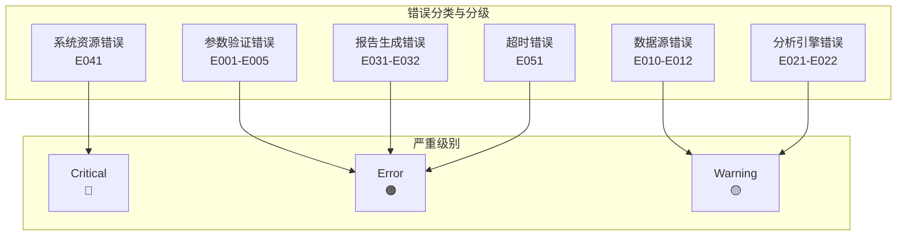
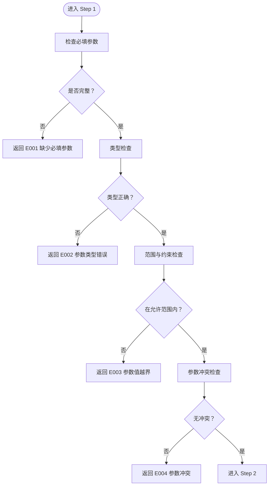
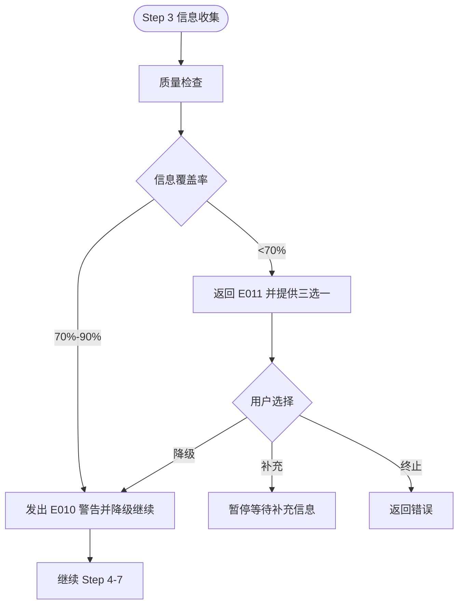
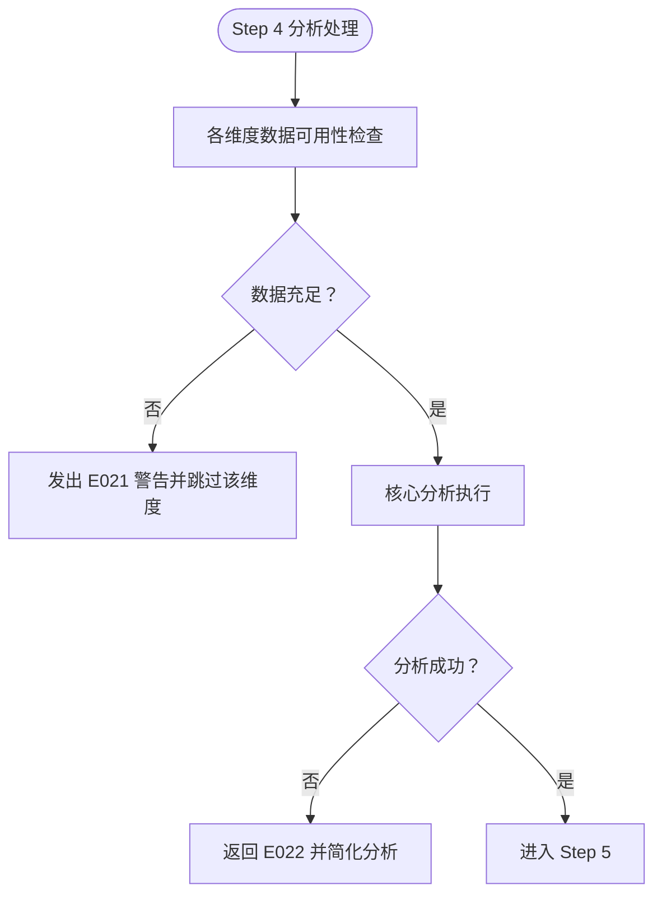
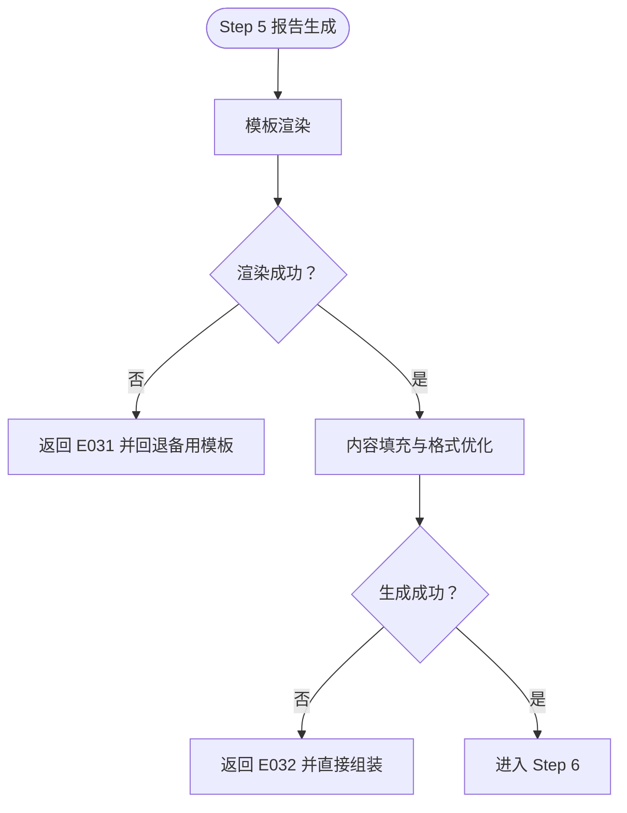
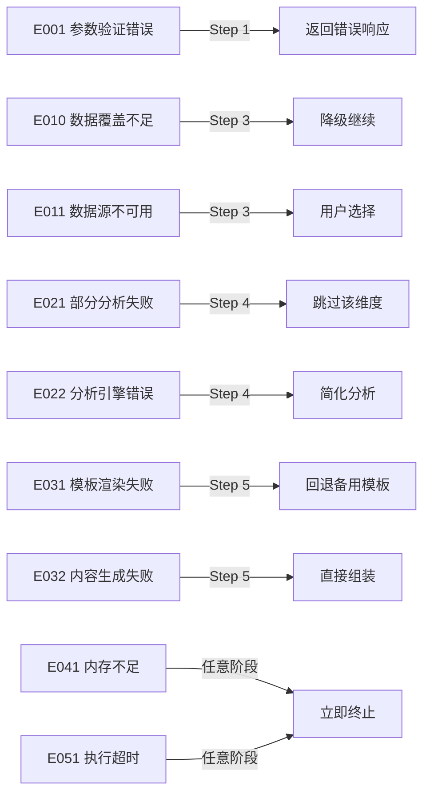

# 错误分类与分级体系

<cite>
**本文档引用的文件**
- [error-codes.md](file://references/error-codes.md)
- [execution-flow.md](file://references/execution-flow.md)
- [api-reference.md](file://references/api-reference.md)
- [examples-v2.md](file://references/examples-v2.md)
- [terminology.md](file://references/terminology.md)
</cite>

## 目录
1. [简介](#简介)
2. [项目结构](#项目结构)
3. [核心组件](#核心组件)
4. [架构总览](#架构总览)
5. [详细组件分析](#详细组件分析)
6. [依赖分析](#依赖分析)
7. [性能考量](#性能考量)
8. [故障排查指南](#故障排查指南)
9. [结论](#结论)
10. [附录](#附录)

## 简介
本文件为“任务执行总结报告生成器”技能的错误分类与分级体系提供系统化文档，涵盖五大错误类别（参数验证、数据源、分析引擎、报告生成、系统资源、超时）的错误码范围、严重级别定义、处理策略与降级机制，并提供决策树与判断标准，帮助开发者快速定位与处理错误。

## 项目结构
本项目围绕“执行流程”构建，包含输入参数解析、触发模式识别、信息收集、分析处理、报告生成、智能推荐、质量检查与输出等七个步骤。错误分类与分级贯穿全流程，依据错误发生阶段与影响程度进行分级与处理。

**图表来源**
- [execution-flow.md:175-1783](file://references/execution-flow.md#L175-L1783)

**章节来源**
- [execution-flow.md:175-1783](file://references/execution-flow.md#L175-L1783)

## 核心组件
- 错误码命名规则：E + 类别编号(1位) + 序号(2位)，如 E001、E010、E041。
- 类别编号分配：0-5 分别对应参数验证、数据源、分析引擎、报告生成、系统资源、超时。
- 严重级别：Critical（红色）、Error（橙色）、Warning（黄色）。
- 处理策略：致命错误直接返回错误响应；警告支持降级继续；部分错误可自动恢复或回退。

**章节来源**
- [error-codes.md:65-96](file://references/error-codes.md#L65-L96)
- [error-codes.md:152-170](file://references/error-codes.md#L152-L170)

## 架构总览
错误分类与分级体系在执行流程中按阶段进行拦截与处理，形成“分层防御”的容错机制：

**图表来源**
- [error-codes.md:154-161](file://references/error-codes.md#L154-L161)
- [error-codes.md:163-169](file://references/error-codes.md#L163-L169)

**章节来源**
- [error-codes.md:152-170](file://references/error-codes.md#L152-L170)

## 详细组件分析

### 参数验证错误（E001-E005）
- 错误码范围：E001（缺少必填参数）、E002（参数类型错误）、E003（参数值越界）、E004（参数冲突）、E005（无效章节组合）。
- 严重级别：Error（橙色）。
- 触发阶段：Step 1（参数解析与验证）。
- 处理策略：立即返回错误响应，提示修复建议；部分越界值可自动修正。
- 典型场景：缺少 task_name、detail_level 传入非法值、chapters 包含无效编号、summary 与全章节冲突等。

**图表来源**
- [execution-flow.md:175-310](file://references/execution-flow.md#L175-L310)

**章节来源**
- [error-codes.md:177-557](file://references/error-codes.md#L177-L557)
- [execution-flow.md:175-310](file://references/execution-flow.md#L175-L310)

### 数据源错误（E010-E012）
- 错误码范围：E010（信息覆盖不足，Warning）、E011（对话历史不可用，Error）、E012（文件访问被拒绝，Error）。
- 严重级别：Warning（🟡）或 Error（🟠）。
- 触发阶段：Step 3（信息收集阶段）。
- 处理策略：E010 降级继续并标注影响；E011 提供降级/补充/终止三选一；E012 支持更换路径或权限修复后重试。
- 典型场景：对话历史不可用、文件写入权限不足、信息覆盖率低于阈值等。

**图表来源**
- [execution-flow.md:627-659](file://references/execution-flow.md#L627-L659)
- [error-codes.md:560-758](file://references/error-codes.md#L560-L758)

**章节来源**
- [error-codes.md:560-758](file://references/error-codes.md#L560-L758)
- [execution-flow.md:627-659](file://references/execution-flow.md#L627-L659)

### 分析引擎错误（E021-E022）
- 错误码范围：E021（部分分析失败，Warning）、E022（核心分析引擎错误，Error）。
- 严重级别：Warning（🟡）或 Error（🔴）。
- 触发阶段：Step 4（分析处理阶段）。
- 处理策略：E021 跳过数据不足维度并标注；E022 回退到简化分析模式。
- 典型场景：协作数据缺失导致协作效果分析跳过、分析引擎异常导致简化输出。

**图表来源**
- [execution-flow.md:701-918](file://references/execution-flow.md#L701-L918)
- [error-codes.md:23-28](file://references/error-codes.md#L23-L28)

**章节来源**
- [error-codes.md:23-28](file://references/error-codes.md#L23-L28)
- [execution-flow.md:701-918](file://references/execution-flow.md#L701-L918)

### 报告生成错误（E031-E032）
- 错误码范围：E031（模板渲染失败，Error）、E032（内容生成失败，Error）。
- 严重级别：Error（🔴）。
- 触发阶段：Step 5（报告生成阶段）。
- 处理策略：E031 回退到备用模板；E032 使用已有数据直接组装。
- 典型场景：模板引擎异常、内容生成器异常。

**图表来源**
- [execution-flow.md:921-1151](file://references/execution-flow.md#L921-L1151)
- [error-codes.md:25-26](file://references/error-codes.md#L25-L26)

**章节来源**
- [error-codes.md:25-26](file://references/error-codes.md#L25-L26)
- [execution-flow.md:921-1151](file://references/execution-flow.md#L921-L1151)

### 系统资源错误（E041）
- 错误码范围：E041（内存不足，Critical）。
- 严重级别：Critical（🔴）。
- 触发阶段：任意阶段。
- 处理策略：立即终止执行并告警，不生成任何输出。
- 典型场景：系统内存不足导致无法继续执行。

**章节来源**
- [error-codes.md:27](file://references/error-codes.md#L27)

### 超时错误（E051）
- 错误码范围：E051（执行超时，Error）。
- 严重级别：Error（🔴）。
- 触发阶段：任意阶段。
- 处理策略：终止或返回部分结果。
- 典型场景：长时间未完成的复杂任务。

**章节来源**
- [error-codes.md:28](file://references/error-codes.md#L28)

## 依赖分析
错误分类与分级体系与执行流程紧密耦合，错误在各阶段被检测与处理，形成“异常路径汇总”。

**图表来源**
- [execution-flow.md:1470-1584](file://references/execution-flow.md#L1470-L1584)
- [error-codes.md:1487-1584](file://references/error-codes.md#L1487-L1584)

**章节来源**
- [execution-flow.md:1470-1584](file://references/execution-flow.md#L1470-L1584)
- [error-codes.md:1487-1584](file://references/error-codes.md#L1487-L1584)

## 性能考量
- 错误处理对性能的影响：参数验证（<1秒）、信息收集（30-120秒）、分析处理（60-180秒）、报告生成（30-120秒）、质量检查（<10秒）。
- 降级策略在保证可用性的前提下尽量减少额外开销，如 E010 降级继续、E021 跳过维度、E031 回退备用模板。

**章节来源**
- [execution-flow.md:142-170](file://references/execution-flow.md#L142-L170)
- [execution-flow.md:1148-1467](file://references/execution-flow.md#L1148-L1467)

## 故障排查指南
- 快速定位：根据错误码前两位判断类别（如 E01X 为数据源错误），结合严重级别决定处理方式。
- 降级执行：当出现 E010 或 E021 时，系统会自动降级并标注影响，开发者可据此调整输入或补充信息。
- 回退策略：模板渲染失败（E031）回退备用模板；内容生成失败（E032）直接组装基础内容。
- 系统资源与超时：内存不足（E041）需扩容或优化资源；超时（E051）需优化任务复杂度或增加时限。

**章节来源**
- [error-codes.md:1487-1584](file://references/error-codes.md#L1487-L1584)
- [execution-flow.md:1586-1584](file://references/execution-flow.md#L1586-L1584)

## 结论
本错误分类与分级体系以执行流程为骨架，以严重级别为准则，建立了从参数验证到报告输出的全链路容错机制。通过明确的错误码范围、处理策略与降级原则，开发者可快速定位问题并采取恰当的恢复措施，确保系统在不完美输入或局部故障下仍能交付有价值的结果。

## 附录

### 错误码命名规则与保留空间
- 命名规则：E + 类别编号(1位) + 序号(2位)。
- 类别编号：0-5 对应参数验证、数据源、分析引擎、报告生成、系统资源、超时。
- 保留空间：每个类别预留5个错误码空间，新增错误码需在对应类别范围内顺延。

**章节来源**
- [error-codes.md:65-96](file://references/error-codes.md#L65-L96)

### 严重级别定义与图标
- Critical（🔴）：系统级故障，无法继续运行，立即终止。
- Error（🟠）：功能性错误，当前操作无法完成，终止当前步骤或返回部分结果。
- Warning（🟡）：非致命问题，可以继续但质量受损，标记警告并继续执行。

**章节来源**
- [error-codes.md:163-169](file://references/error-codes.md#L163-L169)

### 跨类别通用错误处理原则
- 跨类别的通用错误归入最相关的类别。
- 优先保证用户可获得部分可用结果，必要时提供降级与恢复建议。

**章节来源**
- [error-codes.md:92-96](file://references/error-codes.md#L92-L96)