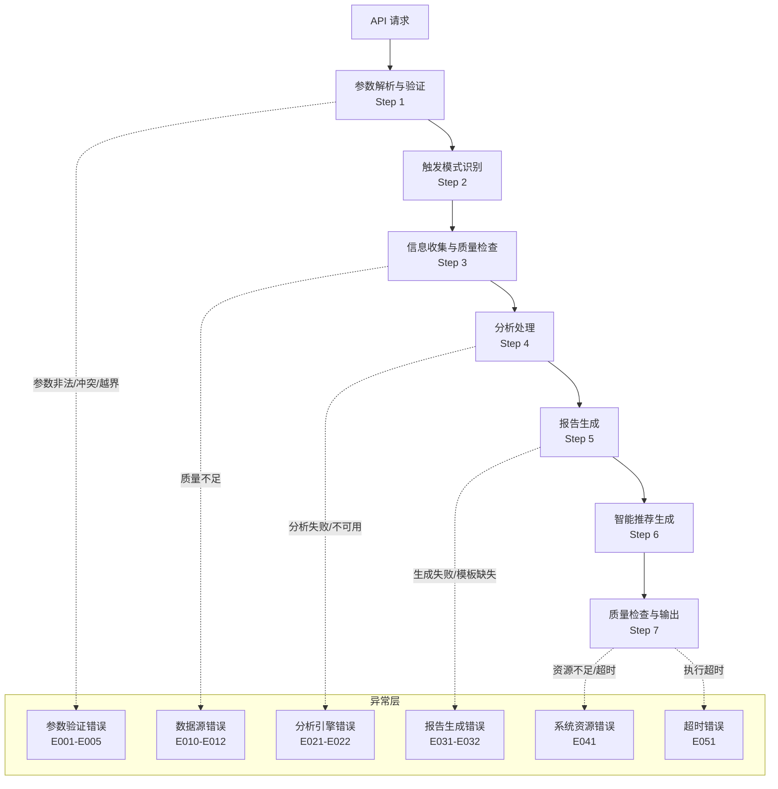
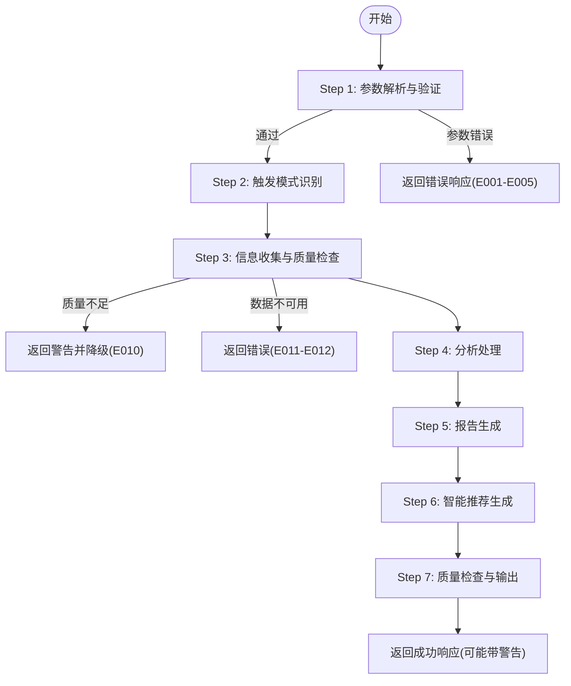
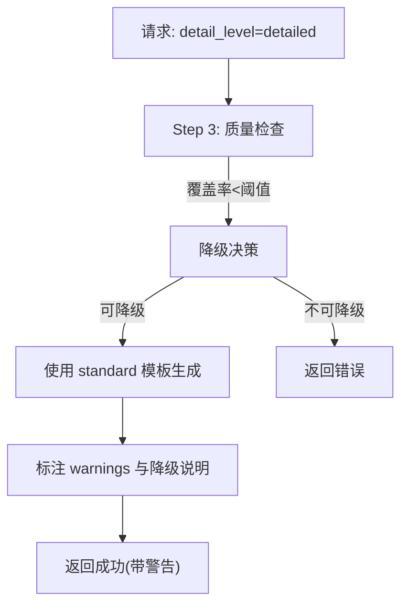

# 错误处理与故障排除

<cite>
**本文档引用的文件**
- [error-codes.md](file://references/error-codes.md)
- [execution-flow.md](file://references/execution-flow.md)
- [api-reference.md](file://references/api-reference.md)
- [examples-v2.md](file://references/examples-v2.md)
- [terminology.md](file://references/terminology.md)
</cite>

## 目录
1. [简介](#简介)
2. [项目结构](#项目结构)
3. [核心组件](#核心组件)
4. [架构总览](#架构总览)
5. [详细组件分析](#详细组件分析)
6. [依赖分析](#依赖分析)
7. [性能考量](#性能考量)
8. [故障排除指南](#故障排除指南)
9. [结论](#结论)
10. [附录](#附录)

## 简介
本文件面向技术支持与开发者，系统化阐述“任务执行总结报告生成器”的错误处理与故障排除体系，包括：
- 错误分级体系（Critical、Error、Warning）
- 各级别处理策略与行为表现
- 完整错误码定义、原因分析与修复建议
- 降级机制的工作原理与适用场景
- 常见问题诊断方法与调试流程
- 为快速定位与解决问题提供实用指导

## 项目结构
本技能的错误处理与故障排除相关文档分布在以下参考文件中：
- 错误码定义与处理策略：references/error-codes.md
- 执行流程与异常路径：references/execution-flow.md
- API 接口与响应规范：references/api-reference.md
- 使用示例与异常场景：references/examples-v2.md
- 术语与概念解释：references/terminology.md

**图表来源**
- [execution-flow.md:126-131](file://references/execution-flow.md#L126-L131)
- [error-codes.md:154-161](file://references/error-codes.md#L154-L161)

**章节来源**
- [execution-flow.md:1-25](file://references/execution-flow.md#L1-L25)
- [error-codes.md:1-35](file://references/error-codes.md#L1-L35)

## 核心组件
- 错误分级与处理策略
  - Critical：系统级故障，立即终止，不生成任何输出
  - Error：功能性错误，当前操作无法完成，终止当前步骤或返回部分结果
  - Warning：非致命问题，继续执行，最终报告标注并降低质量评分
- 错误码命名与分类
  - 格式：E + 类别编号(1位) + 序号(2位)
  - 类别：参数验证(0)、数据源(1)、分析引擎(2)、报告生成(3)、系统资源(4)、超时(5)
- 降级策略
  - 非致命错误不中断执行流程
  - Warning 级别错误允许继续运行并标注影响
  - 最终报告质量评分反映降级程度
  - 用户始终获得有价值的输出（即使不完美）

**章节来源**
- [error-codes.md:37-64](file://references/error-codes.md#L37-L64)
- [error-codes.md:65-97](file://references/error-codes.md#L65-L97)
- [error-codes.md:163-170](file://references/error-codes.md#L163-L170)

## 架构总览
错误处理贯穿执行流程的每个阶段，形成“分层防御、优雅降级、透明告知、可观测性”的体系：
- 分层防御：输入层拦截非法请求，数据层确保信息可获取，分析层异常捕获，生成层容错输出
- 优雅降级：Warning 级别错误允许继续，Critical/Error 级别错误终止或回退
- 透明告知：统一错误响应结构，包含恢复建议与预防措施
- 可观测性：自动记录完整堆栈与上下文，支持统计与趋势分析

**图表来源**
- [execution-flow.md:175-310](file://references/execution-flow.md#L175-L310)
- [execution-flow.md:441-699](file://references/execution-flow.md#L441-L699)

**章节来源**
- [execution-flow.md:28-96](file://references/execution-flow.md#L28-L96)

## 详细组件分析

### 错误分级与处理策略
- Critical（红色）
  - 定义：系统级故障，无法继续运行
  - 行为：立即终止，不生成任何输出
  - 典型场景：系统资源不足（E041）、执行超时（E051）
- Error（橙色）
  - 定义：功能性错误，当前操作无法完成
  - 行为：终止当前步骤，可能返回部分结果
  - 典型场景：参数验证失败（E001-E005）、数据源不可用（E011-E012）、分析失败（E021-E022）、生成失败（E031-E032）
- Warning（黄色）
  - 定义：非致命问题，可以继续但质量受损
  - 行为：标记警告，继续执行，最终报告标注
  - 典型场景：数据不充分（E010）

**章节来源**
- [error-codes.md:163-170](file://references/error-codes.md#L163-L170)

### 错误码定义与处理策略矩阵
- 参数验证错误（E001-E005）
  - E001：缺少必填参数 → Error，终止
  - E002：参数类型错误 → Error，终止
  - E003：参数值越界 → Error/Warning，修正或终止
  - E004：参数冲突 → Error，终止
  - E005：无效章节组合 → Error，终止
- 数据源错误（E010-E012）
  - E010：数据不充分 → Warning，降级继续
  - E011：对话历史不可用 → Error，支持手动输入替代
  - E012：文件访问被拒绝 → Error，更换路径或修复权限
- 分析引擎错误（E021-E022）
  - E021：目标分析失败 → Error，使用默认值或跳过
  - E022：时间线重建失败 → Error，使用估算或跳过
- 报告生成错误（E031-E032）
  - E031：模板未找到 → Error，回退到简化模板
  - E032：报告生成超时 → Error，返回部分结果
- 系统资源错误（E041）
  - E041：内存不足 → Critical，终止并告警
- 超时错误（E051）
  - E051：执行超时 → Error，终止或返回部分结果

**章节来源**
- [error-codes.md:154-161](file://references/error-codes.md#L154-L161)
- [error-codes.md:173-669](file://references/error-codes.md#L173-L669)

### 降级机制详解
- 降级触发条件
  - Step 3 质量检查覆盖率不足（如 E010），或请求的详细程度与可用信息不匹配
- 降级策略
  - 将详细程度从 requested 降级为 effective（如 detailed → standard）
  - 在报告中标注“信息有限”与降级说明
  - 质量评分相应降低，warnings 列表明确受影响章节
- 降级后的输出
  - success 仍为 true，但 degraded 标记为 true
  - quality_score 与 completeness_rate 降低
  - user_advice 提供升级建议（补充信息后重新生成）

**图表来源**
- [execution-flow.md:627-649](file://references/execution-flow.md#L627-L649)
- [examples-v2.md:461-688](file://references/examples-v2.md#L461-L688)

**章节来源**
- [execution-flow.md:627-699](file://references/execution-flow.md#L627-L699)
- [examples-v2.md:461-688](file://references/examples-v2.md#L461-L688)

### API 响应与错误响应结构
- 成功响应（HTTP 200）
  - success: true
  - report_id、timestamp、processing_time_ms
  - report.title、report.content、report.metadata
  - quality_check.completeness_rate、accuracy_confidence、warnings、overall_quality_score
  - statistics、file_info
- 错误响应（HTTP 4xx/5xx）
  - success: false
  - error.code、error.name、error.message、error.category、error.severity、error.http_status
  - error.timestamp、error.request_id、error.context、error.recovery
  - metadata.version、metadata.service

**章节来源**
- [api-reference.md:718-787](file://references/api-reference.md#L718-L787)
- [error-codes.md:98-132](file://references/error-codes.md#L98-L132)

## 依赖分析
- 执行流程与错误处理的耦合
  - Step 1 参数验证直接映射到 E001-E005
  - Step 3 质量检查映射到 E010、E011、E012
  - Step 4 分析失败映射到 E021、E022
  - Step 5 生成失败映射到 E031、E032
  - Step 7 资源不足/超时映射到 E041、E051
- 术语与概念支撑
  - “降级”“警告”“严重程度”等术语在术语表中有明确定义，便于统一理解与沟通

**图表来源**
- [execution-flow.md:126-131](file://references/execution-flow.md#L126-L131)
- [error-codes.md:154-161](file://references/error-codes.md#L154-L161)
- [terminology.md:907-916](file://references/terminology.md#L907-L916)

**章节来源**
- [execution-flow.md:126-131](file://references/execution-flow.md#L126-L131)
- [terminology.md:907-916](file://references/terminology.md#L907-L916)

## 性能考量
- 执行阶段耗时分布（标准版报告，中等复杂度任务）
  - Step 3（信息收集）：40-50%
  - Step 4（分析处理）：35-40%
  - Step 5（报告生成）：15-20%
  - Step 6（智能推荐）：5-10%
  - Step 7（质量检查）：< 2%
  - Step 2（触发识别）：< 2%
  - Step 1（参数解析）：< 1%
- 影响因素
  - 对话轮数：越多耗时越高
  - 详细程度：摘要版降低 30%-50%，详细版增加 50%-80%
- 降级对性能的影响
  - 降级通常降低生成复杂度，从而缩短处理时间，但质量评分下降

**章节来源**
- [execution-flow.md:142-171](file://references/execution-flow.md#L142-L171)

## 故障排除指南

### 1. 参数验证错误（E001-E005）
- E001 缺少必填参数
  - 现象：请求缺少 task_name 或等效任务标识
  - 修复：补齐必填参数，参考 API 文档参数定义
  - 预防：在 SDK/CLI 中实现参数校验与智能推断
- E002 参数类型错误
  - 现象：detail_level 传入数字而非字符串
  - 修复：使用字符串枚举值（summary/standard/detailed）
  - 预防：使用强类型模型与 OpenAPI 校验
- E003 参数值越界
  - 现象：chapters 包含无效编号（如 11）
  - 修复：调整到合法范围 1-10，或使用章节名称选择
  - 预防：提供在线验证与边界提示
- E004 参数冲突
  - 现象：摘要版与全章节同时指定
  - 修复：移除或修改冲突参数，参考参数兼容性矩阵
  - 预防：SDK 中实现冲突检测与建议方案
- E005 无效章节组合
  - 现象：缺少前置章节或仅选择附录
  - 修复：补充被依赖章节或使用预设 detail_level
  - 预防：提供章节依赖关系图与智能推荐

**章节来源**
- [error-codes.md:177-557](file://references/error-codes.md#L177-L557)
- [api-reference.md:183-586](file://references/api-reference.md#L183-L586)

### 2. 数据源与数据质量错误（E010-E012）
- E010 数据不充分（Warning）
  - 现象：对话历史过短、关键信息缺失
  - 修复：接受降级结果并在报告中标注处补充信息；或补充信息后重新生成
  - 预防：在任务执行过程中保持详细记录，使用结构化命令标记关键事件
- E011 对话历史不可用（Error）
  - 现象：权限不足、会话不存在、服务不可用
  - 修复：检查权限与会话有效性；使用手动输入模式；稍后重试
  - 预防：定期备份对话记录，实现分级权限管理
- E012 文件访问被拒绝（Error）
  - 现象：输出目录无写权限、路径不存在、磁盘配额不足
  - 修复：更换输出路径到有权限位置，修复权限或清理磁盘空间
  - 预防：提供权限检查与磁盘空间监控

**章节来源**
- [error-codes.md:560-758](file://references/error-codes.md#L560-L758)

### 3. 分析与生成错误（E021-E032）
- E021 目标分析失败（Error）
  - 现象：目标信息不完整或冲突
  - 修复：补充目标背景与验收标准；或使用默认值继续
- E022 时间线重建失败（Error）
  - 现象：时间戳不完整或冲突
  - 修复：提供精确时间范围；或使用估算值继续
- E031 模板未找到（Error）
  - 现象：模板文件缺失或路径错误
  - 修复：检查模板配置与路径；回退到简化模板
- E032 报告生成超时（Error）
  - 现象：生成过程耗时过长
  - 修复：降低详细程度；优化输入数据；检查系统资源

**章节来源**
- [error-codes.md:23-28](file://references/error-codes.md#L23-L28)
- [error-codes.md:21-22](file://references/error-codes.md#L21-L22)
- [error-codes.md:25-26](file://references/error-codes.md#L25-L26)

### 4. 系统资源与超时（E041、E051）
- E041 内存不足（Critical）
  - 现象：系统资源不足导致无法继续
  - 修复：终止当前请求，释放资源，稍后重试
  - 预防：监控资源使用，设置合理的并发与超时阈值
- E051 执行超时（Error）
  - 现象：请求处理时间超过阈值
  - 修复：降低详细程度或分批处理；检查上游依赖
  - 预防：优化算法与数据源，设置合理的超时策略

**章节来源**
- [error-codes.md:27](file://references/error-codes.md#L27)
- [error-codes.md:41-64](file://references/error-codes.md#L41-L64)

### 5. 调试流程与排查步骤
- 快速定位
  - 检查 error.severity 与 error.code，区分致命与非致命
  - 查看 error.context 与 error.recovery.suggestions 获取上下文与修复建议
- 逐步排查
  - Step 1：确认参数类型、范围与必填项
  - Step 2：确认触发模式与范围
  - Step 3：检查数据源可用性与质量覆盖率
  - Step 4：检查分析引擎日志与异常
  - Step 5：检查模板与生成器状态
  - Step 6：检查推荐生成器状态
  - Step 7：检查资源与超时配置
- 常见修复路径
  - 参数错误：补齐/修正参数值
  - 数据不足：补充对话记录或手动输入
  - 资源不足：释放资源或扩容
  - 超时：降低详细程度或优化数据

**章节来源**
- [execution-flow.md:175-699](file://references/execution-flow.md#L175-L699)
- [examples-v2.md:278-458](file://references/examples-v2.md#L278-L458)

## 结论
本技能通过“分层防御、优雅降级、透明告知、可观测性”的错误处理体系，确保在面对不完美输入或局部故障时仍能交付有价值的结果。建议在集成与使用过程中：
- 严格遵循参数验证规则，避免 E001-E005
- 在数据不足时接受 E010 降级，并在报告中标注补充信息
- 遇到 E011/E012 时优先检查权限与数据源可用性
- 针对 E041/E051 等系统级问题，优化资源配置与超时策略
- 借助统一的错误响应结构与术语表，提升问题定位与沟通效率

## 附录
- 术语速查：参考术语表中的“降级”“警告”“严重程度”等术语定义，有助于统一理解与沟通
- 示例参考：使用示例文档中的异常场景（参数错误、降级执行）快速定位与修复

**章节来源**
- [terminology.md:907-916](file://references/terminology.md#L907-L916)
- [examples-v2.md:278-688](file://references/examples-v2.md#L278-L688)