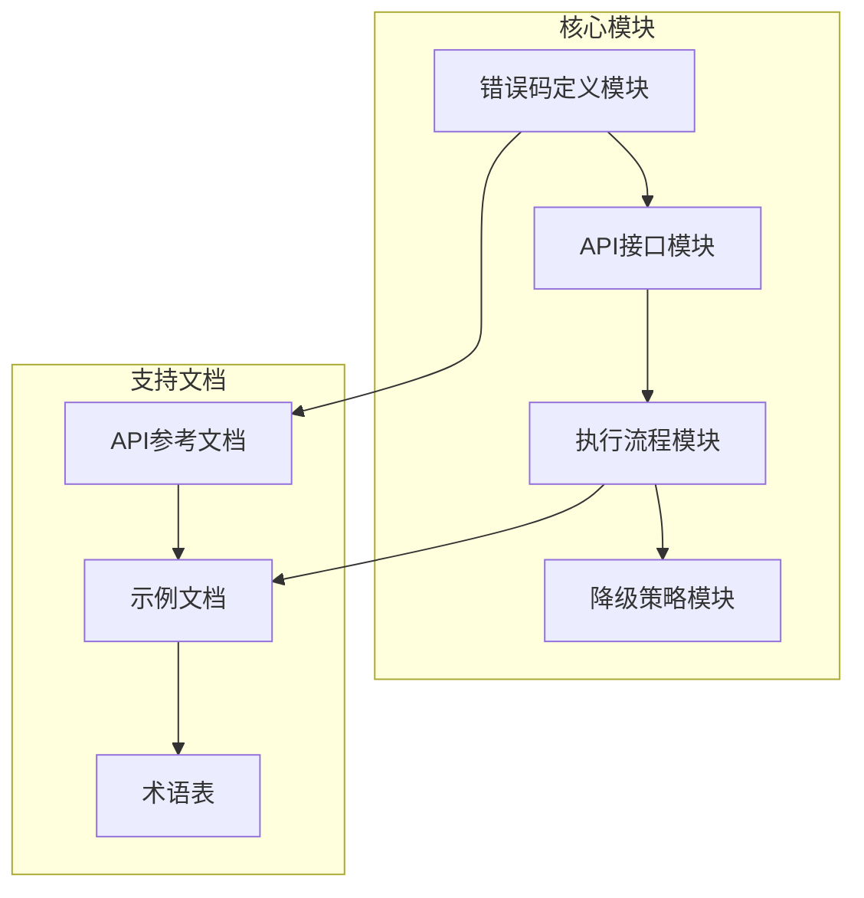
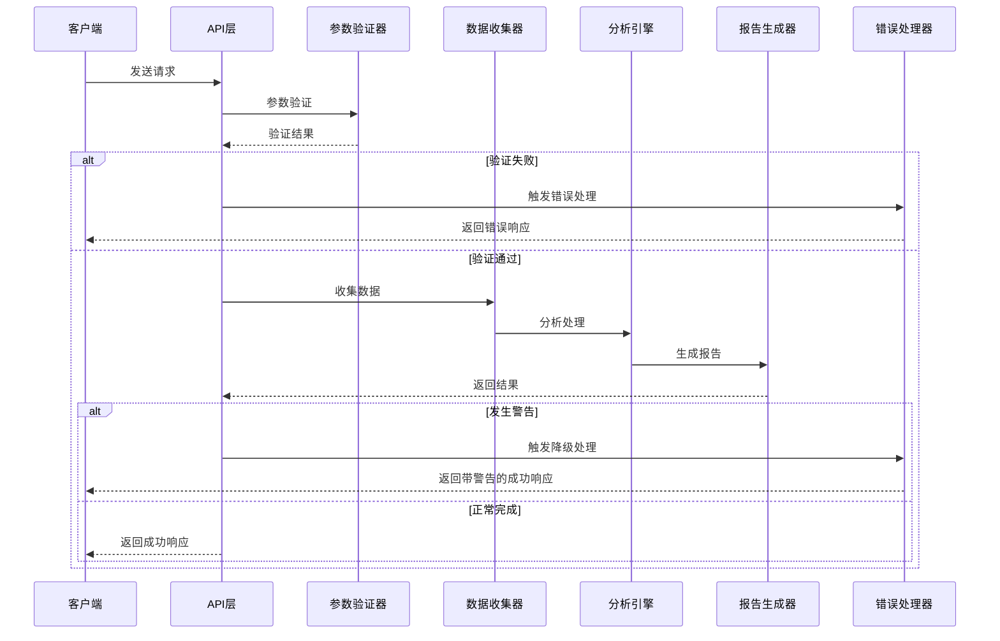
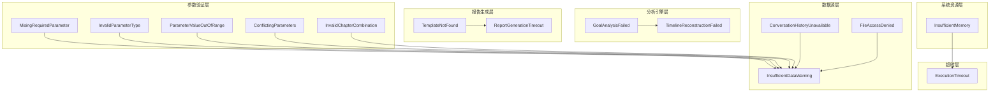
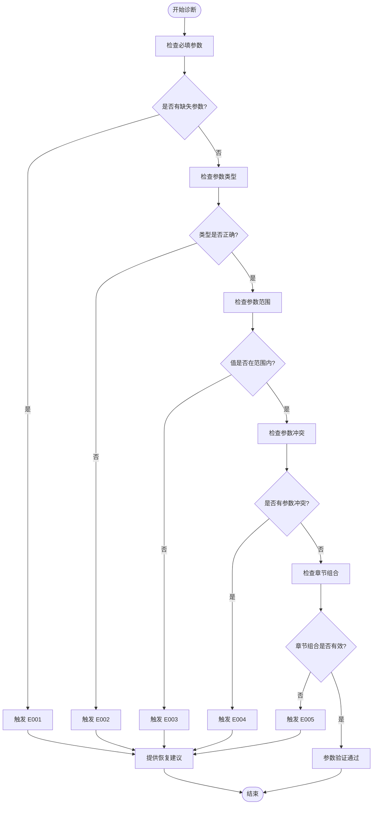
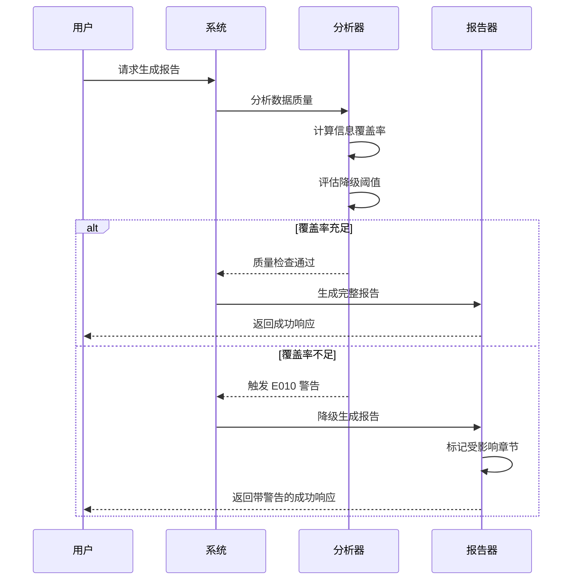

# 错误码完整参考手册

<cite>
**本文档引用的文件**
- [error-codes.md](file://references/error-codes.md)
- [api-reference.md](file://references/api-reference.md)
- [execution-flow.md](file://references/execution-flow.md)
- [examples-v2.md](file://references/examples-v2.md)
</cite>

## 目录
1. [简介](#简介)
2. [项目结构](#项目结构)
3. [核心组件](#核心组件)
4. [架构概览](#架构概览)
5. [详细组件分析](#详细组件分析)
6. [依赖分析](#依赖分析)
7. [性能考虑](#性能考虑)
8. [故障排除指南](#故障排除指南)
9. [结论](#结论)
10. [附录](#附录)

## 简介

"任务执行总结报告生成器"技能的错误码体系是一个完整的、分层的错误处理架构，旨在为开发者提供清晰、一致且可操作的错误处理体验。该体系遵循五大核心设计原则：

### 错误处理设计理念

**分层防御 (Defense in Depth)**
- 输入层：参数验证，拦截非法请求
- 数据层：数据源可用性检查，确保信息可获取
- 分析层：分析引擎异常捕获，保证计算稳定性
- 生成层：报告生成容错，支持部分成功输出

**优雅降级 (Graceful Degradation)**
- 非致命错误不中断执行流程
- Warning 级别错误允许继续运行并标注影响
- 最终报告质量评分反映降级程度
- 用户始终获得有价值的输出（即使不完美）

**透明告知 (Transparent Communication)**
- 所有错误都有明确的错误码和消息
- 响应中包含恢复建议和预防措施
- 日志记录完整上下文便于排查
- 降级信息在报告中清晰标注

**可观测性 (Observability)**
- 错误发生时自动记录完整堆栈和上下文
- 支持错误统计和趋势分析
- 提供质量评分量化报告可信度
- 关键节点有明确的健康检查指标

## 项目结构

该项目采用模块化架构，主要包含以下核心组件：



**图表来源**
- [error-codes.md:1-1594](file://references/error-codes.md#L1-L1594)
- [api-reference.md:1-1378](file://references/api-reference.md#L1-L1378)

**章节来源**
- [error-codes.md:1-1594](file://references/error-codes.md#L1-L1594)
- [api-reference.md:1-1378](file://references/api-reference.md#L1-L1378)

## 核心组件

### 错误码分类体系

系统将错误码按照功能领域进行分类，每个类别预留5个错误码空间，确保扩展性和一致性：

| 类别编码 | 类别名称 | 错误码范围 | 严重级别 | 处理策略 | 触发阶段 |
|---------|---------|-----------|---------|---------|---------|
| **E0xx** | 参数验证错误 | E001-E010 | Error/Warning | 验证失败时立即返回或降级 | 触发检测 → 信息收集 |
| **E1xx** | 数据源错误 | E011-E015 | Error/Warning | 数据获取异常时重试或降级 | 信息收集阶段 |
| **E2xx** | 分析引擎错误 | E021-E025 | Error/Warning | 分析失败时使用默认值或跳过 | 分析处理阶段 |
| **E3xx** | 报告生成错误 | E031-E035 | Error | 生成失败时返回错误或部分结果 | 报告生成阶段 |
| **E4xx** | 系统资源错误 | E041-E045 | Critical | 资源不足时终止并告警 | 任意阶段 |
| **E5xx** | 超时错误 | E051 | Error | 超时时终止或返回部分结果 | 任意阶段 |

**严重级别说明**

| 级别 | 图标 | 定义 | 对执行的影响 |
|------|------|------|-------------|
| **Critical** | 🔴 | 系统级故障，无法继续运行 | 立即终止，不生成任何输出 |
| **Error** | 🟠 | 功能性错误，当前操作无法完成 | 终止当前步骤，可能返回部分结果 |
| **Warning** | 🟡 | 非致命问题，可以继续但质量受损 | 标记警告，继续执行，最终报告标注 |

**章节来源**
- [error-codes.md:152-170](file://references/error-codes.md#L152-L170)
- [error-codes.md:1337-1343](file://references/error-codes.md#L1337-L1343)

## 架构概览

系统采用分层架构设计，每个执行阶段都有相应的错误处理机制：



**图表来源**
- [execution-flow.md:173-446](file://references/execution-flow.md#L173-L446)
- [error-codes.md:1337-1343](file://references/error-codes.md#L1337-L1343)

**章节来源**
- [execution-flow.md:1-800](file://references/execution-flow.md#L1-L800)
- [error-codes.md:1337-1343](file://references/error-codes.md#L1337-L1343)

## 详细组件分析

### 参数验证类错误码 (E001-E010)

#### E001: MissingRequiredParameter (缺少必填参数)

**属性定义**
- **错误码**: E001
- **名称**: MissingRequiredParameter
- **类别**: parameter_validation
- **严重程度**: 🟠 Error
- **HTTP 状态码**: 400 Bad Request
- **恢复模式**: terminate

**触发条件**
当调用技能时缺少一个或多个必填参数时触发。必填参数包括但不限于：
- `task_name` 或等效的任务标识
- 对话历史引用（隐式或显式）
- 输出路径（如果需要保存文件）

**错误消息模板**
```
缺少必填参数: {parameter_name}

必需参数列表:
- {required_param_1}: {description_1}
- {required_param_2}: {description_2}

当前已提供参数: {provided_params_list}

请补充缺失的必填参数后重试。
```

**示例场景**
用户直接发送 `/summary` 命令但没有指定要总结的任务，且当前对话中没有足够的任务执行上下文。

**恢复建议**
1. 检查 API 文档确认所有必填参数
2. 在请求中补充缺失的参数值
3. 如果是交互式场景，引导用户提供必要信息

**预防措施**
- 在 SDK 和 CLI 工具中实现参数校验
- 提供清晰的参数文档和示例
- 实现智能推断：尝试从对话上下文中自动提取缺失信息
- 对于可选但有默认值的参数，在文档中明确标注默认行为

**章节来源**
- [error-codes.md:177-246](file://references/error-codes.md#L177-L246)
- [examples-v2.md:278-407](file://references/examples-v2.md#L278-L407)

#### E002: InvalidParameterType (参数类型错误)

**属性定义**
- **错误码**: E002
- **名称**: InvalidParameterType
- **类别**: parameter_validation
- **严重程度**: 🟠 Error
- **HTTP 状态码**: 400 Bad Request
- **恢复模式**: terminate

**触发条件**
当提供的参数类型与预期不符时触发，常见情况包括：
- `detail_level` 应为字符串 ("summary"/"standard"/"detailed") 但传入了数字
- `chapters` 应为数组但传入了字符串
- `output_format` 应为特定枚举值但传入了自定义字符串
- 时间参数格式错误（非 ISO 8601 格式）

**错误消息模板**
```
参数类型错误: {parameter_name}

期望类型: {expected_type}
实际类型: {actual_type}
实际值: {actual_value}

有效的值示例: {valid_examples}

请修正参数类型后重试。
```

**示例场景**
用户在请求中将 `detail_level` 设置为数字 `2` 而不是字符串 `"detailed"`。

**恢复建议**
1. 对照文档检查参数的预期类型
2. 使用正确的数据类型重新提交请求
3. 利用 SDK 的类型提示功能避免此类错误

**预防措施**
- 使用强类型的请求模型（如 TypeScript interface、Pydantic model）
- 提供 OpenAPI/Swagger 文档供自动校验
- 在客户端 SDK 中内置类型检查
- 对边界情况进行清晰的错误提示

**章节来源**
- [error-codes.md:249-320](file://references/error-codes.md#L249-L320)
- [examples-v2.md:278-407](file://references/examples-v2.md#L278-L407)

#### E003: ParameterValueOutOfRange (参数值超出范围)

**属性定义**
- **错误码**: E003
- **名称**: ParameterValueOutOfRange
- **类别**: parameter_validation
- **严重程度**: 🟠 Error
- **HTTP 状态码**: 400 Bad Request
- **恢复模式**: terminate

**触发条件**
当参数值超出允许的范围时触发，包括：
- 数值型参数超过最大/最小限制（如 `max_issues` > 100）
- 字符串长度超出限制（如 `task_name` > 200 字符）
- 枚举值不在允许集合中
- 日期范围不合理（结束时间早于开始时间）
- 章节选择包含无效的章节编号

**错误消息模板**
```
参数值超出范围: {parameter_name}

当前值: {current_value}
有效范围: {valid_range}
约束说明: {constraint_description}

请将参数调整到有效范围内后重试。
```

**示例场景**
用户请求生成报告时指定了无效的章节组合，包含了不存在的第11章。

**恢复建议**
1. 查看文档了解参数的有效取值范围
2. 将参数值调整到合法范围内
3. 如需扩展范围，联系系统管理员评估可行性

**预防措施**
- 在文档中明确标注每个参数的取值范围和约束
- 使用 enum 类型限制枚举值的选择
- 实现客户端预校验，在提交前拦截无效值
- 对复杂约束提供在线验证工具

**章节来源**
- [error-codes.md:323-397](file://references/error-codes.md#L323-L397)
- [examples-v2.md:278-407](file://references/examples-v2.md#L278-L407)

#### E004: ConflictingParameters (参数冲突)

**属性定义**
- **错误码**: E004
- **名称**: ConflictingParameters
- **类别**: parameter_validation
- **严重程度**: 🟠 Error
- **HTTP 状态码**: 400 Bad Request
- **恢复模式**: terminate

**触发条件**
当多个参数之间存在逻辑冲突时触发，典型场景包括：
- 同时指定了 `detail_level="summary"` 和 `chapters=[1,2,3,4,5,6,7,8,9,10]`（摘要版不应包含全部章节）
- 同时指定了 `include_chapters` 和 `exclude_chapters` 且存在重叠
- `output_path` 指定了 `.pdf` 但 `output_format` 为 `"markdown"`
- `time_range` 与具体的时间点参数冲突

**错误消息模板**
```
参数冲突: {parameter_1} 与 {parameter_2} 存在矛盾

{parameter_1} = {value_1}: {meaning_1}
{parameter_2} = {value_2}: {meaning_2}

冲突原因: {conflict_explanation}

请移除或修改其中一个参数以消除冲突。
```

**示例场景**
用户同时要求摘要版输出但又指定了包含所有10个章节。

**恢复建议**
1. 理解每个参数的含义和它们之间的相互关系
2. 选择一组一致的非冲突参数组合
3. 参考文档中的参数兼容性矩阵

**预防措施**
- 提供参数兼容性表格，明确哪些参数不能同时使用
- 在 SDK 中实现参数冲突检测
- 当检测到冲突时，提供具体的解决方案选项
- 使用 builder 模式或 fluent API 引导用户正确配置

**章节来源**
- [error-codes.md:401-473](file://references/error-codes.md#L401-L473)
- [examples-v2.md:278-407](file://references/examples-v2.md#L278-L407)

#### E005: InvalidChapterCombination (无效的章节组合)

**属性定义**
- **错误码**: E005
- **名称**: InvalidChapterCombination
- **类别**: parameter_validation
- **严重程度**: 🟠 Error
- **HTTP 状态码**: 400 Bad Request
- **恢复模式**: terminate

**触发条件**
当选择的章节组合违反依赖关系或完整性约束时触发：
- 缺少基础章节（如只有第9章经验总结却没有第3章执行过程）
- 章节间存在前置依赖未满足（如选了第8章多维度分析却没选第2章目标）
- 仅选择了附录而没有正文章节
- 选择的章节数量为0（空数组）

**错误消息模板**
```
无效的章节组合: {chapter_list}

问题: {dependency_issue_description}

依赖关系说明:
- {dependent_chapter} 依赖于 {prerequisite_chapter}
- 原因: {reason}

建议的完整组合:
- 方案A: {recommended_set_a}
- 方案B: {recommended_set_b}
```

**示例场景**
用户只选择了第8章（多维度分析）和第9章（经验总结），缺少了提供原始数据的第2-7章。

**恢复建议**
1. 了解章节之间的依赖关系图
2. 补充被依赖的前置章节
3. 或使用预设的 `detail_level` 快速选择合理的章节组合

**预防措施**
- 在文档中提供章节依赖关系图
- 实现 interactive 模式下的实时校验和提示
- 提供"智能推荐"功能，根据用户意图推荐最优章节组合
- 对常见组合提供快捷选项（如"仅复盘"、"仅方法论"等）

**章节来源**
- [error-codes.md:477-556](file://references/error-codes.md#L477-L556)
- [examples-v2.md:278-407](file://references/examples-v2.md#L278-L407)

#### E010: InsufficientDataWarning (数据不充分警告)

**属性定义**
- **错误码**: E010
- **名称**: InsufficientDataWarning
- **类别**: data_source
- **严重程度**: 🟡 Warning
- **HTTP 状态码**: 206 Partial Content
- **恢复模式**: degrade

**触发条件**
当任务执行过程中发现某些关键信息缺失或不充分，但不足以阻止报告生成时触发。这是**降级继续的核心机制**：

- 对话历史过短（< 5轮交互），信息密度不足
- 缺少关键阶段的信息（如有执行无决策记录）
- 时间戳信息不完整，无法精确重建时间线
- 问题解决过程描述模糊，缺乏细节
- 资源使用信息未被提及
- 团队协作信息完全缺失（对于多人任务）

**错误消息模板**
```
⚠️ 数据不充分警告

缺失信息类型: {missing_data_types}
影响程度: {impact_level} (轻微/中等/显著)
受影响章节: {affected_chapters}

系统将以降级模式继续生成报告:
- 受影响的章节将使用推断数据或标注[数据不足]
- 报告质量评分将相应降低
- 建议在获得更完整数据后重新生成

缺失详情:
{missing_details_by_category}
```

**示例场景**
用户的任务对话只有8轮，其中大部分是简短的指令确认，缺少详细的决策讨论和问题描述。

**恢复建议**
1. **接受降级结果**：查看生成的报告，在 `[数据不足]` 标注处手动补充信息
2. **补充信息后重新生成**：提供更多关于任务执行的详细信息后再次请求
3. **切换到交互模式**：使用交互式生成方式，在过程中逐步补充缺失信息
4. **导入手动记录**：如果有外部笔记或文档，可以作为附加数据源导入

**预防措施**
- 在任务执行过程中保持详细的对话记录（鼓励用户说明思考过程）
- 使用结构化的命令来标记关键事件（如 `/decision`, `/issue`, `/milestone`）
- 定期保存中间状态和重要结论
- 对于重要任务，建议在开始前明确告知需要记录哪些维度的信息

**对 quality_score 的影响**

| 缺失信息类型 | 分数扣减 | 说明 |
|-------------|---------|------|
| 决策记录缺失 | -10 至 -20 | 第四章关键决策分析质量下降 |
| 时间信息不全 | -5 至 -15 | 第三章时间线和第八章时间分析精度降低 |
| 问题记录模糊 | -10 至 -20 | 第五章问题分析深度不足 |
| 资源信息缺失 | -5 至 -10 | 第六章资源分析简化 |
| 协作信息缺失 | -0 至 -10 | 第七章标注为"不适用"（单人任务时不扣分） |

**章节来源**
- [error-codes.md:560-668](file://references/error-codes.md#L560-L668)
- [examples-v2.md:461-622](file://references/examples-v2.md#L461-L622)

### 数据源类错误码 (E011-E015)

#### E011: ConversationHistoryUnavailable (对话历史不可用)

**属性定义**
- **错误码**: E011
- **名称**: ConversationHistoryUnavailable
- **类别**: data_source
- **严重程度**: 🟠 Error
- **HTTP 状态码**: 503 Service Unavailable
- **恢复模式**: partial (支持手动输入替代)

**触发条件**
当无法访问对话历史时触发：
- 对话历史服务不可用或超时
- 权限不足无法读取对话记录
- 对话已被删除或过期
- 会话ID无效或不存在
- 网络连接问题导致数据拉取失败

**错误消息模板**
```
对话历史不可用: {reason}

错误原因: {detailed_reason}
会话ID: {session_id} (如适用)

可选的恢复方案:
1. 手动提供任务执行的关键信息
2. 稍后重试（如果是临时性服务问题）
3. 从本地缓存或导出的记录中恢复

如选择手动输入，请提供以下信息:
- 任务目标和背景
- 主要执行步骤
- 遇到的问题和解决方案
- 关键决策及其理由
```

**示例场景**
由于权限变更，系统无法访问用户指定的历史会话记录。

**恢复建议**
1. **检查权限**：确认当前身份有权限访问目标会话
2. **使用手动模式**：切换到手动输入模式，自行填写任务信息
3. **等待重试**：如果是临时服务问题，等待几分钟后重试
4. **导出恢复**：如果之前有导出过对话记录，可以从本地文件恢复

**预防措施**
- 定期备份重要的对话记录
- 使用持久化的存储方案而非纯内存
- 实现分级权限管理，避免意外丢失访问权
- 提供对话导出功能，让用户可以本地存档

**章节来源**
- [error-codes.md:671-757](file://references/error-codes.md#L671-L757)
- [examples-v2.md:461-622](file://references/examples-v2.md#L461-L622)

#### E012: FileAccessDenied (文件访问被拒绝)

**属性定义**
- **错误码**: E012
- **名称**: FileAccessDenied
- **类别**: data_source
- **严重程度**: 🟠 Error
- **HTTP 状态码**: 403 Forbidden
- **恢复模式**: partial (更换路径或权限修复后重试)

**触发条件**
当无法读写指定的文件时触发：
- 输出目录没有写入权限
- 指定的文件路径不存在且无法创建（父目录无权限）
- 文件被其他进程锁定
- 磁盘配额已满
- 安全策略禁止访问该路径（如沙箱限制）

**错误消息模板**
```
文件访问被拒绝: {file_path}

操作类型: {operation} (read/write/create/delete)
原因: {access_denied_reason}

当前用户: {current_user}
目标路径权限: {path_permissions}
磁盘状态: {disk_status}

建议:
1. 检查文件/目录权限设置
2. 更换输出路径到有权限的位置
3. 以更高权限运行（谨慎使用）
4. 检查磁盘空间是否充足
```

**示例场景**
用户指定将报告输出到系统保护目录 `C:\Windows\` 下。

**恢复建议**
1. **更换路径**：使用推荐的备选路径或用户目录下的位置
2. **修复权限**：对目标目录授予当前用户写入权限
3. **创建父目录**：确保输出路径的所有父目录都已存在
4. **检查空间**：确认磁盘有足够的空间（建议至少预留 10MB）

**预防措施**
- 在保存前检查目标路径的可写性
- 默认使用相对路径或用户目录下的安全位置
- 提供路径建议和自动补全功能
- 实现临时文件机制，先写到临时位置再移动

**章节来源**
- [error-codes.md:761-844](file://references/error-codes.md#L761-L844)
- [examples-v2.md:799-831](file://references/examples-v2.md#L799-L831)

### 分析引擎类错误码 (E021-E025)

#### E021: GoalAnalysisFailed (目标分析失败)

**属性定义**
- **错误码**: E021
- **名称**: GoalAnalysisFailed
- **类别**: analysis_engine
- **严重程度**: 🟠 Error
- **HTTP 状态码**: 500 Internal Server Error
- **恢复模式**: estimate (使用估算值代替精确分析)

**触发条件**
当目标达成度分析过程出现异常时触发：
- 无法从对话中提取明确的目标定义
- 目标描述过于模糊无法量化
- 缺少验收标准无法判断达成情况
- 分析算法内部错误
- 目标在执行过程中发生了重大变更且未记录

**错误消息模板**
```
目标达成度分析失败: {failure_reason}

原始目标描述: {goal_description}
问题: {analysis_problem}

影响范围:
- 第二章: 任务背景与目标 - 目标定义部分将使用原始文本
- 第八章: 多维度分析 - 目标达成度分析将被跳过或简化
- 第一章: 执行概览 - 达成率数据将为估算值

系统将继续生成报告，目标分析部分将标注[分析受限]。
```

**示例场景**
用户的任务目标是"优化一下代码"，这个描述过于模糊，无法进行量化的达成度分析。

**恢复建议**
1. **接受估算结果**：报告将包含定性的目标分析而非定量指标
2. **补充目标信息**：如果可能，提供更具体的目标描述和验收标准
3. **事后编辑**：在生成的报告基础上手动补充目标分析的数值

**预防措施**
- 在任务开始时引导用户设定 SMART 目标
- 使用结构化的目标定义模板
- 在执行过程中定期确认目标是否仍然适用
- 记录目标的任何变更及其原因

**章节来源**
- [error-codes.md:847-915](file://references/error-codes.md#L847-L915)
- [examples-v2.md:881-904](file://references/examples-v2.md#L881-L904)

#### E022: TimelineReconstructionFailed (时间线重建失败)

**属性定义**
- **错误码**: E022
- **名称**: TimelineReconstructionFailed
- **类别**: analysis_engine
- **严重程度**: 🟡 Warning
- **HTTP 状态码**: 206 Partial Content
- **恢复模式**: degrade (使用粗粒度时间线)

**触发条件**
当无法精确重建任务执行时间线时触发：
- 对话消息缺少时间戳或时间戳不准确
- 存在大量的离线操作（未在对话中记录的工作）
- 时间跨度太大导致精度损失
- 并行任务交错导致时序混乱
- 中途切换了工作上下文

**错误消息模板**
```
⚠️ 时间线重建精度受限: {limitation_reason}

可用时间信息: {available_time_info}
时间精度: {precision_level} (精确到{granularity})

影响:
- 第三章: 执行过程详解 - 时间数据为近似值
- 第八章: 时间效能分析 - 效能指标为估算值

时间线将以{granularity}粒度呈现，具体时刻可能存在偏差。
```

**示例场景**
用户的任务跨越了3天，但对话中有大量时间段是没有消息的（用户在离线编码），导致只能根据消息间隔粗略估计耗时。

**恢复建议**
1. **接受粗粒度时间线**：报告中的时间数据标注为"估算值"
2. **手动校正**：在报告生成后手动修正已知准确的时间数据
3. **补充时间记录**：如果有外部的工时记录系统，可以整合进去

**预防措施**
- 鼓励用户在任务执行过程中使用 `/timer` 或类似工具记录时间
- 对于长周期任务，定期进行阶段性汇报
- 使用集成开发环境的活动日志作为辅助数据源
- 在对话中使用时间标记（如"[耗时约2小时]"）

**章节来源**
- [error-codes.md:919-987](file://references/error-codes.md#L919-L987)
- [examples-v2.md:952-976](file://references/examples-v2.md#L952-L976)

### 报告生成类错误码 (E031-E035)

#### E031: TemplateNotFound (模板未找到)

**属性定义**
- **错误码**: E031
- **名称**: TemplateNotFound
- **类别**: report_generation
- **严重程度**: 🟠 Error
- **HTTP 状态码**: 404 Not Found
- **恢复模式**: terminate (必须使用有效模板)

**触发条件**
当请求的报告模板不存在时触发：
- 模板名称拼写错误
- 模板版本不存在
- 自定义模板已被删除
- 模板 ID 无效或过期
- 模板文件损坏无法加载

**错误消息模板**
```
报告模板不存在: {template_identifier}

查找位置: {search_locations}
已注册模板列表: {available_templates}

可能的纠正:
1. 检查模板名称拼写
2. 使用 --list-templates 查看可用模板
3. 使用默认模板 (default) 重试
4. 确认自定义模板是否仍存在
```

**示例场景**
用户指定了一个不存在的自定义模板名称。

**恢复建议**
1. **使用默认模板**：省略 template 参数或使用 `"default"`
2. **列出可用模板**：调用模板列表 API 查看正确的模板名称
3. **创建新模板**：如果需要特殊格式，可以先创建再使用

**预防措施**
- 提供模板名称的自动补全功能
- 在文档中列出所有内置模板及其用途
- 实现模板版本管理，避免误删正在使用的模板
- 对自定义模板提供验证和测试机制

**章节来源**
- [error-codes.md:991-1071](file://references/error-codes.md#L991-L1071)
- [examples-v2.md:1024-1060](file://references/examples-v2.md#L1024-L1060)

#### E032: ReportGenerationTimeout (报告生成超时)

**属性定义**
- **错误码**: E032
- **名称**: ReportGenerationTimeout
- **类别**: report_generation
- **严重程度**: 🟠 Error
- **HTTP 状态码**: 504 Gateway Timeout
- **恢复模式**: partial (返回已生成的内容)

**触发条件**
当报告生成过程超过预设时间限制时触发：
- 任务过于复杂（如超长对话、大量代码变更）
- 系统负载过高导致处理缓慢
- 外部服务调用阻塞（如 LLM API 响应慢）
- 模板渲染涉及大量动态内容
- 输出文件过大（如包含大量代码清单）

**错误消息模板**
```
报告生成超时: 已超过 {timeout_limit} 限制

当前进度: {progress_percentage}%
已完成章节: {completed_chapters}
正在生成: {current_chapter}

可选操作:
1. 接收已生成的部分报告 (partial output)
2. 降低详细程度后重试 (use summary mode)
3. 排除部分章节后重试 (reduce scope)
4. 稍后重试 (system may be under load)
```

**示例场景**
用户的任务对话长达200轮，包含大量代码片段，报告生成超过了默认的5分钟超时限制。

**恢复建议**
1. **接收部分报告**：获取已经完成的章节内容，后续可单独生成剩余章节
2. **降低详细程度**：使用 `detail_level="summary"` 大幅减少处理时间
3. **缩小范围**：排除不需要的章节减少工作量
4. **增加超时**：如果确实需要完整报告，联系管理员调整超时设置

**预防措施**
- 对于大型任务，提前预估生成时间并提示用户
- 实现增量生成机制，支持断点续传
- 提供进度显示，让用户了解当前状态
- 优化性能瓶颈（如 LLM 调用批处理、缓存机制）

**章节来源**
- [error-codes.md:1075-1157](file://references/error-codes.md#L1075-L1157)
- [examples-v2.md:1109-1145](file://references/examples-v2.md#L1109-L1145)

### 系统资源类错误码 (E041-E045)

#### E041: InsufficientMemory (内存不足)

**属性定义**
- **错误码**: E041
- **名称**: InsufficientMemory
- **类别**: system_resource
- **严重程度**: 🔴 Critical
- **HTTP 状态码**: 507 Insufficient Storage
- **恢复模式**: terminate (无法恢复，需释放资源)

**触发条件**
当系统内存不足以继续执行时触发：
- 处理超大对话历史时内存溢出
- 同时处理多个大型报告生成任务
- 内存泄漏导致可用内存耗尽
- 系统级别的内存压力（其他进程占用过多）
- 虚拟内存交换频繁导致性能急剧下降

**错误消息模板**
```
🔴 致命错误: 内存不足

当前内存状态:
- 已用内存: {used_memory} / {total_memory} ({usage_percent}%)
- 可用内存: {available_memory}
- 需求内存: {estimated_required_memory}
- 内存缺口: {memory_deficit}

此错误无法自动恢复。请采取以下措施:

1. 关闭不必要的应用程序释放内存
2. 减少并发任务数量
3. 增加系统物理内存
4. 使用更轻量的配置（如 summary 模式）

错误追踪ID: {error_trace_id}
请联系系统管理员获取支持。
```

**示例场景**
系统正在同时处理3个大型报告生成任务，加上其他服务的内存占用，导致可用内存不足2GB，而当前任务预计需要4GB。

**恢复建议**
1. **释放内存**：关闭其他占用内存的应用程序
2. **等待空闲**：等待其他报告生成任务完成
3. **降低需求**：使用 summary 模式减少内存需求（约降低60%）
4. **升级硬件**：长期解决方案是增加物理内存

**预防措施**
- 实现内存使用监控和预警机制
- 设置并发任务数上限
- 对超大输入进行分块处理
- 实现内存优化的数据处理流水线（流式处理而非全量加载）
- 定期进行内存泄漏检测和修复

**章节来源**
- [error-codes.md:1161-1248](file://references/error-codes.md#L1161-L1248)
- [examples-v2.md:1201-1235](file://references/examples-v2.md#L1201-L1235)

### 超时类错误码 (E051)

#### E051: ExecutionTimeout (执行超时)

**属性定义**
- **错误码**: E051
- **名称**: ExecutionTimeout
- **类别**: timeout
- **严重程度**: 🟠 Error
- **HTTP 状态码**: 504 Gateway Timeout
- **恢复模式**: partial (返回部分结果或允许延长)

**触发条件**
当整个任务执行流程（从信息收集到报告生成）超过全局超时限制时触发：
- 全局超时默认值为 10 分钟
- 复杂任务（如跨多天的项目）可能需要更长处理时间
- 系统处于高负载状态导致整体变慢
- 外部依赖服务响应缓慢

**错误消息模板**
```
执行超时: 任务总耗时已超过 {global_timeout} 限制

已用时间: {elapsed_time}
超时限制: {timeout_limit}
当前阶段: {current_phase}
阶段进度: {phase_progress}%

此超时覆盖整个执行流程，不同于单阶段的超时(E032)。

恢复选项:
1. 获取已产生的中间结果
2. 使用更宽松的超时设置重试 (需权限)
3. 简化任务范围后重试
```

**示例场景**
一个涉及50+轮对话、多个代码文件变更、复杂问题排查过程的任务，总体执行时间达到了12分钟，超过了10分钟的全局超时。

**恢复建议**
1. **拆分任务**：将大型任务拆分为多个小任务分别生成报告
2. **降低复杂度**：使用 summary 模式或减少包含的章节
3. **申请延长时间**：联系管理员为当前任务类型设置更长的超时
4. **错峰执行**：在系统负载较低时重试

**预防措施**
- 在任务开始前进行复杂度评估并预警
- 实现任务拆分建议（自动检测是否应该拆分）
- 提供进度条和预计剩余时间
- 优化各阶段的性能瓶颈
- 对已知的大型任务类型使用专门的优化路径

**章节来源**
- [error-codes.md:1252-1333](file://references/error-codes.md#L1252-L1333)
- [examples-v2.md:1287-1320](file://references/examples-v2.md#L1287-L1320)

## 依赖分析

### 错误码依赖关系图



**图表来源**
- [error-codes.md:152-161](file://references/error-codes.md#L152-L161)
- [error-codes.md:1337-1343](file://references/error-codes.md#L1337-L1343)

### 错误码处理策略矩阵

| 严重级别 | 是否中断执行 | 用户通知方式 | 日志级别 | 默认行为 | 可配置？ | 典型错误码 |
|---------|-------------|-------------|---------|---------|---------|-----------|
| **🔴 Critical** | ✅ 立即终止 | 弹窗 + 日志 + 告警 | ERROR | 返回错误，不生成任何输出，释放资源 | ❌ 不可覆盖 | E041 |
| **🟠 Error** | ✅ 终止当前操作 | 提示 + 日志 + 建议 | WARN | 返回错误信息和恢复建议，不生成完整报告 | ⚠️ 部分可配置（可选择 partial 模式） | E001, E002, E003, E004, E005, E011, E012, E021, E031, E032, E051 |
| **🟡 Warning** | ❌ 继续执行 | 报告内标注 + 日志 | INFO | 降级继续，在最终报告中体现警告信息 | ✅ 完全可配置（可选择严格模式升级为 Error） | E010, E022 |

**章节来源**
- [error-codes.md:1337-1375](file://references/error-codes.md#L1337-L1375)

## 性能考虑

### 关键性能指标

系统在典型任务场景下的预估耗时分布：

```
总耗时分布概览（标准版报告，中等复杂度任务）
Step 3 ████████████████████████████████░░░░░░░░  40-50%  (核心瓶颈)
Step 4 ██████████████████████████░░░░░░░░░░░░░░  35-40%
Step 5 ████████████████░░░░░░░░░░░░░░░░░░░░░░░  15-20%
Step 6 ████████░░░░░░░░░░░░░░░░░░░░░░░░░░░░░░░░   5-10%
Step 7 █░░░░░░░░░░░░░░░░░░░░░░░░░░░░░░░░░░░░░░░   < 2%
Step 2 ░░░░░░░░░░░░░░░░░░░░░░░░░░░░░░░░░░░░░░░░   < 2%
Step 1 ░░░░░░░░░░░░░░░░░░░░░░░░░░░░░░░░░░░░░░░░   < 1%

总计：2-8 分钟（取决于对话长度和详细程度要求）
```

**主要性能影响因素**

| 影响因素 | 对 Step 3 影响 | 对 Step 4 影响 | 对 Step 5 影响 |
|---------|---------------|---------------|---------------|
| 对话轮数 (< 20轮) | 低 (~30s) | 低 (~60s) | 低 (~30s) |
| 对话轮数 (20-50轮) | 中 (~60s) | 中 (~120s) | 中 (~60s) |
| 对话轮数 (> 50轮) | 高 (~120s) | 高 (~180s) | 高 (~120s) |
| 详细程度: 摘要版 | -30% | -40% | -50% |
| 详细程度: 标准版 | 基准 | 基准 | 基准 |
| 详细程度: 详细版 | +50% | +60% | +80% |

**章节来源**
- [execution-flow.md:142-170](file://references/execution-flow.md#L142-L170)

## 故障排除指南

### 常见错误场景诊断

#### 参数验证错误诊断流程



**图表来源**
- [error-codes.md:177-556](file://references/error-codes.md#L177-L556)

#### 数据不足降级流程



**图表来源**
- [error-codes.md:560-668](file://references/error-codes.md#L560-L668)
- [execution-flow.md:627-649](file://references/execution-flow.md#L627-L649)

### 错误码快速查询表

| 错误码 | 名称 | 一句话说明 | 严重级别 | 用户该怎么做 |
|-------|------|-----------|---------|------------|
| **E001** | MissingRequiredParameter | 忘了填 xxx | 🟠 Error | 补上这个必填参数，查看文档了解需要什么 |
| **E002** | InvalidParameterType | 参数类型不对 | 🟠 Error | 检查参数应该是字符串还是数字，改正确后重试 |
| **E003** | ParameterValueOutOfRange | 参数值超范围 | 🟠 Error | 把参数调到允许的范围内（文档里有说明） |
| **E004** | ConflictingParameters | 参数互相打架 | 🟠 Error | 去掉矛盾的其中一个参数，或换一组兼容的组合 |
| **E005** | InvalidChapterCombination | 章节选得有问题 | 🟠 Error | 补充被依赖的前置章节，或用 detail_level 快捷选择 |
| **E010** | InsufficientDataWarning | 数据不够完整 | 🟡 Warning | 报告会照常生成但部分内容是估算的，看看能不能补充信息后重新生成 |
| **E011** | ConversationHistoryUnavailable | 对话记录拿不到 | 🟠 Error | 检查权限，或切换到手动输入模式自己填写任务信息 |
| **E012** | FileAccessDenied | 文件读写被拒 | 🟠 Error | 换个有权限的路径，或给目标文件夹加上写入权限 |
| **E021** | GoalAnalysisFailed | 目标分析做不了 | 🟠 Error | 报告还是会生成，但目标达成度那块会是文字描述而不是数字 |
| **E022** | TimelineReconstructionFailed | 时间线建不准 | 🟡 Warning | 时间数据会有误差（±30%），重要的时间点可以手动校正 |
| **E031** | TemplateNotFound | 找不到模板 | 🟠 Error | 检查模板名字拼对了没，或直接用默认模板 |
| **E032** | ReportGenerationTimeout | 生成报告太慢超时了 | 🟠 Error | 可以拿已经生成的那部分，或用摘要模式重试（快很多） |
| **E041** | InsufficientMemory | 内存不够用了 | 🔴 Critical | 关掉一些其他程序释放内存，这是致命错误没法自动恢复 |
| **E051** | ExecutionTimeout | 整个任务跑太久了 | 🟠 Error | 任务太大了，考虑拆分成几个小任务分别总结 |

**章节来源**
- [error-codes.md:1529-1547](file://references/error-codes.md#L1529-L1547)

## 结论

"任务执行总结报告生成器"的错误码体系通过以下方式实现了高效的错误处理：

### 设计优势

1. **层次化架构**：从参数验证到系统资源的完整防护链
2. **智能降级**：在数据不足时提供部分可用的报告
3. **透明通信**：每个错误都有明确的诊断信息和恢复建议
4. **可观测性**：完整的错误追踪和统计分析能力

### 最佳实践建议

1. **预防为主**：在客户端实现参数验证和预检
2. **优雅降级**：充分利用 Warning 级别的降级能力
3. **监控告警**：建立错误统计和趋势分析机制
4. **文档完善**：持续更新错误码文档和示例

### 未来发展

随着技能的演进，建议重点关注：
- 更智能的参数冲突检测和自动修复
- 更精细的降级策略和质量评估
- 更完善的错误预防和自我修复机制
- 更丰富的错误码扩展和自定义能力

## 附录

### HTTP 状态码映射

| HTTP 状态码 | 含义 | 对应的错误码 |
|------------|------|------------|
| 400 Bad Request | 请求参数有问题 | E001, E002, E003, E004, E005 |
| 403 Forbidden | 无权限访问 | E012 |
| 404 Not Found | 资源不存在 | E031 |
| 206 Partial Content | 部分成功（带警告） | E010, E022 |
| 500 Internal Server Error | 服务器内部错误 | E021 |
| 503 Service Unavailable | 服务暂不可用 | E011 |
| 504 Gateway Timeout | 网关超时 | E032, E051 |
| 507 Insufficient Storage | 存储空间不足 | E041 |

### 版本更新记录

| 版本 | 日期 | 变更内容 |
|------|------|---------|
| v1.0.0 | 2026-04-09 | 初始版本，定义15个错误码及完整的分类体系 |

**章节来源**
- [error-codes.md:1569-1581](file://references/error-codes.md#L1569-L1581)
- [error-codes.md:1582-1594](file://references/error-codes.md#L1582-L1594)