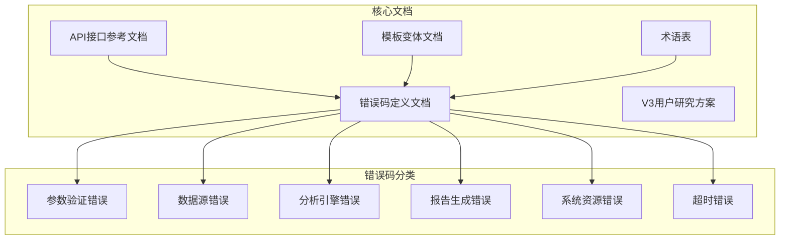
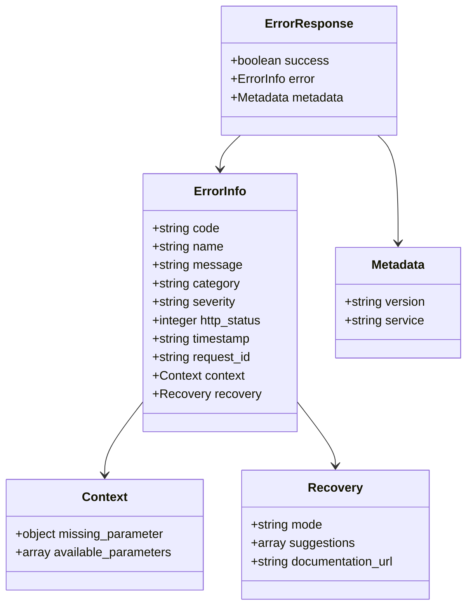
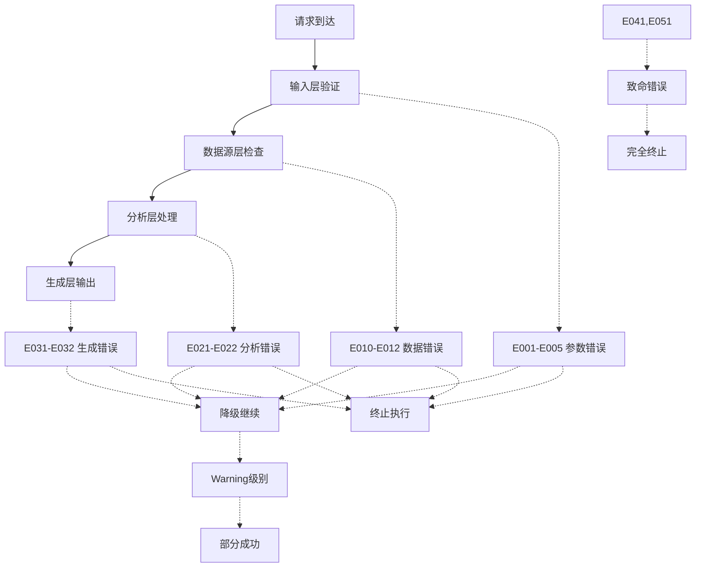
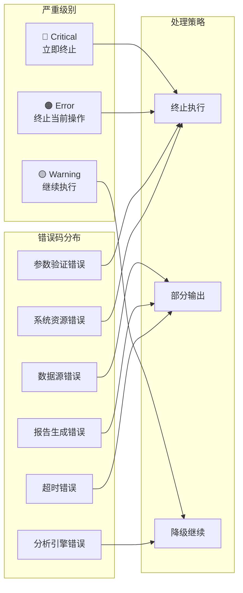
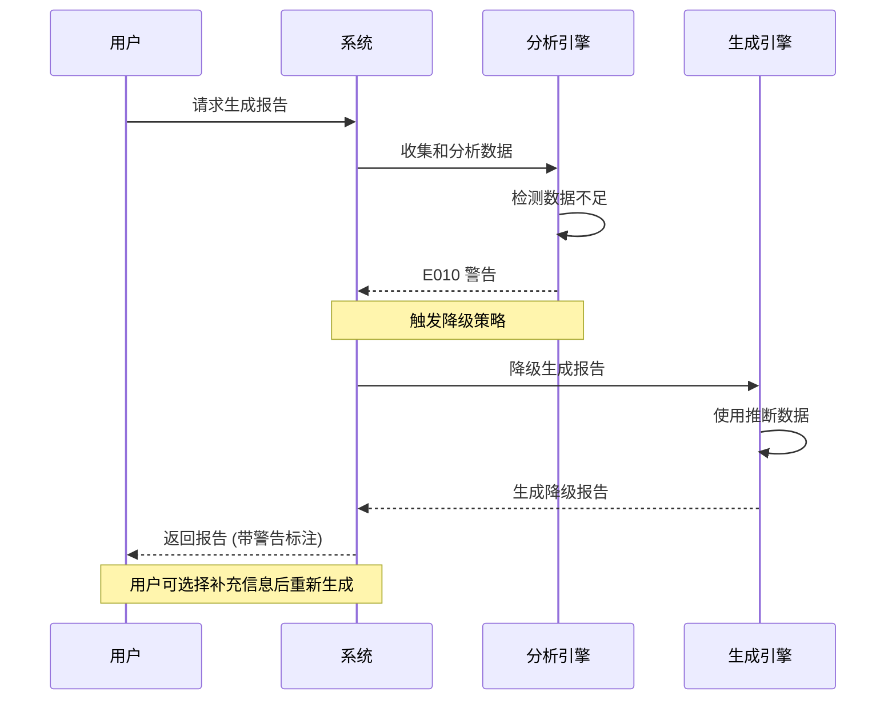
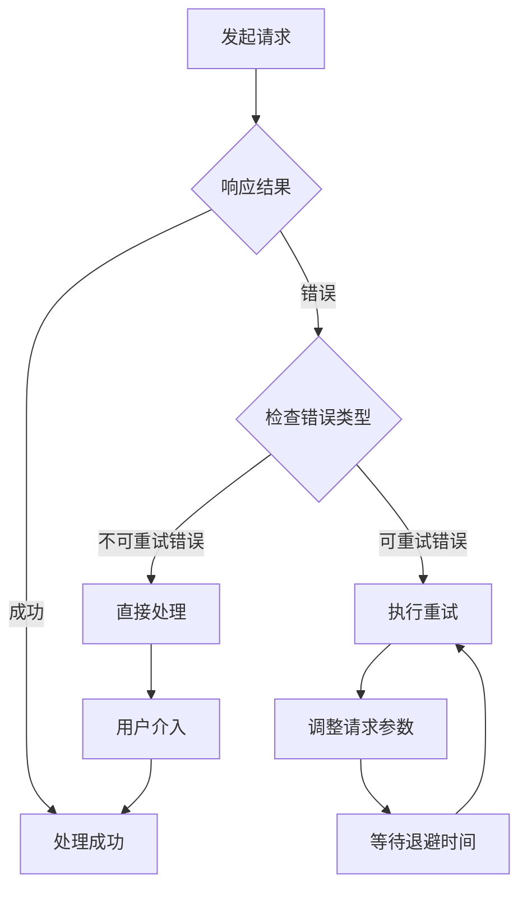

# 错误码定义文档

<cite>
**本文档引用的文件**
- [error-codes.md](file://references/error-codes.md)
- [api-reference.md](file://references/api-reference.md)
- [templates.md](file://references/templates.md)
- [terminology.md](file://references/terminology.md)
- [v3-user-research-spec.md](file://references/v3-planning/v3-user-research-spec.md)
</cite>

## 目录
1. [简介](#简介)
2. [项目结构](#项目结构)
3. [核心组件](#核心组件)
4. [架构概览](#架构概览)
5. [详细组件分析](#详细组件分析)
6. [依赖分析](#依赖分析)
7. [性能考虑](#性能考虑)
8. [故障排除指南](#故障排除指南)
9. [结论](#结论)

## 简介

本文档定义了"任务执行总结报告生成器"技能的完整错误码体系，包括错误分类、详细定义、处理策略和降级机制。该系统遵循分层防御、优雅降级、透明告知和可观测性的设计原则，为用户提供清晰的错误信息和恢复建议。

## 项目结构

该项目采用文档驱动的架构，主要包含以下核心文件：



**图表来源**
- [error-codes.md:1-1865](file://references/error-codes.md#L1-L1865)
- [api-reference.md:1-1378](file://references/api-reference.md#L1-L1378)

**章节来源**
- [error-codes.md:1-1865](file://references/error-codes.md#L1-L1865)
- [api-reference.md:1-1378](file://references/api-reference.md#L1-L1378)

## 核心组件

### 错误码命名规则

错误码采用统一的命名格式：`E + 类别编号(1位) + 序号(2位)`

**命名规则详解**：
- **前缀 E**：固定前缀，表示 Error
- **类别编号**：错误所属大类 (0-5)
- **序号**：同类错误的顺序号 (01-99)

**类别编号分配**：
| 编号 | 类别 | 说明 |
|------|------|------|
| 0 | 参数验证 | 输入参数相关错误 |
| 1 | 数据源 | 数据获取相关错误 |
| 2 | 分析引擎 | 分析过程相关错误 |
| 3 | 报告生成 | 生成输出相关错误 |
| 4 | 系统资源 | 运行环境资源错误 |
| 5 | 超时 | 执行时间超限错误 |

**章节来源**
- [error-codes.md:73-105](file://references/error-codes.md#L73-L105)

### 错误响应通用结构

所有错误响应遵循统一的JSON结构：



**图表来源**
- [error-codes.md:106-140](file://references/error-codes.md#L106-L140)

**章节来源**
- [error-codes.md:106-158](file://references/error-codes.md#L106-L158)

## 架构概览

系统采用分层防御的设计理念，确保错误处理的完整性和有效性：



**图表来源**
- [error-codes.md:45-72](file://references/error-codes.md#L45-L72)

**章节来源**
- [error-codes.md:43-179](file://references/error-codes.md#L43-L179)

## 详细组件分析

### 参数验证错误 (E0xx)

参数验证错误是系统的第一道防线，负责拦截非法请求：

#### E001: MissingRequiredParameter
**触发条件**：缺少必填参数时触发
**严重级别**：Error
**HTTP状态码**：400 Bad Request
**恢复模式**：terminate

**典型场景**：用户直接发送 `/summary` 命令但没有指定要总结的任务

**恢复建议**：
1. 检查 API 文档确认所有必填参数
2. 在请求中补充缺失的参数值
3. 实现智能推断：尝试从对话上下文中自动提取缺失信息

#### E002: InvalidParameterType
**触发条件**：参数类型与预期不符时触发
**严重级别**：Error
**HTTP状态码**：400 Bad Request
**恢复模式**：terminate

**典型场景**：将 `detail_level` 设置为数字 `2` 而不是字符串 `"detailed"`

**预防措施**：
- 使用强类型的请求模型
- 提供 OpenAPI/Swagger 文档
- 在客户端 SDK 中内置类型检查

**章节来源**
- [error-codes.md:185-254](file://references/error-codes.md#L185-L254)
- [error-codes.md:257-328](file://references/error-codes.md#L257-L328)

### 数据源错误 (E1xx)

数据源错误涉及对话历史和文件系统的访问问题：

#### E010: InsufficientDataWarning
**触发条件**：关键信息缺失或不充分，但不足以阻止报告生成时触发
**严重级别**：Warning
**HTTP状态码**：206 Partial Content
**恢复模式**：degrade

**核心机制**：这是降级继续的核心机制，系统会以降级模式继续生成报告

**影响分析**：
- 对话历史过短 (< 5轮交互)
- 缺少关键阶段的信息
- 时间戳信息不完整
- 问题解决过程描述模糊

**质量评分影响**：
| 缺失信息类型 | 分数扣减 | 说明 |
|-------------|---------|------|
| 决策记录缺失 | -10 至 -20 | 第四章关键决策分析质量下降 |
| 时间信息不全 | -5 至 -15 | 第三章时间线和第八章时间分析精度降低 |
| 问题记录模糊 | -10 至 -20 | 第五章问题分析深度不足 |
| 资源信息缺失 | -5 至 -10 | 第六章资源分析简化 |
| 协作信息缺失 | -0 至 -10 | 第七章标注为"不适用" |

**章节来源**
- [error-codes.md:568-676](file://references/error-codes.md#L568-L676)

#### E011: ConversationHistoryUnavailable
**触发条件**：无法访问对话历史时触发
**严重级别**：Error
**HTTP状态码**：503 Service Unavailable
**恢复模式**：partial

**典型场景**：由于权限变更，系统无法访问用户指定的历史会话记录

**章节来源**
- [error-codes.md:679-766](file://references/error-codes.md#L679-L766)

#### E012: FileAccessDenied
**触发条件**：文件访问被拒绝时触发
**严重级别**：Error
**HTTP状态码**：403 Forbidden
**恢复模式**：partial

**典型场景**：用户指定将报告输出到系统保护目录

**章节来源**
- [error-codes.md:769-852](file://references/error-codes.md#L769-L852)

### 分析引擎错误 (E2xx)

分析引擎错误涉及目标达成度分析和时间线重建问题：

#### E021: GoalAnalysisFailed
**触发条件**：目标达成度分析过程出现异常时触发
**严重级别**：Error
**HTTP状态码**：500 Internal Server Error
**恢复模式**：estimate

**典型场景**：用户的目标描述过于模糊，无法进行量化的达成度分析

**章节来源**
- [error-codes.md:855-924](file://references/error-codes.md#L855-L924)

#### E022: TimelineReconstructionFailed
**触发条件**：无法精确重建任务执行时间线时触发
**严重级别**：Warning
**HTTP状态码**：206 Partial Content
**恢复模式**：degrade

**典型场景**：任务跨越了3天，但对话中有大量时间段是没有消息的

**章节来源**
- [error-codes.md:927-996](file://references/error-codes.md#L927-L996)

### 报告生成错误 (E3xx)

报告生成错误涉及模板和生成过程的问题：

#### E031: TemplateNotFound
**触发条件**：报告模板不存在时触发
**严重级别**：Error
**HTTP状态码**：404 Not Found
**恢复模式**：terminate

**典型场景**：用户指定了一个不存在的自定义模板名称

**章节来源**
- [error-codes.md:999-1080](file://references/error-codes.md#L999-L1080)

#### E032: ReportGenerationTimeout
**触发条件**：报告生成过程超过预设时间限制时触发
**严重级别**：Error
**HTTP状态码**：504 Gateway Timeout
**恢复模式**：partial

**典型场景**：任务对话长达200轮，包含大量代码片段

**章节来源**
- [error-codes.md:1083-1166](file://references/error-codes.md#L1083-L1166)

### 系统资源错误 (E4xx)

系统资源错误是最严重的错误类型，需要立即处理：

#### E041: InsufficientMemory
**触发条件**：系统内存不足以继续执行时触发
**严重级别**：Critical
**HTTP状态码**：507 Insufficient Storage
**恢复模式**：terminate

**典型场景**：系统正在同时处理3个大型报告生成任务

**章节来源**
- [error-codes.md:1169-1257](file://references/error-codes.md#L1169-L1257)

### 超时错误 (E5xx)

超时错误涉及执行流程的整体超时问题：

#### E051: ExecutionTimeout
**触发条件**：整个任务执行流程超过全局超时限制时触发
**严重级别**：Error
**HTTP状态码**：504 Gateway Timeout
**恢复模式**：partial

**典型场景**：涉及50+轮对话、多个代码文件变更的任务

**章节来源**
- [error-codes.md:1260-1342](file://references/error-codes.md#L1260-L1342)

## 依赖分析

### 错误处理策略矩阵



**图表来源**
- [error-codes.md:1345-1383](file://references/error-codes.md#L1345-L1383)

### 降级策略详解

系统提供完善的降级机制，确保在数据不足的情况下仍能生成有价值的报告：



**图表来源**
- [error-codes.md:1387-1486](file://references/error-codes.md#L1387-L1486)

**章节来源**
- [error-codes.md:1345-1535](file://references/error-codes.md#L1345-L1535)

## 性能考虑

### 错误码快速查询表

| 错误码 | 名称 | 一句话说明 | 严重级别 | 用户该怎么做 |
|-------|------|-----------|---------|------------|
| **E001** | MissingRequiredParameter | 忘了填 xxx | 🟠 Error | 补上这个必填参数，查看文档了解需要什么 |
| **E002** | InvalidParameterType | 参数类型不对 | 🟠 Error | 检查参数应该是字符串还是数字，改正确后重试 |
| **E003** | ParameterValueOutOfRange | 参数值超范围 | 🟠 Error | 把参数调到允许的范围内（文档里有说明） |
| **E004** | ConflictingParameters | 参数互相打架 | 🟠 Error | 去掉矛盾的其中一个参数，或换一组兼容的组合 |
| **E005** | InvalidChapterCombination | 章节选得有问题 | 🟠 Error | 补充被依赖的前置章节，或用 detail_level 快捷选择 |
| **E010** | InsufficientDataWarning | 数据不够完整 | 🟡 Warning | 报告会照常生成但部分内容是估算的，看看能不能补充信息后重新生成 |
| **E011** | ConversationHistoryUnavailable | 对话记录拿不到 | 🟠 Error | 检查权限，或切换到手动输入模式自己填写任务信息 |
| **E012** | FileAccessDenied | 文件读写被拒 | 🟠 Error | 换个有权限的路径，或给目标文件夹加上写入权限 |
| **E021** | GoalAnalysisFailed | 目标分析做不了 | 🟠 Error | 报告还是会生成，但目标达成度那块会是文字描述而不是数字 |
| **E022** | TimelineReconstructionFailed | 时间线建不准 | 🟡 Warning | 时间数据会有误差（±30%），重要的时间点可以手动校正 |
| **E031** | TemplateNotFound | 找不到模板 | 🟠 Error | 检查模板名字拼对了没，或直接用默认模板 |
| **E032** | ReportGenerationTimeout | 生成报告太慢超时了 | 🟠 Error | 可以拿已经生成的那部分，或用摘要模式重试（快很多） |
| **E041** | InsufficientMemory | 内存不够用了 | 🔴 Critical | 关掉一些其他程序释放内存，这是致命错误没法自动恢复 |
| **E051** | ExecutionTimeout | 整个任务跑太久了 | 🟠 Error | 任务太大了，考虑拆分成几个小任务分别总结 |

**章节来源**
- [error-codes.md:1537-1555](file://references/error-codes.md#L1537-L1555)

## 故障排除指南

### 重试与恢复策略

系统为可重试错误提供了完善的重试机制：



**图表来源**
- [error-codes.md:1679-1756](file://references/error-codes.md#L1679-L1756)

### 客户端错误处理示例

系统提供了多种语言的错误处理示例：

#### JavaScript 处理示例
```javascript
// 检查是否成功
if (!response.success) {
  const error = response.error;
  
  // 致命错误：无法生成报告
  if (error.severity === 'critical' || error.severity === 'error') {
    console.error(`[${error.code}] ${error.message}`);
    // 展示恢复建议
    if (error.recovery) {
      console.log('建议操作:', error.recovery.suggestion);
    }
    return null;
  }
}

// 检查警告（报告已生成但存在质量问题）
const report = response.report;
if (report.quality_check?.warnings?.length > 0) {
  for (const warning of report.quality_check.warnings) {
    console.warn(`[${warning.code}] ${warning.message}`);
    // E010: 数据覆盖不足，标注低置信度区域
    if (warning.code === 'E010') {
      markLowConfidenceSections(report, warning.affected_sections);
    }
  }
}
```

#### Python 处理示例
```python
def handle_task_summary_response(response: dict) -> dict | None:
    """处理任务执行总结报告的响应"""
    
    # 检查是否成功
    if not response.get("success"):
        error = response.get("error", {})
        severity = error.get("severity", "error")
        
        # 致命错误
        if severity in ("critical", "error"):
            print(f"[{error['code']}] {error['message']}")
            recovery = error.get("recovery")
            if recovery:
                print(f"建议操作: {recovery['suggestion']}")
            return None
    
    # 检查警告
    report = response.get("report", {})
    warnings = report.get("quality_check", {}).get("warnings", [])
    for warning in warnings:
        print(f"⚠️ [{warning['code']}] {warning['message']}")
        if warning["code"] == "E010":
            mark_low_confidence_sections(report, warning["affected_sections"])
    
    return report
```

**章节来源**
- [error-codes.md:1596-1667](file://references/error-codes.md#L1596-L1667)

## 结论

"任务执行总结报告生成器"的错误码体系体现了现代软件工程的最佳实践：

1. **完整的错误分类**：涵盖了从输入验证到系统资源的各个层面
2. **优雅的降级机制**：在数据不足时仍能生成有价值的报告
3. **清晰的恢复指导**：为用户提供了具体的解决步骤
4. **可观测性设计**：完整的日志记录和错误追踪
5. **可扩展性**：预留了足够的错误码空间用于未来扩展

该体系确保了系统在面对各种异常情况时都能提供稳定可靠的服务，同时为用户提供了透明的错误信息和有效的恢复途径。通过分层防御和优雅降级的设计，系统能够在保证服务质量的同时最大化地利用可用信息，为用户提供最有价值的报告输出。