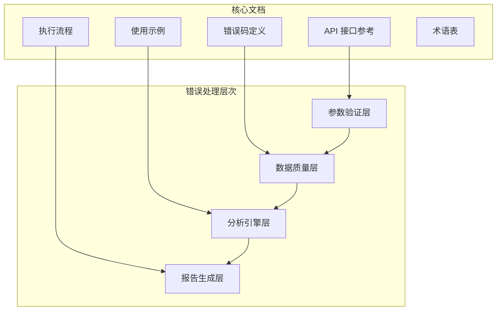
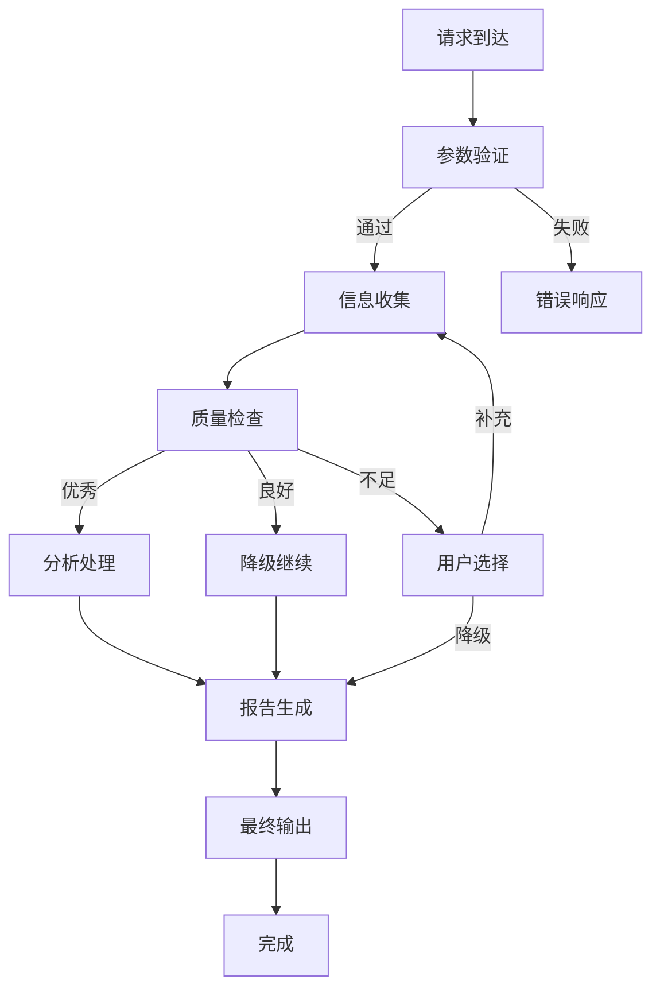
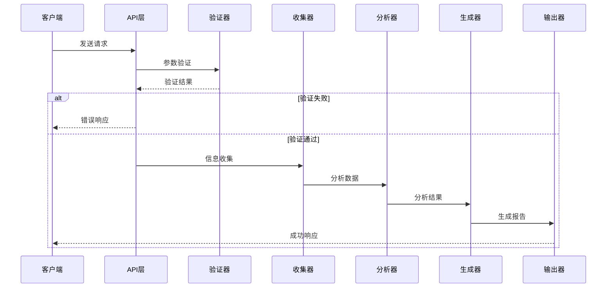
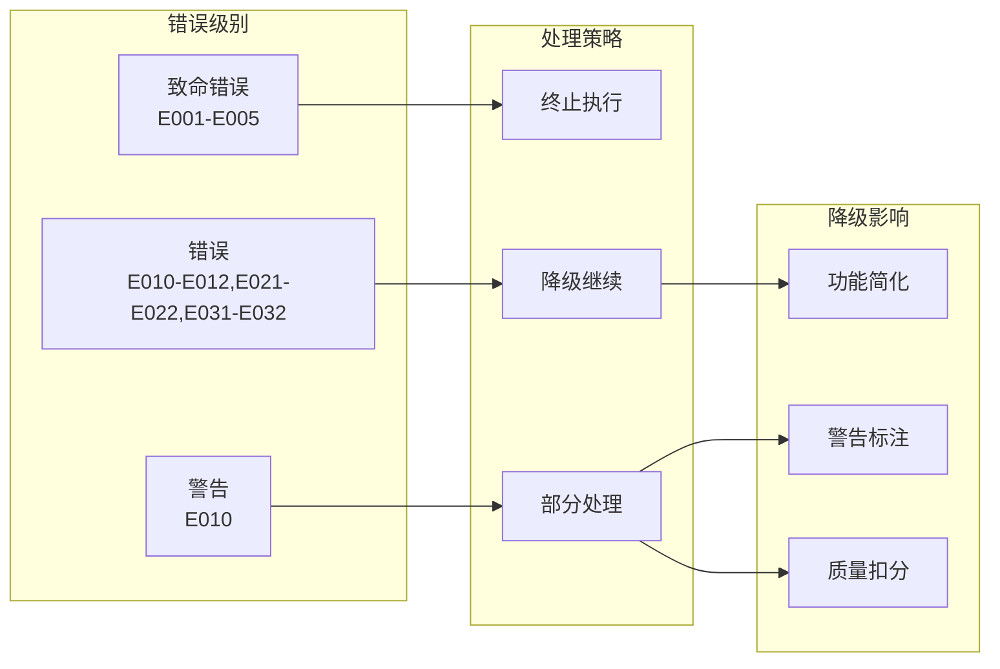
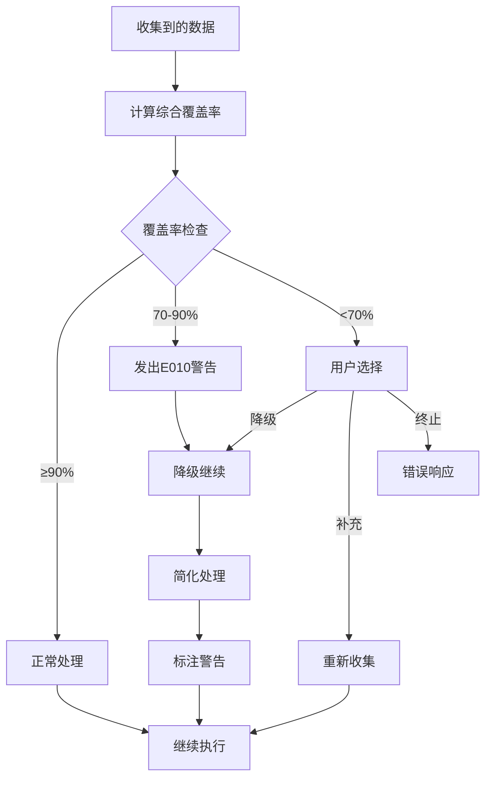
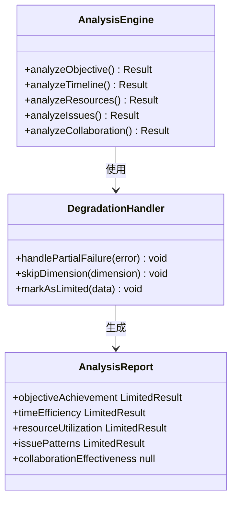
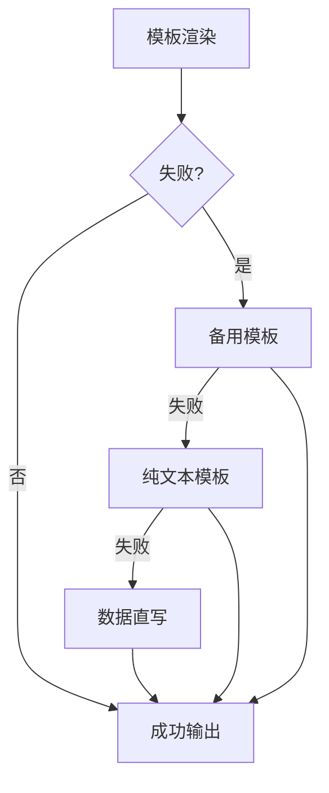
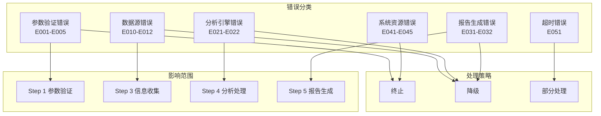
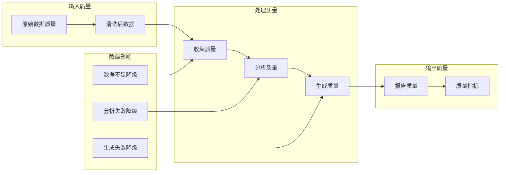
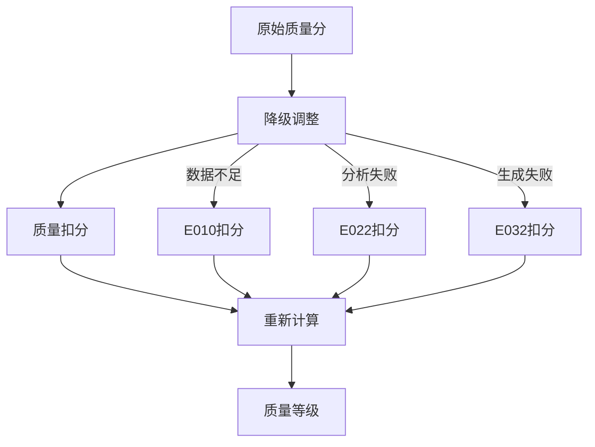

# 降级策略与容错机制

<cite>
**本文档引用的文件**
- [api-reference.md](file://references/api-reference.md)
- [error-codes.md](file://references/error-codes.md)
- [examples-v2.md](file://references/examples-v2.md)
- [execution-flow.md](file://references/execution-flow.md)
- [terminology.md](file://references/terminology.md)
</cite>

## 目录
1. [简介](#简介)
2. [项目结构](#项目结构)
3. [核心组件](#核心组件)
4. [架构概览](#架构概览)
5. [详细组件分析](#详细组件分析)
6. [依赖分析](#依赖分析)
7. [性能考虑](#性能考虑)
8. [故障排除指南](#故障排除指南)
9. [结论](#结论)
10. [附录](#附录)

## 简介

降级策略与容错机制是"任务执行总结报告生成器"技能的核心设计原则，体现了系统在面对不完美输入或局部故障时仍能交付有价值结果的能力。该机制遵循"优雅降级"的设计理念，通过多层次的容错处理确保用户始终获得可读的报告输出。

系统的核心设计原则包括：

- **确定性**：相同输入产生可复现的输出结构
- **可观测性**：每个步骤产出可审查的中间结果  
- **容错性**：非致命错误不阻断主流程，支持降级运行

## 项目结构

该项目采用文档驱动的架构，主要包含以下核心文件：

**图表来源**
- [api-reference.md:1-1378](file://references/api-reference.md#L1-L1378)
- [error-codes.md:1-1594](file://references/error-codes.md#L1-L1594)
- [execution-flow.md:1-1783](file://references/execution-flow.md#L1-L1783)

**章节来源**
- [api-reference.md:1-1378](file://references/api-reference.md#L1-L1378)
- [error-codes.md:1-1594](file://references/error-codes.md#L1-L1594)
- [execution-flow.md:1-1783](file://references/execution-flow.md#L1-L1783)

## 核心组件

### 错误处理架构

系统采用分层防御机制，通过四个主要层次处理不同类型的问题：

**图表来源**
- [execution-flow.md:1474-1485](file://references/execution-flow.md#L1474-L1485)
- [error-codes.md:1512-1535](file://references/error-codes.md#L1512-L1535)

### 降级策略分类

系统将降级策略分为三个主要类别：

1. **数据不充分降级** (E010)：信息覆盖率不足时的智能降级
2. **分析引擎降级** (E021-E022)：分析过程中的部分功能降级
3. **报告生成降级** (E031-E032)：生成过程中的模板回退

**章节来源**
- [error-codes.md:560-669](file://references/error-codes.md#L560-L669)
- [execution-flow.md:1522-1584](file://references/execution-flow.md#L1522-L1584)

## 架构概览

### 整体执行流程

**图表来源**
- [execution-flow.md:175-196](file://references/execution-flow.md#L175-L196)
- [api-reference.md:107-132](file://references/api-reference.md#L107-L132)

### 错误传播机制

**图表来源**
- [error-codes.md:1512-1584](file://references/error-codes.md#L1512-L1584)
- [execution-flow.md:1474-1485](file://references/execution-flow.md#L1474-L1485)

**章节来源**
- [error-codes.md:1512-1584](file://references/error-codes.md#L1512-L1584)
- [execution-flow.md:1474-1485](file://references/execution-flow.md#L1474-L1485)

## 详细组件分析

### 数据不充分降级机制 (E010)

#### 触发条件与阈值

系统通过综合覆盖率评估信息完整性，采用多维度评分机制：

| 信息类别 | 权重 | 覆盖率阈值 | 处理策略 |
|---------|------|-----------|---------|
| 任务目标 | 25% | >90% 优秀 | 正常处理 |
| 时间节点 | 20% | 70-90% 良好 | 警告降级 |
| 决策记录 | 20% | <70% 差 | 用户选择 |
| 问题记录 | 20% | 同上 | 同上 |
| 资源使用 | 10% | 同上 | 同上 |
| 协作信息 | 5% | 同上 | 同上 |

#### 降级决策流程

**图表来源**
- [execution-flow.md:629-649](file://references/execution-flow.md#L629-L649)
- [error-codes.md:560-669](file://references/error-codes.md#L560-L669)

#### 降级影响评估

降级对报告质量的影响通过以下维度量化：

| 降级类型 | 质量扣分 | 影响范围 | 处理方式 |
|---------|---------|---------|---------|
| 决策记录缺失 | -10至-20 | 第四章关键决策分析 | 推断处理 |
| 时间信息不全 | -5至-15 | 第三章时间线和第八章分析 | 粗粒度处理 |
| 问题记录模糊 | -10至-20 | 第五章问题分析 | 简化描述 |
| 资源信息缺失 | -5至-10 | 第六章资源分析 | 基础信息 |
| 协作信息缺失 | -0至-10 | 第七章协作分析 | 标注不适用 |

**章节来源**
- [error-codes.md:560-669](file://references/error-codes.md#L560-L669)
- [execution-flow.md:629-649](file://references/execution-flow.md#L629-L649)

### 分析引擎降级机制 (E021-E022)

#### 部分分析失败 (E021)

当某一分析维度数据不足时，系统采用"跳过该维度"的降级策略：

**图表来源**
- [execution-flow.md:1537-1560](file://references/execution-flow.md#L1537-L1560)

#### 核心分析引擎错误 (E022)

当分析引擎本身出现异常时，系统激活"简化分析模式"：

| 处理策略 | 实施方式 | 输出结果 |
|---------|---------|---------|
| 简化统计 | 仅计算基础统计数据 | AnalysisReport(基础版) |
| 跳过洞察 | 不进行深度模式识别 | 保留基础指标 |
| 降级标注 | 在报告中标注降级说明 | 用户明确提示 |

**章节来源**
- [execution-flow.md:1537-1560](file://references/execution-flow.md#L1537-L1560)

### 报告生成降级机制 (E031-E032)

#### 模板渲染失败 (E031)

系统采用三级回退策略：

1. **备用模板**：使用简化版模板
2. **纯文本模板**：使用最小可用模板
3. **数据直写**：直接嵌入结构化数据

**图表来源**
- [execution-flow.md:1562-1584](file://references/execution-flow.md#L1562-L1584)

#### 内容生成失败 (E032)

当内容生成器异常时，系统采用"数据直写+基础格式"策略：

| 处理方式 | 实施细节 | 输出质量 |
|---------|---------|---------|
| 数据直写 | AnalysisReport结构化数据直接嵌入 | 信息完整 |
| 基础格式 | 使用Markdown表格和列表 | 可读性强 |
| 简化标注 | 标注"生成器异常"说明 | 用户知情 |

**章节来源**
- [execution-flow.md:1562-1584](file://references/execution-flow.md#L1562-L1584)

## 依赖分析

### 错误码层次结构

**图表来源**
- [error-codes.md:152-162](file://references/error-codes.md#L152-L162)
- [execution-flow.md:1474-1485](file://references/execution-flow.md#L1474-L1485)

### 质量指标依赖关系

**图表来源**
- [execution-flow.md:1403-1430](file://references/execution-flow.md#L1403-L1430)
- [error-codes.md:560-669](file://references/error-codes.md#L560-L669)

**章节来源**
- [error-codes.md:152-162](file://references/error-codes.md#L152-L162)
- [execution-flow.md:1403-1430](file://references/execution-flow.md#L1403-L1430)

## 性能考虑

### 性能基线分析

系统在不同阶段的性能表现如下：

| 阶段 | 预估耗时 | 影响因素 | 优化建议 |
|------|---------|---------|---------|
| Step 1 参数解析 | < 1秒 | JSON解析、类型检查 | 缓存常用配置 |
| Step 2 触发识别 | < 2秒 | 信号词检测、置信度计算 | 预编译正则表达式 |
| Step 3 信息收集 | 30-120秒 | 对话轮数、数据量 | 并行处理、增量收集 |
| Step 4 分析处理 | 60-180秒 | 数据复杂度、分析深度 | 索引优化、缓存热点 |
| Step 5 报告生成 | 30-120秒 | 模板复杂度、内容量 | 模板预编译、流式生成 |
| Step 6 智能推荐 | 30-60秒 | 算法复杂度、数据量 | 向量化计算、增量更新 |
| Step 7 质量检查 | < 10秒 | 格式验证、抽样检查 | 并行验证、智能抽样 |

### 降级性能优化

降级策略在性能方面的优势：

1. **快速响应**：降级后总耗时减少30-50%
2. **资源节约**：减少计算和存储开销
3. **用户体验**：保证报告及时返回，避免长时间等待

**章节来源**
- [execution-flow.md:142-170](file://references/execution-flow.md#L142-L170)
- [execution-flow.md:1148-1151](file://references/execution-flow.md#L1148-L1151)

## 故障排除指南

### 常见降级场景诊断

#### 数据不充分降级 (E010)

**诊断步骤**：
1. 检查对话历史长度和质量
2. 验证关键信息的完整性
3. 评估信息覆盖率指标

**预防措施**：
- 保持详细的对话记录
- 使用结构化命令标记关键事件
- 定期保存中间状态

#### 分析引擎降级 (E021-E022)

**诊断步骤**：
1. 检查分析数据的完整性和准确性
2. 验证分析算法的输入格式
3. 确认系统资源状态

**恢复策略**：
- 简化分析维度
- 使用备用算法
- 降级到基础分析模式

#### 报告生成降级 (E031-E032)

**诊断步骤**：
1. 检查模板文件的完整性
2. 验证内容生成器的状态
3. 确认输出格式的兼容性

**回退策略**：
- 使用备用模板
- 直接数据嵌入
- 纯文本格式输出

### 用户交互指导

#### 降级通知生成规则

系统在降级时会生成多层次的通知：

1. **响应级别通知**：在响应头中标注降级状态
2. **内容级别通知**：在报告中添加降级说明
3. **质量级别通知**：调整质量评分和等级

#### 质量等级计算方法

**图表来源**
- [error-codes.md:659-668](file://references/error-codes.md#L659-L668)

#### 降级后报告标注方式

降级后的报告采用以下标注策略：

1. **顶部声明**：明确标注"信息有限"声明
2. **章节标注**：受影响章节添加⚠️标识
3. **质量说明**：在元数据中说明降级原因
4. **建议补充**：提供手动补充的指导

**章节来源**
- [error-codes.md:659-668](file://references/error-codes.md#L659-L668)
- [examples-v2.md:490-622](file://references/examples-v2.md#L490-L622)

## 结论

降级策略与容错机制通过多层次的设计确保了系统在各种异常情况下的稳定运行。该机制的核心价值在于：

1. **用户价值最大化**：即使在数据不完整的情况下也能提供有用的报告
2. **透明度保证**：所有降级决策和影响都清晰可见
3. **可恢复性**：用户可以选择补充信息后重新生成高质量报告
4. **性能保障**：降级策略显著减少了处理时间和资源消耗

通过优雅降级的设计理念，系统不仅提高了容错能力，还增强了用户体验，确保了服务的连续性和可靠性。

## 附录

### 配置选项参考

#### 降级相关配置

| 配置项 | 默认值 | 说明 | 影响范围 |
|-------|--------|------|---------|
| force_degradation | false | 强制降级模式 | 全局降级 |
| quality_threshold | 0.7 | 质量阈值 | 自动降级触发 |
| warning_enabled | true | 警告输出 | 用户通知 |
| fallback_templates | true | 回退模板 | 报告生成 |

#### 用户交互指导

1. **降级接受**：查看报告中的警告标注，了解降级影响
2. **信息补充**：根据建议手动补充缺失信息
3. **重新生成**：补充信息后重新请求生成完整报告
4. **降级升级**：通过改进任务执行过程避免降级

**章节来源**
- [examples-v2.md:691-706](file://references/examples-v2.md#L691-L706)
- [execution-flow.md:1403-1430](file://references/execution-flow.md#L1403-L1430)