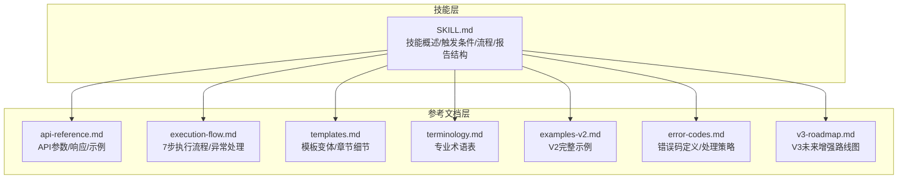
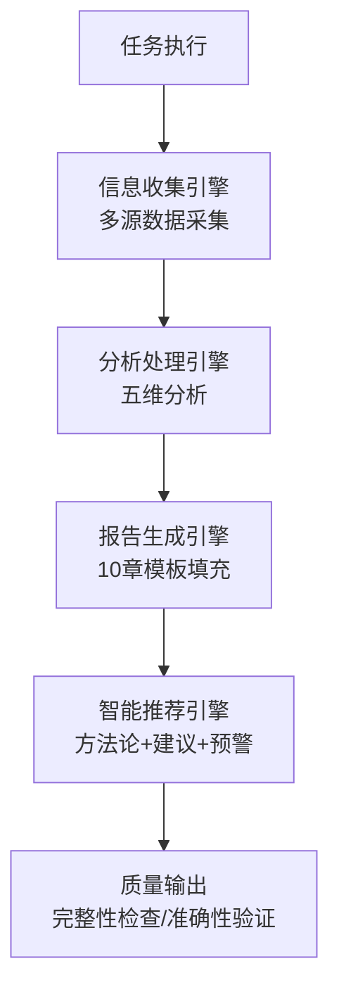
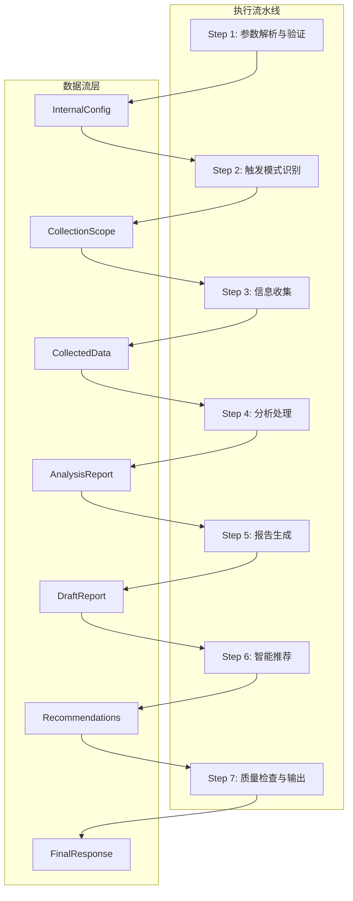
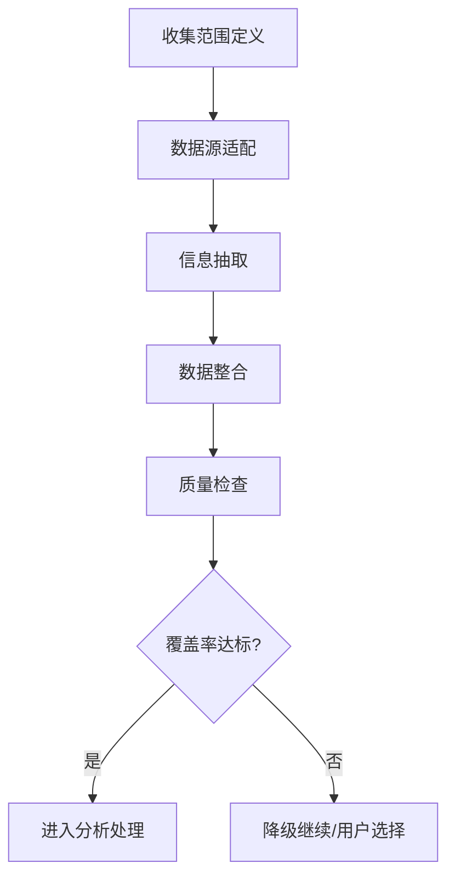
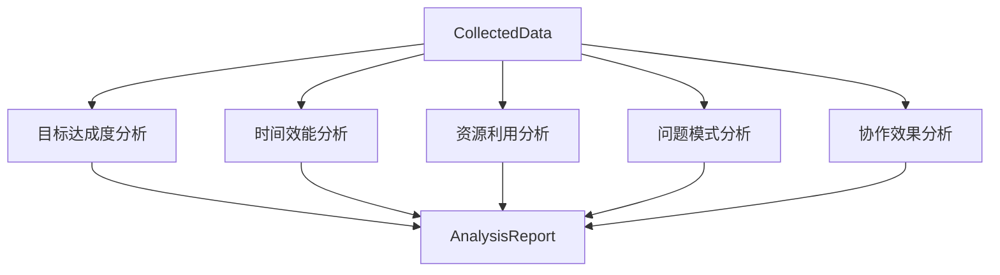
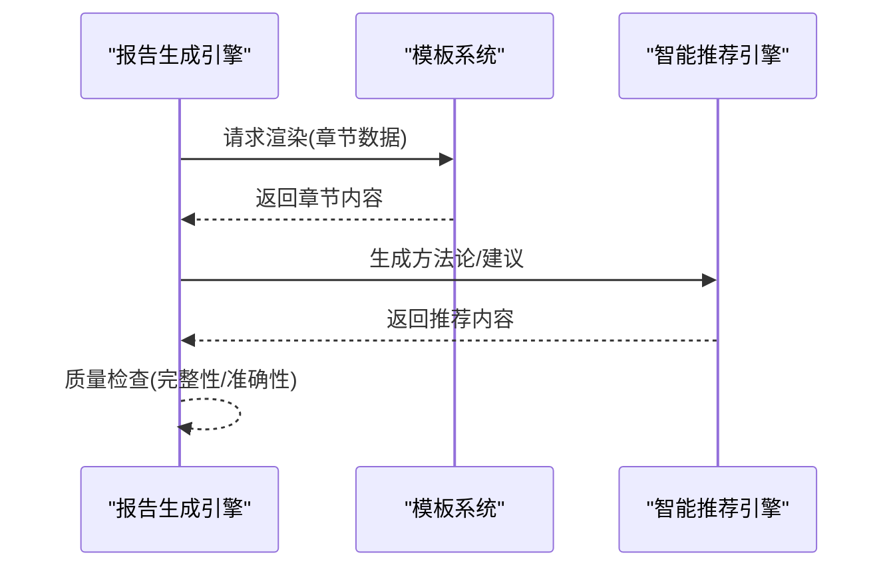
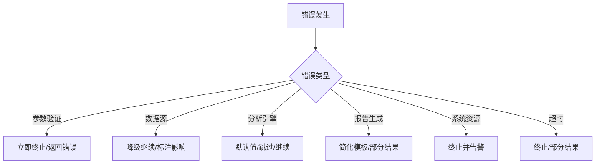
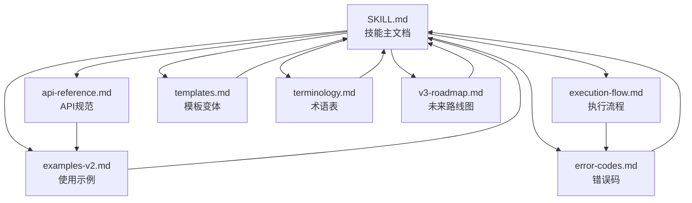

# 项目概述

<cite>
**本文档引用的文件**
- [SKILL.md](file://SKILL.md)
- [api-reference.md](file://references/api-reference.md)
- [execution-flow.md](file://references/execution-flow.md)
- [templates.md](file://references/templates.md)
- [terminology.md](file://references/terminology.md)
- [examples-v2.md](file://references/examples-v2.md)
- [error-codes.md](file://references/error-codes.md)
- [v3-roadmap.md](file://references/v3-roadmap.md)
</cite>

## 目录
1. [简介](#简介)
2. [项目结构](#项目结构)
3. [核心组件](#核心组件)
4. [架构总览](#架构总览)
5. [详细组件分析](#详细组件分析)
6. [依赖关系分析](#依赖关系分析)
7. [性能考量](#性能考量)
8. [故障排查指南](#故障排查指南)
9. [结论](#结论)
10. [附录](#附录)

## 简介
“任务执行总结报告生成器”是一个智能化、系统化的任务复盘与经验沉淀技能，旨在帮助个人与团队从已完成任务中提炼有价值的经验教训，形成可复用的方法论，持续提升执行效能。项目通过四大核心引擎协同工作，提供标准化的10章报告结构与灵活的输出配置，覆盖软件开发、项目管理、运维排查、技术研究、学习成长等广泛场景。

- **核心价值**
  - 经验沉淀：将隐性知识转化为显性文档，构建组织知识资产
  - 模式识别：发现任务执行中的规律性问题与最佳实践
  - 决策支持：为未来类似任务提供参考依据与风险预警
  - 能力提升：通过系统性复盘促进持续改进与学习成长

- **适用场景**
  - 软件开发：功能开发完成、Bug修复、技术重构
  - 项目管理：Sprint结束、里程碑达成、项目收尾
  - 运维排查：故障处理、性能优化、安全加固
  - 技术研究：技术选型、POC验证、架构设计
  - 学习成长：课程学习、技能培训、认证备考

**章节来源**
- [SKILL.md: 52-72:52-72](file://SKILL.md#L52-L72)

## 项目结构
项目采用“技能主文档 + 参考文档”的分层结构，便于不同角色按需阅读：

- **技能主文档（SKILL.md）**：面向使用者与集成者，提供触发条件、执行流程、报告结构、最佳实践等内容
- **参考文档（references/）**：面向开发者与维护者，提供API规范、执行流程、模板变体、术语表、错误码、路线图等

**图表来源**
- [SKILL.md: 287-301:287-301](file://SKILL.md#L287-L301)
- [api-reference.md: 13-32:13-32](file://references/api-reference.md#L13-L32)
- [execution-flow.md: 1-25:1-25](file://references/execution-flow.md#L1-L25)
- [templates.md: 1-14:1-14](file://references/templates.md#L1-L14)
- [terminology.md: 1-21:1-21](file://references/terminology.md#L1-L21)
- [examples-v2.md: 1-10:1-10](file://references/examples-v2.md#L1-L10)
- [error-codes.md: 1-13:1-13](file://references/error-codes.md#L1-L13)
- [v3-roadmap.md: 1-10:1-10](file://references/v3-roadmap.md#L1-L10)

**章节来源**
- [SKILL.md: 287-301:287-301](file://SKILL.md#L287-L301)

## 核心组件
项目由四大核心引擎协同工作，形成从信息收集到报告输出的完整闭环：

- **信息收集引擎**：多源采集对话历史、代码文件、日志等，智能识别目标/时间/决策/问题等要素
- **分析处理引擎**：五维深度分析（目标达成度/时间效能/资源利用/问题模式/协作效果）
- **报告生成引擎**：基于标准化10章模板动态填充内容，确保结构完整性
- **智能推荐引擎**：提炼方法论 + 生成改进建议 + 风险预警，提供可操作的行动指导

**图表来源**
- [SKILL.md: 73-79:73-79](file://SKILL.md#L73-L79)

**章节来源**
- [SKILL.md: 73-79:73-79](file://SKILL.md#L73-L79)

## 架构总览
项目遵循“确定性、可观测性、容错性”的设计原则，通过七步标准执行流程实现稳定可靠的报告生成：

- **确定性**：统一的内部配置对象与类型化的数据模型，确保相同输入产生可复现的输出
- **可观测性**：每个步骤产出可审查的中间结果，关键决策点记录决策依据
- **容错性**：非致命错误不阻断主流程，支持降级运行与警告级别的成功响应

**图表来源**
- [execution-flow.md: 97-141:97-141](file://references/execution-flow.md#L97-L141)

**章节来源**
- [execution-flow.md: 28-96:28-96](file://references/execution-flow.md#L28-L96)

## 详细组件分析

### 信息收集阶段（Step 3）
信息收集是整个流程的核心，占总耗时的40-50%，包含数据源适配、信息抽取、数据整合与质量检查四个子步骤。

- **数据源适配**：对话历史解析器、操作记录提取器、文件变更追踪器
- **信息抽取**：任务目标、时间节点、关键决策、问题记录、资源使用、协作信息六大类实体
- **数据整合**：去重处理、时序对齐、实体关联
- **质量检查**：完整性评分与阈值判断，支持降级继续

**图表来源**
- [execution-flow.md: 441-699:441-699](file://references/execution-flow.md#L441-L699)

**章节来源**
- [execution-flow.md: 441-699:441-699](file://references/execution-flow.md#L441-L699)

### 分析处理阶段（Step 4）
分析处理阶段进行五维深度分析，形成结构化的分析报告：

- **目标达成度分析**：对比法 + 量化评估，计算达成率与等级
- **时间效能分析**：偏差计算 + 瓶颈识别，计算时效比、阶段均衡度等指标
- **资源利用分析**：利用率计算 + 浪费识别，评估资源配置合理性
- **问题模式分析**：分类统计 + 规律识别，发现高频问题与共性模式
- **协作效果分析**：沟通效率 + 分工合理性评估（多人任务）

**图表来源**
- [execution-flow.md: 701-799:701-799](file://references/execution-flow.md#L701-L799)

**章节来源**
- [execution-flow.md: 701-799:701-799](file://references/execution-flow.md#L701-L799)

### 报告生成与智能推荐（Step 5-6）
- **报告生成**：基于标准10章模板动态填充内容，支持摘要版、标准版、详细版与学习专用模板
- **智能推荐**：从成功实践中提取可复用方法论，生成具体改进建议与风险预警

**图表来源**
- [templates.md: 168-752:168-752](file://references/templates.md#L168-L752)
- [execution-flow.md: 176-191:176-191](file://references/execution-flow.md#L176-L191)

**章节来源**
- [templates.md: 168-752:168-752](file://references/templates.md#L168-L752)
- [execution-flow.md: 176-191:176-191](file://references/execution-flow.md#L176-L191)

### 错误处理与降级机制
项目采用分层防御与优雅降级策略，确保在异常情况下仍能提供有价值的结果：

- **参数验证错误**：立即返回错误，指导修复
- **数据源错误**：支持降级继续，标注影响
- **分析引擎错误**：使用默认值或跳过，继续生成
- **报告生成错误**：回退到简化模板
- **系统资源错误**：终止并告警
- **超时错误**：终止或返回部分结果

**图表来源**
- [error-codes.md: 152-170:152-170](file://references/error-codes.md#L152-L170)

**章节来源**
- [error-codes.md: 152-170:152-170](file://references/error-codes.md#L152-L170)

## 依赖关系分析
项目文档之间存在清晰的依赖关系，形成“主文档指导 + 参考文档支撑”的知识体系：

**图表来源**
- [SKILL.md: 287-301:287-301](file://SKILL.md#L287-L301)

**章节来源**
- [SKILL.md: 287-301:287-301](file://SKILL.md#L287-L301)

## 性能考量
- **关键性能指标**：信息收集阶段占40-50%，分析处理阶段占35-40%，报告生成与推荐占15-20%
- **主要性能影响因素**：对话轮数、详细程度、数据量
- **性能优化建议**：合理选择详细程度、提供必要的上下文信息、使用默认配置减少参数校验开销

**章节来源**
- [execution-flow.md: 142-171:142-171](file://references/execution-flow.md#L142-L171)

## 故障排查指南
- **参数验证错误**：检查必填参数、参数类型与取值范围
- **数据不足警告**：补充任务执行的背景信息与关键决策细节
- **模板加载失败**：检查模板ID与访问权限
- **系统资源错误**：检查内存、磁盘空间与权限设置
- **超时错误**：优化参数配置或等待系统恢复

**章节来源**
- [error-codes.md: 173-800:173-800](file://references/error-codes.md#L173-L800)

## 结论
“任务执行总结报告生成器”通过四大核心引擎与七步执行流程，实现了从任务执行到经验沉淀的自动化与标准化。项目在保证确定性与可观测性的同时，具备良好的容错性与降级机制，能够适应不同复杂度与场景的任务总结需求。随着V3路线图的推进，项目将进一步增强个性化定制、多语言输出、外部工具集成与团队协作能力，为企业级知识管理提供更强大的支撑。

## 附录

### 标准10章报告结构
- **第一章：执行概览**（必填）
- **第二章：任务背景与目标**（必填）
- **第三章：执行过程详解**（必填）
- **第四章：关键决策分析**（必填）
- **第五章：问题与解决方案**（必填）
- **第六章：资源使用情况**（必填）
- **第七章：团队协作分析**（条件性）
- **第八章：多维分析**（必填）
- **第九章：经验总结与方法论**（必填）
- **第十章：改进建议与行动计划**（必填）

**章节来源**
- [SKILL.md: 196-212:196-212](file://SKILL.md#L196-L212)

### 七步执行流程
- **Step 1：参数解析与验证**
- **Step 2：触发模式识别**
- **Step 3：信息收集**
- **Step 4：分析处理**
- **Step 5：报告生成**
- **Step 6：智能推荐**
- **Step 7：质量检查与输出**

**章节来源**
- [SKILL.md: 135-194:135-194](file://SKILL.md#L135-L194)

### 模板变体与详细程度
- **摘要版**：2-3页，仅核心章节
- **标准版**：8-15页，完整10章
- **详细版**：20-30页，深入分析与附录
- **学习专用模板**：强调知识体系与方法论

**章节来源**
- [SKILL.md: 213-242:213-242](file://SKILL.md#L213-L242)