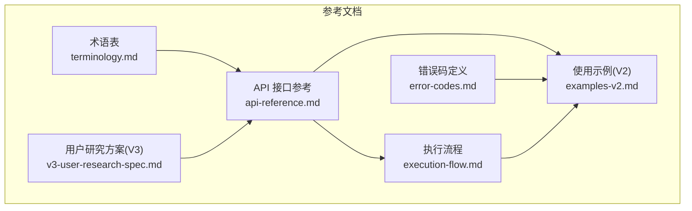
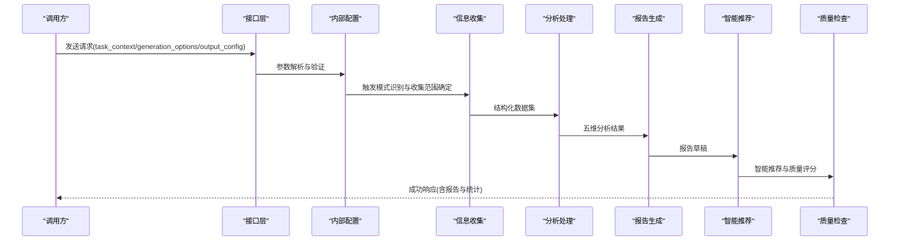
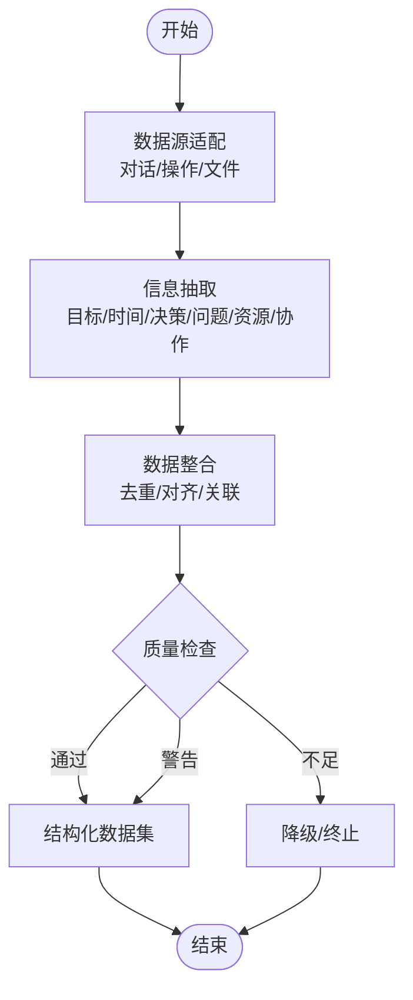
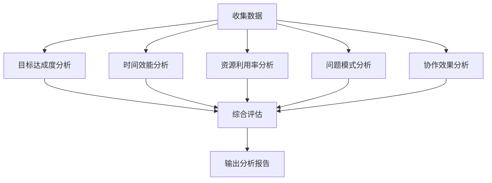
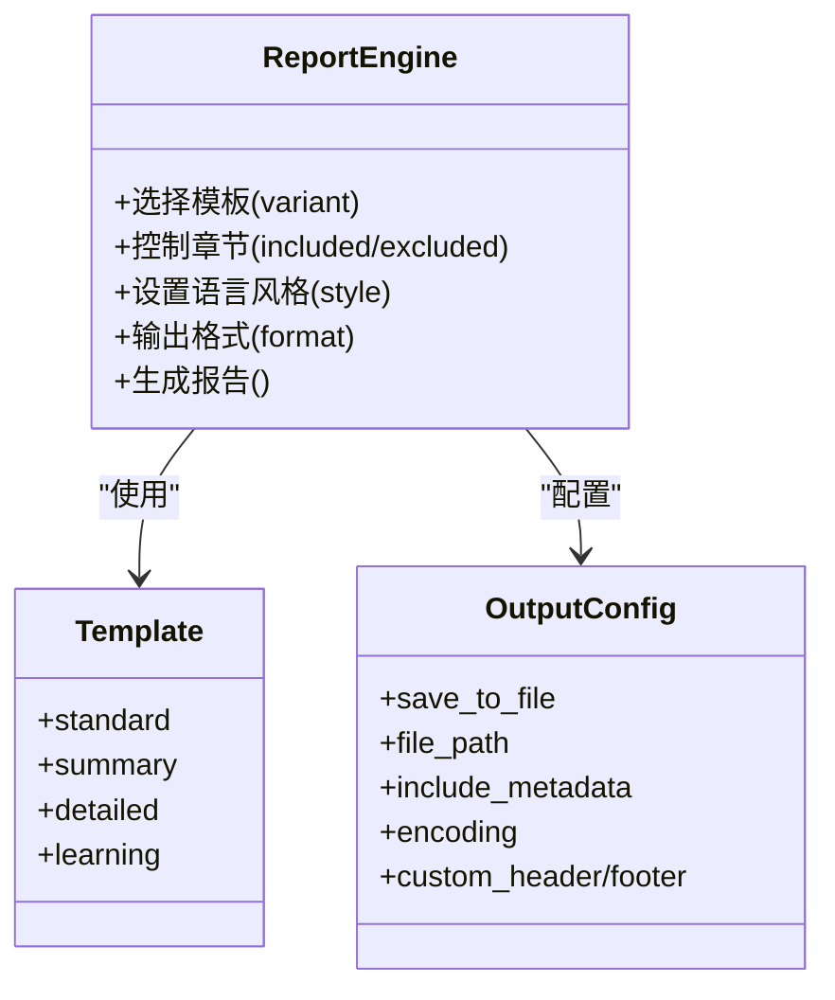
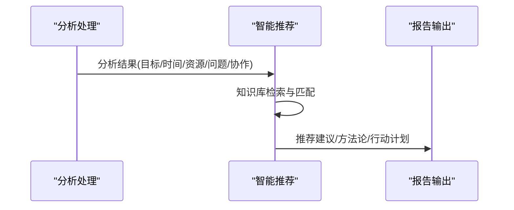
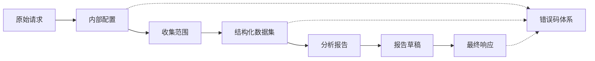
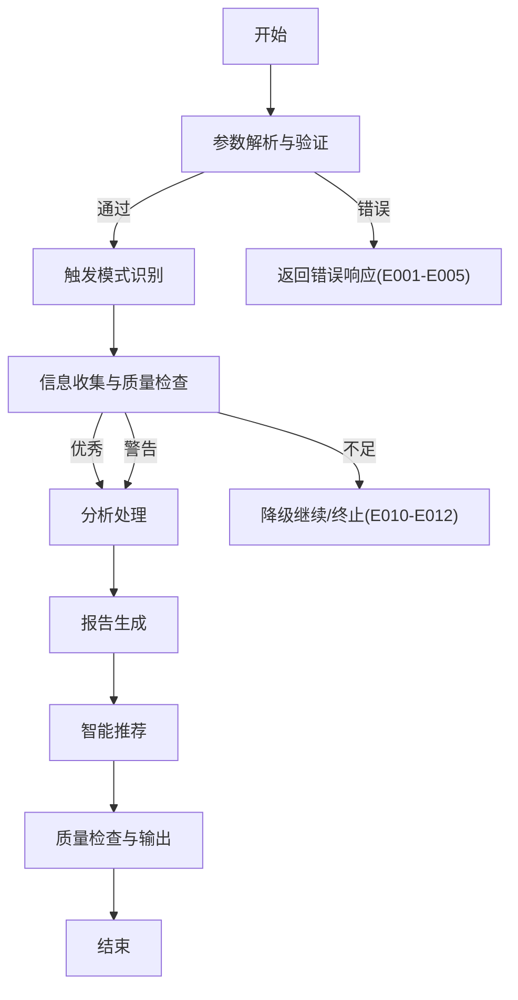

# 项目概述

<cite>
**本文档引用的文件**
- [api-reference.md](file://references/api-reference.md)
- [error-codes.md](file://references/error-codes.md)
- [examples-v2.md](file://references/examples-v2.md)
- [execution-flow.md](file://references/execution-flow.md)
- [terminology.md](file://references/terminology.md)
- [v3-user-research-spec.md](file://references/v3-user-research-spec.md)
</cite>

## 目录
1. [简介](#简介)
2. [项目结构](#项目结构)
3. [核心组件](#核心组件)
4. [架构总览](#架构总览)
5. [详细组件分析](#详细组件分析)
6. [依赖分析](#依赖分析)
7. [性能考量](#性能考量)
8. [故障排查指南](#故障排查指南)
9. [结论](#结论)
10. [附录](#附录)

## 简介
“任务执行总结报告生成器”是一个面向任务执行过程的知识沉淀与经验萃取技能，旨在将已完成任务中的隐性知识转化为高质量、结构化的显性文档。通过四大核心引擎的协同工作，系统能够：
- 将对话历史与任务上下文中的碎片化信息进行系统化提取与整合
- 基于多维度分析模型对目标达成度、时间效能、资源利用率、问题模式与协作效果进行深度评估
- 生成标准化的结构化报告，并提供智能改进建议与可复用方法论
- 在数据不足或参数异常时，提供优雅降级与透明的错误提示，确保用户始终获得可用的输出

该技能适用于软件开发、项目管理、运维排查、技术研究与学习成长等多种场景，既能满足日常快速复盘，也能支撑深度审计与知识沉淀。

## 项目结构
项目以“参考文档”为核心，形成“接口规范—执行流程—错误处理—使用示例—术语表—用户研究”的完整知识体系，便于开发者与集成方快速理解与落地。

**图表来源**
- [api-reference.md:1-1378](file://references/api-reference.md#L1-L1378)
- [error-codes.md:1-1594](file://references/error-codes.md#L1-L1594)
- [examples-v2.md:1-769](file://references/examples-v2.md#L1-L769)
- [execution-flow.md:1-1783](file://references/execution-flow.md#L1-L1783)
- [terminology.md:1-1104](file://references/terminology.md#L1-L1104)
- [v3-user-research-spec.md:1-1204](file://references/v3-user-research-spec.md#L1-L1204)

**章节来源**
- [api-reference.md:1-1378](file://references/api-reference.md#L1-L1378)
- [execution-flow.md:1-1783](file://references/execution-flow.md#L1-L1783)

## 核心组件
- 信息收集引擎：从对话历史、操作记录与文件变更中抽取任务目标、时间线、决策、问题、资源与协作等结构化信息，完成去重、对齐与质量检查。
- 分析处理引擎：基于五维分析（目标达成度、时间效能、资源利用率、问题模式、协作效果）生成多维度评估与洞察。
- 报告生成引擎：按照模板将分析结果转化为结构化 Markdown/JSON/HTML 报告，支持章节选择、语言风格与输出格式定制。
- 智能推荐引擎：基于分析结果与知识库生成针对性改进建议与可复用方法论，辅助闭环改进。

上述组件在“执行流程”中以七步流水线串联，形成“确定性—可观测性—容错性”的设计原则，确保在不同输入与环境下都能稳定产出高质量报告。

**章节来源**
- [execution-flow.md:1-1783](file://references/execution-flow.md#L1-L1783)
- [api-reference.md:64-69](file://references/api-reference.md#L64-L69)

## 架构总览
系统采用“参数解析—触发识别—信息收集—分析处理—报告生成—智能推荐—质量检查”的七步执行流水线，配合统一的内部配置对象与结构化数据流，实现端到端的可追踪与可降级。

**图表来源**
- [execution-flow.md:173-23](file://references/execution-flow.md#L173-L23)
- [api-reference.md:183-186](file://references/api-reference.md#L183-L186)

**章节来源**
- [execution-flow.md:1-1783](file://references/execution-flow.md#L1-L1783)

## 详细组件分析

### 信息收集引擎
- 数据源适配：对话历史解析、操作记录提取、文件变更追踪
- 信息抽取：实体识别、关系抽取、事件检测
- 数据整合：去重、时序对齐、关联建立
- 质量检查：完整性评分与阈值判断，支持降级与警告

**图表来源**
- [execution-flow.md:441-699](file://references/execution-flow.md#L441-L699)

**章节来源**
- [execution-flow.md:441-699](file://references/execution-flow.md#L441-L699)

### 分析处理引擎（五维分析）
- 目标达成度：目标分解、基线建立、逐项测量、偏差计算、综合评定
- 时间效能：时效比、阶段均衡度、瓶颈集中度、响应延迟、有效工作率
- 资源利用率：必要性、充分性、适配性、性价比评估与浪费识别
- 问题模式：问题分类统计与模式识别
- 协作效果：沟通效率、分工合理性、协同顺畅度评估

**图表来源**
- [execution-flow.md:701-1104](file://references/execution-flow.md#L701-L1104)

**章节来源**
- [execution-flow.md:701-1104](file://references/execution-flow.md#L701-L1104)

### 报告生成引擎
- 模板体系：摘要版、标准版、详细版与学习专用模板
- 章节控制：包含/排除章节、章节组合有效性校验
- 输出格式：Markdown、JSON、HTML
- 元数据与元信息：报告元信息、生成器版本、模板类型、语言风格等

**图表来源**
- [api-reference.md:424-586](file://references/api-reference.md#L424-L586)

**章节来源**
- [api-reference.md:424-586](file://references/api-reference.md#L424-L586)

### 智能推荐引擎
- 基于分析结果与知识库生成改进建议
- 提供可执行的行动计划与优先级
- 支持方法论提炼与经验沉淀

**图表来源**
- [execution-flow.md:1-1783](file://references/execution-flow.md#L1-L1783)
- [api-reference.md:64-69](file://references/api-reference.md#L64-L69)

**章节来源**
- [execution-flow.md:1-1783](file://references/execution-flow.md#L1-L1783)
- [api-reference.md:64-69](file://references/api-reference.md#L64-L69)

## 依赖分析
- 参数与配置：统一的内部配置对象承载任务范围、详细程度、章节选择、输出格式与语言风格等
- 数据流：从原始请求到内部配置，再到收集范围、结构化数据集、分析报告、报告草稿与最终响应
- 错误与降级：参数验证、数据源可用性、分析引擎异常、生成错误与资源不足等均有明确的错误码与降级策略

**图表来源**
- [execution-flow.md:1-1783](file://references/execution-flow.md#L1-L1783)
- [error-codes.md:1-1594](file://references/error-codes.md#L1-L1594)

**章节来源**
- [execution-flow.md:1-1783](file://references/execution-flow.md#L1-L1783)
- [error-codes.md:1-1594](file://references/error-codes.md#L1-L1594)

## 性能考量
- 性能基线：信息收集阶段通常占总耗时的40-50%，分析处理次之，报告生成与智能推荐占比更低
- 影响因素：对话轮数、详细程度、数据量与模板复杂度
- 优化建议：在保证质量的前提下，合理选择详细程度与章节组合，避免不必要的深度分析与大体量输出

**章节来源**
- [execution-flow.md:142-170](file://references/execution-flow.md#L142-L170)

## 故障排查指南
- 参数验证错误：缺少必填参数、类型不符、值越界、参数冲突等，系统会在第一步拦截并返回结构化错误响应
- 数据质量问题：信息覆盖率不足触发降级，系统会标注受影响章节并提供补救建议
- 数据源错误：对话历史不可用或文件访问被拒，系统提供替代方案与权限修复指引
- 分析/生成错误：引擎异常或模板生成失败时，系统回退到简化模板并返回带警告的成功响应

**图表来源**
- [execution-flow.md:173-23](file://references/execution-flow.md#L173-L23)
- [error-codes.md:152-161](file://references/error-codes.md#L152-L161)

**章节来源**
- [error-codes.md:1-1594](file://references/error-codes.md#L1-L1594)
- [execution-flow.md:1-1783](file://references/execution-flow.md#L1-L1783)

## 结论
“任务执行总结报告生成器”通过系统化的四大引擎与七步执行流程，将任务执行过程中的隐性知识转化为结构化、可复用的经验资产。其设计强调确定性、可观测性与容错性，既适合初学者快速上手，也为资深开发者提供了可扩展的参数体系与强大的降级机制。结合丰富的使用示例与术语表，用户可以高效地生成高质量的复盘报告，并持续优化团队的执行效能与知识管理能力。

## 附录
- 术语表：涵盖任务执行、目标与成果评估、时间与效率分析、问题与风险、资源与协作、报告结构、项目管理、软件开发、学习方法论与质量与改进等术语，便于统一理解与沟通
- 用户研究方案：为V3版本规划提供定量+定性混合研究方法，支撑功能优先级与商业化策略制定

**章节来源**
- [terminology.md:1-1104](file://references/terminology.md#L1-L1104)
- [v3-user-research-spec.md:1-1204](file://references/v3-user-research-spec.md#L1-L1204)