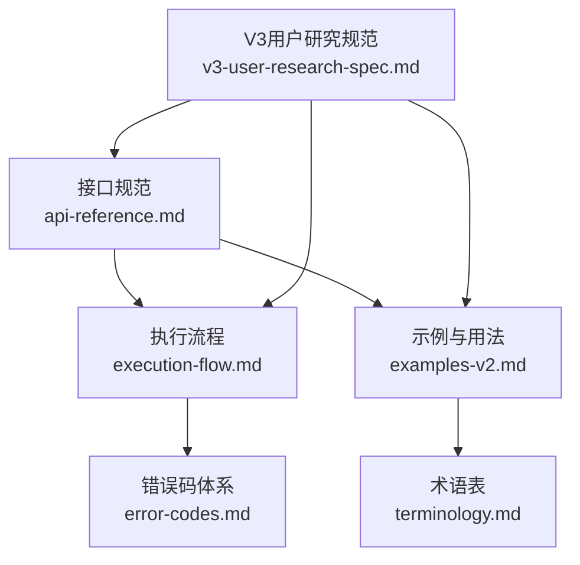
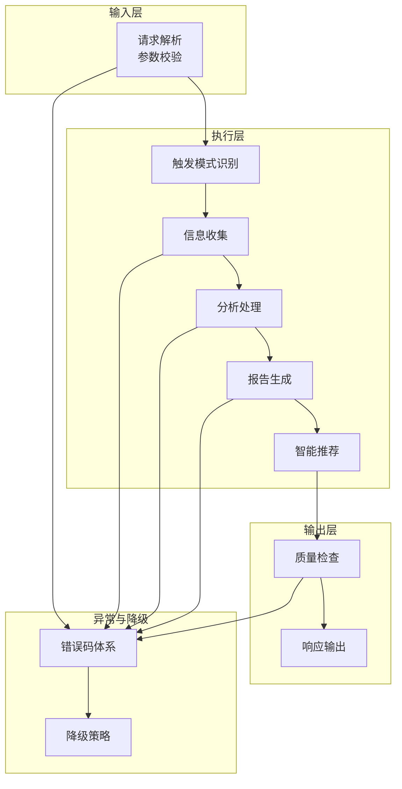
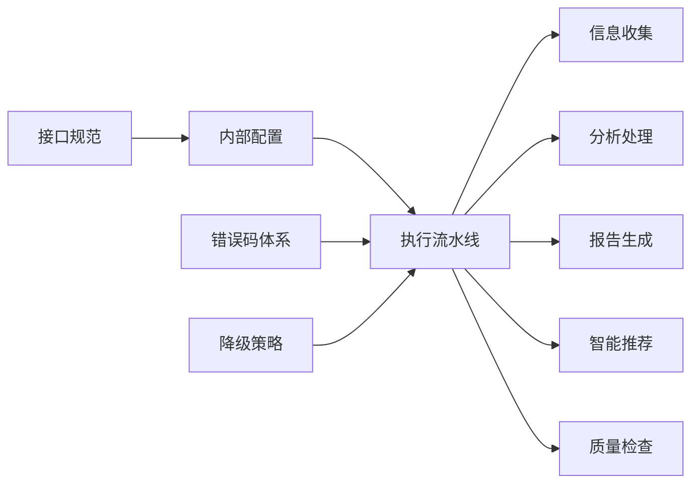
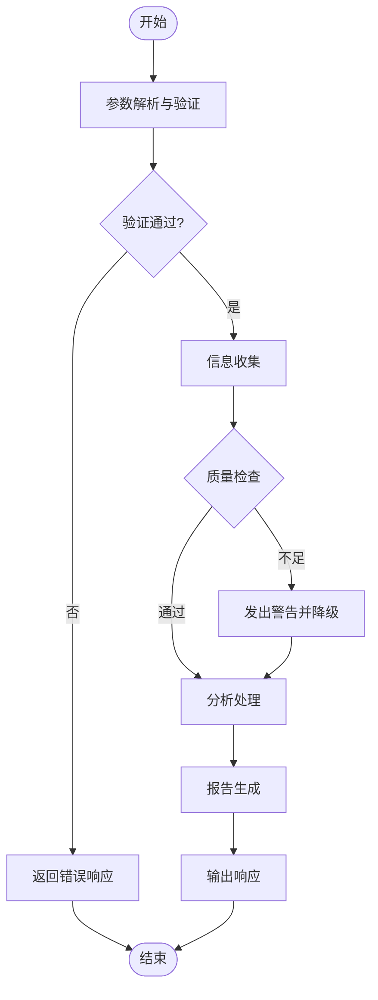

# 高级功能与扩展

<cite>
**本文引用的文件**
- [api-reference.md](file://references/api-reference.md)
- [error-codes.md](file://references/error-codes.md)
- [examples-v2.md](file://references/examples-v2.md)
- [execution-flow.md](file://references/execution-flow.md)
- [terminology.md](file://references/terminology.md)
- [v3-user-research-spec.md](file://references/v3-planning/v3-user-research-spec.md)
</cite>

## 目录
1. [简介](#简介)
2. [项目结构](#项目结构)
3. [核心组件](#核心组件)
4. [架构总览](#架构总览)
5. [详细组件分析](#详细组件分析)
6. [依赖分析](#依赖分析)
7. [性能考量](#性能考量)
8. [故障排查指南](#故障排查指南)
9. [结论](#结论)
10. [附录](#附录)

## 简介
本文件面向“任务执行总结报告生成器”的高级功能与扩展能力，系统阐述V3版本的功能规划与未来增强路线图，围绕五大模块（自定义模板、多语言支持、外部系统集成、历史管理、团队协作）展开，配套PoC验证方法与用户研究规范，明确技术演进路径与开发策略。同时提供集成开发指南、扩展点说明、技术债务与性能瓶颈分析，以及社区参与方式，帮助开发者与产品团队高效推进系统演进。

## 项目结构
- 文档体系以“接口规范”“错误码体系”“示例与用法”“执行流程”“术语表”“V3用户研究规范”为核心，形成从“能做什么”到“怎么做”的闭环。
- V3规划以用户研究为依据，采用“定量+定性”的混合研究设计，确保功能优先级与真实需求对齐。

**图表来源**
- [api-reference.md:1-1378](file://references/api-reference.md#L1-L1378)
- [execution-flow.md:1-1783](file://references/execution-flow.md#L1-L1783)
- [error-codes.md:1-1594](file://references/error-codes.md#L1-L1594)
- [examples-v2.md:1-769](file://references/examples-v2.md#L1-L769)
- [terminology.md:1-1104](file://references/terminology.md#L1-L1104)
- [v3-user-research-spec.md:1-1204](file://references/v3-planning/v3-user-research-spec.md#L1-L1204)

**章节来源**
- [api-reference.md:1-1378](file://references/api-reference.md#L1-L1378)
- [execution-flow.md:1-1783](file://references/execution-flow.md#L1-L1783)
- [error-codes.md:1-1594](file://references/error-codes.md#L1-L1594)
- [examples-v2.md:1-769](file://references/examples-v2.md#L1-L769)
- [terminology.md:1-1104](file://references/terminology.md#L1-L1104)
- [v3-user-research-spec.md:1-1204](file://references/v3-planning/v3-user-research-spec.md#L1-L1204)

## 核心组件
- 接口与参数体系：定义task_context、generation_options、output_config的输入参数与约束，覆盖模板变体、详细程度、章节选择、语言风格、输出格式等。
- 执行流程：包含参数解析、触发模式识别、信息收集、分析处理、报告生成、智能推荐、质量检查与输出的七步流水线。
- 错误码与降级：提供参数验证、数据源、分析引擎、报告生成、系统资源、超时等错误分类与处理策略，支持降级继续与警告标注。
- 示例与用法：提供标准调用、最小参数、参数错误、数据不足降级等典型场景，便于集成测试与用户理解。
- 术语表：统一“目标达成度、时间效能、问题模式、资源利用率、协作效果”等分析维度的专业术语，支撑报告结构与方法论提炼。
- V3用户研究：以混合研究设计验证五大模块需求强度、用户分层与付费意愿，为功能路线图提供数据支撑。

**章节来源**
- [api-reference.md:183-716](file://references/api-reference.md#L183-L716)
- [execution-flow.md:173-1783](file://references/execution-flow.md#L173-L1783)
- [error-codes.md:1-1594](file://references/error-codes.md#L1-L1594)
- [examples-v2.md:1-769](file://references/examples-v2.md#L1-L769)
- [terminology.md:1-1104](file://references/terminology.md#L1-L1104)
- [v3-user-research-spec.md:1-1204](file://references/v3-planning/v3-user-research-spec.md#L1-L1204)

## 架构总览
系统采用“参数解析—触发识别—信息收集—分析处理—报告生成—智能推荐—质量检查—输出”的流水线架构，强调确定性、可观测性与容错性。错误与降级策略贯穿全流程，确保在信息不完整或资源受限时仍可产出可用结果。

**图表来源**
- [execution-flow.md:173-1783](file://references/execution-flow.md#L173-L1783)
- [error-codes.md:1-1594](file://references/error-codes.md#L1-L1594)

**章节来源**
- [execution-flow.md:1-1783](file://references/execution-flow.md#L1-L1783)
- [error-codes.md:1-1594](file://references/error-codes.md#L1-L1594)

## 详细组件分析

### 自定义模板（B1）
- 需求背景：降低重复劳动、统一团队规范、沉淀最佳实践。
- 用户画像与优先级：独立开发者与技术Lead对模板复用与团队共享有高需求；学习者关注模板的可学习性。
- PoC验证要点：
  - 模板创建/保存/复用流程的可用性与性能。
  - 模板变量/占位符的表达能力与渲染质量。
  - 团队共享与权限控制的边界与一致性。
- 集成开发指南：
  - 模板引擎扩展点：支持多语言渲染（Markdown/JSON/HTML）与变量替换。
  - 存储与版本：模板库持久化、版本对比与回滚。
  - 权限与审计：模板可见性、编辑权限、操作审计。
- 技术债务与优化：
  - 避免模板渲染性能瓶颈，提供缓存与懒加载。
  - 控制模板复杂度，提供模板质量评分与建议。

**章节来源**
- [v3-user-research-spec.md:219-316](file://references/v3-planning/v3-user-research-spec.md#L219-L316)
- [terminology.md:458-534](file://references/terminology.md#L458-L534)

### 多语言输出（B2）
- 需求背景：国际化团队与多语言工作场景，需要报告在不同语言间准确传达。
- 用户画像与优先级：学习者与技术Lead对多语言输出有中高需求；个人开发者偏向中文。
- PoC验证要点：
  - 专业术语库的覆盖度与一致性。
  - 翻译质量与术语一致性校验。
  - 多语言模板与内容的可维护性。
- 集成开发指南：
  - 术语库管理：术语采集、校对、版本化与批量导入。
  - 翻译流程：内容切片、机器翻译+人工校对、质量评分。
  - 输出格式：Markdown/JSON/HTML的多语言渲染与本地化。
- 技术债务与优化：
  - 术语库的动态扩展与社区贡献机制。
  - 降低翻译成本，提供增量翻译与缓存策略。

**章节来源**
- [v3-user-research-spec.md:241-267](file://references/v3-planning/v3-user-research-spec.md#L241-L267)
- [terminology.md:458-534](file://references/terminology.md#L458-L534)

### 外部系统集成（B3）
- 需求背景：与Git、CI/CD、Jira、Slack等工具无缝集成，提升研发效率。
- 用户画像与优先级：技术Lead与项目经理对工具链集成有高需求；运维工程师关注CI/CD与监控集成。
- PoC验证要点：
  - 集成能力矩阵：Git提交信息生成、CI/CD触发与状态回传、项目管理工具关联、团队协作工具联动。
  - 数据一致性与安全性：访问令牌管理、审计日志、数据脱敏。
- 集成开发指南：
  - 插件化架构：统一的集成适配器与事件驱动机制。
  - 配置中心：可视化配置面板、OAuth授权、回调地址管理。
  - 错误与重试：失败重试、幂等处理、降级回退。
- 技术债务与优化：
  - 降低集成复杂度，提供“一键启用”与“自动发现”能力。
  - 建立集成质量度量与告警体系。

**章节来源**
- [v3-user-research-spec.md:269-293](file://references/v3-user-research-spec.md#L269-L293)
- [execution-flow.md:173-1783](file://references/execution-flow.md#L173-L1783)

### 历史管理（B4）
- 需求背景：智能管理对话历史、代码版本与上下文，支持检索、对比与归档。
- 用户画像与优先级：独立开发者与项目经理对历史检索与版本对比有高需求。
- PoC验证要点：
  - 检索与组织：按项目/会话/标签组织，全文检索与高亮。
  - 版本对比与回滚：差异展示、二进制安全、批量归档。
  - 跨设备同步与导出：增量同步、离线可用、多格式导出。
- 集成开发指南：
  - 历史索引：倒排索引与向量检索，支持模糊匹配与语义检索。
  - 存储与归档：冷热分层、压缩与去重。
  - 导出与审计：合规导出、水印与访问控制。
- 技术债务与优化：
  - 优化检索性能，提供增量索引与缓存。
  - 降低存储成本，提供智能压缩与生命周期管理。

**章节来源**
- [v3-user-research-spec.md:282-293](file://references/v3-user-research-spec.md#L282-L293)
- [terminology.md:458-534](file://references/terminology.md#L458-L534)

### 团队协作（B5）
- 需求背景：共享模板、权限管理、协作编码与知识沉淀。
- 用户画像与优先级：技术Lead与项目经理对团队协作有高需求；学习者关注知识沉淀。
- PoC验证要点：
  - 权限与角色：模板可见性、编辑权限、团队空间隔离。
  - 协作能力：实时评审、评论与修订追踪、知识库沉淀。
  - 管理与审计：管理员控制台、使用统计、合规审计。
- 集成开发指南：
  - 企业集成：SSO/LDAP对接、组织架构同步。
  - 数据治理：数据隔离、访问日志、合规导出。
  - 体验优化：邀请与加入流程、新手引导、协作提醒。
- 技术债务与优化：
  - 降低协作门槛，提供“邀请+审批”与“一键加入”。
  - 建立团队使用度量与激励机制。

**章节来源**
- [v3-user-research-spec.md:295-306](file://references/v3-user-research-spec.md#L295-L306)
- [terminology.md:458-534](file://references/terminology.md#L458-L534)

### V3功能演进与开发策略
- 研究驱动：以V3用户研究为依据，按需求强度与优先级排序，采用“最小可行功能（MVP）+快速迭代”策略。
- 技术路线：
  - 第一阶段：完成B1/B2核心能力，验证用户价值与技术可行性。
  - 第二阶段：补齐B3/B4，完善工具链与历史管理。
  - 第三阶段：上线B5团队协作，打通企业级能力。
- 风险控制：通过PoC与用户研究验证功能价值，避免资源错配；在开发中持续进行性能与安全评估。

**章节来源**
- [v3-user-research-spec.md:1-1204](file://references/v3-planning/v3-user-research-spec.md#L1-L1204)

## 依赖分析
- 组件耦合与内聚：
  - 参数解析与执行流程强耦合，需确保输入规范化与默认值一致性。
  - 信息收集与分析处理弱耦合，便于并行扩展与性能优化。
  - 报告生成与智能推荐相对独立，可插拔扩展。
- 外部依赖与集成点：
  - Git、CI/CD、Jira、Slack等工具的API与鉴权机制。
  - 术语库与翻译服务的外部依赖与缓存策略。
- 循环依赖与规避：
  - 通过统一的内部配置对象与中间数据结构避免循环引用。
  - 错误码与降级策略作为横切关注点，贯穿各模块。

**图表来源**
- [api-reference.md:183-716](file://references/api-reference.md#L183-L716)
- [execution-flow.md:173-1783](file://references/execution-flow.md#L173-L1783)
- [error-codes.md:1-1594](file://references/error-codes.md#L1-L1594)

**章节来源**
- [api-reference.md:183-716](file://references/api-reference.md#L183-L716)
- [execution-flow.md:173-1783](file://references/execution-flow.md#L173-L1783)
- [error-codes.md:1-1594](file://references/error-codes.md#L1-L1594)

## 性能考量
- 性能基线与瓶颈：
  - Step 3（信息收集）与Step 4（分析处理）为主要耗时阶段，占总耗时40%-50%。
  - 详细程度越高，耗时增长越明显（摘要版-30%，标准版基准，详细版+50%-80%）。
- 优化建议：
  - 并行化：对多数据源解析与实体抽取进行并行处理。
  - 缓存与索引：对常用模板、术语库与检索结果进行缓存。
  - 分页与增量：对历史管理与工具集成采用分页与增量同步。
  - 资源调度：对高耗时任务进行队列化与优先级调度。

**章节来源**
- [execution-flow.md:142-1783](file://references/execution-flow.md#L142-L1783)

## 故障排查指南
- 常见错误与处理：
  - 参数验证错误（E001-E005）：立即返回，检查必填参数、类型与范围。
  - 数据质量问题（E010-E012）：支持降级继续，标注警告并提供补救建议。
  - 分析与生成错误（E021-E032）：根据策略回退到简化模板或返回部分结果。
- 诊断流程：
  - 检查请求参数与默认值应用。
  - 核对数据源可用性与权限。
  - 查看质量检查与警告信息。
  - 结合错误码与恢复建议进行修复。

**图表来源**
- [error-codes.md:1-1594](file://references/error-codes.md#L1-L1594)
- [execution-flow.md:173-1783](file://references/execution-flow.md#L173-L1783)

**章节来源**
- [error-codes.md:1-1594](file://references/error-codes.md#L1-L1594)
- [execution-flow.md:173-1783](file://references/execution-flow.md#L173-L1783)

## 结论
V3版本以用户研究为驱动，围绕五大模块构建能力矩阵，通过PoC与用户研究验证优先级与可行性。在技术层面，系统采用确定性、可观测性与容错性设计，配合性能优化与安全治理，确保在复杂场景下稳定交付。建议以MVP快速验证价值，逐步补齐工具链与团队协作能力，最终形成可扩展、可集成、可持续演进的高级功能体系。

## 附录
- 集成开发指南（概要）
  - 接口与参数：严格遵循接口规范，确保参数校验与默认值一致性。
  - 执行流程：按七步流水线实现，关注质量检查与降级策略。
  - 错误码与降级：统一错误分类与恢复建议，提供降级继续与警告标注。
  - 扩展点：模板引擎、术语库、集成适配器、历史索引与权限控制。
- 技术债务与优化清单
  - 模板与术语库：提供质量评分与建议，支持社区贡献与版本化。
  - 集成与历史：统一鉴权与审计，提供增量同步与缓存策略。
  - 性能与安全：并行化与缓存、资源调度与队列化、数据脱敏与合规导出。
- 社区参与方式
  - 用户研究：参与问卷与深度访谈，提供真实使用场景与改进建议。
  - 开源协作：通过Issue/PR参与功能与文档贡献，共同完善术语库与模板库。
  - 反馈与建议：通过官方渠道提交使用反馈与功能建议，参与Beta测试。

**章节来源**
- [api-reference.md:1-1378](file://references/api-reference.md#L1-L1378)
- [execution-flow.md:1-1783](file://references/execution-flow.md#L1-L1783)
- [error-codes.md:1-1594](file://references/error-codes.md#L1-L1594)
- [v3-user-research-spec.md:1-1204](file://references/v3-user-research-spec.md#L1-L1204)